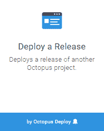
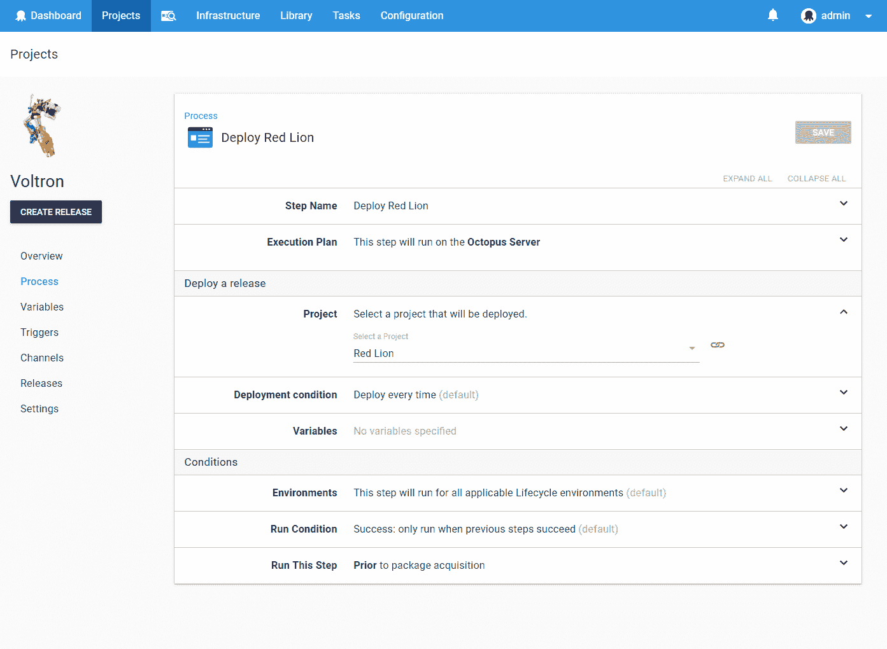
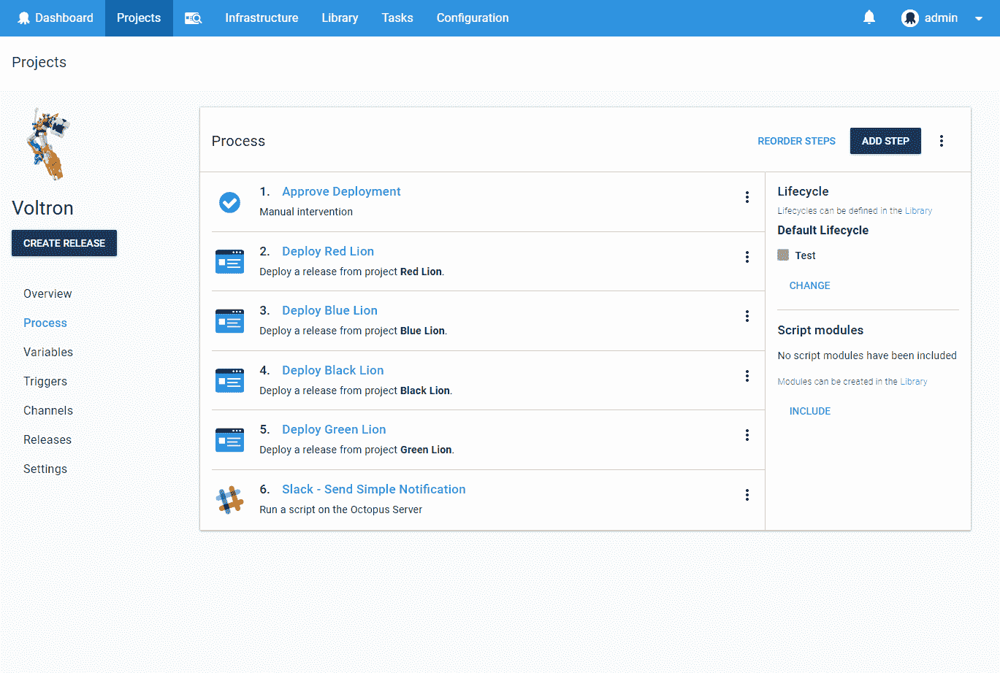
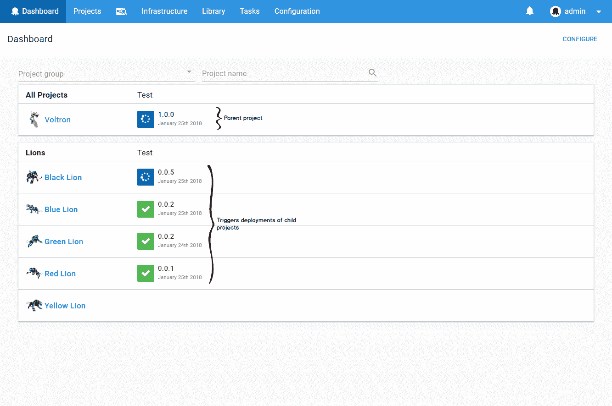
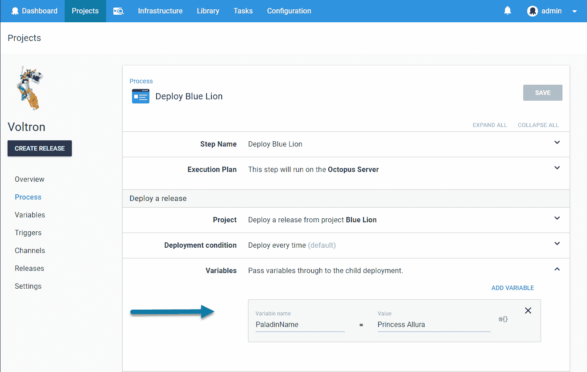

# 用部署发布步骤协调项目- Octopus 部署

> 原文：<https://octopus.com/blog/deploy-release-step/deploy-release-step>

除非你正在建造一个真正的整体，否则你的项目不会孤立存在。我们的行业越来越朝着系统由更细粒度的组件组成的方向发展。有人称之为面向服务的架构，有人称之为微服务，但是从发布管理的角度来看，关键是它需要协调。

在 Octopus 总部，我们喜欢这种趋势，因为坦率地说，你的发布和部署过程中的移动部分越多，Octopus 带来的价值就越大。

这样做的自然结果是，用户希望能够在 Octopus 中协调多个项目的发布。这是我们最重要的[用户声音建议](https://octopusdeploy.uservoice.com/forums/170787-general/suggestions/9811932-allow-project-dependencies-so-deploying-one-proj)之一。

两个关键场景是:

*   **Bundle:** 您想要创建一个“Bundle”发布，以允许多个项目的发布在您的环境中一起进行。
*   **依赖关系:**您想要明确地建模项目 A 依赖于已经部署的项目 B 的特定版本。

## 介绍*部署发布*步骤

为了解决这个问题，我们创建了一个新的步骤:[部署一个发布版本](https://octopus.com/docs/deployment-process/coordinating-multiple-projects/deploy-release-step)。 *Deploy a Release* 步骤允许您选择另一个 Octopus 项目进行部署。

当您创建一个包含一个或多个 *Deploy a Release* 步骤的项目发布时，您可以选择要部署的子项目的发布版本。正如在创建包含部署包的步骤的项目发布时选择包的版本一样。

【T2 

将此作为一个步骤来实现的好处是，所有常规的 Octopus 功能都像预期的那样工作。您可以将*部署发布*步骤与其他步骤类型穿插在一起。例如，如果您正在创建一个 bundle 项目，那么您的第一步可能是一个*手动干预*步骤(批准发布)，而您的最后一步可能是发送一个 Slack 通知。 *Deploy a Release* 步骤也可以配置为仅针对特定的环境、渠道或租户运行，就像任何其他步骤一样。它们可以配置为并行或串行运行，就像任何其他步骤一样。

当*部署发布*步骤运行时，它触发指定项目的部署。这种部署与直接触发的部署没有什么不同。它将在八达通仪表板上可见。

### 有条件部署

您可以配置部署子项目的条件:

*   始终部署(默认)。
*   如果所选版本不是环境中的当前版本。
*   如果所选版本的版本高于环境中的当前版本。

这允许您指定组件版本之间的关系。

#### 微服务示例

例如，您正在部署一个应用程序， *Acme。店铺*，靠的是一个伐木微服务，*极致。装运*。

*到了极致。商店*项目可以包含一个*部署发布*步骤，该步骤被配置为部署 *Acme。在*展开条件*字段设置为`If the selected release has a higher version than the current release in the environment`的情况下装运*。

这将允许团队在 *Acme 上工作。发布*独立工作的微服务项目，在准备就绪时部署到 Octopus 环境中。

当团队工作在*的极致时。商店*创建了一个版本，他们选择了 *Acme 的一个版本。发货*，例如`2.0.0`。这有效地指定了每个环境中必须有的最低版本。随着*的极致。车间*发布在环境中进行，它将触发 *Acme 的部署。只有当环境中还没有包含*极致的`>= 2.0.0`时才发货*。装运*。

### 变量

变量可以传递给由*部署发布*步骤触发的部署。就像任何其他项目变量一样，这些变量可用于子部署过程。

[由*部署发布*步骤触发的部署的输出变量](https://octopus.com/docs/deployment-process/variables/output-variables)被捕获，并作为*部署发布*步骤的输出变量公开。

这允许父流程使用子部署的输出，甚至传递到由后续*部署发布*步骤触发的部署中。这使得许多协调场景成为可能。

## 我什么时候能拿到它？

该功能将在 Octopus 2018.2 版本中提供，该版本将于 2 月初发布。

*愉快的(多项目)部署！*

## 了解更多信息