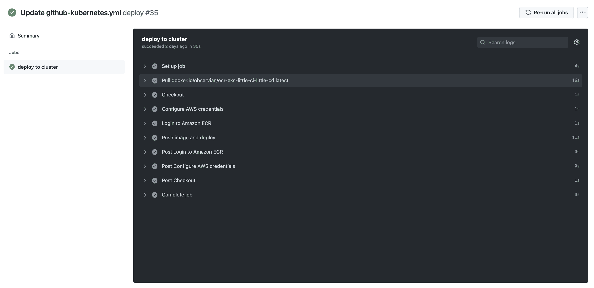

# 使用 GitHub Actions 部署到亚马逊 EKS-Octopus Deploy

> 原文：<https://octopus.com/blog/deploying-amazon-eks-github-actions>

在 DevOps 流程中，CI 服务器(如 Github Actions)构建代码存储库，并将软件工件推送到容器注册中心，准备进行部署。在 GitHub Actions 推出之前，像 Jenkins 这样的第三方工具必须在 GitHub 存储库上执行 DevOps 操作。

GitHub Actions 在您的 GitHub 存储库中引入了 DevOps 操作，使您更容易实现 DevOps 流程。

在本文中，您将在 GitHub Actions 工作流中构建一个 Docker 映像，将该映像发布到 Amazon Elastic Container Registry(ECR ),并将其部署到 Amazon Elastic Kubernetes Service(EKS)。

## 先决条件

要跟进这篇文章，你需要:

*   亚马逊网络服务(AWS)帐户
*   GitHub 账户

这个帖子使用了 [Octopus 水下应用库](https://github.com/OctopusSamples/octopus-underwater-app)。您可以派生存储库并跟随它。或者，github-deployment 分支包含完成本文中的步骤所需的模板文件。你必须用你自己的价值观来代替一些价值观，但是我已经把我的价值观作为参考。

## 亚马逊网络服务设置

要为 GitHub 操作设置 AWS，您需要创建一个访问键和一个 ECR 存储库来存储图像。

要创建访问密钥，请转到**亚马逊控制台**，然后 **IAM** ，然后**用户**、`[your user]`，然后**安全凭证**，然后**创建访问密钥**。

您的浏览器将下载一个包含访问密钥 ID 和秘密访问密钥的文件。这些值将在 Jenkins 中用于向 Amazon 认证。

要创建存储库，请转到**亚马逊控制台**，然后转到 **ECR** ，然后转到**创建存储库**。

您需要为发布的每个图像建立一个图像存储库。给存储库起一个您想让图像起的名字。

你会在**亚马逊 ECR** 下看到你的仓库，然后是**仓库**。记下它所在的区域，在 URI 场。

[](#)

### AWS 集群设置

按照我们的文章[中的步骤在 AWS 中设置集群，在 AWS 中创建 EKS 集群](https://octopus.com/blog/eks-cluster-aws)。

## GitHub 设置

对于这个示例，您使用一个示例 web 应用程序，该应用程序显示一个带有有用链接的水下动画场景。

在`https://github.com/OctopusSamples/octopus-underwater-app`分叉存储库。

进入**设置**，然后**机密**，然后**新储存库机密**。

*   **REPO_NAME** -您创建的 AWS ECR 存储库的名称
*   **AWS_ACCESS_KEY_ID** -之前的访问密钥 ID
*   **AWS _ SECRET _ ACCESS _ KEY**-之前的秘密访问密钥
*   **AWS_ACCOUNT_ID** -您的亚马逊账户 ID

首先，您需要为 GitHub actions 创建一个部署 YAML 文件，以部署到 EKS。用下面的代码在存储库的根级别创建一个名为`git-deployment.yml`的文件:

```
 apiVersion: apps/v1
kind: Deployment
metadata:
  name: underwater-app-github
  labels:
    app: octopus-underwater-app
spec:
  selector:
    matchLabels:
        app: octopus-underwater-app
  replicas: 3
  strategy:
    type: RollingUpdate
  template:
    metadata:
      labels:
        app: octopus-underwater-app
    spec:
      containers:
        - name: octopus-underwater-app
          image: 720766170633.dkr.ecr.us-east-2.amazonaws.com/octopus-underwater-app:latest
          ports:
            - containerPort: 80
              protocol: TCP
          imagePullPolicy: Always 
```

然后您需要在存储库中创建一个工作流文件。

Github Actions 工作流包含对代码库执行操作的说明。几个预构建的步骤模板允许您在代码存储库上执行许多不同的任务。在本例中，您使用一个步骤模板来构建代码，并将代码推送到 AWS ECR 存储库，并将其部署到 EKS。

创建一个名为`main.yml`的文件。根文件夹的 github/workflow 目录。将以下代码粘贴到 main.yml 文件中:

```
 on:
  push:
    branches: [ main ]
  pull_request:
    branches: [ main ]

name: AWS ECR push

jobs:
  deploy:
    name: Deploy
    runs-on: ubuntu-latest

    steps:
    - name: Install Octopus CLI
      uses: OctopusDeploy/install-octopus-cli-action@v1.1.1
      with:
          version: latest
    - name: Checkout
      uses: actions/checkout@v2

    - name: Configure AWS credentials
      uses: aws-actions/configure-aws-credentials@v1
      with:
        aws-access-key-id: ${{ secrets.AWS_ACCESS_KEY_ID }}
        aws-secret-access-key: ${{ secrets.AWS_SECRET_ACCESS_KEY }}
        aws-region: us-east-2

    - name: Login to Amazon ECR
      id: login-ecr
      uses: aws-actions/amazon-ecr-login@v1

    - name: Build, tag, and push the image to Amazon ECR
      id: build-image
      env:
        ECR_REGISTRY: ${{ steps.login-ecr.outputs.registry }}
        ECR_REPOSITORY: ${{ secrets.REPO_NAME }}
        IMAGE_TAG: "latest"

      run: |
        # Build a docker container and push it to ECR 
        docker build -t $ECR_REGISTRY/$ECR_REPOSITORY:$IMAGE_TAG .
        echo "Pushing image to ECR..."
        docker push $ECR_REGISTRY/$ECR_REPOSITORY:$IMAGE_TAG
        echo "::set-output name=image::$ECR_REGISTRY/$ECR_REPOSITORY:$IMAGE_TAG" 
```

[](#)

您需要本地端口转发来检查服务。使用此命令检查 web 应用程序。端口 28015 是根据 Kubernetes 文档中的示例选择的:

```
kubectl port-forward deployment/underwater-app-github  28015:80 
```

在浏览器中转至 IP 地址`http://127.0.0.1:28015/`查看您的 web 应用程序。

[](#)

GitHub Actions 可以在 EKS 这样的 Kubernetes 云平台上构建、推送和部署 GitHub 存储库。与云平台和其他工具的集成依赖于社区构建的 step 模板。根据我的经验，这些步骤模板并不是标准化的。我尝试了几种不同的模板，根据调用的变量，有些模板的工作方式不同。

我发现在 GitHub 中使用新的步骤模板每次都需要一些新的学习。像 Octopus 这样的工具也使用 step 模板，但是它们在 Octopus Deploy 应用程序中共享一个标准设计。这意味着 Octopus 部署步骤模板体验是一致的。

## 结论

Github Actions 允许开发人员在其 Github 存储库中执行 DevOps 操作，简化了部署过程。

在这篇文章中，您构建了一个 GitHub 存储库并将其推送到 Amazon ECR，并将其部署到 Amazon EKS。下一篇文章将讨论如何使用 Octopus Deploy 来管理部署过程。

模板可用于不同的第三方集成。然而，用户体验可能因模板而异，因为它们是由社区维护的。在以后的文章中，我们将介绍 Octopus Deploy 如何与 Github Actions 集成，并为持续部署提供标准化模板，同时提供丰富的用户体验。

查看我们关于使用 GitHub Actions、Kubernetes 和 Octopus Deploy 进行部署的其他帖子:

[试用我们免费的 GitHub Actions 工作流工具](https://oc.to/GithubActionsWorkflowGenerator)，帮助您快速为 GitHub Actions 部署生成可定制的工作流。

您还可以了解更多关于[使用 GitHub 构建和使用 Octopus](https://octopus.com/github) 部署的信息，并在 GitHub 市场使用我们[验证的行动。](https://github.com/marketplace?query=octopus&type=actions&verification=verified_creator)

## 观看我们的 GitHub 行动网络研讨会

[https://www.youtube.com/embed/gLkAs_Cy5t4](https://www.youtube.com/embed/gLkAs_Cy5t4)

VIDEO

阅读我们的[持续集成系列](https://octopus.com/blog/tag/CI%20Series)的其余部分。

愉快的部署！