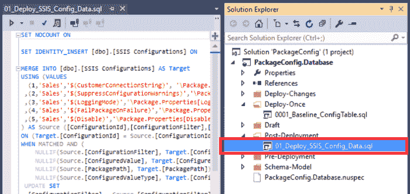
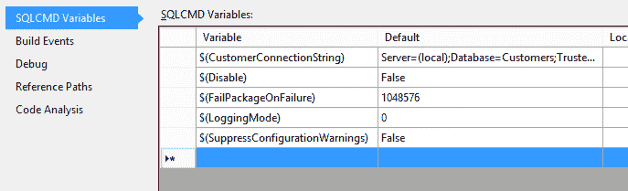
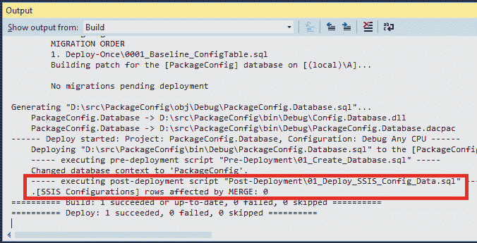
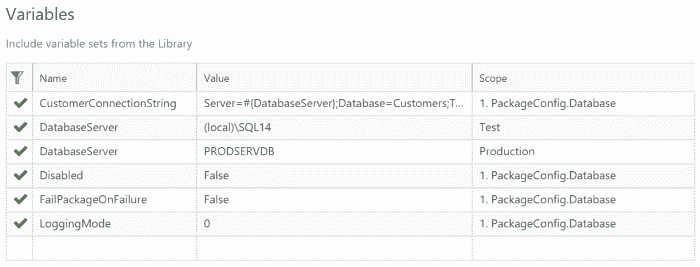
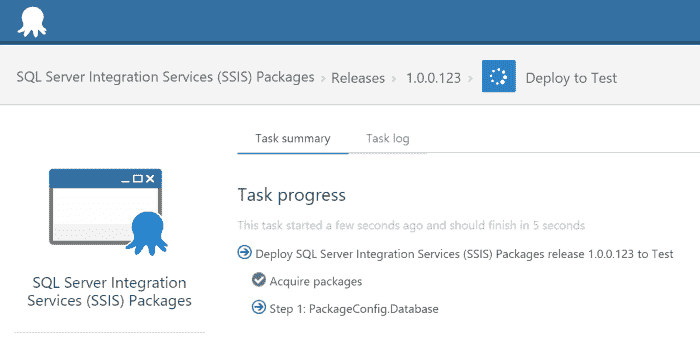
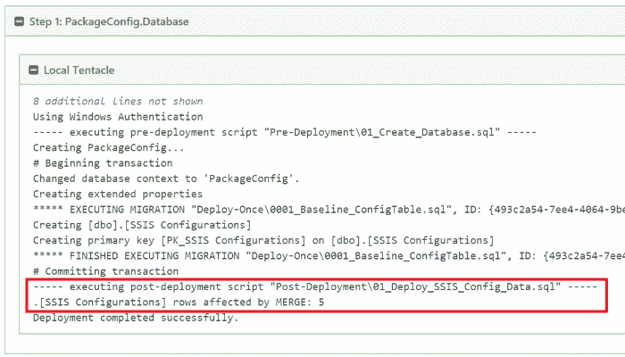
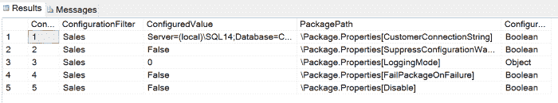
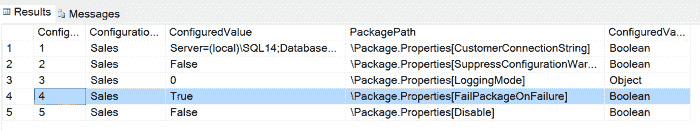

# 使用 Octopus Deploy 和 ReadyRoll - Octopus Deploy 部署数据库配置表

> 原文：<https://octopus.com/blog/deploying-database-configuration-tables-with-readyroll>

下面是我们的朋友 Daniel Nolan 的客座博文，他是 ReadyRoll 的创始人，ready roll 是一个 Visual Studio 扩展，它使 SQL 数据库的开发和部署变得更加简单。我们认为这项技术很酷，并希望与我们的客户分享，所以请继续阅读！

我最近了解到一个开发团队正在使用 [ReadyRoll 和 Octopus Deploy](http://doc.ready-roll.com/display/RRSQLDOC/Octopus+Deploy) 的组合来驱动配置数据在其每个生命周期环境中的部署。

对于存储在文件中的配置数据，这实际上非常容易实现；毕竟 Octopus 从 1.0 版本开始就内置了对应用配置(Web.config/App.config)变量替换的支持。这个特性允许跨多个环境管理配置数据的键/值对，后来扩展到允许多个项目使用来自[可重用库集](http://docs.octopusdeploy.com/display/OD/Library+variable+sets)的变量。

这样做的好处是显而易见的:每当您需要更改服务器名称或更新超时设置时，不必在多个地方更新配置，您只需更新 Octopus 中的一个变量，在下一次部署时，所有相关的系统组件都会发生变化。这意味着，例如，您不需要担心在部署后设置正确的特定于环境的连接字符串，并且您可以避免将服务器名称硬编码到项目源代码中。

到目前为止，一切顺利。

### 存储在数据库中的配置呢？

对于存储在文件中的配置数据来说，这确实很好，但是如果您的配置存储在数据库表中呢？保持受源代码控制的数据与关系数据库表同步是一项非常困难的任务。当您添加将数据转换成特定于环境的键-值对的复杂性时，很少有团队着手自动化这项任务就不足为奇了。

在这个客户的例子中，他们需要驱动环境敏感的`[SSIS Configurations]`表的部署——这是一个键值对存储，由他们组织中的多个*SQL Server Integration Services*包使用。

### Octopus+ReadyRoll 提供了解决方案

好消息是 ReadyRoll 支持开箱即用的 Octopus 变量:对于您希望在脚本中使用的每个 Octopus 变量，只需将一个 [SQLCMD 变量](http://doc.ready-roll.com/display/RRSQLDOC/SQLCMD+Variables)添加到 ReadyRoll 数据库项目中。在部署时，ReadyRoll 会将存储在 Octopus 中的值传递给部署脚本。

在我们的配置数据部署中，我们将使用一个*部署后*脚本来实现这个目的，它将在部署的主要部分完成后执行。因为脚本将在每个部署中执行，所以以一种*等幂*的方式编写它是很重要的，这样它就可以多次运行并得到相同的结果。

首先，我们需要为我们的数据库设置一个基线。在[创建新的 ReadyRoll 数据库项目](http://doc.ready-roll.com/display/RRSQLDOC/Getting+started)之后，将以下内容添加到新的*部署一次*脚本中，以生成模式:

```
CREATE TABLE [dbo].[SSIS Configurations]
(
[ConfigurationId] [int] NOT NULL IDENTITY(1, 1),
[ConfigurationFilter] [nvarchar] (255) NOT NULL,
[ConfiguredValue] [nvarchar] (255) NULL,
[PackagePath] [nvarchar] (255) NOT NULL,
[ConfiguredValueType] [nvarchar] (20) NOT NULL,
CONSTRAINT [PK_SSIS Configurations] PRIMARY KEY CLUSTERED ([ConfigurationId])
);
GO 
```

**[下载本脚本](http://download.ready-roll.com/Octopus-RR-Conf/CREATE-SSIS-Configuration.sql)**

#### 添加*等幂*数据同步脚本

要填充数据表，通常需要使用一组包含要添加到表中的值的`INSERT`语句。然而，这不会给我们提供执行增量数据同步所需的“可重新运行性”。

我们需要的是一个可重用的脚本，它足够智能，能够计算出需要对表数据进行哪些更改。实现这一点的关键是 T-SQL `MERGE`语句，它提供了一种*期望状态*方法来填充表。

`MERGE`的伟大之处在于它能够根据需要`UPDATE`、`INSERT`或`DELETE`目标表中的数据。这基本上意味着，在决定更改表中的配置时，我们不必担心数据的当前状态。

```
SET IDENTITY_INSERT [dbo].[SSIS Configurations] ON;

MERGE INTO [dbo].[SSIS Configurations] AS Target
USING (VALUES
  (1,'Sales','Server=(local);Database=Customers;Trusted_Connection=True;'
  ,'\Package.Properties[CustomerConnectionString]','Boolean')
 ,(2,'Sales','False','\Package.Properties[SuppressConfigurationWarnings]','Boolean')
 ,(3,'Sales','0','\Package.Properties[LoggingMode]','Object')
 ,(4,'Sales','False','\Package.Properties[FailPackageOnFailure]','Boolean')
 ,(5,'Sales','False','\Package.Properties[Disable]','Boolean')
) AS Source 
([ConfigurationId],[ConfigurationFilter],[ConfiguredValue],[PackagePath],[ConfiguredValueType])
ON (Target.[ConfigurationId] = Source.[ConfigurationId])
WHEN MATCHED THEN
 UPDATE SET
  [ConfigurationFilter] = Source.[ConfigurationFilter], 
  [ConfiguredValue] = Source.[ConfiguredValue], 
  [PackagePath] = Source.[PackagePath], 
  [ConfiguredValueType] = Source.[ConfiguredValueType]
WHEN NOT MATCHED BY TARGET THEN
 INSERT
 ([ConfigurationId],[ConfigurationFilter],[ConfiguredValue],[PackagePath],[ConfiguredValueType])
 VALUES
 (Source.[ConfigurationId],Source.[ConfigurationFilter],Source.[ConfiguredValue]
 ,Source.[PackagePath],Source.[ConfiguredValueType])
WHEN NOT MATCHED BY SOURCE THEN 
 DELETE;

SET IDENTITY_INSERT [dbo].[SSIS Configurations] OFF;
GO 
```

**[下载本脚本](http://download.ready-roll.com/Octopus-RR-Conf/MERGE-SSIS-Configuration-Data.sql)**

### 如何生成 MERGE 语句

不幸的是，SQL Server 没有提供一种内置的方式来将表数据编写成`MERGE`语句。因此，我们将使用开源神奇工具 [`sp_generate_merge`](https://github.com/readyroll/generate-sql-merge) ，来完成所有繁重的工作。该工具通过将自身作为全局存储过程安装到`[master]`数据库中来工作，当执行时，从给定的表中读取数据并输出 T-SQL 语句([访问项目的 Github 页面](https://github.com/readyroll/generate-sql-merge)以了解关于该工具的更多信息)。

将该过程安装到本地 SQL Server 实例中后，在配置数据库的上下文中执行该过程:

```
EXEC sp_generate_merge 'SSIS Configurations', @schema='dbo'; 
```

这将生成 MERGE 语句并将结果输出到查询窗口。由于结果包含在一个 Xml 片段中，因此只需删除开头的`<?x`和结尾的`?>`字符就可以创建有效的 T-SQL 脚本。将该脚本粘贴到 ReadyRoll 数据库项目中的新*部署后*脚本中(例如`Post-Deployment\01_Deploy_SSIS_Config_Data.sql`)。[下载输出示例](https://trello-attachments.s3.amazonaws.com/5588e49f7d6eb828b358663e/55b8919fc24b22d60e4fe4ba/cd41f0dfb5359615f0ffea5530253985/MERGE-SSIS-Configuration-Data.sql)。



### 如何向 T-SQL 脚本添加变量

您可能已经注意到，我们生成的`MERGE`语句目前包含每个键值对的静态值(`[ConfigurationValue]`列)。我们将在后面的文章中用 SQLCMD 变量替换这些变量，这将与 Octopus 中定义的变量一一对应。首先，我们需要向数据库项目添加一些变量。为了简单起见，我们将为每一个 **SSIS 配置**键/值对行添加一个 *[SQLCMD 变量](http://doc.ready-roll.com/display/RRSQLDOC/SQLCMD+Variables)* ，它们将依次映射到 Octopus Deploy 项目中的匹配变量。

在 ReadyRoll 数据库项目设计器中，切换到 *SQLCMD Variables* 选项卡，为每个键/值对添加一个变量，将上述文字指定为默认值:



接下来，编辑*后期部署*脚本，用 SQLCMD 变量替换每个`[ConfigurationValue]`文本值，格式为`$(VariableName)`:

```
SET IDENTITY_INSERT [dbo].[SSIS Configurations] ON;

MERGE INTO [dbo].[SSIS Configurations] AS Target
USING (VALUES
  (1,'Sales','$(CustomerConnectionString)', '\Package.Properties[CustomerConnectionString]'
   ,'Boolean')
 ,(2,'Sales','$(SuppressConfigurationWarnings)','\Package.Properties[SuppressConfigurationWarnings]'
   ,'Boolean')
 ,(3,'Sales','$(LoggingMode)','\Package.Properties[LoggingMode]','Object')
 ,(4,'Sales','$(FailPackageOnFailure)','\Package.Properties[FailPackageOnFailure]','Boolean')
 ,(5,'Sales','$(Disable)','\Package.Properties[Disable]','Boolean')
) AS Source 
([ConfigurationId],[ConfigurationFilter],[ConfiguredValue],[PackagePath],[ConfiguredValueType])
ON (Target.[ConfigurationId] = Source.[ConfigurationId])
WHEN MATCHED THEN
 UPDATE SET
  [ConfigurationFilter] = Source.[ConfigurationFilter], 
  [ConfiguredValue] = Source.[ConfiguredValue], 
  [PackagePath] = Source.[PackagePath], 
  [ConfiguredValueType] = Source.[ConfiguredValueType]
WHEN NOT MATCHED BY TARGET THEN
 INSERT
 ([ConfigurationId],[ConfigurationFilter],[ConfiguredValue],[PackagePath],[ConfiguredValueType])
 VALUES
 (Source.[ConfigurationId],Source.[ConfigurationFilter],Source.[ConfiguredValue]
 ,Source.[PackagePath],Source.[ConfiguredValueType])
WHEN NOT MATCHED BY SOURCE THEN 
 DELETE;

SET IDENTITY_INSERT [dbo].[SSIS Configurations] OFF;
GO 
```

**[下载本脚本](http://download.ready-roll.com/Octopus-RR-Conf/MERGE-SSIS-Configuration-Data-SQLCMDVars.sql)**

在继续之前，最好通过运行 *Build 来测试这个脚本...部署解决方案*。



如果默认值与表中的当前值匹配，则输出窗口应显示零个受影响的行。

### 在 Octopus 中设置它

假设你已经[通过 Octopus](http://doc.ready-roll.com/display/RRSQLDOC/Octopus+Deploy) 为部署设置了数据库，最后一步是在 Octopus 项目或者相关的变量库中设置变量。只需向 Octopus 添加与 SQLCMD 变量(在上一步中定义)同名的变量，ReadyRoll 就会在部署时将这些值映射到您的 SQL 脚本。



值得注意的是，在 Octopus 中，由您决定覆盖哪些变量。如果您对数据库项目文件中设置的默认值感到满意，那么您可以选择简单地从 Octopus 配置中省略这些值，默认值将继续用于您的部署中。

要查看所有操作，创建一个发布并部署到一个*测试*环境中。



请注意，由于这是该项目的第一次发布，因此将创建新表并插入行。



对表数据的快速检查表明，它与我们在 Octopus 中的当前变量配置相匹配:



要测试增量更改是否会成功传播到表中，请打开 Octopus 项目中的变量列表，并将变量`FailPackageOnFailure`的值调整为`True`。在更新版本并将其重新部署到测试环境之后，确认`[SSIS Configurations]`记录的值反映了新的变量值:



### 结论

通过在 T-SQL 脚本中使用 Octopus 变量，而不是使用文字值，只需更新 Octopus 中的一个变量并重新部署给定的版本，就可以部署配置数据。不需要修改代码，也不需要可怕的硬编码或环境嗅探来确定哪些设置适用于给定的目标环境。

这还意味着，如果生产数据库的备份被恢复到测试 SQL Server 实例上，您需要做的就是在 Octopus 中运行一个部署，以清除表中的任何实时配置数据。

通过在 Octopus 中存储您的所有配置，您可以更进一步为您的所有配置数据创建一个单一的参考点。ReadyRoll 与 Octopus 变量存储的直接集成为简化您的数据库部署流程创造了机会，使您的团队能够更快、更频繁地交付。

不说别的，想想看，一旦您将 DBA 从费力不讨好的任务中解放出来，让他们不必在每个环境中维护所有数据，他们会多么高兴！

**[下载本项目(。sqlproj，8KB)](http://download.ready-roll.com/Octopus-RR-Conf/PackageConfig.zip)**