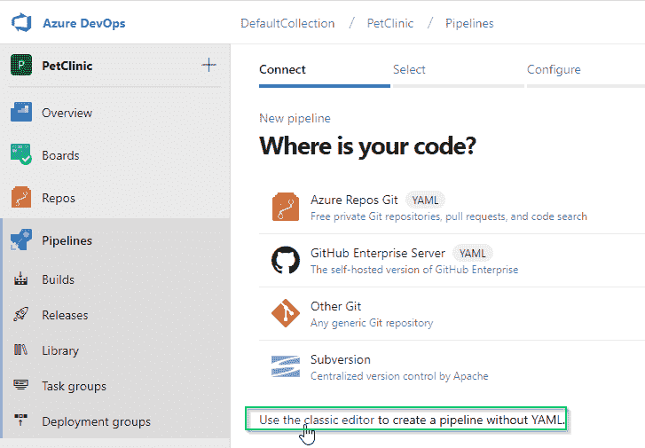
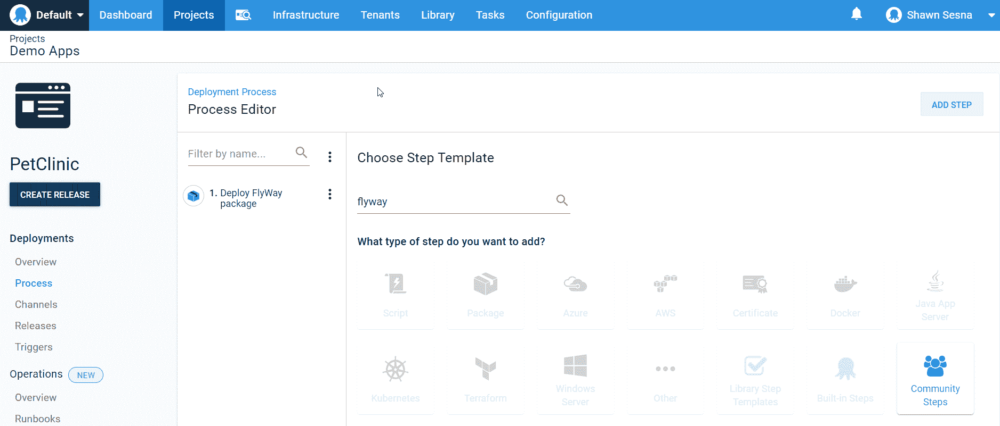
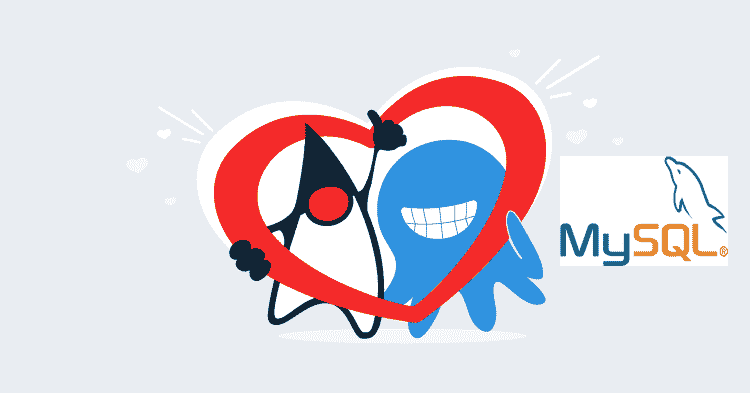

# 通过 Octopus Deploy - Octopus Deploy 部署带有 MySQL 后端的 Java web 应用程序

> 原文：<https://octopus.com/blog/deploying-java-with-mysql>

[](#)

在本文中，我将介绍如何构建和部署一个使用 MySQL 后端数据库的基于 Java 的 web 应用程序。

## 设置构建服务器

对于这个演示，我使用 Azure DevOps 作为我的构建服务器。当人们想到 Azure DevOps 时，他们会立即想到。NET/。NET 核心，不是 Java。但是，Microsoft build server 的任务库中内置了 Maven 和 ANT 构建任务。

等等，好像是...太容易了。

您的怀疑是正确的，尽管任务确实存在，但如果没有一点配置，它们实际上是无法工作的。对我们来说幸运的是，这一切都很简单。

### 构建代理上的 Java

要构建 Java，需要在构建代理上安装 Java 开发工具包(JDK)，可以从 [OpenJDK](https://openjdk.java.net/) 下载。如果您像我一样是 Windows 用户，要使 Java 正常工作，还需要两个额外的步骤:

*   创建 JAVA_HOME 环境变量，并将其设置为 JAVA 安装的根目录(即 c:\Program Files\Java)。
*   将\bin 文件夹添加到 Path 环境变量中(即 c:\ Program Files \ Java \ jav exversion \ bin)。

### 构建代理上的 Maven

我们需要做的下一件事是在我们的构建代理上安装 Maven。Maven 没有安装程序，它是一个. zip 文件，需要提取出来放在构建代理上。与 Java 类似，我们需要配置环境变量:

*   创建 MAVEN_HOME 并指向提取 MAVEN 的位置(即 c:\maven)。
*   将\bin 文件夹添加到 Path 环境变量中(即 c:\maven\bin)。

### 添加 Maven 功能

如果您正在创建一个新的构建代理，这一步可能是不必要的，代理安装的一部分会扫描机器的功能，如果找到的话会自动添加 Maven。如果您使用的是现有的代理，您需要进入 Azure DevOps (ADO)并手动为代理添加功能。

导航到 ADO 的代理池部分。选择您想要修改的代理并点击**功能**:

[](#)

点击**添加功能**按钮，添加以下内容(参见我使用的值的截图):

*   JAVA_HOME
*   专家
*   MAVEN_HOME

[](#)

现在，您的 ADO 实例可以构建 Maven 项目。

配置 ADO 以构建 ANT 项目的步骤几乎与此相同。对于构建代理和功能部分，用 ANT 替换 Maven。

## 示例应用程序

在这个演示中，我使用的是 [Pet Clinic](https://github.com/spring-petclinic/spring-framework-petclinic) 示例应用程序，它最初是为了演示 Spring 框架的功能而开发的。Pet Clinic 已经配置为使用 Maven 构建，并且能够使用 MySQL 作为数据库后端。开箱即用，宠物诊所是完全功能性的，所以我们自然要修改它。

### 调整 POM

我需要对 POM 做一些调整。XML (Maven 项目对象模型)文件，使其适用于本文:

*   使用变量使`<version>`属性动态化。
*   将活动配置文件切换到 MySQL。
*   更改 MySQL 概要文件的`jdbc.url`以使用变量。
*   改变`finalName`属性。
*   更新`cssDestinationFolder`属性。

#### 使版本号动态化

原始项目中的版本号是硬编码的，但是我想根据内部版本号使它成为一个动态值。这很容易通过在 Maven 构建过程中插入变量来实现。在 POM.xml 文件中找到`<version>5.2.1</version>`，并将其更改为`<version>${project.versionNumber}</version>`。

变量名`project.versionNumber`是我选的名字，不过你想怎么命名都行。

#### 将活动数据库配置文件更改为 MySQL

这个报告的作者在使这个应用程序支持多个数据库后端方面做了出色的工作:HyperSQL、MySQL 和 PostgreSQL。默认设置为 HyperSQL 配置文件(HSQLDB)。要将其更改为 MySQL，只需将`<activation>` XML 节点从 HSQLDB 概要文件移动到 MySQL 概要文件。

为此:

1.  在 POM 中找到`<profiles>` XML 节点。XML 文件。
2.  找到子节点为`<id>HSQLDB</id>`的`<profile>`节点。在`<id>`节点的正下方是一个`<activation>`节点。
3.  将`<activation>`节点移动到 MySQL 节点。

生成的 MySQL 节点应该如下所示:

```
<profile>
    <id>MySQL</id>
    <activation>
        <activeByDefault>true</activeByDefault>
    </activation>            
    <properties>
        <db.script>mysql</db.script>
        <jpa.database>MYSQL</jpa.database>
        <jdbc.driverClassName>com.mysql.jdbc.Driver</jdbc.driverClassName>
        <jdbc.url>jdbc:mysql://${databaseServerName}/${databaseName}?useUnicode=true</jdbc.url>
        <jdbc.username>root</jdbc.username>
        <jdbc.password></jdbc.password>
    </properties>
    <dependencies>
        <dependency>
            <groupId>mysql</groupId>
            <artifactId>mysql-connector-java</artifactId>
            <version>${mysql-driver.version}</version>
            <scope>runtime</scope>
        </dependency>
    </dependencies>
</profile> 
```

#### 更改我的概要文件的 jdbc.url 以使用变量

当编译 Maven 项目时，活动数据库概要文件的属性被复制到结果中的`/WEB-INF/classes/spring/datasource-config.xml`文件中。战争档案。`datasource-config.xml`是用于该应用程序数据库连接字符串的文件。在上面的代码示例中，我们将服务器和数据库的连接字符串改为使用变量`databaseServerName`和`databaseName`:

```
<jdbc.url>jdbc:mysql://${databaseServerName}/${databaseName}?useUnicode=true</jdbc.url> 
```

#### 更改 finalName 属性

POM 的`finalName`属性。XML 是。战争档案将在项目打包时给出。默认`finalName`为`petclinic`:

```
<finalName>petclinic</finalName> 
```

构建时，这会产生一个 petclinic.war 的文件名。Octopus Deploy 使用[语义版本化](https://semver.org/)，文件名中嵌入了一个版本号。POM 的`version`属性。XML 文件将非常适合这种情况，因为我们已经将它动态化了。将您的`<finalName>`属性更新为:

```
<finalName>petclinic.web.${project.version}</finalName> 
```

我添加了`.web.`部分，以便更容易地识别这是 Octopus Deploy 中的哪个组件。

#### 更新 cssDestinationFolder 属性

当我在本地系统上完成这项工作时，当我更改 POM 的`finalName`属性时，我遇到了令人讨厌的意外；没有一个 css 能成为最终产品。经过一些故障排除后，我发现将 css 复制到应用程序中的操作使用了`finalName`值作为复制到的路径。为了解决这个问题，我更新了`<cssDestinationFolder>`属性:

```
<cssDestinationFolder>${project.build.directory}/petclinic/resources/css</cssDestinationFolder> 
```

收件人:

```
<cssDestinationFolder>${project.build.directory}/petclinic.web.${project.version}/resources/css</cssDestinationFolder> 
```

如果您的应用程序呈现以下图像，则您的`<cssDestinationFolder>`不正确:

[](#)

### 更新 datasource-config.xml

通过这个示例应用程序，我了解到无论何时部署它，它都会运行包含的数据库脚本。经过一番挖掘，我发现我可以在 datasource-config.xml 文件中注释掉一些 XML 来阻止这种情况。我仍然需要数据库脚本，我只是不希望每次部署应用程序时都执行它们。稍后将详细介绍。

导航到`/src/main/resources/spring/datasource-config.xml`并注释掉数据库初始化器部分。它应该是这样的:

```
 <!-- Database initializer. If any of the script fails, the initialization stops. -->
    <!-- As an alternative, for embedded databases see <jdbc:embedded-database/>. -->
    <!--
    <jdbc:initialize-database data-source="dataSource">
        <jdbc:script location="${jdbc.initLocation}"/>
        <jdbc:script location="${jdbc.dataLocation}"/>
    </jdbc:initialize-database>
    --> 
```

## 添加飞行路线项目

Flyway 是一款基于迁移的数据库部署工具。简而言之，它是一个包含在项目中的命令行实用程序，使用特定的文件夹结构以指定的顺序执行 SQL 脚本。Flyway 下载本质上是您将添加到项目源代码控制中的项目。

### 添加。到 Flyway 的 sql 脚本

在 Java 应用程序源代码中，复制。位于 Flyway 项目的`src/main/resources/db/mysql`到`/sql`文件夹的 sql 文件。然后，重命名文件以符合 [Flyway 的工作方式](https://flywaydb.org/getstarted/how)。例如:

*   V1__initDb.sql
*   V1_1__populateDb.sql

就是这样！

## 创建生成定义

现在我们已经完成了在构建代理上安装 Maven 的先决条件工作，调整了几个文件，并添加了 Flyway，我们可以创建我们的构建定义了。

### 添加 Maven 任务

创建一个新的构建定义，这个演示使用经典编辑器而不是 YAML 方法:

[](#)

从空工单开始:

[](#)

添加 Maven 构建任务:

[](#)

填写任务输入字段:

*   显示名称:
    *   这个值不重要。
*   Maven POM 文件:
    *   如果您的`pom.xml`不在根文件夹中，使用省略号(…)找到它。
*   目标:
    *   `clean package dependency:purge-local-repository`
*   选项:
    *   `-Dproject.versionNumber=$(Build.BuildNumber) -DdatabaseServerName=$(DatabaseServerName) -DdatabaseName=$(DatabaseName) -DskipTests=$(SkipTests)`

dependency:purge-local-repository 目标可能没有必要，但是我喜欢在构建时清理我的 sources 文件夹。

[](#)

导航到变量并创建以下内容:

*   数据库名称:`#{Project.MySql.Database.Name}`
*   数据库服务器名称:`#{Project.MySql.Database.ServerName}`
*   船长:`true`

如果您不熟悉变量值使用的#语法，Octopus Deploy 使用它来替换变量。

跳过测试是必要的，因为测试试图连接到数据库后端。因为我们将它们作为部署过程的变量，所以连接尝试将会失败，并使构建完全失败:

[](#)

您会注意到定义了两个额外的变量；`MajorVersion`和`MinorVersion`。我使用这些变量在 ADO 中创建我的内部版本号格式。要对此进行设置，单击 Options 选项卡并填写构建号格式，我使用了`$(MajorVersion).$(MinorVersion).$(Year:yy)$(DayOfYear).$(Date:Hmmss)`:

[](#)

这是 ADO 对`$(Build.BuildNumber)`的引用值，我们将它输入到传递给 Maven 构建任务的`project.VersionNumber`变量中。

Maven 任务到此为止。`.war`是 Octopus Deploy 中内置包存储库支持的文件类型，因此不需要打包 Java 应用程序。

### 打包飞行路线项目

如前所述，Flyway 是一个命令行实用程序，所以没有构建项目。我们唯一需要做的就是打包它，以便 Octopus Deploy 可以用它做一些事情。为此，我们可以使用任何创建 ZIP 或 NuGet 包的任务。本演示使用 Octopus 部署插件，打包应用程序任务:

*   包 ID: `petclinic.flyway`
*   包装格式:`NuPkg`
*   包版本:`$(Build.BuildNumber)`
*   来源路径:`$(Build.SourcesDirectory)\flyway`
*   输出路径:`$(build.stagingdirectory)`

[](#)

### 推进到章鱼部署

构建过程的最后一部分是将我们创建的包推送到我们的 Octopus Deploy 服务器。添加推送至 Octopus 部署任务:

*   空间:选择您的空间。
*   包装:
*   `$(Build.SourcesDirectory)\target\*.war`
*   `$(build.artifactstagingdirectory)\*.nupkg`

[](#)

这就是您的构建定义。

## 创建 Octopus 部署项目

在 Octopus Deploy web 门户中，单击项目选项卡，然后单击**添加项目**:

[](#)

给项目命名，然后点击**保存**。或者，您可以选择将其放入哪个项目组以及使用哪个生命周期:

[](#)

### 变量

点击**保存**后，我们将直接进入我们全新的项目。单击变量来定义我们的一些变量，因为在我们定义流程之前，我们需要它们先存在:

[](#)

在变量屏幕上，我们创建以下变量:

*   `Project.MySql.Database.Name`
*   `Project.MySql.Database.ServerName`
*   `Project.MySql.Database.User.Name`
*   `Project.MySql.Database.User.Password`

为变量命名空间被认为是 Octopus Deploy 的最佳实践；它帮助用户识别变量的来源和用途。

#### 项目。MySql .数据库.名称

这个变量是我们在构建过程中使用#语法设置的变量之一。我们将很快介绍变量是如何被替换的。现在，给这个变量取数据库名的值。在我的例子中，我使用了`petclinic`。

#### 项目。MySql .数据库.服务器名

当您从一个环境转到另一个环境时，数据库服务器通常是不同的。此变量将使用部署到的环境范围内的值。

#### 项目。MySql.Database .用户名

顾名思义，这是数据库连接的用户名。

#### 项目。MySql .数据库.用户.密码

这是数据库连接的用户帐户密码:

[](#)

### 过程

定义好变量后，让我们创建流程。点击**进程**按钮:

[](#)

#### 添加部署包步骤

在过程屏幕上，点击**添加步骤**按钮:

[](#)

选择**包**类别和**部署包**步骤:

[](#)

填写步骤的属性:

*   步骤名称:`Deploy Flyway package`。
*   关于目标角色:`PetClinic-Db`(这是我给角色起的名字)。
*   包装:`petclinic.flyway`。

这是点击**保存**后的步骤:

[](#)

##### 变量替换(可选)

如果您在任何。sql 脚本(我做了)，您需要配置这个步骤来执行变量替换。

点击**配置功能**按钮:

[](#)

选择**文件中的替代变量**:

[](#)

点击**确定**，然后向下滚动并展开文件中的替代变量部分。对于**目标文件**，输入值`sql/*.sql`，点击**保存**:

[](#)

#### 添加 Flyway 迁移步骤

社区步骤模板库中提供了此步骤。

和前面一样，点击**添加步骤**按钮。当窗口出现时，键入 flyway 来过滤步骤。鼠标悬停飞行路线迁移并点击**安装并添加**:

[](#)

[](#)

系统会提示您安装并添加，点击**保存**:

[【](#)

填写步骤模板的必需属性:

*   关于角色中的目标:`PetClinic-Db`(这是我给角色起的名字)。
*   飞行路径包步骤:使用下拉菜单选择**部署飞行路径包**步骤。
*   目标网址:`jdbc:mysql://#{Project.MySql.Database.ServerName}/#{Project.MySql.Database.Name}?useUnicode=true`
*   目标用户:`#{Project.MySql.Database.User.Name}`
*   目标密码:`#{Project.MySql.Database.User.Password}`

由于这是一个敏感变量，我们需要单击 Bind 图标来设置它使用一个变量:

[T14](#) T16  

这一步就这样，点击**保存**。

在撰写本文时，必须在目标上执行部署包步骤和 Flyway 迁移步骤。然而，Flyway 迁移步骤的工人友好版本正在审查中。

#### 部署网站步骤

Octopus Deploy 为两个最流行的基于 Java 的应用程序的 web 服务器 Tomcat 和 JBOSS/wildly 提供了内置步骤。这个演示使用了野花步骤。

像以前一样，点击**添加步骤**，然后按野花过滤。选择**部署到 Wildfly 或 EAP** 步骤模板:

[](#)

填写步骤模板的详细信息:

*   步骤名称:`Deploy Petclinic Web`
*   关于角色中的目标:`Petclinic-Web`
*   包 ID: `petclinic.web`
*   管理主机或 IP: `#{Octopus.Machine.Hostname}`(这是一个系统变量，使用要部署到的机器的主机名。)
*   管理用户:`[Your management user]`
*   管理密码:`[Password for management account]`
*   部署名称:`PetClinic.war`

[](#)

对于 Wildfly 步骤，还有最后一件要配置的事情，替换 datasource-config.xml 中的# variables。单击**配置特性**按钮并选择**替换文件**中的变量，就像我们在**部署包**步骤中所做的那样。在**目标文件**部分，输入以下值`WEB-INF/classes/spring/datasource-config.xml`。

使用`/`而不是`\`是为了支持 Linux 部署目标，并且仍然适用于 Windows 目标。

就是这样。让我们创建我们的第一个版本。

## 部署时间

我们现在准备部署我们的应用程序。点击**创建发布**按钮:

[](#)

点击**保存**:

[](#)

点击**部署到开发**(用您命名的环境替换开发):

[](#)

点击**展开**:

[T32](#)

完成后，您应该会看到如下所示的屏幕:

[](#)

注意，web 服务器的部署被部署到两个服务器上，Wildfly1 (Windows)和 Wildfly2 (Linux)。

点击**任务日志**标签，查看关于我们部署的更多详细信息:

飞行方式: [](#)

[](#) 野花

宠物诊所: [](#)

## 结论

在本文中，我们配置了一个 CI/CD 管道来构建和部署一个基于 Java 的 web 应用程序，使用 Flyway 来管理 MySQL 数据库！

[](#)