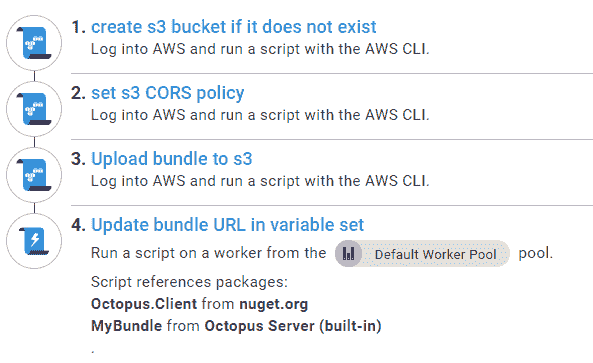
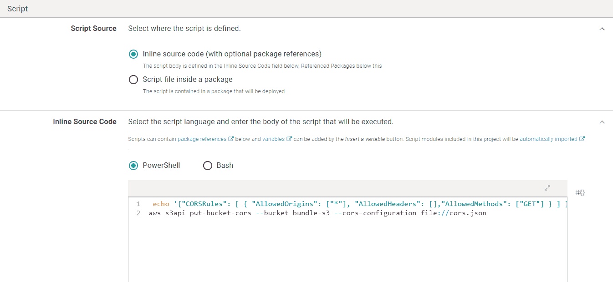
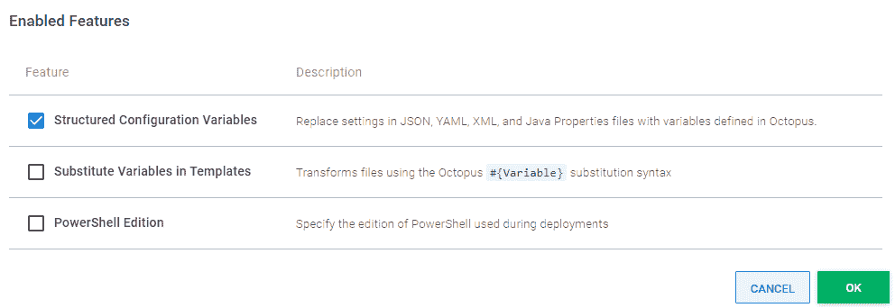
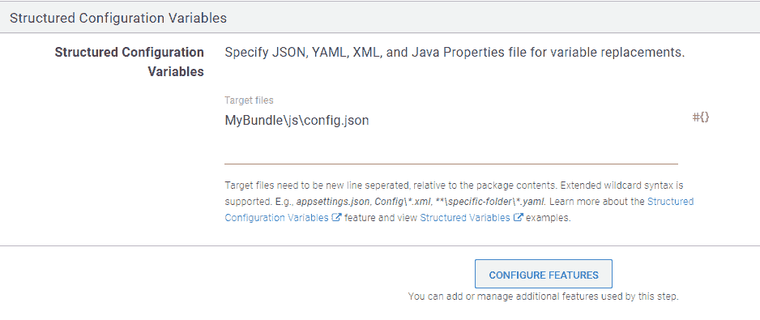

# 用 Octopus - Octopus Deploy 部署 JavaScript 库项目

> 原文：<https://octopus.com/blog/deploying-javascript-library-project-with-octopus>

有一种常见的前端开发模式，它以最好的意图开始，但如果不小心处理，可能会导致痛苦。您看到了跨多个项目重用前端代码的需要，这些项目由使用不同技术的不同团队维护。您创建一个共享的 JavaScript 库项目，它有自己的 repo 和 release 过程。这是一个明智的想法，但提出了一些需要好答案的问题，以阻止我们的快乐成长为一个怪物。

在这篇文章中，我解释了如何管理一个共享 JavaScript 项目的部署过程，这个项目很容易从其他 Octopus 项目中引用。我的例子使用了部署到亚马逊 S3 的 Vue JS 包，但是同样的原则可以应用到前端框架和托管提供商的任何组合。

## 该过程

我们在 Octopus 中完成的部署过程如下所示:

[](#)

我解释了每一步的原因以及它们是如何工作的。

## 如果 S3 存储桶不存在，则创建一个

本着把服务器当成牛而不是宠物的精神，除了拥有一个具有适当权限的 AWS 帐户之外，我对我们的部署目标不做太多假设。在一个具体的例子中，我有专门的存储桶用于区域和测试、阶段和生产环境的组合，所以我喜欢这样一个构建过程，它只需要我在限定了作用域的变量中命名存储桶和区域，并在需要时正确地设置它。这是通过运行以下 PowerShell 脚本的 [AWS CLI 步骤](https://octopus.com/docs/deployments/custom-scripts/aws-cli-scripts)实现的，该脚本使用 AWS CLI 来查看您在尝试列出 bucket 的内容时是否获得了非错误结果。否则，它会创建 bucket，然后在步骤完成之前轮询以确认 bucket 是否存在。

```
$bucket = $OctopusParameters["s3-bucket-name"]
$region = $OctopusParameters["s3-region"]
$found = aws s3 ls s3://$bucket/ --recursive --summarize | Select-String -Pattern 'Total Objects:'
if ([string]::IsNullOrWhiteSpace($found)) {
    aws s3api create-bucket --bucket $bucket --region $region
    aws s3api wait bucket-exists --bucket $bucket
} 
```

## 制定 S3 CORS 政策

这是另一个 AWS CLI 脚本，内嵌以下 PowerShell:

```
echo '{"CORSRules": [ { "AllowedOrigins": ["*"], "AllowedHeaders": [],"AllowedMethods": ["GET"] } ] }' | out-file -encoding ASCII cors.json
aws s3api put-bucket-cors --bucket bundle-s3 --cors-configuration file://cors.json 
```

您可以根据需要更复杂地使用 CORS，但是在我的例子中，我假设我们的包存在于它们自己的专用桶中，所以简单的`allow all GET requests`是有意义的。

编码步骤很重要，而不是直接回显到文件。我不确定为什么设置 CORS 的 [CLI 命令](https://docs.aws.amazon.com/cli/latest/reference/s3api/put-bucket-cors.html)坚持从文件中读取，并且不让你通过命令行传递 JSON。如果您需要更复杂的 CORS 策略，那么选择包中的**脚本文件，并在您的 bundle repo 中控制. ps1 和 cors.json 文件的源代码，这比我在这里使用的内联选项更干净。**

[](#)

## 将包上传到 S3

下一个 **AWS CLI 步骤**有几个先决条件，在展示如何在 Octopus 中设置之前我会解释一下。我演示了它是如何在 Vue 中实现的。对于其他框架，步骤会有所不同，但是解释会为您指出正确的方向。

### 一个 JavaScript 文件来管理它们

默认情况下，Vue 会创建一个单独的 CSS 文件、一个生产源映射文件和一个供应商库文件。这是 webpack 执行的一个优化，用于更好地缓存不经常改变的公共依赖项。

这些都是合理的默认设置，但是对于一个不太大的共享 JS 包，您可以从允许消费者引用一个 JS 文件开始，以获得所有的样式和行为。如果需要，您可以在以后引入对优化、源映射和外部 CSS 的支持。

要指示 vue 只构建一个 JavaScript 文件，您可以将以下 vue.config.js 添加到 Vue 项目的根目录下，紧挨着 package.json:

```
 module.exports = {
  configureWebpack: {
    optimization: {
      splitChunks: false
    }
  },
  css: {
    extract: false,
  },
  productionSourceMap: false
} 
```

### 单独的 config.json 文件

[章鱼变量替换](https://octopus.com/docs/projects/variables/variable-substitutions)功能强大。为了在您的前端项目中利用它们，您需要告诉 Octopus 我们的包旁边有一个 config.json 文件。

为了让 Vue CLI 将文件包含在其 dist 文件夹中，该文件夹将被压缩以创建发送到 Octopus 的包，您需要在 Vue 启动新项目时生成的 public 文件夹中创建`js\config.json`。

这与针对 [React 和 Angular](https://octopus.com/blog/javascript-configuration) 显示的配置示例类似，只是在完整部署流程的环境中针对 Vue 实施。

现在，您需要运行以下命令:

```
npm run build 
```

您可以看到 Vue 已经将 config.json 作为一个单独的文件复制到输出文件夹中。要告诉 Vue 使用它，创建以下助手模块:

```
const configUrl = document.currentScript.src.substring(0, document.currentScript.src.lastIndexOf('/')) + '/config.json'

module.exports = async function() {
    const response = await fetch(configUrl);
    return await response.json();
}; 
```

现在，当您调用这个函数时，这个包将获取它部署到的 S3 文件夹中的相邻 config.json。

下面是如何在 Vue 组件中使用它:

```
<template>
  <div id="app">
    
    <HelloWorld msg="Welcome to Your Vue.js App"/>
  </div>
</template>

<script>
import HelloWorld from './components/HelloWorld.vue'
import getConfig from './config.js'

export default {
  name: 'App',
  components: {
    HelloWorld
  },
  data() {
    return { config: { } }
  },
  async created () {
    this.config = await getConfig();
  },
}
</script> 
```

您需要给任何图像或其他外部资产的引用一个基本 URL，类似于 **bucketUrl** 设置。这是因为 Vue 默认产生的相对路径对 S3 资产的消费者不起作用。

要告诉 Octopus 替换 config.json 文件中的变量，点击**配置特性**，勾选**结构化配置变量**。

[](#)

告诉 Octopus 替换`MyBundle\js\config.json`中的变量，其中`MyBundle`是您的包的 ID。

[](#)

### 上传您的包

最后，向步骤提供 CLI 命令，将您的包、config.json 和资产上传到以当前版本命名的文件夹中。

```
aws s3 cp MyBundle s3://#{s3-bucket-name}/release_#{Octopus.Release.Number} --recursive --exclude index.html --acl public-read 
```

我跳过上传 Vue CLI 生成的 index.html 文件，因为您的捆绑包的传统消费者不能使用该 index.html，而是需要唯一命名的捆绑包文件的 URL。

下一步也是最后一步的重点是向任何需要的项目提供环境的最新包的 URL。

## 更新变量集中的包 URL

能够通过自动填充的配置设置告诉其他项目从哪里获得缓存不足的共享包是为这种类型的 JavaScript 项目构建 Octopus 流程的一个优势。

破坏缓存的策略多得惊人，根据我的经验，很多都会带来痛苦。对我来说，这种痛苦要么源于消费者对捆绑过程了解太多，要么源于捆绑商对消费者了解太多。理想情况下，任何使用该包的项目只读取带有该包 URL 的配置设置。幸运的是，Octopus 让您在部署时无需太多定制代码就能实现这一点。

部署之后，这个定制脚本步骤更新了其他项目可以引用的[库变量集](https://octopus.com/docs/projects/variables/library-variable-sets)中作用域`BundleUrl`变量的包 URL。要做到这一点，参考章鱼。客户端在我们的文档中的[步骤中获取包。](https://octopus.com/docs/octopus-rest-api/octopus.client/using-client-in-octopus)

该步骤还需要对您部署的包的引用，以找到您上传的 JavaScript 文件的名称。然后，它可以运行以下 PowerShell:

```
Add-Type -Path 'Octopus.Client/lib/net452/Octopus.Client.dll'

$bundle = Get-ChildItem -Path MyBundle/js/*.js | Select-Object -First 1

$endpoint = new-object Octopus.Client.OctopusServerEndpoint $octopusURI,$octopusApiKey
$repository = new-object Octopus.Client.OctopusRepository $endpoint

$scope = New-Object Octopus.Client.Model.ScopeSpecification
$enviornmentName = $OctopusParameters["Octopus.Environment.Name"]
$envID = $repository.Environments.FindByName($enviornmentName).Id
$scope.Add([Octopus.Client.Model.Scopefield]::Environment,(New-Object Octopus.Client.Model.ScopeValue($envID)))

$libraryVariableSetId = $repository.LibraryVariableSets.FindByName('BundleVariables').Id
$libraryVariableSet = $repository.LibraryVariableSets.Get($libraryVariableSetId);
$variables = $repository.VariableSets.Get($libraryVariableSet.VariableSetId);
$releaseId = $OctopusParameters["Octopus.Release.Number"]
$variables.AddOrUpdateVariableValue("BundleUrl", $bucketUrl + 'release_' + $releaseId + '/js/' + $bundle.Name,$scope)
$repository.VariableSets.Modify($variables) 
```

就是这样！现在，任何数量的其他项目都可以通过包含`BundleVariables`库变量集来引用您的共享 JavaScript 包，并且可以使用`BundleUrl`变量。

## 结论

这篇文章解释了如何应用限定了作用域的变量、作为牲口的服务器和变量集的概念来实现对共享 JavaScript 项目的合理管理。

与管理 JavaScript 项目的其他解决方案相比，我在生产中遵循这一策略取得了良好的结果。我确实发现自己向前端专家解释说，他们需要重新发布消费者项目，以使它自己升级到软件包的最新版本，但在人们掌握了它之后，这是合乎逻辑的。我的团队中的前端专家对这个部署过程模式的工作方式给了我很好的反馈。

愉快的部署！