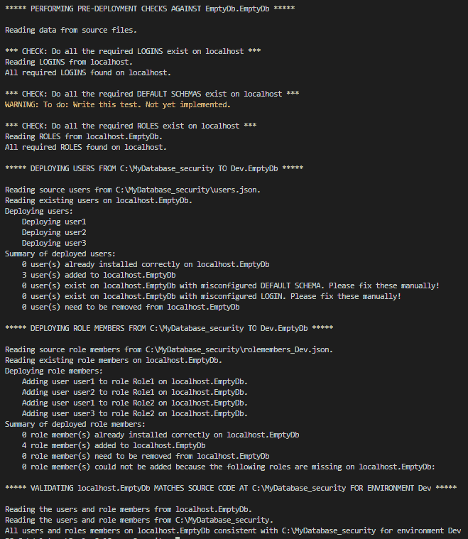

# 使用 dbatools 和 Octopus Deploy 部署 SQL Server 安全性

> 原文：<https://octopus.com/blog/deploying-sql-server-security-with-dbatools-and-octopus-deploy>

[](#)

上个月，我写了关于您的 [SQL Server 部署工具选项](https://octopus.com/blog/sql-server-deployment-options-for-octopus-deploy)的文章。这个月，我将讨论管理数据库安全性这一经常令人痛苦且缺乏支持的挑战。

由于过去几周我一直在为我的一个客户解决这个难题，所以我将以一些 PowerShell 脚本的链接结束本文，您可以将这些脚本用于您自己的数据库。

## 安全性的挑战

如果您可以编写脚本，那么您应该对其进行源代码控制，并通过您的管道进行部署。

这使您可以看到发生了什么变化，什么时候发生的，为什么会发生变化，并且可以更容易地进行故障排除和回滚。审计员喜欢它。但是安全性带来了挑战，因为有些部分在每个环境中可能是相同的(例如，数据库角色)，但其他部分可能会改变(例如，被分配到这些角色的用户)。

在每个环境的基础上编写脚本可能会导致大量的重复、管理上的辛劳和一大堆旧东西。然而，对所有环境使用一个标准的安全模型也是不可行的。显然，您的开发人员需要对他们的开发数据库进行写操作的权限，但是您可能不希望让每个开发人员都可以访问生产数据库。

实践基于角色的访问控制(RBAC)很有帮助。如果您的角色在整个管道中是一致的，那么您可以使用我上个月讨论的工具进行源代码控制和部署。然而，这仍然给你留下了管理每个环境中哪些用户应该是那些角色的成员的挑战。我在上一篇文章中讨论的工具通常不能提供一个优雅的解决方案——除了允许您过滤掉用户，以便您可以通过其他方式管理他们。

## 可能的解决方案

通常，您需要某种环境感知的部署后流程来部署适合环境的用户，并将他们分配到所需的角色。

Octopus Deploy 有一些很酷的特性来帮助您管理特定于环境的配置。例如，我们可以创建一个 [#变量](https://octopus.com/docs/projects/variables)，并将其设置为*开发*或*生产*，等等。在我们部署的每个环境中。然后，我们可以使用这个变量来选择是否要将 *DEV* 或 *PROD* 用户部署到给定的环境中。例如，在下面的截图中，我将*开发*安全模型部署到*开发*和*测试*环境中，但是我使用了不同的*产品*安全模型用于生产。

[](#)

一些工具，如 [SSDT](https://docs.microsoft.com/en-us/sql/ssdt/how-to-specify-predeployment-or-postdeployment-scripts?view=sql-server-ver15) 和[红门工具](https://documentation.red-gate.com/soc6/common-tasks/working-with-pre-post-deployment-scripts)，内置了对*后期部署脚本*的支持。作为我研究的一部分，我查看了彼得·肖特的一个项目的一些细节，他自己是在杰米·汤普森的早期工作的基础上建立的(谢谢彼得，你的工作真的帮助了我！).

然而，Peter 的工作只支持 SSDT 项目，正如我在上一篇文章中所讨论的，有很多部署工具，例如，我这个月接触的客户使用了不同的工具。我们真正想要的是不管你用的是 SSDT、Redgate、DbUp 还是别的什么都可以工作的东西。

自 2013 年(Peter 发表其作品)以来，PowerShell 已成为微软堆栈上的首选自动化工具，在过去几年中 [dbatools](https://dbatools.io/) (社区驱动的 SQL Server PowerShell 模块)彻底改变了热爱自动化的 DBA 使用 SQL Server 的方式。非常感谢[克里斯·勒梅尔和所有其他人](https://dbatools.io/team/)让我的工作变得如此简单！如果您热爱自动化，您使用 SQL Server，并且您没有听说过 dbatools，那么您真的需要了解一下。

dbatools 自带[超过 500 个 cmdlet](https://dbatools.io/commands/)，包括(例如) [New-DbaDbUser](https://docs.dbatools.io/#New-DbaDbUser) 和 [Add-DbaDbRoleMember](https://docs.dbatools.io/#Add-DbaDbRoleMember) 。由于 PowerShell 是 Octopus Deploy 的默认自动化语言之一，dbatools 有助于我们避免动态生成 T-SQL 负载，因此我着手创建了一个纯 PowerShell 版本的 Peter 的 SSDT 后期部署脚本，该脚本易于维护，从 Octopus Deploy 运行起来也很简单，与您的数据库部署工具无关。

## 把所有的放在一起

我们想要的是一个环境感知、部署后脚本，可以很容易地从 Octopus Deploy 调用。我已经创建了一些 PowerShell 脚本来探索如何实现这一点。它们无论如何都不完美，但希望它们能给你一些启发。如果你喜欢，可以随意叉回购:[https://github.com/Alex-Yates/DeploySqlServerSecurity](https://github.com/Alex-Yates/DeploySqlServerSecurity)。

首先，一些免责声明。这仍是一项进行中的工作。我知道 PowerShell 足够危险，但不够优雅。使用时风险自担。

您要做的第一件事是运行 GetSecurity.ps1:

```
git clone https://github.com/Alex-Yates/DeploySqlServerSecurity.git
cd .\DeploySqlServerSecurity
\DeploySqlServerSecurity> .\GetSecurity -SqlInstance DevSql01 -Database MyDatabase -Environment Dev -OutputDir “C:\MyDatabase_security” 
```

这将把您的所有用户和角色成员导出到您选择的输出目录。

与 Peter 不同，我假设您正在练习 RBAC，所以我不包括角色或权限。我希望您的角色在所有环境中都是一致的，并且您的所有权限都是通过您的角色来管理的，并且这些角色是通过您的常规数据库部署工具来部署的。在这一点上，我也只支持 Windows 授权用户。如果这不现实，请告诉我，我们可以考虑添加角色、权限和/或 SQL 用户。

数据存储在 JSON 文件中。(抱歉 XML 粉丝。我计划很快添加 XML 支持。)我希望这些易于理解和维护:

[](#)

现在，您可以第二次运行 GetSecurity.ps1，这一次将它指向测试数据库:

`\DeploySqlServerSecurity> .\GetSecurity -SqlInstance TestSql01 -Database MyDatabase -Environment Test -OutputDir “C:\MyDatabase_security”`

您将得到一个 users.json 文件，它指定了每个用户应该部署到哪个环境。对于每个环境，您还将获得一个单独的 rolemembers_$Environment.json 文件。角色成员文件定义了在特定环境中应该将哪些用户添加到哪个角色:

[](#)

现在，您可以随意编辑这些文件。例如，您可以添加用户或更改哪些用户是哪个角色的成员。当您准备好时，您可以使用`DeploySecurity.ps1`部署用户。该脚本将对您的源代码执行一系列测试，并确保适当的角色和登录等。，然后它将部署您的用户并确保所有用户都被添加到适当的角色。

默认情况下，它不会删除任何内容，但是如果目标数据库中存在任何意外的用户或角色成员，它会向您发出警告。但是，如果您使用`-DeleteAdditional`开关，它将删除目标数据库中不存在于源文件中的任何内容。在本例中，我创建了一个几乎为空的数据库，只包含所需的角色，并在其中部署了我所有的 *Dev* 安全性。

`\DeploySqlServerSecurity> .\DeploySecurity -SqlInstance localhost -Database EmptyDb -Environment Dev -SourceDir “C:\MyDatabase_security”`

[](#)

现在，您需要设置一个构建过程，将源文件和部署脚本打包到一个 NuGet 或 zip 文件中，并将它们传递给 Octopus Deploy。您可能希望运行`TestSecurity.ps1`作为构建过程的一部分，以检查您在编辑源文件时没有破坏键盘或者错过任何登录。

然后，在您的 Octopus 项目中，在常规数据库部署完成之后，您需要运行一个标准的 Octopus Deploy PowerShell 步骤，传递适当的环境变量，以确保将正确的安全配置部署到目标数据库。

[](#)

## 下一步是什么？

我有一堆东西想用它来做，我真的很想听听你对如何改进它的想法。你能使用这个吗？如果没有，为什么没有？少了什么？留给我一个 GitHub 问题或者提交一个 pull 请求。

然而，我也应该提到，在过去的几天里，我了解到[斯图尔特·摩尔正在做类似的事情](https://github.com/sqlcollaborative/dbasecurityscan)。本周早些时候，他向 sqlcolaboratory 发表了他的作品。他更多的是从安全审计/测试的角度来解决问题，而不是从源代码控制/部署的角度，但是我们的工作是如此紧密地联系在一起，所以最好是将我们的努力结合起来。

我最喜欢这个社区的一点是有多少人愿意分享他们的工作，并合作解决困难的问题。

* * *

自 2010 年以来，Alex Yates 一直在帮助组织将 DevOps 原则应用于他们的数据。他最引以为豪的是帮助 Skyscanner 开发了一天 95 次部署的能力，并支持了联合国项目服务办公室的发布流程。亚历克斯与除南极洲以外的各大洲的客户都有过合作——所以他渴望见到任何研究企鹅的人。

作为一名热心的社区成员，他共同组织了[数据接力](https://datarelay.co.uk/)，是[www.SpeakingMentors.com](http://www.speakingmentors.com/)的创始人，并自 2017 年以来被公认为[微软数据平台 MVP](https://mvp.microsoft.com/en-us/PublicProfile/5002655?fullName=Alex%20Yates) 。

Alex 是官方 Octopus Deploy 合作伙伴 [DLM 顾问](https://dlmconsultants.com/)的创始人。他喜欢为那些希望通过改进 IT 和数据库交付实践来实现更好业务成果的客户提供指导、辅导、培训和咨询。

如果你想和亚历克斯一起工作，请发电子邮件:[enquiries@dlmconsultants.com](mailto:enquiries@dlmconsultants.com)