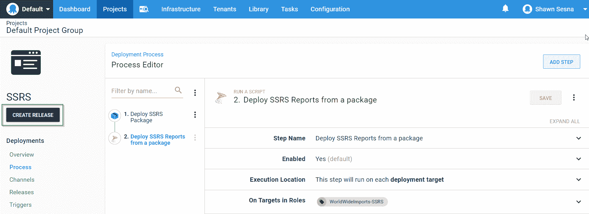

# 使用 Octopus - Octopus Deploy 部署 SQL Server Reporting Services(SSRS)报表

> 原文：<https://octopus.com/blog/deploying-ssrs>

当您想到自动化应用程序部署时，通常想到的是自动化部署 web 代码、容器和/或数据库。在本系列中，我将演示如何自动化支持组件，如 SQL Server Integration Services(SSIS)包和 SQL Server Reporting Services(SSRS)报表。

* * *

收集和存储数据通常是 web 应用程序的主要功能。需要分析收集到的数据，并以图形格式显示出来，以帮助做出决策。这通常采用报告的形式。SQL Server Reporting Services(SSRS)是微软的报告解决方案。SSRS 是一个基于 web 的应用程序，可以使用许多不同的数据源来为用户填充报告。在本系列的这一部分中，我将演示如何使用 Octopus Deploy 部署 SSRS 报表。

## 构建项目

截至 Visual Studio (VS) 2017，MSBuild 可以构建。rtpproj 文件。在 Visual Studio 的旧版本中创建的项目将需要配置类似于我的 [SSIS 邮报](/blog/deploying-ssis)的构建代理，以便使用 Visual Studio itslef(devenv . exe)来构建项目。这篇文章利用 Azure DevOps 作为构建平台，但是任何可以使用 MSBuild 的构建服务器都可以做到这一点(针对 VS 2017+)。

### 添加构建任务

要生成 SSRS 项目，只需将任何 MSBuild 类型的任务添加到您的生成定义中。对于我的构建定义，我选择了一个 Visual Studio 构建任务，它调用 MSBuild:

### 打包工件

当构建 SSRS 项目时，它将构建的报告放入`bin`文件夹中。在本例中，他们在`Reports/Reports/bin/release` We 中将这些报告打包成一个. zip 或. nupkg 包进行部署。对于这篇文章，我选择。nupkg 格式:

### 推动藏物

既然我们已经打包了工件，我们可以将它们推送到我们的 Octopus Deploy 服务器:

这就是我们构建定义所需要的。

## 章鱼部署

现在，我们已经在 Octopus Deploy 中拥有了我们的工件，我们可以为部署创建我们的项目。

### 创建项目

点击**项目**，然后**添加项目**:

### 部署包

我们流程的第一步是将包部署到 SSRS 服务器。点击**添加步骤**:

添加一个部署包步骤，并选择我们推送到 Octopus 服务器的包:

添加步骤后，填写文本框:

 

### 添加 SSRS 步骤

为了部署 SSRS 报告，我添加了一个社区步骤模板。按 SSRS 筛选步骤，并从程序包步骤中选择部署 SSRS 报表:

此步骤需要在部署包的同一目标上执行，对于执行位置，选择部署目标并填写您在部署包步骤中选择的相同角色:

填写该步骤的值。

*   **SSRS 包步骤**:这是我们之前创建的部署包步骤。
*   **SSRS 服务器服务的 URL**:这是报表服务 web 服务的 URL。比如 http://servername/ReportServer/reportservice 2010 . asmx？wsdl。
*   **报表执行 Url** :这是报表执行 web 服务的 Url。比如 http://servername/ReportServer/report execution 2005 . asmx？wsdl。
*   **报表文件夹**:报表将要部署到的文件夹的相对路径。比如`/MyFolder`。
*   **报表数据源文件夹**:数据源将要部署到的文件夹的相对路径。比如`/MyFolder/MyDataSources`。
*   **覆盖数据源**:如果您想在部署时覆盖数据源，请选中此项。

要指定数据源细节，您需要创建 Octopus Deploy 变量来匹配要覆盖的数据源。可以覆盖以下属性:

*   连接字符串
*   用户名
*   密码

例如，如果数据源的名称是`MyDatasource`，变量将是:

*   我的数据源。连接字符串
*   我的数据源。用户名
*   我的数据源。密码

如果用户名和密码用于一个域帐户，您需要创建一个名为`MyDatasource.WindowsCredentials`的额外变量，其值为`True`。

*   **备份位置(可选)**:在覆盖报表之前，在部署目标上备份报表的位置。
*   **数据集文件夹(可选)**:共享数据集将要部署到的文件夹的相对路径。比如`/MyFolder/MyDatasets`。
*   **报表部件文件夹(可选)**:报表部件将要部署到的文件夹的相对路径。比如`/MyFolder/MyReportParts`。
*   **服务域(可选)**:部署时使用的账户域名。
*   **服务用户名(可选)**:部署时使用的帐户用户名。
*   **服务密码(可选)**:用户部署时使用的密码。
*   **清除报告文件夹**:如果您想在部署之前从目标文件夹中删除报告，请选中此框。
*   **使用包文件夹结构**:如果您希望该步骤遵循包中包含的文件夹结构，选中此框。该设置忽略`Report folder`、`Report data source folder`和`DataSet folder`设置。
*   **根文件夹**:专门与`Use package folder structure`选项一起使用，指定这个项目在 SSRS 文件夹中的根位置。

步骤到此为止。我们现在准备部署。

## 部署报告

流程完成后，让我们创建一个发布。点击**创建发布**:

点击**保存**后，选择部署环境:

点击**部署**:

部署完成后，它应该如下所示:

[T31](#)

## 结论

在这篇文章中，我演示了使用 Octopus Deploy 部署 SSRS 报表是多么容易。愉快的部署！