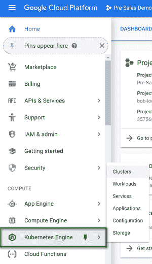
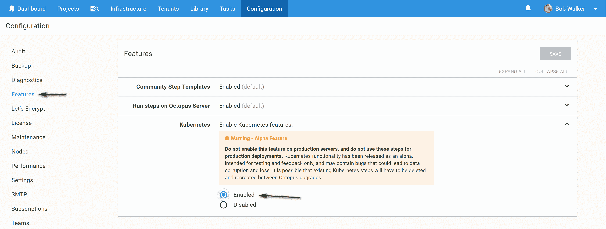
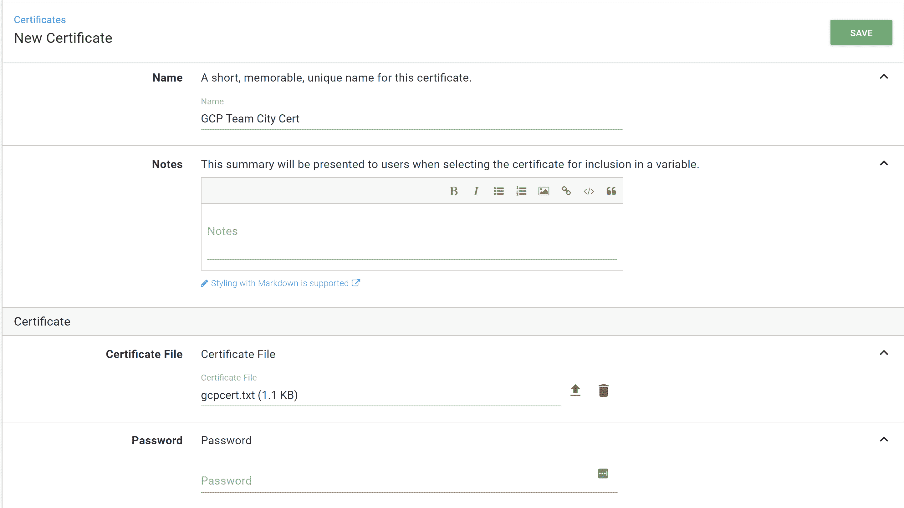
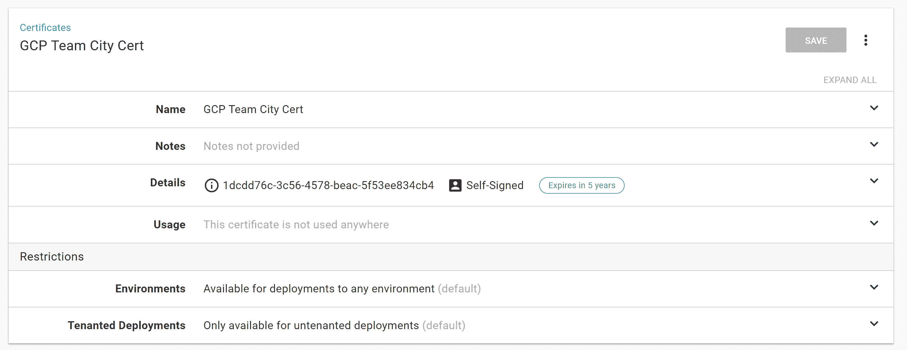
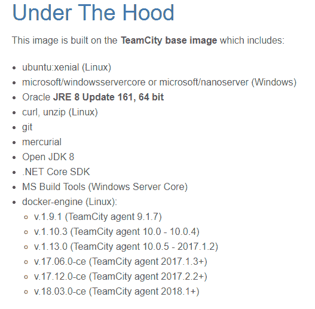
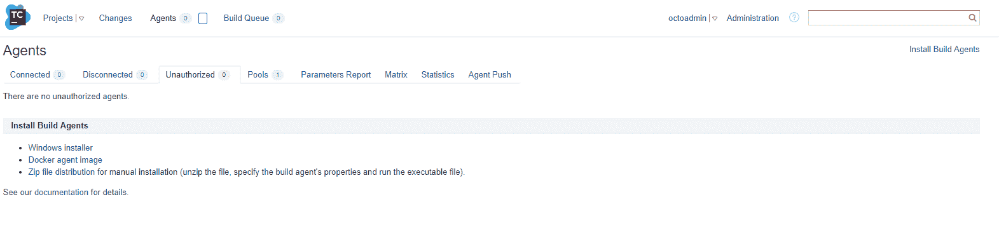
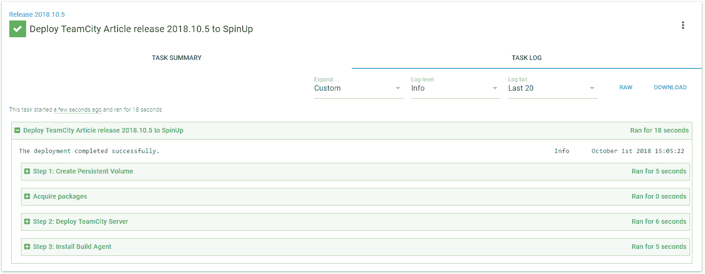

# 使用 Octopus Deploy - Octopus Deploy 将 TeamCity 部署到 Kubernetes

> 原文：<https://octopus.com/blog/deploying-teamcity-to-kubernetes>

[](#)

嗨！我叫 Bob Walker，是 Octopus Deploy 的解决方案架构师。

我的主要关注点是确保我们的客户成功使用 Octopus Deploy。这句简单的话涵盖了广泛的职责。有一天我可能会审查配置。接下来，我可能会使用 API 进行自定义实现。或者，我可能会提供演示，展示我们添加的所有新功能。在 Octopus Deploy，我们对客户使用哪种构建服务器没有偏好，这种灵活性对我们客户来说非常大，因为他们可以继续使用他们选择的构建工具。这样做的一个副作用是，我可以通过创建构建来演示来学习如何使用每个构建服务器。说到这里，如果您想要一个演示，请[点击此处](https://octopus.appointlet.com/s/sales-60/bob-ryan)预定一个！

在撰写本文时，我们还有两位专注于客户成功的解决方案架构师，Ryan Rousseau 和 Derek Campbell。只要有可能，我们就分享我们制作的演示。我们的背景是开发或基础设施，这意味着我们真的不喜欢任何时候我们必须重新发明轮子。我们发现共享演示资源的最简单方法是尽可能使用 SaaS 或 IaaS。我们使用 [Octopus Cloud](https://octopus.com/docs/octopus-cloud) 作为演示 Octopus 实例。事实上，我们是章鱼云的 alpha 用户之一，也是最前沿的用户之一。我们每天帮狗粮章鱼云。

我们最初的两个构建服务器，VSTS(现在的 Azure DevOps)和 AppVeyor，非常容易安装。他们已经是 SaaS 了。但是我们的许多用户都在使用 TeamCity。我们三个都有一个本地 TeamCity 实例。是时候把它转移到云端了。

我选择 TeamCity 的另一个原因是因为它的“现实世界”潜力。我有机会使用的许多容器都相当简单。一个 ASP.NET 核心 WebApi，它只连接到一个外部 SQL 服务器。对于 TeamCity，有许多考虑因素，有一个主服务器，一个需要与服务器通信的代理，以及在部署之间持久化数据的需要。

**旁注:**在本文中，我有时会交替使用 Kubernetes 和 K8s。它们的意思是一样的。这真的取决于我写这个句子时的感受。

## 要求

我们希望我们的构建服务器支持许多技术。该列表包括但不限于:

1.  。NET Framework 4.7.x 应用程序(ASP。NET、Windows 服务等)
2.  。网络核心应用
3.  Windows 容器应用程序
4.  Linux 容器应用程序(适用于我的。网络核心应用！)
5.  Java 语言(一种计算机语言，尤用于创建网站)
6.  Web 框架(Angular、React 等)

## 平台

我可以走捷径，在一个 Linux 虚拟机上运行 TeamCity，在另一个虚拟机上运行 Windows build agent。JetBrains 提供 AWS 和 Azure 模板来尽可能简化设置。但是我不想维护虚拟机。

JetBrains 提供了一个[服务器停靠容器](https://hub.docker.com/r/jetbrains/teamcity-server/)和一个[代理停靠容器](https://hub.docker.com/r/jetbrains/teamcity-agent/)。如果仔细观察代理 docker 容器，您会发现它既可以作为 Linux 容器运行，也可以作为 Windows 容器运行。它们还包括许多构建工具，如。NET 和 Git。而且，Octopus Deploy 最近增加了 Kubernetes 支持。今天的挑战是让 TeamCity 在 Kubernetes 集群中运行。

出于好玩，我将使用 Octopus Deploy 将 TeamCity 部署到 Kubernetes，这将依次将包推回到同一个 Octopus Deploy 实例。那是一些蛇在吃尾巴，但为什么不呢？YOLO，对吗？

## 步骤 1:创建 K8s 集群并连接 Octopus Deploy 到它

首先，我们需要设置 Octopus Deploy 来部署到 K8s 集群。为了实现这一点，我需要首先创建一个 K8s 集群。出于本文的目的，我将使用谷歌云平台或 GCP 来托管我的 K8s 集群。

让我们去[谷歌控制台登录](https://console.cloud.google.com)。

### 创建集群

创建您的帐户并登录后，您将被发送到控制面板。在左侧菜单中选择 Kubernetes。

[](#)

单击创建集群按钮。

[](#)

您将看到一个向导。您可以保留默认值不变。我所做的只是输入一个名字，然后点击创建。我只留下了大小(1 个 vCPU 和 3.75 GB 的内存)和位置(us-central1-a)。有趣的是，那个数据中心离我家只有 15 英里。如果有任何延迟，我有几个问题和几个后续问题。

[](#)

### 设置 Octopus 以连接到 Kubernetes 集群

创建群集大约需要 5 到 20 分钟。在我们等待的时候，让 Octopus Deploy 准备好连接它。为此，我将使用我团队托管的 Octopus 实例。因为我使用的是托管实例，所以我知道我使用的是最新版本，在撰写本文时是 2018.8.6。您至少需要使用 2018.8.0 才能正常工作。

目前 K8s 被一个功能标志禁用。首先，转到配置➜功能并启用它。

[](#)

接下来，是时候创建一个工人了。工人是一种新型的目标。这个[特性是 2018.7.0](https://octopus.com/blog/octopus-release-2018.7) 新增的。它允许您创建一个机器池来执行工作。以前这项工作是直接在 Octopus 服务器上进行的。

工人将在其上安装 Kubectl。我希望这些机器与我的其他目标分开，因为它们将对我的集群拥有管理员权限。为此，我首先创建了一个工人池，名为“Kubernetes 工人池”

[](#)

工人是没有什么花哨的，一个监听触手分配到一个特定的工人池。

[](#)

别忘了在机器上加上 KubeCtl。我用的是 Windows，所以我会让 chocolatey 来处理繁重的工作。

```
Set-ExecutionPolicy Bypass -Scope Process -Force; iex ((New-Object System.Net.WebClient).DownloadString('https://chocolatey.org/install.ps1'))

choco install kubernetes-cli -y 
```

### 连接到 GCP

好了，我们已经消磨了足够的时间。让我们检查一下 GCP，看看我的集群在哪里。很好，完成了。点击铅笔图标。

[](#)

下一页向我们展示了集群的概况。记下 IP 地址。这就是 Octopus 与集群通信的方式。在你疑惑之前，“嘿，显示你的 IP 地址和其他敏感信息难道不危险吗？”是的，它是。在这个上线之前我删除了 GCP 的所有内容。

**补充说明:**在写这篇文章的时候，我确实重复了几次这些步骤。我在尝试几个选择。这些截图来自很久以前被删除的原始实例。

为了连接到集群，我们需要获得用户名和密码。

#### 获取管理员凭据以将 Octopus 连接到 Google Cloud

Google Cloud 上的 Kubernetes 提供了两种连接方式。在撰写本文时，谷歌云将为您创建一个管理员帐户。然而，在未来的版本中，这将是可选的。

[](#)

如果您单击“显示凭据”链接，将会显示用户名和密码。

[](#)

**补充说明:**在 Google Cloud 上即将发布的 Kubernetes(1.12 版)版本中，默认的管理员和密码将被禁用。您需要创建一个服务帐户。请按照[这些说明](https://kubernetes.io/docs/tasks/configure-pod-container/configure-service-account/)进行操作。由于 1.12 版还没有发布，我在这里发布的任何内容都可能会过时。

#### 保存凭据

现在我们有了用户名和密码，我们将把这些凭证保存在 Octopus 中。转到基础设施➜账户。在右上角，点击添加帐户，并选择用户名/密码。

[](#)

你需要做的就是在 GCP 输入用户名和密码。

[](#)

#### 保存证书

将使用 GCP 提供的证书，因此我们可以使用 TLS 验证。我们需要在 Octopus Deploy 中保存该证书，以便使用。首先，将证书作为. pem 文件保存到桌面。然后转到库➜证书并点击添加证书。

[](#)

填写表单并选择您在桌面上创建的证书文件。

[](#)

如果成功，你会看到一个类似这样的屏幕。您会注意到证书是自签名的，并将在 5 年后过期。如果我想的话，我可以设置一个订阅，在过期时通知我。但不是现在，那是未来鲍勃的问题。

[](#)

### 添加 Kubernetes 目标

现在是时候添加 Kubernetes 部署目标了。转到添加部署目标

[](#)

首先，创建一个名称，将其分配给环境和角色。

[](#)

接下来，选择用户名/密码帐户，输入 IP 地址，然后选择证书。

**请注意:**在 URL 的[Ip 地址]前有 https://很重要。如果你不这样做，Octopus 将无法连接到你的 K8s 集群，你会花很多时间想知道为什么。我知道这一点，因为我忘记了，我一直挠头想知道为什么它不工作。

[](#)

我喜欢马上进行健康检查，以确保我没有搞砸任何事情。

[](#)

### 添加外部 Docker Feed

最后，我们需要添加 Docker Hub 作为提要。这是 TeamCity 容器将被拉出的地方。转到➜图书馆外部源并点击右上角的“添加源”按钮。

[](#)

## 步骤 2:部署 Team City Server

我想从简单开始，然后变得复杂。可以将 TeamCity 配置为使用外部存储和外部数据库。但是也可以将其配置为使用本地存储和本地数据库。我知道如果我将它配置为使用本地资源，那么每次进行部署时它们都会被销毁。就目前而言，这很好。我只想让它跑起来。我不会设置任何用户或项目。

### 创建项目并添加第一步

在 Octopus Deploy 中，创建一个新项目。我创建了一个名为“启动”的新环境和名为“仅启动”的生命周期您可以随意配置您的环境和生命周期。这正是我所做的。

[](#)

该过程将包括一个部署 Kubernetes 容器的步骤。请注意，这一步有很多选项。为了简洁起见，我将只包括我更改的项目的截图。如果你在截图中看不到什么，假设我没动它。

[](#)

### 部署 Kubernetes 容器步骤

首先，输入这一步的基本信息。

[](#)

接下来，点击“配置资源”并禁用“秘密”和“配置地图”这是为了让这个步骤更容易完成。

[](#)

输入部署名称。该名称只能包含小写字母数字字符和“-”。

[](#)

对于部署策略，我将它留在“重新创建部署”中。

[](#)

现在是指定容器的时候了。点击添加容器。

[](#)

完整的容器名是 jetbrains/teamcity-server。JetBrains 是创建容器的用户名，teamcity-server 是容器的名称。将所有信息输入到“添加容器”屏幕的开始部分。

[](#)

现在是时候指定端口号了。TeamCity 公开的默认端口号是 8111。

[](#)

这就是我们现在要指定的全部内容。继续并点击 ok 按钮。

模式窗口关闭后，在功能选择中输入服务的名称，并选择负载平衡器选项。

[](#)

我们需要进入服务器的方法。单击添加端口按钮，打开服务端口模式窗口。

[](#)

为此，我们将使用端口 80。给它一个名称，使用端口 80，并让它指向我们选择容器时定义的命名端口。

[](#)

完成后，摘要屏幕应该类似于以下内容:

[](#)

### 首次部署

就是这样！现在是保存的时候了，我们可以创建我们的第一个部署了！

[](#)

部署本身并不需要很长时间。

[](#)

但是回到 GCP 的界面，点击左边的服务链接。您可以看到，GCP 需要一分钟来创建负载平衡器。

[](#)

负载平衡器完成后，让我们单击 URL。如果一切顺利，我们应该看到这个屏幕！

[](#)

## 第三步:持久卷

好吧，事情有进展了。然而，我们有一个小问题。每次 Octopus Deploy 进行部署时，它都会销毁节点并重新创建它。这意味着上面截图中的数据目录将被清除。最终结果是，我们每次都必须重新创建 TeamCity 配置。即...太可怕了。那是什么样的构建服务器？

**请注意:**这不是由 Octopus Deploy 引起的，这是 Kubernetes 的一个特点。默认情况下，它假设 pod 可以在需要时被销毁和重新创建。

我们需要的是在两次部署之间持久保存这些数据。幸运的是，Kubernetes 已经具备了这种功能。我们只需要利用它。

为了简单起见，我将使用一个简单的持久性卷。这使用支持 Kubernetes 集群的存储。可以利用其他存储选项。有[多种选择](https://kubernetes.io/docs/concepts/storage/persistent-volumes/)。选择最适合贵公司/需求的方案。

### 将创建持久卷步骤添加到流程中

要做到这一点，我们需要学习一点关于 K8s CLI 的知识，这个 CLI 叫做 kubectl。我们感兴趣的命令是[应用命令](https://kubernetes.io/docs/reference/generated/kubectl/kubectl-commands#apply)。如果资源不存在，此命令将创建一个资源。这是完美的，这意味着我们可以在部署过程中使用它。

现在，apply 命令的一个奇怪之处是，您必须为它提供一个 YAML 或 JSON 文件。该文件可以是 URL 或硬盘上的权限。我创建了一个 GitHub repo 来存储这些类型的文件。然后我参考了 Github 的文件。

文件。它正在为我创建一个 30 GB 的硬盘驱动器，用作我的数据驱动器。

```
apiVersion: v1
kind: PersistentVolumeClaim
metadata:
  name: dt-pm-claim
  labels:
    app: data
spec:
  accessModes:
    - ReadWriteOnce
  resources:
    requests:
      storage: 30Gi 
```

Octopus Deploy 可以运行 kubectl 命令。让我们继续寻找要添加到我们流程中的步骤。

[](#)

我需要运行的脚本是:

```
kubectl apply -f [URL of file] 
```

让我们继续将它添加到步骤中。不要忘记设置工人和角色！

[](#)

保存后，我的流程是这样的。

[](#)

这看起来不对，我们想要为服务器创建卷。让我们重新订购那个。

[](#)

### 添加持久卷以部署 TeamCity 服务器步骤

现在，我们需要告诉 TeamCity 服务器我们将要创建的存储。返回到部署 TeamCity 服务器步骤。找到“volumes”部分，然后单击“add volume”。

[](#)

从下拉列表中选择永久卷声明。在接下来的两个文本框中，输入您在 YAML 文件中创建的名称。

[](#)

现在，这个部署知道这个声明。我们需要告诉集装箱这件事。单击容器定义。

[](#)

我们需要在这个容器中添加一个卷装载。这可以通过展开卷装载并单击“添加卷装载”链接来完成。

[](#)

提供卷装载的详细信息。我选择路径/mnt/teamcity/data 的唯一原因就是“为什么不”

[](#)

卷已全部装入。现在我们需要告诉 TeamCity 默认使用这个卷装载。

[](#)

要设置的环境变量的名称是什么？多亏了一些 GoogleFu 和一些随机的文章，我能够确定它应该是“团队城市数据路径”所以我们来设定一下。

[](#)

在您单击 ok 之后，您的部署摘要应该如下所示。

[](#)

### 部署

好了，是时候进行另一次部署了！创建卷不需要太长时间。它应该显示部署成功。

[](#)

当我转到我在 Kubernetes 中的 TeamCity 实例时，我看到路径现在已经更改为“/mnt/teamcity/data。”成功！

[](#)

## 步骤 4:配置团队城市

TeamCity 正在运行的数据量将在两次部署之间持续存在。现在可以安全地配置 TeamCity 了。我的建议是做一些小的配置。例如设置数据量、设置数据库和创建管理员用户。只需进入 TeamCity 仪表板主屏幕。然后用 Octopus Deploy 再释放一次。您的所有设置应该保持不变。如果他们不这样做，那么你就知道有些东西配置不正确。在确定数据将在 Kubernetes 部署之间保持不变之前，不要配置任何项目。那会让你失去一天的乐趣。

## 步骤 5:添加生成代理

没有构建代理的构建服务器有什么用？好的方面是 JetBrains 提供了一个我们可以利用的好的[构建代理映像](https://hub.docker.com/r/jetbrains/teamcity-agent/)。它提供了相当多的内置功能。

[](#)

### 将部署生成代理步骤添加到流程中

现在只需添加一个 Windows 构建代理并开始使用即可！我正在创建一个新步骤来安装构建代理。我这样做有几个原因。第一，它有助于在出现问题时进行调试。第二，我可以自由地将它移动到另一个群集或同一群集内的另一个节点。

[](#)

我将对几乎所有内容使用默认值。我为部署命名。但我会继续重建部署。

[](#)

容器相当简单，只需将它指向 jetbrains/teamcity-agent 图像。因为这是内部生成代理，所以不需要公开端口。

[](#)

代理的环境变量将告诉它指向哪个服务器以及应该使用什么名称。关于 Kubernetes 的一个巧妙的小技巧是，您可以引用 TeamCity 服务器的服务名，Kubernetes 将处理其余的工作。

[](#)

因为这是一个内部构建服务器(意味着我们不希望人们从外部连接到它)，所以我不需要设置任何服务名或端口。

[](#)

现在我的过程有三个步骤，一个是创建卷(如果它不存在)，另一个是创建服务器，最后一个是创建代理。

[](#)

### 重新部署到 TeamCity 群集

是时候创建另一个版本了。令人失望的是，您必须让 Octopus 告诉 Kubernetes 部署代理的 Windows 映像，而不是代理的 Linux 映像。

[](#)

同样，部署不需要太长时间。一切都是绿色的。

[](#)

如果您在部署期间打开了 TeamCity，您将会看到这样的消息。

[](#)

### 缺少生成代理

在等待 TeamCity 启动几分钟后，我没有看到代理。等了 10 分钟代理还是没有出现。

[](#)

好吧，让我们检查一下库伯内特的节点。确保一切部署正确。所有节点都显示为绿色。

[](#)

是时候深入挖掘一下了。让我们来看看每个节点的 pod。单击第一个节点显示问题。TeamCity 代理显示 ImagePullBackOff 错误。不管那是什么意思。

[](#)

如果我单击显示详细信息，我会看到完整的错误消息。Kubernetes 无法提取图像。什么？为什么？

[](#)

我就不告诉你细节了。这里是 TL；DR；它的版本。这些节点正在运行容器优化的操作系统。

[](#)

单击“更改”链接会显示我有哪些有限的选项。

[](#)

### 更改为 Linux 构建代理容器

为了部署和运行 Windows 容器，底层操作系统必须是 Windows。这难道不是一个有趣的小怪癖吗？为了获得额外的乐趣，让我们尝试重新部署，但只使用默认映像，即 Linux。

[](#)

Octopus Deploy 说它是成功的。

[](#)

在等待 TeamCity 完成启动后，我现在看到了一个需要授权的代理。

[](#)

## 结论

在撰写本文时，Kubernetes Windows 支持仍处于测试阶段。事实上，没有一个主要的云提供商支持在他们的 Kubernetes 实现中运行 Windows 容器。甚至没有[蔚蓝](https://docs.microsoft.com/en-us/azure/aks/faq#can-i-run-windows-server-containers-on-aks)。如果 Azure 不支持它，Google Cloud 或 AWS 支持它的可能性非常小。

在完成所有工作和配置后，我遇到了另一个问题。在容器中构建容器映像。为此我需要访问 docker 守护程序。这样做的文档非常好。问题是我一直在碰壁，试图让一切配置正确。

【T2 

这是什么意思？我的目标是在 Kubernetes 集群上运行整个构建服务器。这是不可能的。现在，这是我可以用现有的 TeamCity 集群构建的。

1.  ~~。NET Framework 4.7.x 应用程序(ASP。NET、Windows 服务等)~~
2.  。网络核心应用
3.  ~~Windows 容器应用~~
4.  ~~Linux 容器应用程序(针对我的。网络核心应用！)~~
5.  Java 语言(一种计算机语言，尤用于创建网站)
6.  Web 框架(Angular、React 等)

总的来说，这不是世界末日。这仍然是相当多的功能。它不符合我的所有要求。但是没关系。这是一次很好的学习经历。把这些知识传播出去对我来说很重要。Kubernetes 和 Docker 都很棒。他们可以解决很多问题。然而，它们不是灵丹妙药。此时了解工具的局限性是很重要的。决不，我是我试图抨击平台。每个平台都有局限性。一旦你知道这些限制，就更容易使用它们。

您可以在 Kubernetes 集群中运行 TeamCity。事实上，它很容易安装。但是，如果在虚拟机上运行 TeamCity，您将无法获得完整的功能。根据您的使用情况，这可能好，也可能不好。

好吧，我希望你对 Kubernetes 和 Octopus Deploy 有更多的了解。愉快的部署！

## 了解更多信息