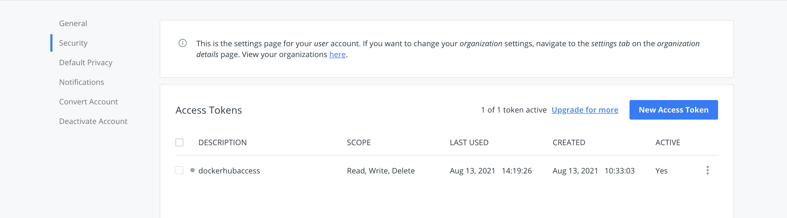
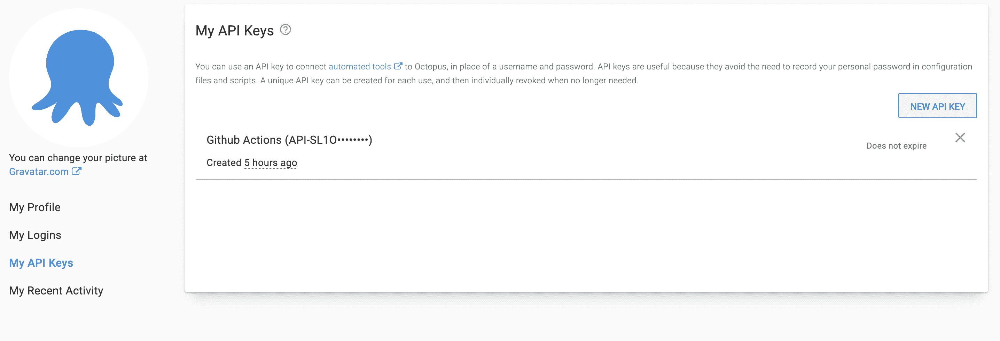
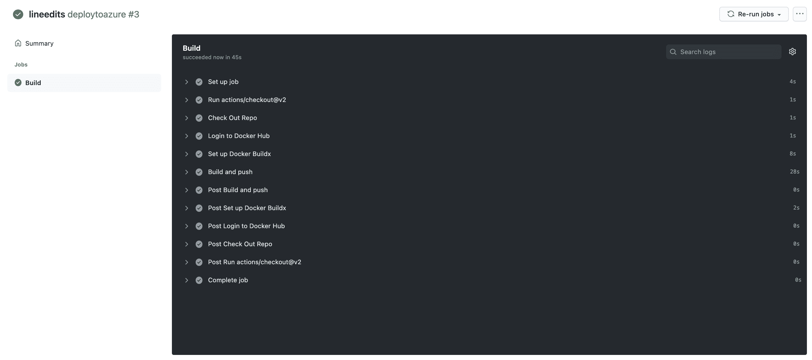
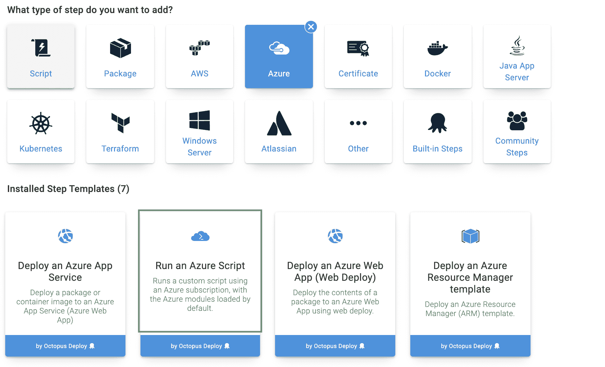
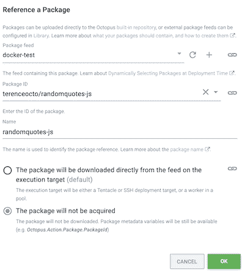
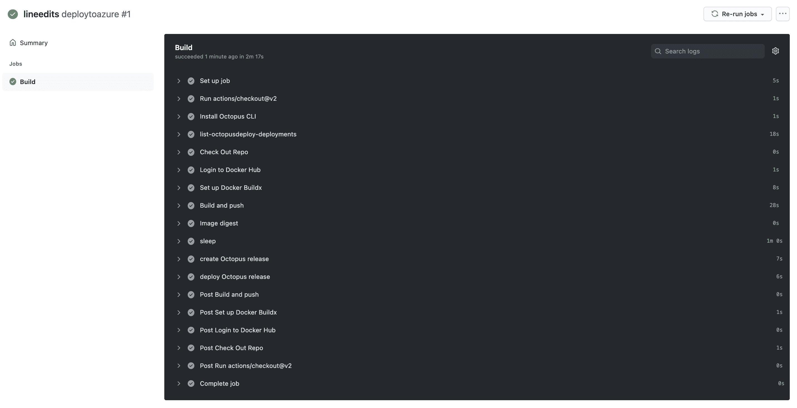
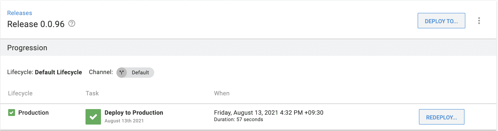
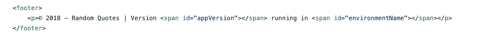
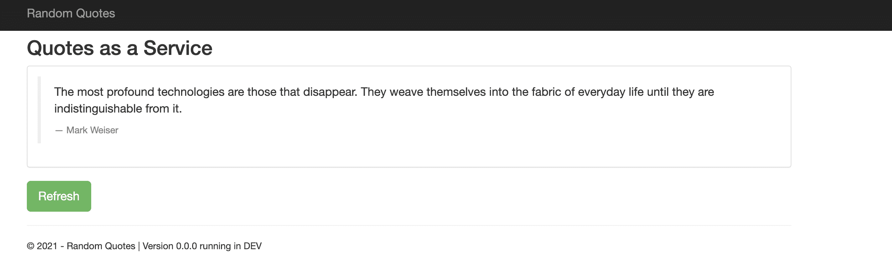

# 使用 GitHub Actions 和 Octopus - Octopus Deploy 部署到 Azure

> 原文：<https://octopus.com/blog/deploying-to-azure-with-github-actions-and-octopus>

GitHub Actions 是一个持续集成和持续交付(CI/CD)工具，它使用自动化操作来部署您的代码。如果您将代码存储在 GitHub 中，GitHub Actions 会用 CI/CD 功能增强每个 GitHub 存储库，从而简化部署。

许多开发人员希望有一种简单的方法来入门，而不需要臃肿的企业工具，GitHub Actions 满足了这种需求。

在这篇文章中，我将向您展示如何开始使用 GitHub Actions，以及如何使用 Octopus 将一个示例 web 应用程序部署到 Azure。

## 开始之前

要完成这篇文章中的步骤，你需要:

部署流程从 GitHub 开始。GitHub 托管 web 应用程序代码。GitHub Actions 自动检测代码库的变化，构建代码，并将 Docker 映像部署到 Docker Hub。Octopus Deploy 在编排步骤中使用这个映像将 web 应用程序部署到 Azure。

这个过程的第一步是分叉[随机报价库](https://GitHub.com/OctopusSamples/RandomQuotes-JS)。Random Quotes 是一个简单的 web 应用程序，它生成随机的历史报价，以展示 GitHub Actions 的功能。

接下来，您需要设置 GitHub 动作来自动化构建、推送和部署过程。为此，您需要从 Docker 和 Octopus 中检索一些凭证。

转到 **Docker Hub 账户**，然后是**账户设置**，然后是**安全**，创建一个新的访问令牌。请确保保存此令牌，因为您只能查看一次。

[](#)

转到你的 Octopus 实例，然后**配置文件**，然后**我的 API 密匙**并创建一个 API 密匙。保存该键值。记下你的八达通服务器网址。

[](#)

在你的分叉随机报价存储库中，进入**设置**然后**秘密、**然后**动作**，添加以下存储库秘密:

```
DOCKER_HUB_ACCESS_TOKEN
DOCKER_HUB_USERNAME
OCTOPUS_APIKEY
OCTOPUS_SERVER 
```

导航到。GitHub/workflows，您可以在其中看到 node.yml 文件。这个文件指导 GitHub 如何部署代码。用以下代码替换文件的内容:

```
name: deploytoazure

on:
  push:
    branches: [ master ]
jobs:

  build:
    name: Build
    runs-on: ubuntu-latest
    steps:
      - uses: actions/checkout@v2

      - name: Check Out Repo 
        uses: actions/checkout@v2

      - name: Login to Docker Hub
        uses: docker/login-action@v1
        with:
          username: ${{ secrets.DOCKER_HUB_USERNAME }}
          password: ${{ secrets.DOCKER_HUB_ACCESS_TOKEN }}

      - name: Set up Docker Buildx
        id: buildx
        uses: docker/setup-buildx-action@v1

      - name: Build and push
        id: docker_build
        uses: docker/build-push-action@v2
        with:
          context: ./
          file: ./Dockerfile
          push: true
          tags: ${{ secrets.DOCKER_HUB_USERNAME }}/randomquotes-js:latest 
```

这段代码在每次新的 push to main 时构建代码并将其作为 Docker 映像推送到 Docker Hub。转到 **GitHub 动作**选项卡查看步骤。

【T2 

构建完成后，导航到 [Docker Hub](https://hub.docker.com/) 查看图像。

## 配置 Azure 帐户

您需要配置一个 Azure 帐户和 web 应用程序作为 Octopus 部署的目标。其他目标也是可能的，例如 AWS 或 local。

接下来，通过导航到 [Azure 门户](https://portal.azure.com/)，在 Azure 中创建一个帐户。

### 使用 Azure 门户创建 Azure 服务主体

1.  在 Azure 门户中，打开菜单 [](#) 并导航到 **Azure Active Directory，**然后是**属性**，并从**租户 ID** 字段中复制值。这是你的房客身份证。
2.  接下来你需要你的**应用 ID** 。

*   如果您创建了一个 AAD 注册的应用程序，导航到 **Azure Active Directory、**然后**应用程序注册**，点击**查看所有应用程序**，选择应用程序并复制**应用程序 ID** 。请注意，Azure UI 默认为**自有应用**标签。点击**所有应用**选项卡查看所有应用注册。
*   如果您尚未创建注册的应用程序，请导航至 **Azure Active Directory、**然后**应用程序注册**，点击**新注册**并添加您的应用程序的详细信息，然后点击**保存**。记下**应用 ID** 。

1.  通过导航到**证书&机密、**然后**证书&机密**来生成一次性密码。添加新的**秘密**，输入描述，点击**保存**。记下显示的应用程序密码，以便在 Octopus 中使用。如果您不想接受默认的密码一年到期，您可以更改到期日期。

您现在拥有以下内容:

*   **租户 ID**
*   **应用 ID**
*   **应用程序密码/秘密**

现在，您可以[在八达通](#add-service-principal-account)中添加服务主账户。

接下来，您需要配置您的资源权限。

### 资源权限

资源权限确保您注册的应用程序有权使用您的 Azure 资源。

1.  在 Azure 门户中，导航到**资源组**并选择您希望注册的应用程序访问的资源组。
2.  接下来，点击**访问控制(IAM)** 选项。在**角色分配**下，如果你的应用没有列出，点击**添加角色分配**。选择适当的角色(**贡献者**是一个常见选项)，并搜索您的新应用程序名称。从搜索结果中选择它，然后单击**保存**。

接下来，您将设置一个 Azure web 应用程序并配置其属性。

### Web 应用程序设置

1.  如果一个资源组不存在，通过转到**主页**，然后**资源组**，然后**创建**来创建一个。创建之后，记下资源组的 Azure 订阅 ID。
2.  在您的**资源组**中，点击**创建**，然后点击 **Web App**
3.  对于发布设置，选择 Docker 容器。
4.  对于操作系统，选择 Linux。
5.  记下你的 Azure 应用名称。这将是您的 web 应用程序的地址:`[webapp-name].azurewebsites.net`
6.  设置应用程序时，请注意应用程序服务计划和资源组。

在您的 Octopus 实例中，进入**库**，然后进入**外部提要**，通过输入您的 Docker 凭证添加 Docker 容器注册表提要。点击**保存并测试**确认连接。

### 在八达通上加入服务主账户

使用以下值，您现在可以将您的帐户添加到 Octopus:

*   应用程序 ID
*   租户 ID
*   应用程序密码/密钥

1.  导航至**基础设施、**然后是**账户**。
2.  选择**添加账户**，然后选择 **Azure 订阅**。
3.  在 Octopus 中给帐户起一个你想要的名字。
4.  给账户一个描述。
5.  添加您的 Azure 订阅 ID。这可以在 Azure 门户的**订阅**下找到。
6.  添加**应用 ID** 、**租户 ID** 和**应用密码/关键字**。

点击**保存并测试**确认账户可以与 Azure 交互。Octopus 然后尝试使用帐户凭证来访问 Azure 资源管理(ARM) API，并列出该订阅中的资源组。您可能需要将目标 Azure 数据中心的 IP 地址列入白名单。请参见[通过防火墙部署到 Azure】了解更多详细信息。](https://octopus.com/docs/deployments/azure)

新创建的服务主体可能需要几分钟才能通过凭据测试。如果您已经仔细检查了您的凭据值，请等待 15 分钟，然后重试。

## 添加部署目标

使用 Octopus，您可以将软件部署到 Windows 服务器、Linux 服务器、Microsoft Azure、AWS、Kubernetes 集群、云区域或离线软件包。无论您在哪里部署软件，这些机器和服务都是您的部署目标。Octopus 将您的部署目标(您部署软件的虚拟机、服务器和服务)组织到环境中。

1.  转到**基础设施、**然后是**部署目标**。
2.  选择一个 Azure Web 应用。
3.  输入显示名称。
4.  填写**环境**和**目标角色**。
5.  选择之前创建的 Azure 帐户和 web 应用。

## 创建项目环境

通过导航到**项目、**然后**添加项目**来创建项目。这些步骤假设一个名为`docker`的项目。

通过转到**基础设施**，然后**环境**，然后**添加环境**，添加一个名为`Production`的环境。

导航到您创建的项目。在**变量**下，添加以下变量及其值:

*   `app-service-plan`
*   `resource-group`
*   `webapp-name`

在流程步骤中，添加一个 Azure 脚本步骤。

[](#)

添加您之前配置的 Azure 帐户，并将以下代码复制到脚本步骤中:

```
 $pi = $OctopusParameters["Octopus.Action.Package[randomquotes-js].PackageId"]
 $pv = $OctopusParameters["Octopus.Action.Package[randomquotes-js].PackageVersion"]
 $dockerImage = "${pi}:${pv}"
 $ImageName = $OctopusParameters["Octopus.Action.Package[randomquotes-js].Image"]
 $RegistryUrl = $OctopusParameters["Octopus.Action.Package[randomquotes-js].Registry"]

 az webapp create --resource-group $OctopusParameters["resource-group"] --plan $OctopusParameters["app-service-plan"] --name $OctopusParameters["webapp-name"] --deployment-container-image-name $dockerImage

 az webapp config container set --name $OctopusParameters["webapp-name"] --resource-group $OctopusParameters["resource-group"] --docker-custom-image-name $ImageName --docker-registry-server-url $RegistryUrl 
```

通过导航到 Docker 提要并搜索 Random Quotes 包，在脚本步骤下添加一个引用包。勾选**不获取包**引用脚本中的包。点击**确定**。点击**保存**保存工艺步骤。

[](#)

您希望让 GitHub Actions 自动构建 Docker 映像，将其推送到 Docker Hub，创建一个发布，并在 GitHub 代码中部署它。每次提交 main 时都会进行更新。将 node.yml 更新为以下内容:

```
name: deploytoazure

on:
  push:
    branches: [ master ]
jobs:

  build:
    name: Build
    runs-on: ubuntu-latest
    steps:
      - uses: actions/checkout@v2

      - name: Install Octopus CLI
        uses: OctopusDeploy/install-octopus-cli-action@v1.1.1
        with:
          version: latest

      - name: Check Out Repo 
        uses: actions/checkout@v2

      - name: Login to Docker Hub
        uses: docker/login-action@v1
        with:
          username: ${{ secrets.DOCKER_HUB_USERNAME }}
          password: ${{ secrets.DOCKER_HUB_ACCESS_TOKEN }}

      - name: Set up Docker Buildx
        id: buildx
        uses: docker/setup-buildx-action@v1

      - name: Build and push
        id: docker_build
        uses: docker/build-push-action@v2
        with:
          context: ./
          file: ./Dockerfile
          push: true
          tags: ${{ secrets.DOCKER_HUB_USERNAME }}/randomquotes-js:latest

      - name: sleep
        run: sleep 60

      - name: create Octopus release
        run: octo create-release --project docker --version 0.0.i --server=${{ secrets.OCTOPUS_SERVER }} --apiKey=${{ secrets.OCTOPUS_APIKEY }}

      - name: deploy Octopus release
        run: octo deploy-release --project docker --version=latest --deployto Production --server=${{ secrets.OCTOPUS_SERVER }} --apiKey=${{ secrets.OCTOPUS_APIKEY }} 
```

这些更改将 Octopus Deploy CLI 安装到机器上，以代表 Octopus Deploy 实例运行命令。在每次推送 Docker 时，脚本会等待 60 秒，然后为 Azure 创建一个新的部署。

提交更改并导航到操作选项卡以确认部署。

[](#)

导航到 Octopus Deploy **项目，**然后**发布**以查看最新的部署。

[](#)

前往`[webapp-name].azurewebsites.net`查看您的网络应用程序:

[](#)

进行更改以确认部署已自动更新。在 GitHub 中，编辑文件:

```
RandomQuotes-JS/source/www/index.html 
```

[](#)

将年份改为`2021`，并将代码提交给 GitHub。提交和推送将触发 GitHub 操作构建。部署完成后，导航到年份发生变化的 web 应用程序。

[](#)

## 结论

GitHub Actions 是一个 CI/CD 平台，增强了所有 GitHub 项目的 CI/CD 功能。GitHub Actions 让开发者可以轻松部署他们的 GitHub 项目。 [Octopus Deploy 与 GitHub Actions](https://octopus.com/github) 协同工作，为管理部署提供专用的连续交付工具。CI/CD 流程可以连接到云目标，比如 Microsoft Azure 或 Amazon Web Services，为应用程序提供一个部署目标。

本教程使用 Octopus Deploy、GitHub Actions、Docker 和 Azure 建立了一个连续交付流程。GitHub 自动检测代码的变化，触发构建，并推送到 Docker。Octopus Deploy 然后创建一个新的版本并部署 Azure Web 应用程序。

[试用我们免费的 GitHub Actions 工作流工具](https://oc.to/GithubActionsWorkflowGenerator)，帮助您快速为 GitHub Actions 部署生成可定制的工作流。

有关持续集成(CI)和构建服务器的更多信息，[请查看我们的 CI 博客系列](https://octopus.com/blog/tag/CI%20Series)。浏览 [DevOps 工程师手册](https://octopus.com/devops/)了解有关 DevOps 和 CI/CD 的更多信息。

愉快的部署！