# 如何使用 Octopus Deploy 部署到 MuleSoft 运行时

> 原文：<https://octopus.com/blog/deploying-to-mulesoft-runtime>

MuleSoft 开发了独特的软件，允许您创建自定义 API 来从内部或基于云的系统中检索或操作信息。

在这篇文章中，我将向您展示如何使用 Octopus Deploy 将 MuleSoft API 部署到运行 [Mule Runtime](https://docs.mulesoft.com/mule-runtime/4.4/) 的服务器上。

## 入门指南

要阅读这篇文章，你需要下载以下软件:

### 安装 Anypoint Studio

Anypoint Studio 可从 MuleSoft 获得，试用期为 30 天。填写完表格后，下载 ZIP 文件并解压到您的磁盘。AnyPoint Studio 并没有“安装”在您的机器上，所以您可以在提取之后执行 AnyPoint Studio。

### 配置 MuleSoft 运行时

要配置 Mule Community Edition 运行时，首先要安装和配置 Java。MuleSoft 文档推荐 [Java 8](http://www.oracle.com/technetwork/java/javase/downloads/jdk8-downloads-2133151.html) ，然而我成功使用了[微软 OpenJDK 11](https://docs.microsoft.com/en-us/java/openjdk/download#openjdk-11) 。

安装 Java 和 Mule 运行时之后，创建以下系统环境变量:

*   `JAVA_HOME`:设置为你的 Java 文件夹的位置
*   `MULE_HOME`:将此设置为您的 Mule 运行时文件夹的位置

[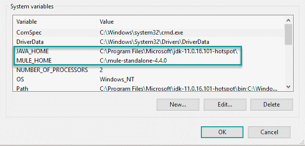](#)

默认情况下，Mule Community 运行时在前台运行。要将其配置为作为服务运行，请遵循 MuleSoft 文档:

### 安装 Maven

安装 Maven 是可选的，因为 Anypoint Studio 软件将 Maven 内置于产品中。如果您希望构建服务器构建 Anypoint Studio 项目，那么您的构建服务器需要 Maven 功能。如果 Maven 安装在构建代理上，大多数(如果不是全部的话)现代构建服务器都包含这样的步骤或任务。

安装 Maven 非常简单，只需提取 ZIP 文件，然后将文件夹添加到`PATH`系统环境变量中。

### 邮递员测试

创建 API 后，您需要测试它以确保它正常运行。任何能够处理 POST 请求的工具都可以工作，然而，最流行的 API 测试工具是 [Postman](https://www.postman.com/downloads/) 。

[Postman 是免费的](https://identity.getpostman.com/signup)，可用于 Windows、Mac 和 Linux 操作系统。

## 创建 API

在这篇文章中，我创建了一个简单的“Hello World”API。顾名思义，调用这个 API 得到的响应是`Hello world!`。

真实世界的 API 更加复杂，但是在本文中，我将向您展示如何使用 Octopus Deploy 部署 API。

### 创建项目

1.  在 Anypoint Studio 中，点击**文件**，然后**新建**，然后**骡子项目**。

[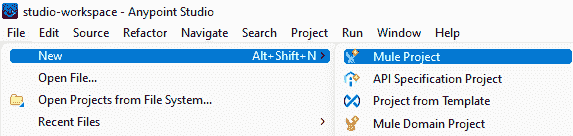](#)

2.  给项目命名，点击**完成**。

[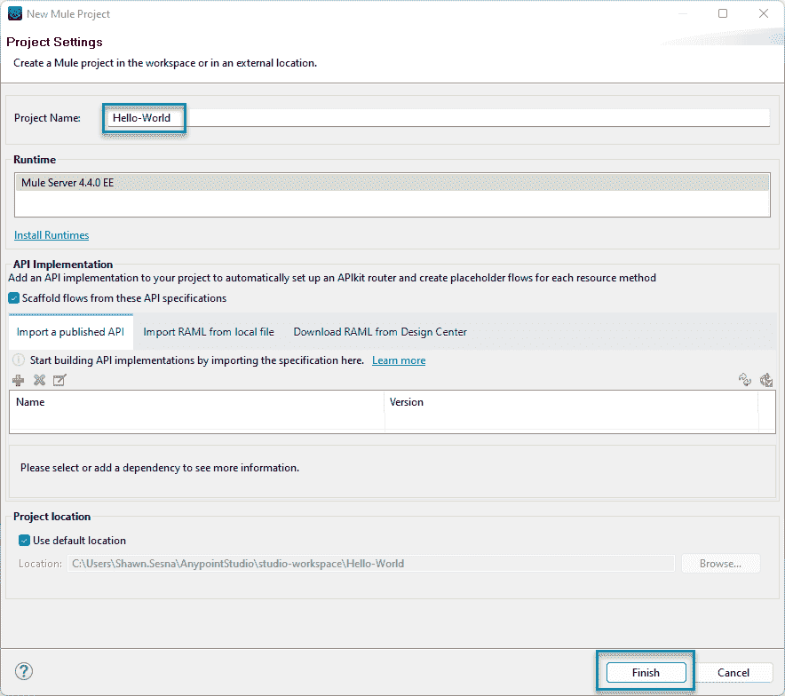](#)

3.  从 **Mule Palette** 中，选择 **HTTP** 类别，并将**监听器**拖到画布上。

[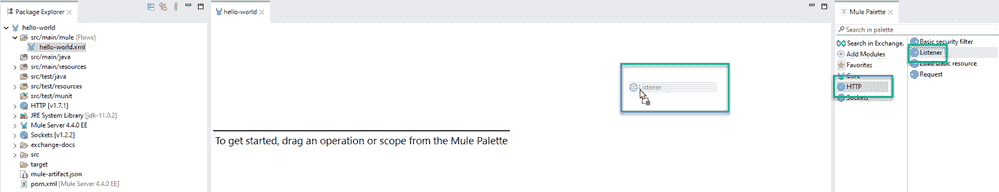](#)

4.  点击绿色加号按钮配置监听器**连接器配置**。

[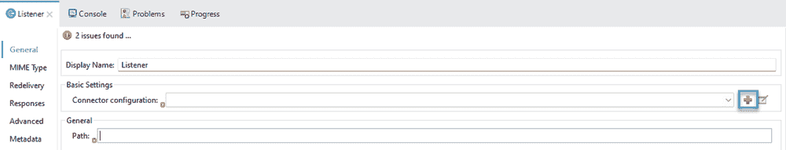](#)

5.  配置连接器配置的设置。在这篇文章中，我保留了默认值。

[T32](#)

点击**测试连接...**按钮，以确保此操作有效。

6.  为 API 定义一个路径。对于这个帖子，我选择了`/hello-world`。

[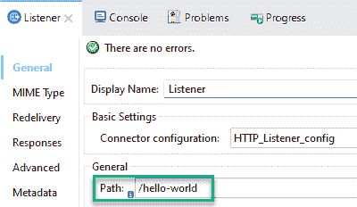](#)

7.  从 **Mule Palette** 的 **Core** 类别中添加一个 **Set Payload** 对象，并将其拖动到消息流的 **Process** 部分。

[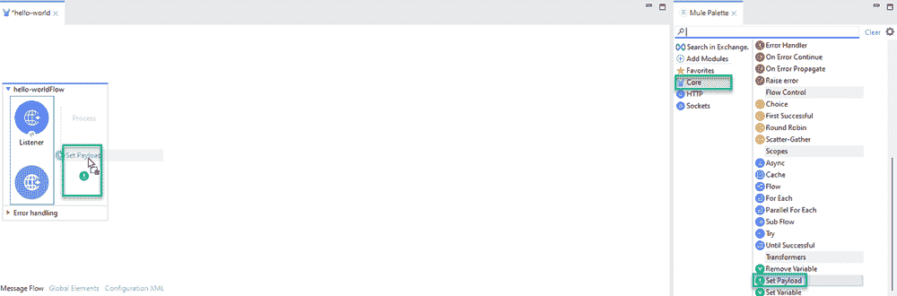](#)

8.  点击 **fx** 按钮使其失效，并为**值**设置静态信息。对于这个帖子，我使用了`Hello World!`。

[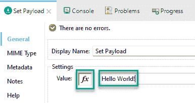](#)

9.  单击绿色的 play 按钮测试您的 API。当**控制台**窗口显示**部署**的状态时，您的 API 就准备好了。切换到 Postman(或您选择的工具)来测试您的 API。向`http://localhost:8081/hello-world`发送帖子请求。

[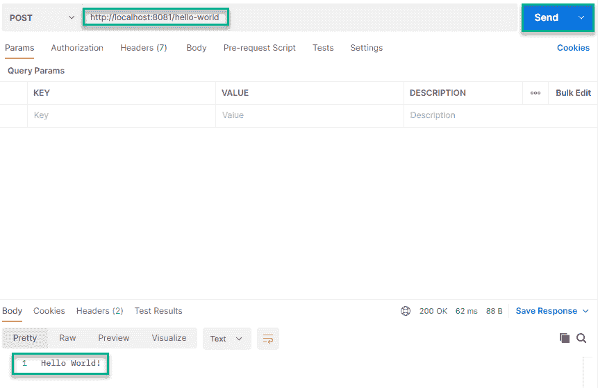](#)

## 创建可部署文件

Anypoint Studio 软件包含内置于产品中的 Maven 版本。这意味着您可以在 Anypoint Studio 本身中创建一个可部署的工件。或者，您可以从构建服务器(或命令行)使用 Maven 来生成可部署文件。

### 任意点工作室

您可以通过执行以下操作从 Anypoint Studio 中**导出**您的项目:

1.  点击**文件**，然后**导出**。

[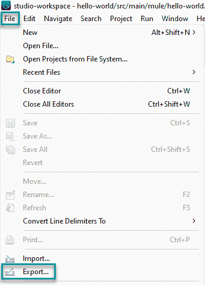](#)

2.  选择一个导出向导。对于这篇文章，我选择了 **Anypoint Studio 项目来 Mule Deployable Archive(包括 Studio 元数据)**。点击下一个的**。**

[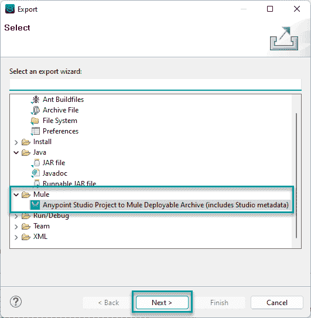](#)

3.  选择要导出的项目。这个项目是我唯一创建的项目。点击下一个的**。**

4.  选择保存文件的位置，点击**完成**。

[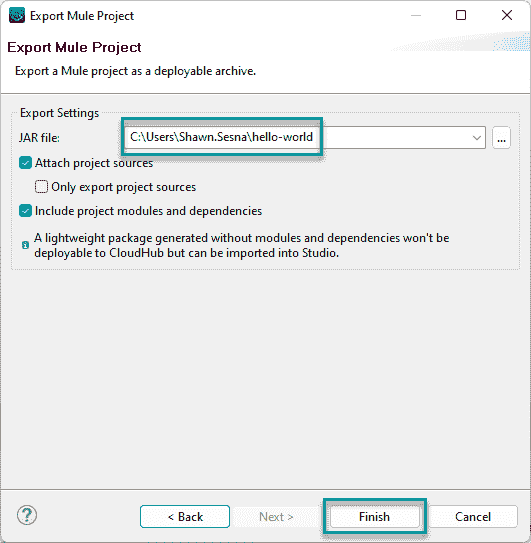](#)

保存操作完成后，它会显示文件的保存位置和名称。在我的例子中，它被保存到`C:\Users\Shawn.Sesna\hello-world.jar`。

[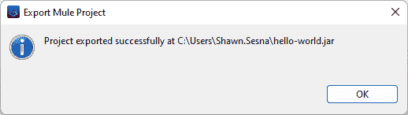](#)

### 专家

您还可以从构建服务器或命令行使用 Maven 来构建项目。

在本文中，我将向您展示命令行方法，但是构建服务器的方法几乎是相同的。

1.  导航到项目文件夹。这个文件夹已经包含了一个您在 Maven 中使用的`pom.xml`文件。

2.  使用以下命令/目标运行 Maven:

```
mvn clean package 
```

3.  构建完成后，导航到**目标**子文件夹。构建产生了一个名为`hello-world-1.0.0-SNAPSHOT-mule-application.jar`的文件。

[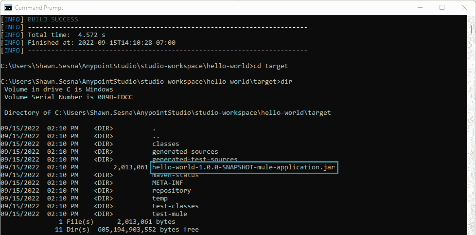](#)

## 部署 API

如您所见，Anypoint Studio 项目被编译成 JAR 文件。Octopus Deploy 没有部署到 Mule Community Edition 运行时的具体步骤，但是，它包含一个**部署 Java 归档**步骤。

将 JAR 文件放入内置存储库或外部存储库之后，就可以继续配置部署了。

### 配置部署 Java 归档文件步骤

这篇文章假设你知道如何在 Octopus Deploy 中创建项目。

要配置 Octopus 部署项目，请使用以下步骤:

1.  向您的流程添加一个**部署 Java 归档**步骤。

2.  选择要部署到的角色。这篇文章使用了角色 **Hello-World-API** 。

3.  选择要部署的包。这篇文章使用了由导出方法`hello-world-1.0.0-SNAPSHOT-mule-application.jar`创建的包。我重命名了文件`hello-world.1.0.0.jar`,这样 Octopus 就可以确定包的 SemVer 版本。

4.  Mule Community Edition 运行时希望将 API 部署到特定的文件夹中。在**部署 Java 归档**步骤的**部署**部分，勾选**使用定制部署目录**。输入 Mule Community Edition 运行时应用程序文件夹的位置。

5.  为部署的 JAR 文件选择最终文件名。如果你不填写这个，Octopus 会创建一个类似下面格式的文件`hello-world@S1.0.0@673BE843C229AA40AC1698CC82104BD0`。在此部署和运行的同时，下一个版本(如 1.0.1)被部署为`hello-world@S1.0.1@673BE843C229AA40AC1698CC82104BD0`。Mule 会认为这是一个新的 API，并试图部署它，这与第一个相冲突。如果`1.0.1`和`1.0.0`有相同的文件名，Mule 会发现一个变化，并使用新的 API。

不要勾选**净化**选项。如果部署了其他 API，这会将它们全部删除。

完成后，它应该看起来像这样:

[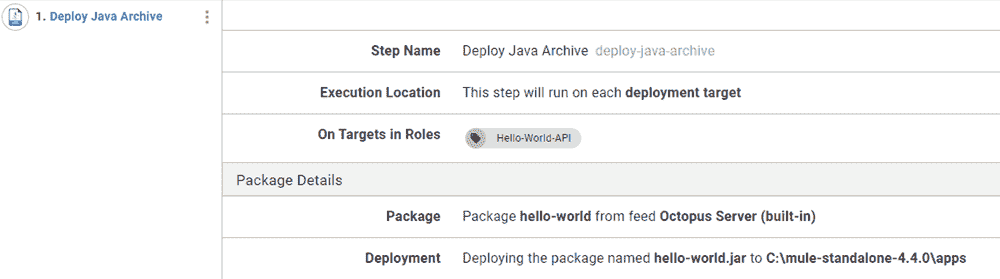](#)

6.  创建一个版本并部署。

[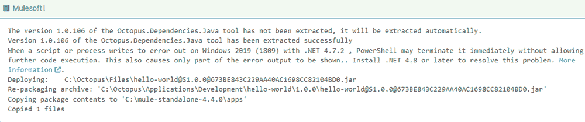](#)

7.  使用 Postman 测试 API。

【T2 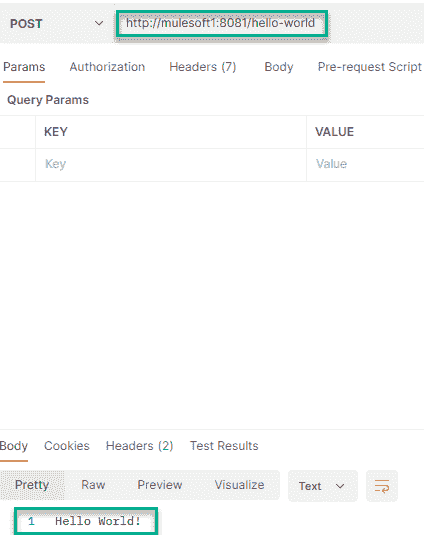

## 使用结构化配置变量操作 API

您成功地部署了一个简单的 API，但是，这并不太现实。随着 API 在您的环境中的发展，它更有可能需要更新。

使用[结构化配置变量](https://octopus.com/docs/projects/steps/configuration-features/structured-configuration-variables-feature)，您可以将显示的消息从`Hello World!`更改为其他内容。

### 更新 API 消息

API 消息存储在 JAR 包中的 XML 文件中。通过确定消息的 XPath，可以为部署的 API 更新消息。

```
<?xml version="1.0" encoding="UTF-8"?>

<mule xmlns:http="http://www.mulesoft.org/schema/mule/http" 
    xmlns:doc="http://www.mulesoft.org/schema/mule/documentation"
    xmlns:xsi="http://www.w3.org/2001/XMLSchema-instance" xsi:schemaLocation="http://www.mulesoft.org/schema/mule/core http://www.mulesoft.org/schema/mule/core/current/mule.xsd
http://www.mulesoft.org/schema/mule/http http://www.mulesoft.org/schema/mule/http/current/mule-http.xsd">
    <http:listener-config name="HTTP_Listener_config" doc:name="HTTP Listener config" doc:id="1bcf8768-d2f4-449e-ace0-4a86472cc4e1" >
        <http:listener-connection host="0.0.0.0" port="8081" />
    </http:listener-config>
    <flow name="hello-worldFlow" doc:id="5b6f81da-ecf0-4a71-8299-c9918ed2ca69" >
        <http:listener doc:name="Listener" doc:id="433558cb-1dcc-4385-8126-5b2801575a29" config-ref="HTTP_Listener_config" path="/hello-world"/>
        <set-payload value="Hello World!" doc:name="Set Payload" doc:id="638c8080-540b-4fce-8539-a5e74350ab80" />
    </flow>
</mule> 
```

1.  编辑**部署 Java 归档**步骤。

2.  点击**配置功能**按钮。

[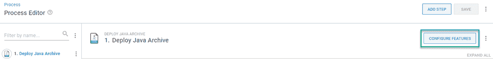](#)

3.  启用**结构化配置变量**功能。

[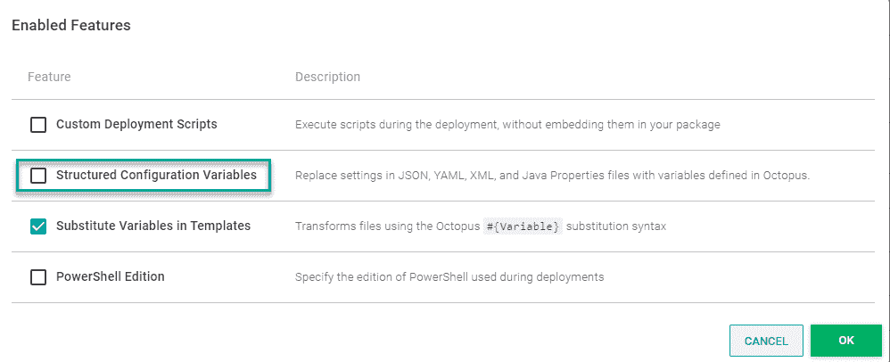](#)

4.  该消息位于 hello-world.xml 文件中。指定要替换的文件。

[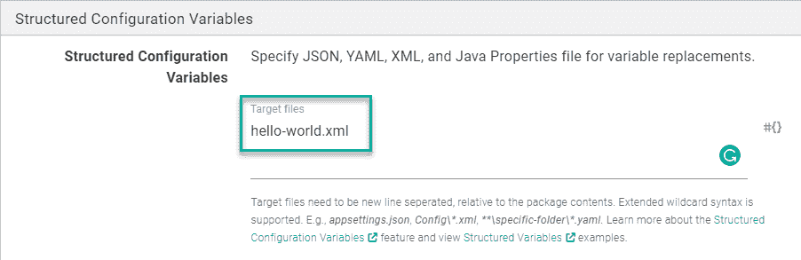](#)

5.  创建一个 XPath 项目变量并赋予它一个值。在这种情况下，XPath 是`/*[local-name()='mule']/*[local-name()='flow']/*[local-name()='set-payload']/@value`。

6.  创建一个版本并部署。部署完成后，测试您的 API 以查看新消息。

[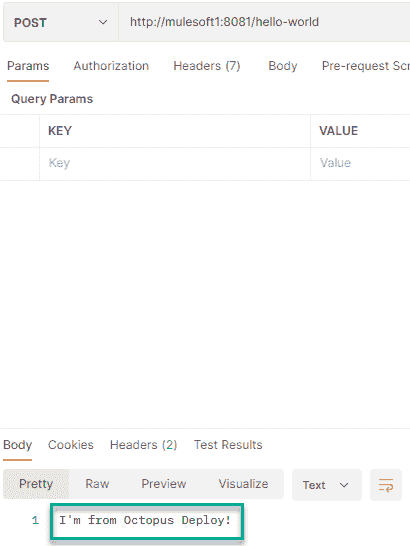](#)

## 结论

在本文中，您学习了如何使用 MuleSoft Anytime Studio 创建 API，以及如何使用 Octopus Deploy 将它部署到运行 Mule Community Edition Runtime 的服务器上。

愉快的部署！