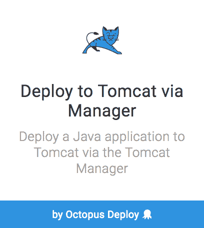
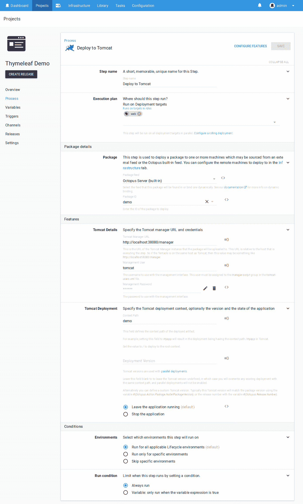
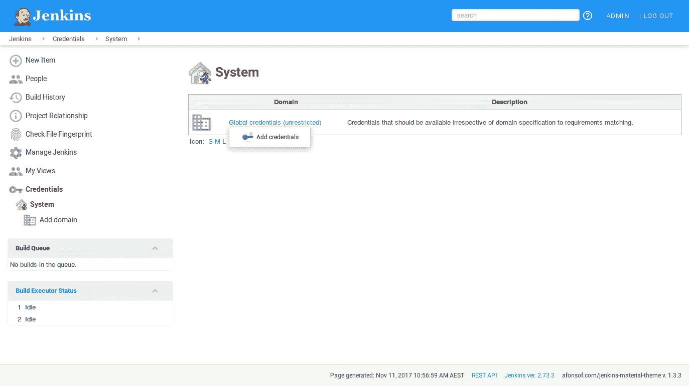
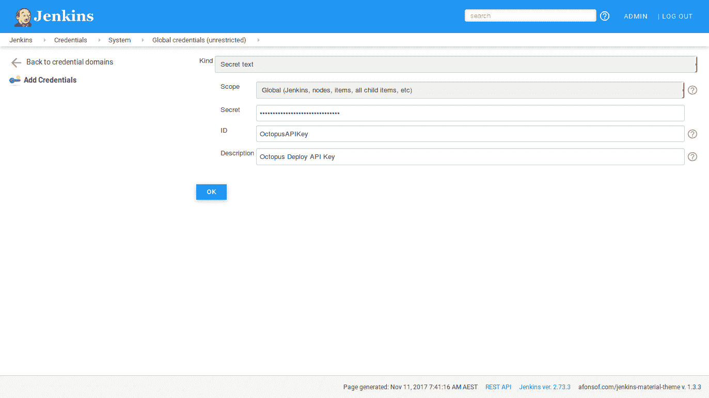
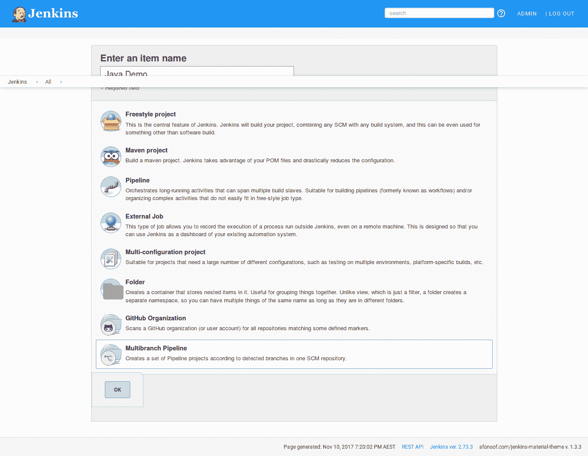
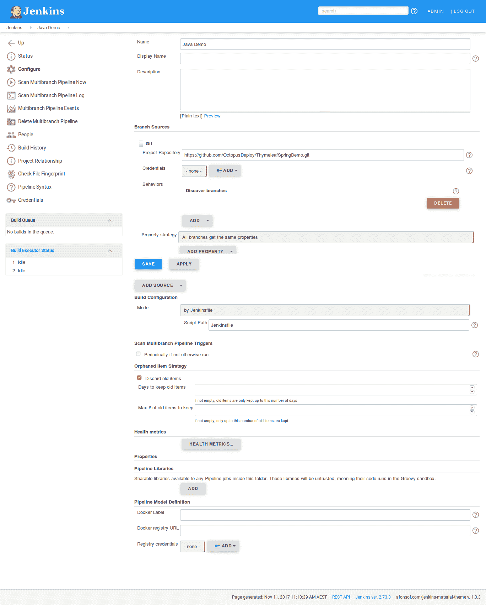
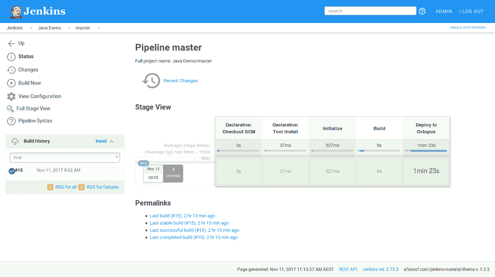
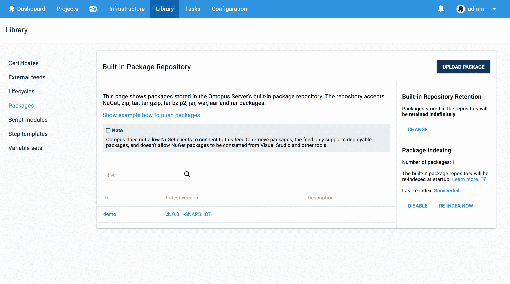
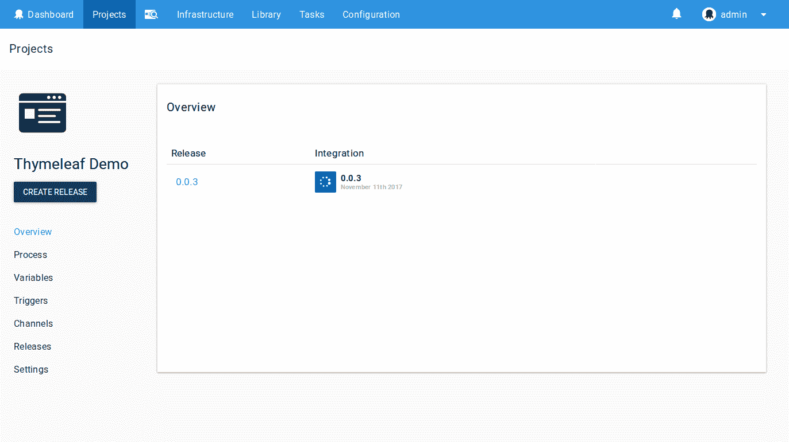
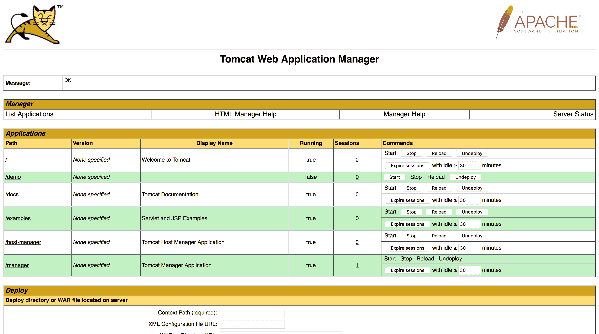

# 使用管道从 Jenkins 部署到 Octopus-Octopus Deploy

> 原文：<https://octopus.com/blog/deploying-to-octopus-from-jenkins>

在[之前的博客文章](/blog/installing-jenkins-from-scratch)中，我向您展示了如何使用构建 Maven 项目并将其发布到 Octopus 所需的工具建立并运行 Jenkins 的基本实例。

在这篇博文中，我们将看看如何使用 [Jenkins Pipelines](https://jenkins.io/doc/book/pipeline/) 构建一个`Jenkinsfile`，它将使用这些工具构建一个 WAR 文件，将其推送到 Octopus，并部署到 Tomcat 服务器。

## 在 Octopus 中创建 Tomcat 部署项目

第一步是在 Octopus 中创建一个新项目，将 Java web 应用程序部署到 Tomcat。

为此，我们将有一个名为`Thymeleaf Demo`的 Octopus 项目，只有一个`Deploy to Tomcat via Manager`步骤。

[](#)

这一步将把名为`demo`的包从内置提要部署到位于`http://localhost:38080/manager`的 Tomcat 实例。

注意，在这一点上，我们可能在内置库中有一个名为`demo`的包，也可能没有。创建步骤时，我们可以在包可用之前引用它。

`Tomcat Manager URL`是相对于执行部署的触手而言的。因为触手通常会安装在托管 Tomcat 的机器上，所以 URL 主机名通常是`localhost`。

[](#)

## 保存 API 密钥

我们的`Jekninsfile`将在使用 Octo CLI 工具时使用 Octopus API 密钥。然而，我们不想将 API 键保存到`Jenkinsfile`中，因为这个文件应该被签入到源代码控制中。

幸运的是，我们可以在 Jenkins 中保存像 API 密钥这样的秘密信息，并从`Jenkinsfile`中引用它。

点击凭证➜系统，然后点击全局凭证➜添加凭证。

[](#)

从`Kind`列表中选择`Secret Text`，在`Secret`字段中粘贴 API key，在`ID`字段中输入`OctopusAPIKey`。

[【](#)

## 创建 Jenkinsfile

A `Jenkinsfile`描述了 Jenkins 将遵循的构建和部署项目的流程。在我们的例子中,`Jenkinsfile`将描述如何用 Maven 构建一个项目，如何将生成的 WAR 文件推送到 Octopus，然后如何在 Octopus 中创建和部署一个版本。

来看看完整的`Jenkinsfile`。

```
pipeline {
    agent any
    tools {
        maven 'Maven 3.5.2'
        jdk 'Java 9'
    }
    stages {
        stage ('Initialize') {
            steps {
                sh '''
                    echo "PATH = ${PATH}"
                    echo "M2_HOME = ${M2_HOME}"
                '''
            }
        }

        stage ('Build') {
            steps {
                sh 'mvn package'
            }
        }

        stage ('Deploy to Octopus') {
            steps {
                withCredentials([string(credentialsId: 'OctopusAPIKey', variable: 'APIKey')]) {
                    sh """
                        ${tool('Octo CLI')}/Octo push --package target/demo.0.0.1-SNAPSHOT.war --replace-existing --server https://youroctopusserver --apiKey ${APIKey}
                        ${tool('Octo CLI')}/Octo create-release --project "Thymeleaf Demo" --server https://youroctopusserver --apiKey ${APIKey}
                        ${tool('Octo CLI')}/Octo deploy-release --project "Thymeleaf Demo" --version latest --deployto Integration --server https://youroctopusserver --apiKey ${APIKey}
                    """
                }
            }
        }
    }
} 
```

首先，我们需要公开我们的构建将使用的工具。在我们的例子中，我们需要使用在[之前的博客文章](/blog/installing-jenkins-from-scratch)中定义的 Java 和 Maven 工具。

在`Jenkinsfile`中使用的名称需要与我们在 Jenkins 中给工具的名称相匹配。

```
tools {
    maven 'Maven 3.5.2'
    jdk 'Java 9'
} 
```

我们可以看到这些工具在`Initialize`阶段修改了环境变量`PATH`和`M2`。

```
stage ('Initialize') {
    steps {
        sh '''
            echo "PATH = ${PATH}"
            echo "M2_HOME = ${M2_HOME}"
        '''
    }
} 
```

执行构建时，这些`echo`命令在输出中显示以下文本。您可以看到`Java 9`和`Maven 3.5.2`工具是如何添加到`PATH`环境变量中的。

```
[Java_Demo_master-MGS2PX56MOUS3SDGT4NCJIWUFLV7GTCUYZIZ6SVGHQVXJPBCSCFA] Running shell script
+ echo PATH = /var/lib/jenkins/tools/hudson.model.JDK/Java_9/bin:/var/lib/jenkins/tools/hudson.tasks.Maven_MavenInstallation/Maven_3.5.2/bin:/var/lib/jenkins/tools/hudson.model.JDK/Java_9/bin:/var/lib/jenkins/tools/hudson.tasks.Maven_MavenInstallation/Maven_3.5.2/bin:/usr/local/bin:/usr/bin:/bin:/usr/local/games:/usr/games:/snap/bin
PATH = /var/lib/jenkins/tools/hudson.model.JDK/Java_9/bin:/var/lib/jenkins/tools/hudson.tasks.Maven_MavenInstallation/Maven_3.5.2/bin:/var/lib/jenkins/tools/hudson.model.JDK/Java_9/bin:/var/lib/jenkins/tools/hudson.tasks.Maven_MavenInstallation/Maven_3.5.2/bin:/usr/local/bin:/usr/bin:/bin:/usr/local/games:/usr/games:/snap/bin
+ echo M2_HOME = /var/lib/jenkins/tools/hudson.tasks.Maven_MavenInstallation/Maven_3.5.2
M2_HOME = /var/lib/jenkins/tools/hudson.tasks.Maven_MavenInstallation/Maven_3.5.2 
```

在`Build`阶段，我们执行 Maven 构建。

```
stage ('Build') {
    steps {
        sh 'mvn package'
    }
} 
```

最后的`Deploy to Octopus`阶段是我们推送 Maven 构建的 WAR 文件，在 Octopus 中创建一个发布，并将该发布部署到`Integration`环境中。

```
stage ('Deploy to Octopus') {
    steps {
        withCredentials([string(credentialsId: 'OctopusAPIKey', variable: 'APIKey')]) {
            sh """
                ${tool('Octo CLI')}/Octo push --package target/demo.0.0.1-SNAPSHOT.war --replace-existing --server https://youroctopusserver --apiKey ${APIKey}
                ${tool('Octo CLI')}/Octo create-release --project "Thymeleaf Demo" --server https://youroctopusserver --apiKey ${APIKey}
                ${tool('Octo CLI')}/Octo deploy-release --project "Thymeleaf Demo" --version latest --deployto Integration --server https://youroctopusserver --apiKey ${APIKey}
            """
        }
    }
} 
```

注意，我们已经使用`withCredentials`将保存在 Jenkins 中的 Octopus API 密匙`OctopusAPIKey`作为变量`APIKey`公开。我们在这个`withCredentials`块中运行的任何脚本都可以访问由 Jenkins 维护的秘密。

```
withCredentials([string(credentialsId: 'OctopusAPIKey', variable: 'APIKey')]) {
    sh """
        ...
    """
} 
```

在`withCredentials`块中，我们针对 Octo CLI 执行三个命令:`push`、`create-release`和`deploy-release`。

如果你还记得[之前的博文](/blog/installing-jenkins-from-scratch)，那么`Octo CLI`被定义为一个定制工具。我们可以通过调用`${tool('Octo CLI')}/Octo`来引用这个工具。

将这个`Jenkinsfile`与我们的 Java 代码一起检入，我们就可以创建一个 Jenkins 项目来使用它了。

## 创建詹金斯管道项目

为了使用我们的 Java 项目及其关联的`Jenkinsfile`，我们需要在 Jenkins 中创建一个新的`Multibranch Pipeline`项目。

[](#)

在这个项目中我们唯一需要改变的设置是`Project Repository`，我已经将它设置为`https://github.com/OctopusDeploy/ThymeleafSpringDemo`。这个 repo 持有一个演示的 Spring Java web 应用程序，并且有一个上面描述的`Jenkinsfile`的副本。

[](#)

## 构建和部署

一旦构建完成，这就是我们的`Jenkinsfile`的结果。

[](#)

在 Octopus 中，WAR 文件被推送到内置库中。

[](#)

并且已经创建和部署了一个版本。

[](#)

然后将应用程序部署到 Tomcat。

[](#)

## 结论

Jenkins 管道是一种描述构建过程的强大方式，通过使用 Octo CLI 作为定制工具，将 Octopus 集成到您的构建管道中是非常容易的。

如果您对 Java 应用程序的自动化部署感兴趣，[下载 Octopus Deploy 的试用版](https://octopus.com/downloads)，并查看我们的文档。