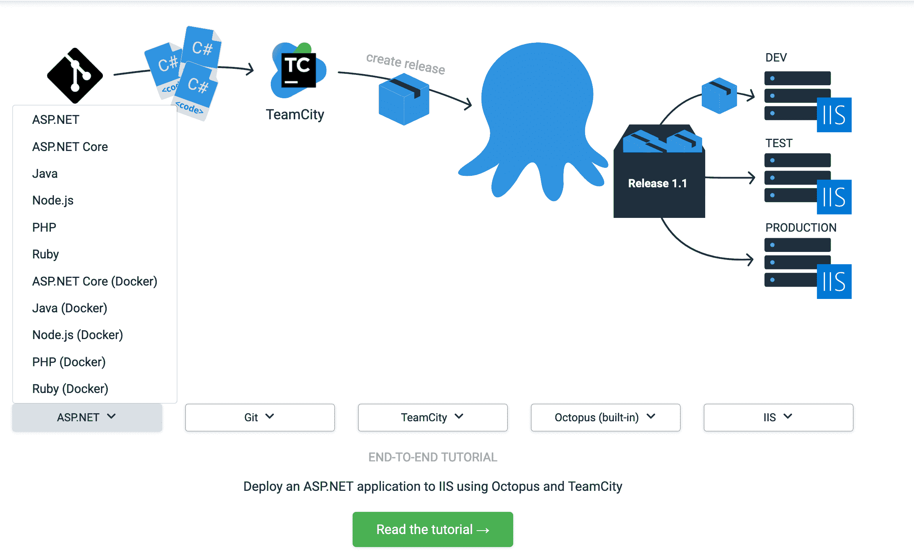
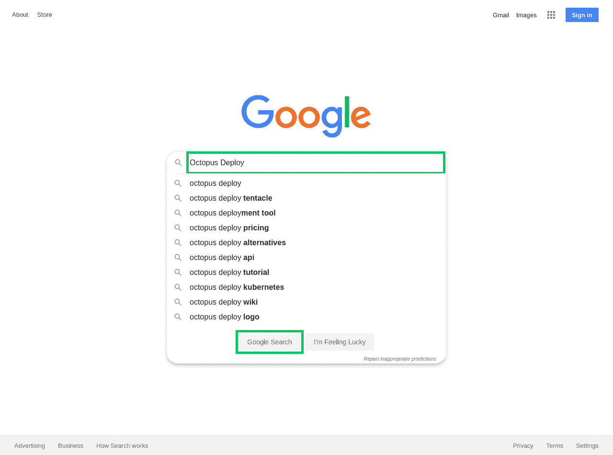

# DevOps 原则如何驱动 Octopus 文档- Octopus 部署

> 原文：<https://octopus.com/blog/devops-documentation>

[](#)

我们有详细的端到端 CI/CD 指南到 [Octopus 文档](https://octopus.com/docs/guides)来帮助团队配置他们的交付管道。我们将 [DevOps 原则](https://octopus.com/devops/)应用到软件文档的过程中，这使我们能够创建有用的分步指南，每个场景都有自动截图和截屏。

如果您曾经尝试过通过电话为朋友、同事或客户的技术问题提供支持，您就会知道这种对话是多么低效:

*点击绿色的大“确定”按钮。向下滚动页面。它在右下角。不，不是那个按钮。不，也不是那个。不，不要单击后退按钮。唉…好吧，我们重新开始。*

如果你曾经亲自向某人提供过同样的支持，这个过程会更有效率，因为你可以在发布指示时指向屏幕:

*点击那个。点击那个。向下滚动。点击那个。不，不是那个。是的，点击那个。*

两个人看着同一个屏幕提供的共享上下文立即消除了模糊性，整个过程也流畅了许多。

Octopus Deploy 是一个集成工具，位于十几个不同的(同样复杂的)平台和工具的中间。当我们开始端到端指南的工作时，我们知道我们需要提供完整的旅程，而不是假设人们知道全局。我们还需要向用户展示如何做事情，而不是告诉他们。

这个项目的成果就是[章鱼指南](https://octopus.com/docs/guides)。

[Octopus Guides](https://octopus.com/docs/guides) 允许您选择您的技术堆栈，并看到一个专门的指南，引导您完成从编译代码到将其部署到目的地的整个过程。我们还没有完成每一个组合，但是如果你找到一个还没有写出来的组合，你可以投它一票。

[](#)

## 创建定制的软件文档

为了再现两个人看着同一个屏幕的效率，每个指南都有超过 100 个突出显示的图像，并且整个过程都被显示每次鼠标点击的截屏所捕捉。因为每个指南都是为选定的软件堆栈量身定制的，所以您不必在过程的下一步进行搜索。

创建这一套定制的软件文档不是一项简单的任务。在撰写本文时，我们有大约 60 个这样的个人指南，其中包含超过 6，000 个突出显示的图像、25 小时的视频和近 300，000 个单词，记录了大约 16 种技术堆栈的各种组合。

指南中包含的许多应用程序是按月或周发布的，理想情况下，我们的截屏会保持最新。这个内容是由两个人组成的团队(我是作者/开发人员，一个编辑来审核和编辑内容)在几个月的时间里创建和维护的。

为了实现这一点，我们需要一个能够远远超越传统的编写、提交、转换和发布工作流的解决方案。由于无法投入更多的人来解决这个问题，我们严重依赖于 DevOps 实践，例如:

*   [自动化测试](https://octopus.com/devops/continuous-delivery/software-testing-in-continuous-delivery)(确保我们记录的过程如所描述的那样工作)。
*   作为代码的基础设施。
*   生成截图和视频的自动化管道。

## 简单的例子

为了演示我们如何创建指南，我将创建一个简单的示例来记录执行 Google 搜索的情况:

1.  打开 https://google.com 的。

2.  在文本框中输入搜索词，然后单击 Google 搜索按钮:

[](#)

3.  随后将显示搜索结果:

[](#)

这是一个简单的例子，但是它说明了我们实现的两个特性:

1.  我们有一个截屏显示与浏览器的交互，跟踪每一次鼠标点击和表单输入。这个视频是*节目的一个重要部分，不要告诉*哲学，因为它确切地展示了文档描述的内容。

2.  我们在搜索屏幕上交互的元素在截图中用荧光绿框突出显示。这相当于坐在某人的肩膀上指向屏幕，而不是依赖于视觉用户界面的笨拙的书面描述。

## 自动化流程

该视频和截图可以手动创建和编辑，但鉴于我们正在为扩展到几十个(如果不是数百个)指南的工作流构建基础，我们需要自动创建这些资产。

自动化这些资产的创建和更新需要四项服务:

*   一个视频托管服务，理想情况下可以就地更新视频。
*   图像托管服务。
*   一个用于编写 web 浏览器交互脚本的工具。
*   执行脚本的服务。

对于八达通指南，我们使用:

要了解这一点，请看一个[样本项目](https://github.com/OctopusSamples/GoogleAgileDocs)。这个项目包括两个由 GitHub Actions 执行的工作流:一个用于捕获截屏，另一个用于生成截屏。

捕捉截屏的工作流代码可以在 [OctopusSamples GitHub repo](https://github.com/OctopusSamples/GoogleAgileDocs/blob/master/.github/workflows/video.yml) 中找到。它从一些样板 YAML 开始，命名工作流，指定何时运行它，并定义在 Ubuntu 虚拟机(VM)上执行的名为`build`的作业。

`push`选项意味着对存储库的每次提交都会触发一次构建，而`schedule`选项被设置为在 UTC 每天午夜运行构建。

按照这样的时间表运行构建意味着我们知道我们的截图和视频是最新的，即使正在使用的应用程序是更新的。或者在这个例子中，它确保我们的文档捕获最新的 Google doodle。

这很重要，因为我们不希望我们的文档充满陈旧的媒体。

```
name: Google Agile Docs Video
on:
  push:
  schedule:
    - cron:  '0 0 * * *'
jobs:
  build:
    runs-on: ubuntu-latest 
```

接下来，我们定义一组与作业中的步骤共享的公共环境变量。这些变量定义了用于上传图像的 AWS 凭证、用于替换视频的 Wista 凭证和视频 ID、用于配置 WebDriver 脚本工具的布尔标志，以及用于定义浏览器 UI 在显示 HTML 内容之前占用的像素数的硬编码偏移量。

因为浏览器只能报告元素相对于浏览器窗口的位置，而不是相对于屏幕上的位置，所以垂直偏移值被添加到相对窗口位置，以找到元素的绝对屏幕位置，这又允许 WebDriver 工具将鼠标光标移动到该位置:

```
 env:
      AWS_ACCESS_KEY_ID: ${{ secrets.AWS_ACCESS_KEY_ID }}
      AWS_SECRET_ACCESS_KEY: ${{ secrets.AWS_SECRET_ACCESS_KEY }}
      AWS_DEFAULT_REGION: ${{ secrets.AWS_DEFAULT_REGION }}
      WISTIA_USERNAME: ${{ secrets.WISTIA_USERNAME }}
      WISTIA_PASSWORD: ${{ secrets.WISTIA_PASSWORD }}
      WISTIA_MEDIA_ID: eecl0uod01
      MOVE_TO_MOUSE_CURSOR: true
      DISABLE_HIGHLIGHTS: true
      DISABLE_SCREENSHOTS: true
      DISABLE_VIDEO: false
      DUMP_OPTIONS: true
      MOUSE_VERTICAL_OFFSET: 74 
```

接下来，我们开始定义组成工作流的步骤。第一步是从 GitHub repo 中检查代码:

```
 steps:
      - uses: actions/checkout@v1 
```

下一步使用 Puppet 来安装我们需要的工具，比如用于上传图像的 AWS CLI，以及用于处理视频的 VLC 和 FFmpeg。

我们使用 Puppet 而不是原生 GitHub 动作有几个原因:

1.  Puppet 可以在开发 VM 中的 GitHub 动作之外运行，以调试流程。
2.  Octopus 指南记录的场景涉及复杂的基础设施初始化:CI 服务器、Octopus 部署、Artifactory 之类的包存储库、带有 Minikube 的 Kubernetes 集群和 web 服务器。

Puppet 非常适合部署这种基础设施，而 GitHub Actions 往往局限于构建和测试代码。

```
 - name: Configure VM
        run: ./puppet/install.sh setup.pp 
```

下一步运行我们定制的 Selenium WebDriver 脚本工具。这个工具的代码可以在这个 [GitHub repo](https://github.com/OctopusDeploy/WebDriverTraining) 中找到。如果“WebDriverTraining”听起来像一个奇怪的名字，那是因为这段代码最初是作为描述从头开始创建 WebDriver 测试工具的过程的[博客系列](https://octopus.com/blog/selenium/0-toc/webdriver-toc)的一部分编写的。该项目非常适合为指南生成资产，因此我们将其扩展并捆绑到一个 [Docker 映像](https://hub.docker.com/r/mcasperson/webdriver)中，以便与 GitHub Actions 集成。

在这里，您可以看到许多全局环境变量通过`JAVA_OPTS`环境变量作为 Java 属性传递。这些属性是用`-D`参数、属性名和属性值定义的:

*   `moveCursorToElement`:将鼠标光标移动作为 WebDriver 脚本的一部分。
*   `disableHighlights`:禁止在元素上放置绿色高亮。
*   `disableScreenshots`:禁用截图。
*   `mouseMoveVerticalOffset`:定义浏览器 UI 顶部小工具的高度。
*   `CucumberAlias-[Alias Name]`:定义一些在脚本中使用的别名。

最后，定义要传递给 Docker 映像的参数。参数被传递给 Cucumber CLI，这个 Docker 映像实现了它。第一个参数启用进度插件(`--plugin progress`)，并传递要运行的特征文件的路径(`/github/workspace/google.feature`):

```
 - name: Run script
        uses: docker://mcasperson/webdriver
        env:
          JAVA_OPTS: >-
            -DmoveCursorToElement=${MOVE_TO_MOUSE_CURSOR}
            -DdisableHighlights=${DISABLE_HIGHLIGHTS}
            -DdisableScreenshots=${DISABLE_SCREENSHOTS}
            -DmouseMoveVerticalOffset=${MOUSE_VERTICAL_OFFSET}
            -DdisableVideoRecording=${DISABLE_VIDEO}
            -DdumpOptions=${DUMP_OPTIONS}
            -DCucumberAlias-ExternalVideoDir=/github/workspace
            -DCucumberAlias-ExternalScreenshotDir=/github/workspace
        with:
          args: --plugin progress /github/workspace/google.feature 
```

在这个步骤运行之后，我们在工作区目录中有一个或多个 AVI 文件。下一步是使用 VLC 将文件转换成 MP4 格式，并将它们组合成一个视频。然后，它使用 FFmpeg 加速视频，使它们更容易观看。执行此操作的脚本可以在 [OctopusSamples Repo](https://github.com/OctopusSamples/GoogleAgileDocs/blob/master/process-video.sh) 中找到:

```
 - name: Process video
        run: ./process-video.sh 
```

最后一步是替换已经上传到 Wistia 的视频。替换视频意味着任何嵌入它的现有 HTML 页面将显示新内容，而无需进一步编辑。

不幸的是，Wistia API 没有提供替换视频的功能，但是可以通过网站来实现。对于我们为自己的文档执行的 WebDriver 脚本来说，这是一个完美的用例。在这种情况下，我们不会从脚本中生成任何媒体资源，因此所有屏幕截图和视频录制都已被禁用:

```
 - name: Replace Wistia video
        uses: docker://mcasperson/webdriver
        env:
          JAVA_OPTS: >-
            -DmoveCursorToElement=false
            -DdisableHighlights=true
            -DdisableScreenshots=true
            -DdisableVideoRecording=true
            -DdumpOptions=${DUMP_OPTIONS}
            -DCucumberAlias-ExternalWistiaUsername=${WISTIA_USERNAME}
            -DCucumberAlias-ExternalWistiaPassword=${WISTIA_PASSWORD}
            -DCucumberAlias-ExternalMediaID=${WISTIA_MEDIA_ID}
            -DCucumberAlias-ExternalVideoDir=/github/workspace
        with:
          args: --plugin progress /github/workspace/replace-video.feature 
```

生成截图的工作流程非常相似，只是传递给 WebDriver Docker 容器的标志禁用视频并启用高亮显示和截图，最后一步是将截图上传到 AWS S3。截图工作流程的 YAML 可在 [OctopusSamples Repo](https://github.com/OctopusSamples/GoogleAgileDocs/blob/master/.github/workflows/screenshots.yml) 中找到。

## Selenium WebDriver 示例脚本

GitHub Actions 工作流完成后，我们已经配置了生成截图和视频所需的所有工具，并将结果上传到 Wistia 或 AWS S3。拼图的最后一块是 WebDriver 脚本。

我们提到 WebDriver Docker 容器正在运行 Cucumber。Cucumber 是一个库，它读取小黄瓜脚本并执行与步骤相关的代码。但是，如果您不熟悉 Cucumber 或 Gherkin，也不用担心，因为这些脚本很容易理解，因为它们是用类似于简单英语的语言编写的。

`google.feature`文件如下所示:

```
Feature: Search with Google

  Scenario: Open Page
    And I open the shared browser "FirefoxNoImplicitWait"
    And I maximize the window
    And I open the URL "https://google.com"

  Scenario: Perform Search
    Given I set the following aliases:
      | Search        | //input[@name='q']              |
      | Google Search | //input[@value='Google Search'] |
    And I start recording the screen to the directory "ExternalVideoDir"

    When I populate the "Search" text box with "Octopus Deploy"

    And I highlight outside the "Search" text box with an offset of "2"
    And I highlight outside the "Google Search" button with an offset of "2"
    And I save a screenshot to "#{ExternalScreenshotDir}/google/010-search.png"

    And I click the "Google Search" button

    And I save a screenshot to "#{ExternalScreenshotDir}/google/020-search-results.png"

    Then I verify the current URL matches the regex "https://www.google.com/search.*"

  Scenario: Close browser
    Then I close the browser 
```

该文件由一个顶级特性和几个子场景标识。第一个场景打开 web 浏览器，将其最大化，然后打开 Google 主页:

```
 Scenario: Open Page
    And I open the shared browser "FirefoxNoImplicitWait"
    And I maximize the window
    And I open the URL "https://google.com" 
```

第二个场景是我们执行搜索的地方。场景中的第一步是定义别名(键/值对),将人类可读的名称分配给 XPath，该名称标识页面上我们将与之交互的元素。在本例中，我们将与两个元素进行交互，即搜索文本框和搜索按钮:

```
 Scenario: Perform Search
    Given I set the following aliases:
      | Search        | //input[@name='q']              |
      | Google Search | //input[@value='Google Search'] | 
```

下一步开始记录到别名`ExternalVideoDir`中定义的目录中(除非已经从命令行禁用了所有记录)。与上面定义的别名不同，这个别名被定义为 GitHub Actions 工作流文件中的`JAVA_OPTS`环境变量的一部分，设置为`-DCucumberAlias-ExternalVideoDir=/github/workspace`:

```
 And I start recording the screen to the directory "ExternalVideoDir" 
```

我们现在开始通过在搜索文本框中输入查询来与页面进行交互。注意这里我们通过别名`Search`来引用我们正在交互的元素:

```
 When I populate the "Search" text box with "Octopus Deploy" 
```

接下来的两个步骤在页面上的元素周围添加荧光绿色高亮显示(除非从命令行禁用了所有高亮显示)。这些重点用于帮助读者快速找到文档中引用的元素:

```
 And I highlight outside the "Search" text box with an offset of "2"
    And I highlight outside the "Google Search" button with an offset of "2" 
```

随着高光的应用，我们捕捉一个截图。这里，我们使用内插法从别名`ExternalScreenshotDir`的值和固定路径`/google/010-search.png`创建了截图的路径:

```
 And I save a screenshot to "#{ExternalScreenshotDir}/google/010-search.png" 
```

然后我们单击 search 按钮，别名为`Google Search`:

```
 And I click the "Google Search" button 
```

我们抓取了搜索结果的另一个截图:

```
 And I save a screenshot to "#{ExternalScreenshotDir}/google/020-search-results.png" 
```

这个场景的最后一步是验证结果页面的 URL 是否匹配正则表达式。这种验证为我们提供了一种保证，即我们正确填写了搜索表单:

```
 Then I verify the current URL matches the regex "https://www.google.com/search.*" 
```

最后一种情况是关闭浏览器。这也将停止任何视频录制:

```
 Scenario: Close browser
    Then I close the browser 
```

同样的脚本运行两次，一次是在禁用所有突出显示的情况下捕获视频，另一次是在禁用视频录制的情况下捕获屏幕截图。这两个阶段的输出为我们提供了突出显示的截图和截屏，我们可以在最终的文档中引用它们。

## 将 DevOps 引入软件文档

虽然这是一个微不足道的例子，但我们在这里创建的工作流程基本上与我们在 Octopus Guides 中制作数千个截图和数小时视频的流程相同。这里展示了几个关键特性，它们使我们能够扩大文档的制作规模。

### 近乎无限的执行规模

整个过程是自动化的，并使用 GitHub Actions 进行调度。这使我们能够通过并行运行多个工作流来进行扩展，只受您希望在计算成本上花费多少以及 GitHub 强加的限制的限制。

GitHub 负责配置和清理构建环境，所以我们需要做的就是设置合适的时间表。

### 可验证的而非期望的文件

你有没有读过技术文档，认为作者在描述他们认为产品应该如何工作而不是 T2 如何工作？或者你碰壁了，因为编写文档的开发人员忘记提到他们几年前安装的一个依赖项，并且根本没有意识到它对过程的重要性？

通过使用 Puppet 和 GitHub Actions 提供的空白虚拟机(不可变的基础设施),我们迫使自己每次都要从头开始重建我们正在记录的环境。

虽然这个例子没有安装任何本地基础设施，只访问了 Google，但是 Octopus Guides 工作流在每次运行时都会安装 CI 服务器、数据库、构建工具和 web 服务器。这意味着指南可以可验证地演示 Octopus 和相关工具实际上是如何工作的，而不是描述事情是如何假设工作的。

### 自动化测试和可测试文档

尽管文档仍然是手写的，但现在文档中概述的步骤与我们用 GitHub 操作执行和验证的 Gherkin 脚本之间有了一对一的映射。这意味着我们现在有了由自动化测试支持的文档，这在制作我们包含在 Octopus 指南中的大量内容时是必不可少的。

安排工作流的定期运行意味着我们可以在任何可能破坏我们脚本的产品更新时得到通知，因此需要更新文档。

### 总是最新的软件文档

虽然这些浏览器脚本的目的是生成我们的文档所使用的截图和视频，但它们本质上也是端到端的测试。

如果脚本失败，例如，如果 HTML 元素不再可用或者手动验证步骤不成功，GitHub 操作失败，我们会得到通知，并可以确定我们的文档的某些方面是否需要更新。

另一方面，如果脚本通过，我们可以确信我们收集的截图和视频是有效的，并且它们可以立即更新。

在实践中，这意味着如果您的 Puppet 脚本默认安装任何软件的最新版本，并且脚本通过，则无需任何手动干预就可以将截图和视频推送到 live 文档中。这解决了文档中出现陈旧图像的问题，并消除了手动更新此类媒体的成本。

因此，如果詹金斯曾经刷新他们的用户界面，你可以放心，章鱼指南将保持最新。

## 结论

通过采用 DevOps 最佳实践，如代码、自动化测试和管道等基础设施，有可能简化创建和维护大量高质量文档的一些最手工、繁琐和昂贵的方面。

仅仅经过几个月的工作，一个 2 人团队就制作了数千张截图、数小时的视频和数十万字，所有这些都是自动生成和验证的。

如果你是八达通的顾客，我们希望你会发现这些新的指南很有价值。如果你对制作类似的内容感兴趣，下面列出了本博客中提到的资源:

愉快的部署！