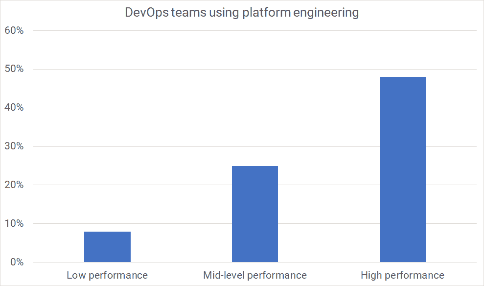

# DevOps 和平台工程- Octopus 部署

> 原文：<https://octopus.com/blog/devops-platform-engineering>

在这篇文章中，你会发现平台工程在你更广泛的软件交付过程中的位置。您将了解平台工程如何与开发运维流程协同工作，以及为什么开发运维与平台工程都能帮助您的组织实现高性能。

## DevOps 的快速版本

DevOps 源于开发人员和运营人员一起工作的简单想法。这在许多组织中变得很难做到，因为这些团队有相互冲突的目标。

组织将目标与每个团队的专长相结合。运营团队需要保持系统稳定，而开发人员必须更频繁地交付更多价值。当团队独立工作时，来自开发人员的变更的增加降低了系统的稳定性。你可以看到这是如何为冲突创造条件的。

您可以通过让开发人员和运营人员更好地协作来克服这些相互冲突的目标。当人们尝试这样做时，他们发现有可能在更短的时间内交付更多的变更*和*增加可靠性。

10 年来，由于 Puppet 和 DORA 的广泛研究,“开发人员和运营人员一起工作”这一模糊的价值陈述已经发展成为一套定义明确的能力。

DevOps *结构方程模型*描绘了研究中发现的能力和关系。它最初是在《T2 加速》一书中描述的，多拉继续更新它，作为他们研究计划的一部分。

2021 年 DevOps 结构方程模型

该模型对于寻找改进机会的团队和希望采用 DevOps 并获得高绩效好处的组织很有帮助。你可能见过这个图表的旧版本，它的方框更少。

正如你所看到的，2021 年的模型充满了特定功能的想法，你可以采用这些功能来成为*更多的开发人员*。如果你感到不知所措，请阅读我们 [DevOps 工程师手册](https://octopus.com/devops)中的[如何开始使用连续交付](https://octopus.com/devops/continuous-delivery/how-to-start-using-continuous-delivery/)。

该模型中的关键观点是文化对组织的技术绩效及其商业和非商业目标绩效的重要性。

在 2022 年，DevOps 已经发展成为:

*   Developers and ops working together
*   一组定义明确的技术和非技术能力
*   用全系统的方法评估你的成功

如果你已经存在足够长的时间，你可能会注意到 DevOps 鼓励的许多变化看起来就像我们在开发和运营筒仓被创建之前如何开发系统。

专家团队的建立是有原因的，所以当我们后退并尝试另一条道路时，你应该确保你解决了那些最初的问题，而没有重现令人讨厌的副作用。规模化和专业化的问题依然存在，那么我们如何健康的克服呢？

进入平台工程团队。

## 平台工程

尽管围绕 DevOps 涌现了许多新的团队和职位，但平台工程团队可能是最符合 DevOps 理念和目标的。

平台团队与开发团队合作，创建一个或多个代表一组受支持的技术选择的*黄金路径*。这些途径不会阻止团队使用其他东西。路径鼓励联合，而不是在开发团队中实施集中决策。平台团队创建易于使用的自助工具供开发团队使用，而不是像“创建测试环境”那样去捡票。

平台工程的一个关键部分是将开发者视为客户，解决他们的问题并减少摩擦，同时倡导采用一致的技术选择。例如，假设您的组织在运行 MySQL 数据库方面有丰富的经验，并且已经找到了解决以下问题的方法:

*   缩放比例
*   备份
*   维护
*   安全性
*   分身术
*   部署
*   测试数据库

选择 MySQL 的团队只需按一下按钮，就可以免费获得所有这些。另一个团队可能仍然需要使用不同的东西，但是当他们离开这条道路时，他们将对他们的选择负责。

选择黄金路径可以加速您的软件交付，让您专注于差异化工作，并在出现问题时为您提供支持渠道。作为开发人员，您的时间最好花在为客户提供价值的特性上，而不是建立构建、环境和其他类似的活动。

平台工程可以简化许多任务:

*   建造管道
*   测试和生产环境
*   自动化部署
*   测试框架
*   记录和监控
*   安全功能

当您扩大您的软件交付团队时，平台工程减轻了您的操作负担。总体而言，你需要更少的这些难以找到的平台工程师，并且通过在平台团队中工作，他们可以产生比他们嵌入到开发中更大的影响。

平台工程帮助您的组织扩展其软件交付，而不会失去一些最好的小团队利益。

## DevOps 和平台工程

如您所见，平台工程与 DevOps 互为补充，而非竞争。为了提供这种积极关系的进一步证据，DevOps 报告的[傀儡状态](https://puppet.com/resources/report/2021-state-of-devops-report)发现 DevOps 高绩效者比低绩效者更有可能拥有平台工程团队。

【T2 

| 种类 | %与平台工程 |
| --- | --- |
| 低的 | 8% |
| 中间的 | 25% |
| 高的 | 48% |

平台工程本身并不能提供完整的性能组织视图。DevOps 结构方程模型向我们展示了平台团队范围之外的领导、管理、文化和产品能力。这就是为什么平台工程属于一个更广泛的过程，如 DevOps，而不是提供一个替代品。

与 DevOps 一起使用，平台工程是扩展软件交付能力的优秀工具。

DevOps 希望您:

*   测量整个系统的性能
*   缩短和扩大反馈回路
*   创造一种不断学习和改进的文化

平台工程希望您:

*   平稳的开发体验
*   创建支持自助服务的工具和工作流
*   让开发人员更容易实现系统质量属性(比如性能、可观察性和安全性)

## 结论

随着您的软件交付团队的成长，您必须小心地管理规模的复杂性。一些组织通过限制团队的自主性来限制复杂性，但是平台工程提供了一种在保持开发团队自主性的同时驯服复杂性的机制。

## 进一步阅读

愉快的部署！