# DevOps 阅读清单:选择你的下一本书

> 原文：<https://octopus.com/blog/devops-reading-list>

你喜欢书。你想更多地了解 DevOps。要么你是这个话题的新手，要么你想扩大你的知识面，但是你被这些选项淹没了。好像每个人都有自己的看法，你不知道从哪里开始，也不知道先/下一步读什么。

或者，您可能已经是 DevOps 的拥护者，您想为朋友或同事推荐一本书，但您并不了解最新版本。你应该把哪本书放在他们的鼻子下？

这篇文章是给你的。

以下是一些最受尊敬的 DevOps 书籍的列表，以及我个人对你(是的，你，特别是你)应该首先阅读哪本书的建议。如果你时间紧迫，试试我们的[推荐工具](https://octopus.com/devops/reading-list)吧，它是受这篇文章的启发。

## 如何阅读这个帖子

[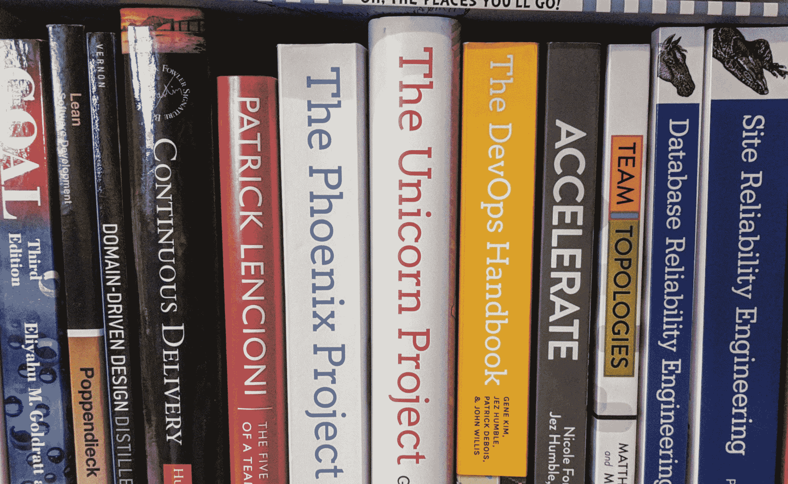](#)

这篇文章太长了，你不能从头到尾看完。它不应该被这样理解。相反，把这当成一本“选择你自己的冒险”的故事书，我会陪你到你最合适的部分。

接下来是一个简单的决策树，旨在将你直接指向我为你推荐的个人书籍。当你进入决策树时，我鼓励你回答问题，看看它们会把你引向何方。希望你最终能得到一本引起你兴趣的书籍推荐。

有些问题有点复杂，所以在决策树下面，我提供了关于这些问题的更多信息/说明。如果这些澄清有助于你做出决定，那很好，否则，你可以跳过它们。

接下来，我为我推荐的每本 DevOps 书写了一个简短的总结。在你完成决策树练习后，我鼓励你通过链接直接找到我对你最感兴趣的书的描述。在那里，您将找到更多信息/评论和购买选项的链接。

我在这篇文章的结尾提到了几个不适合决策树的额外荣誉，以及一些最终的想法。

我希望当你读完的时候，你已经准备好去买一本你喜欢的书，在你的时间表中划出几个小时，开始阅读。我可以毫不夸张地说，当我这么做的时候，其中的一本书让我的职业生涯变得更好。

要找出哪本书让我走上了这条路，以及我在为这篇文章做研究时发现了哪本书，你必须继续读下去。

## 选择自己的冒险！决策树

在完成这个练习之前，有一个重要的注意事项:

这并不完美。可能行不通。

我怎么强调这一点都不为过。下面的许多书是重叠的。有些问题有点做作，经常故意低估复杂性或夸大差异，以制造简单和快速推荐的假象。请不要太认真。

此外，这不是一个详尽的标题列表。在整理这份清单时，我尽可能多地寻求反馈，但最终还是有那么多好书，我无法一一列举。一些读者会说，我应该包括这个或排除那个，但我希望绝大多数人会同意，以下所有文本都受到广泛尊重。

先不说警告，现在是你自己回答这些问题的时候了，看看你的结局如何。

【T2 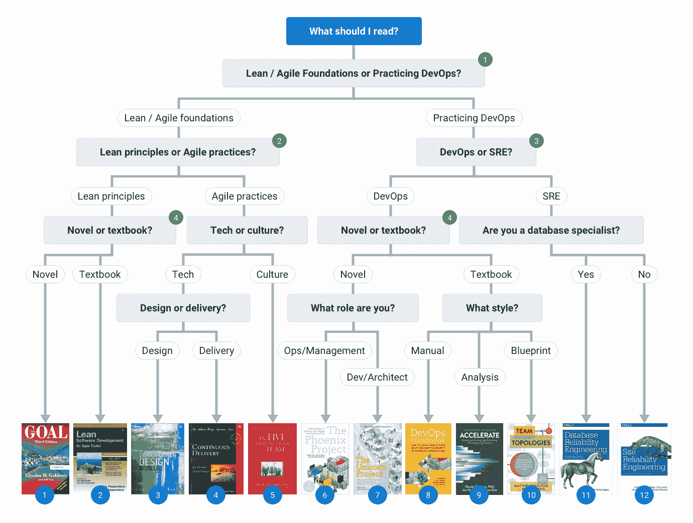

*(点击图示放大。)*

如果您希望澄清以上决策树中突出显示的问题，您可以在下面找到更多指导。如果你不需要任何澄清，跳到我对这些书的总结。

## 对加载问题的澄清

### 问题 1:精益/敏捷基础还是实践 DevOps？

DevOps 建立在巨人的肩膀上。在 DevOps 之前，有持续交付，敏捷和极限编程，TDD 和精益。为了真正理解 DevOps，了解构建 DevOps 的理念是很有用的。

问问你自己，现在，你对了解 DevOps 的基本思想还是现状更感兴趣？

[回到决策树](#decision_tree)

### 问题 2:精益原则还是敏捷实践？

敏捷运动(在 DevOps 运动之前)本身受到丰田生产系统(TPS)和精益思想的严重影响。TPS 和精益本身就是巨大的主题，值得他们自己去阅读。他们指的是制造业和供应链管理的一场革命，这场革命可以追溯到 20 世纪 70 年代，并受到日本汽车行业的严重影响。

几十年后，敏捷运动认识到，20 世纪 90 年代的 IT 正遭受着与 1970 年前的汽车行业相似的问题。为制造业设计的各种精益原则被重新构想，以便在 IT 中发挥作用。这些已经被编纂成一套现在几乎无处不在的敏捷实践。

[回到决策树](#decision_tree)

### 问题 3: DevOps 还是站点可靠性工程(SRE)？

这是 DevOps/SRE 世界中最热门的辩论之一，但它可能会令人困惑，因为在许多方面，DevOps 和 SRE 非常相似。DevOps 和 SRE 都提倡类似的理念，例如持续交付、可观察性、无可指责的文化、减少管理工作，以及“开发”和“运营”团队之间更紧密的合作/联合。然而，也有一些重要的区别。

由于谷歌被广泛认为是发明了 SRE，所以尊重谷歌的定义是合适的。在这篇文章和 YouTube 视频短片中，他们将 SRE 描述为一个实现 DevOps 的类。换句话说，SRE 是一种特殊的工作实践，它实现了许多最重要的 DevOps 原则。因此，根据谷歌的说法，DevOps 和 SRE 并不冲突。

SRE 的一些关键组成部分包括 SRE(重新设想的“Ops”)团队与产品(重新设想的“Dev”)团队的分离，使用服务水平目标(SLO)来确保产品和 SRE 团队共享相同的优先级，以及使用错误预算来鼓励大量的创新和风险承担。

然而，来自 DevOps 社区的一些人对此感到不舒服。他们认为，在几乎所有情况下，由开发和运营人员健康组合而成的产品团队运行他们自己的服务要健康得多。因此，不需要集中运营或 SRE 团队。一些 DevOps 人员认为，SRE 使传统的开发和运营问题的分离正常化。他们有时认为这不可避免地会导致 DevOps 试图避免的熟悉的孤岛和功能性对峙。

问问你自己哪个感觉更真实:

*   特定产品或服务的开发和运营问题属于不同的团队(SRE)
*   对于拥有整个生命周期的小型跨职能团队，端到端(DevOps)

[回到决策树](#decision_tree)

### 问题 4:小说还是教科书？

这个问题与其说是关于主题，不如说是关于学习风格:你喜欢读什么样的书？

大多数书读起来像教科书或手册。它们被分成关于不同主题的章节，它们像老师向学生解释一样解释观点，通常参考其他相关材料。

然而，有几本书是非常不同的。它们被写成了小说。他们以特定的人物为中心，这些人物通常比大多数 IT 人士所熟悉的许多刻板印象的生活讽刺要大。读者通常会在这些角色中认出他们的同事或他们自己，引发欢笑或痛苦的泪水。

大多数人认为小说更容易阅读，更令人愉快，而其他人则对通常由工程师而不是艺术专业学生写的散文感到厌恶。虽然这些故事可能出奇地熟悉，而且发人深省，但不要指望莎士比亚、奥斯汀或狄更斯那样的文学天才会深入其中。

其他人觉得教科书更容易理解。他们提出了清晰而结构良好的论点，但是，即使有世界上最好的意愿，当没有角色和情节时，人们被吸引并在情感上投入是不常见的。对大多数读者来说，它们不太吸引人。

教科书会和你的大脑对话。小说与你的直觉对话。

[回到决策树](#decision_tree)

## 书籍:

希望到现在为止，你已经挑选了一本或多本让你感兴趣的书。点击下面的链接，阅读我对每本书的一些评论，并链接到进一步的评论和采购选项。

检查完你所选书籍的资料后，继续进入[荣誉奖](#hon_mentions)和[最终想法](#final_thoughts)部分。

### 图书索引

1.  [目标](#goal)
2.  [精益软件开发:敏捷工具包](#lean)
3.  [领域驱动设计:提炼](#ddd)
4.  [连续交货](#cd)
5.  [团队的五大功能障碍](#dysfunc)
6.  [凤凰计划](#phoenix)
7.  [独角兽项目](#unicorn)
8.  DevOps 手册
9.  [加速](#accelerate)
10.  [团队拓扑](#tt)
11.  [数据库可靠性工程](#dre)
12.  [现场可靠性工程](#sre)

### 1.目标(戈德拉特:1984)

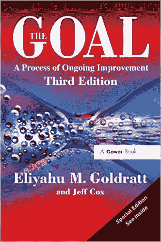

事实上，这是迄今为止我所选择的最古老的书，这证明了它的古老程度以及它的重要性和永恒性。

目标是一部关于汽车零部件制造公司 UniCo 的高级经理 Alex Rogo 的小说。生意不景气。为了避免大规模重组计划和大量失业，Rogo 需要在看似不可能的最后期限之前同时提高绩效、质量和盈利能力。

他最初的努力并不顺利。他陷入了老式工厂管理的各种陷阱，专注于局部优化和成本效益。幸运的是，他遇到了一个古怪的老朋友约拿，他给了他一些奇怪的建议，这些建议似乎与他所相信的有效的工厂管理背道而驰。

该目标提供了一种真正吸引人的、个性化的、可及的、实用的方法来学习基本的精益原则，如价值流、流程、浪费、全球效率和约束理论。

与我列表中的其他书不同，这个目标几乎没有提到软件。毕竟，这是一本关于制造而不是软件开发的书。这是一件好事，因为它有助于读者理解原始上下文中的基本精益原则，这意味着读者不需要任何 it 经验就能理解这些概念。

如果你想了解更多关于这些精益原则如何应用于现代软件开发的信息，我鼓励你阅读[凤凰计划](#phoenix)(一个基于 IT 部门的目标的现代复述)或者[精益软件开发:一个敏捷工具包](#lean)(一本更正式的教科书)。

更多评论，以及采购选项:[在 GoodReads 上查看这本书](https://www.goodreads.com/book/show/113934.The_Goal)

上一页:[书籍索引](#book-index) /下一页:[优秀奖](#hon_mentions)

### 2.精益软件开发:敏捷工具包(Poppendieck，Poppendieck: 2003)

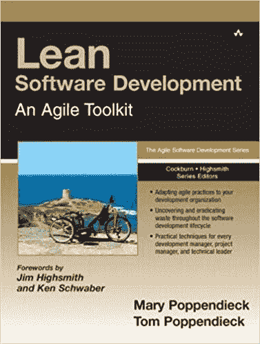

一本经得起时间考验的书。

我不想猜测有多少软件书籍的标题中有“敏捷”。可以说，“敏捷”是软件最初的营销术语。这可能与一次酒后滑雪旅行有关，一群人创建了一个简洁的网站。

然而，撇开怀疑不谈，我相信这些时髦的词语非常适合销售软件、培训和认证，因为它们背后有一个基本的真理。这些想法在技术和商业上都很有意义。

我可能在上面嘲笑过它，但是敏捷宣言有它的位置。对许多人来说，这是阐明敏捷的重要垫脚石。然而，对敏捷更好的表述是玛丽和汤姆·波彭迪克的《精益软件开发:敏捷工具包》，该书于两年后出版。

Poppendiecks 采用了 7 个核心精益原则，并实际讨论了它们如何从制造领域转化为软件开发:

1.  消除浪费
2.  加强学习
3.  尽可能晚地决定
4.  尽可能快地交付
5.  授权给团队
6.  在...中建立诚信
7.  看到整体

一路上，他们涵盖了 20 种将精益原则应用到实践中的工具，例如价值流图、迭代工作和重构。

这本书是对敏捷实际上是什么，它如何建立在稳定的精益基础上，以及为什么特定的实践会产生更好的软件交付结果的最好的阐述之一。作为一本“敏捷”的书，它在技术上不是一本“DevOps”的书(它是在 Patrick DeBois 偶然给了我们*那个时髦词的 6 年前写的)，但是这本书是 DevOps 起源中的一个重要章节。*

对于那些想在最初的制造环境中了解更多精益原则的人，请查看[目标](#goal)。对于那些想了解这些敏捷思想是如何随着 DevOps 的出现而发展的人来说，看看[的 DevOps 手册](#handbook)。对于那些想深入软件设计/架构的人，试试[领域驱动设计:精华](#ddd)。最后，对于那些对敏捷/开发工作人员更感兴趣的人来说，你可能更喜欢团队的五大功能(更个人化)或[团队拓扑](#tt)(更具战略性)。

更多评论，以及预览和采购选项:[在 GoodReads 上查看这本书](https://www.goodreads.com/book/show/194338.Lean_Software_Development)

上一页:[书籍索引](#book-index) /下一页:[优秀奖](#hon_mentions)

### 3.领域驱动的设计精华(Vernon: 2016)

领域驱动设计(DDD)是一种方法，它使人们能够创建松散耦合的架构，并避免创建一个“泥巴大球”式的整体系统，这对于开发、部署或维护来说是痛苦的。Martin Fowler 在他的博客上对此做了更好的描述，比我在这里的几个段落中所能合理预期的要好。

DDD 的中心思想是“有界环境”，它可以用来定义系统的任何一部分的范围。团队成员承认，在任何一个上下文中使用的语言都是一致的，但在不同的上下文中也可能有所不同。这使得团队可以专注于在正确的地方解决正确的问题，并在不同的上下文之间建立适当的接口，以避免复杂的依赖性和由于微妙的上下文差异而引入的错误。再次，Fowler 在这里更详细地解释了有界环境。

写这样一篇文章的最大好处是收到反馈。当我在整理我的书目列表时，我向 Twitter 征求反馈，一些人推荐了一本关于 DDD 的书。例如:

老实说，这是我发现了自己的盲点。DDD 不是我以前研究过的话题，我也没有意识到 DDD 和德沃普斯之间的关系。我感谢所有鼓励我去看一看的人。现在我的书架上有一本新书，我也一直在学习。

大多数人推荐 Eric Evans 的领域驱动设计，但是 Matthew Skelton(《T2 团队拓扑》的作者)也向我推荐了 Vernon 的“精选”版。经过一点研究，我了解到埃文斯的书有很好的评论，是公认的 DDD 的黄金标准。然而，它也被认为是漫长而复杂的。(它有 560 页长，售价超过 50 美元，比本文中的任何一本书都要长，也更贵。)

因为这是我第一本关于 DDD 的书，所以我买了一本弗农的“精华”版。只有一半的价格和 130 页丰富的图表。即使是阅读速度慢的人(像我一样)也可能在几个小时内从头到尾读完。我把弗农的书列入我的清单，因为我不愿意推荐一本我没读过的书，但我认识到许多读者可能更喜欢直接去读埃文斯的书。

Vernon 这本书是一本很好的关于 DDD 的入门书，对任何有一点软件开发经验的人来说都相对容易理解。对于那些正在与一个单一系统作斗争的人，或者那些希望避免他们的东西逐渐变成一个系统的人来说，这尤其重要。

在阅读完《领域驱动设计精粹》之后，你可能会想通过上面提到的 Evans 的书更深入地了解 DDD。或者，您可能想阅读更多关于松耦合架构如何更容易使用的内容。这在某种程度上在[加速](#accelerate)和[devo PS 手册](#handbook)中都有涉及。

你可能还想看看 [Sam Newman 的构建微服务](https://www.goodreads.com/book/show/22512931-building-microservices)(在这篇文章中有一点遗漏了)，在[站点可靠性工程](#sre)中，你将了解 Google 如何维护一个拥有许多松散耦合服务的大型复杂环境。

最后，我鼓励你看一看[团队拓扑](#tt)。软件架构从团队架构开始，团队拓扑使用康威法则将有界上下文和松散耦合系统的思想应用到我们在 IT 部门构建团队的方式中。

更多评论，以及预览和采购选项:[在 GoodReads 上查看这本书](https://www.goodreads.com/book/show/28602719-domain-driven-design-distilled)

上一页:[书籍索引](#book-index) /下一页:[优秀奖](#hon_mentions)

### 4.持续交付(Humble，Farley: 2011)

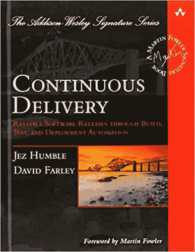

我第一次参加伦敦连续交付(CD) Meetup 小组时，这本书刚出版不久，一半的与会者都拿着一本。他们称之为“圣经”。虽然 DevOps 运动在 2011 年就已经开始了，但我想我还没有听说过它。我们的社区有一个非常相似的东西，叫做 CD。

这本书正式提出了许多关于部署管道的想法，这些想法后来变得无处不在。它深入探讨了一些关于配置即代码、构建和部署自动化以及有效测试策略的技术细节。

大多数人不倾向于从头到尾阅读这本书。(挺干的，技术含量高。)相反，它最好用作参考书。如果您打算采用新的技术实践，那么在开始之前有必要阅读相关章节，以帮助您理解如何实现它。

这本书通常非常专业，主要关注部署管道的实际实现。然而，它也讨论了诸如移交、快速迭代、实验和学习等主题。在许多方面，一旦你开始通过这个更广阔的镜头来看 CD，就很难区分 CD 和 DevOps。

事实上，今天，对裁谈会的范围有些混乱。对某些人来说，这只是关于部署管道的实际实现。对其他人来说，CD 包含更广泛的文化和组织问题。有些人甚至会说 DevOps 是 CD 的一部分，而不是相反。

例如，两位作者现在似乎站在了这场辩论的对立面。Jez Humble 接着与人合著了 [Accelerate](#accelerate) ，该书的封面上有“DevOps”一词，并在“架构”、“产品和流程”、“精益管理和监控”以及“文化”的标题下描述了一组与其他功能截然不同的“连续交付”功能。与此同时，戴夫·法利将 CD 视为 DevOps 的同义词(过去，他声称 DevOps 只是 CD 的一个组成部分)，正如[在他的 YouTube 频道](https://www.youtube.com/watch?v=MnyvgFDh-kw&list=PLwLLcwQlnXBw9jv5tFXQC_ch-VCXwPikM&index=4)上表达的那样。

就我个人而言，我厌倦了这场辩论。CD 和 DevOps 是一起成长起来的，并且是从类似的精益、极限编程和敏捷思想中衍生出来的。通过独立思考和借鉴，他们得出了相似的结论。我鼓励你庆祝这两个运动相互支持的方式，而不是停留在它们之间的关系上。(我希望 Jez 和 Dave 会同意。)

如果你喜欢连续交付，你可能也会喜欢[现场可靠性工程](#sre)。这是一本类似的技术书籍，专为大型 It 部门设计，涵盖了更多生产/运营/维护方面的其他主题。另一方面，如果你觉得 CD 有点枯燥，想要一些更容易理解的东西，试试[的 DevOps 手册](#handbook)或[的 Accelerate](#accelerate) 吧。

更多评论，以及采购选项:[在 GoodReads 上查看这本书](https://www.goodreads.com/book/show/8686650-continuous-delivery)

上一页:[书籍索引](#book-index) /下一页:[优秀奖](#hon_mentions)

### 5.团队的五大功能障碍(Lencioni: 2002)

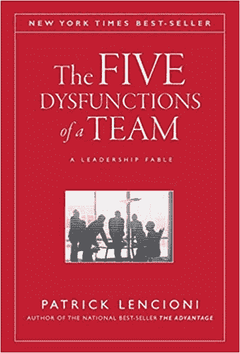

Andrew Clay Shafer 在 2009 年的“困惑之墙”幻灯片引起了共鸣，因为它很好地表达了开发和运营之间的“核心长期冲突”。引起了共鸣。痛苦地。

大多数大型组织都有比简单的“开发”和“运营”更复杂的政治结构，很难让所有的职能部门协调一致地工作——然而这恰恰是实现短交付周期、频繁发布和“流动”所需要的。

只有团队合作才有可能达成一致，而没有训练有素的团队成员，团队合作是不可能的。正如杰拉尔德·温伯格的名言，“不管他们告诉你什么，这总是一个人的问题”。

这也是 DevOps 社区一直以来都非常关注人和文化的原因。然而，技术人员通常更愿意谈论软件或自动化，而不是情感、信任或个人弱点。这导致了 DevOps 的一个问题:太多时候，它归结为简单的自动化部署、作为代码的基础设施或最新的供应商工具。这些过度简化完全没有抓住要点。

团队的五大功能障碍为解决“人的问题”提供了一个逻辑框架。前 180 页讲了一个“领导力寓言”，类似于[目标](#goal)、[凤凰计划](#phoenix)，或者[独角兽计划](#unicorn)。DecisionTech 是一家具备所有成功要素的初创公司，但高层领导团队却是一团混乱。新任首席执行官凯瑟琳·彼得森(Kathryn Peterson)的任务是团结这些才华横溢但狡猾谨慎的个人，扭转公司的命运。

最后 40 页正式回顾了凯瑟琳用来创建一个有效团队的框架。你可以跳过这个寓言，只阅读这 40 页，然后在一个小时内完成，但这就像在沉默中阅读乐谱，或者通过阅读文档而不安装它来学习使用一些新技术。为了得到真正的赞赏，阅读寓言并观察框架的运行是很有价值的。

如果你最大的问题是“人的问题”，这本书应该是你首先要读的书之一。

读完“功能障碍”之后，如果你想学习如何在你的组织中构建多个团队以取得成功，你可能会想尝试阅读[团队拓扑](#tt)。如果你喜欢另一个寓言，看看[的凤凰计划](#phoenix)，其中一些“功能障碍”的练习被用来在项目管理灾难中把敌对的领导团队聚集在一起。

更多评论，以及预览和采购选项:[在 GoodReads](https://www.goodreads.com/book/show/21343.The_Five_Dysfunctions_of_a_Team) 上查看这本书

上一页:[书籍索引](#book-index) /下一页:[优秀奖](#hon_mentions)

### 6.凤凰计划(金，贝尔，斯帕福德:2013 年)

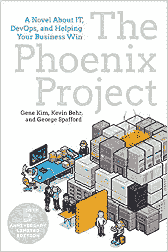

早些时候，我提到其中一本书改变了我的职业生涯。就是这个。

凤凰计划是对你曾经工作过的每一家公司的讽刺。它充满了你过去经常合作的传奇人物。有脾气暴躁的数据库管理员，了解所有最关键系统如何工作的孤独工程师，不了解技术的高级领导人物，以及许多其他人。你看了这本书，认出了你的同事。一个接一个，你对自己傻笑。戴夫在那儿。那是苏珊。哦，等等，那是我。

当 Gene Kim 读到目标时，他受到了极大的鼓舞，以至于他想在软件开发的背景下复述这个目标。凤凰计划是一种敬意。亚历克斯·罗戈被比尔·帕尔默取代，他是一名中层经理，在前任被解雇后，无意中被提升为高级领导。他在另一家汽车零部件制造公司 Parts Unlimited 工作，生意不景气。听起来熟悉吗？

Parts Unlimited 将赌注押在了凤凰计划(Phoenix Project)上，这是一个旨在扭转公司命运的大型新软件版本。他们向投资者承诺将在几周内交付，但团队已经无望地落后于计划，营销部门通过各种非官方的秘密渠道不断增加工作量。与此同时，频繁的灭火正在从凤凰城抽走资源，并导致更多的延误。这是一个恶性循环，从中逃脱似乎是不可能的。

如果 Phoenix 不能按时交付，Bill 知道他和他的大多数同事都会失业。

《Goal》中的乔纳被埃里克取代，他是一个古怪的新投资者，有着挑战比尔传统智慧的疯狂想法。在 Eric 的指导下，Bill 认识到了他关于如何管理 IT 项目的旧观念中的缺陷。他踏上了理解“三种方式”的旅程:心流、反馈和持续的实验和学习。

在这个过程中，每个原型人物要么学会接受一种新的工作方式，要么得到应有的惩罚。当我意识到我所认识的角色不会有好的结局时，我个人知道我必须改变。

在我看来，这本书最有价值的地方在于，当我认为自己的工作做得很好的时候，它很好地阐述了我正在做的伤害。凤凰计划帮助我在一个更广阔和更有价值的背景下理解我的角色和我行为的后果。如果不是这本书，我可能不会写这个帖子。

如果你喜欢凤凰计划，你可能也会喜欢独角兽计划，它从一个非常不同的角度讲述了同样的故事，你可能会有兴趣回过头来阅读《T2》的目标。如果你想了解更多关于建立优秀团队的知识，请查看[团队的五大功能障碍](#dysfunc)。如果你想对菲尼克斯提出的主题有一个更正式的概述，可以试试 DevOps 手册或 Accelerate。

更多评论，以及预览和采购选项:[在 GoodReads 上查看这本书](https://www.goodreads.com/book/show/17255186-the-phoenix-project)

上一页:[书籍索引](#book-index) /下一页:[优秀奖](#hon_mentions)

### 7.独角兽项目(金:2019)

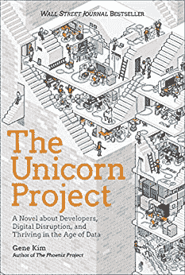

独角兽计划是凤凰计划的重演。既不是前传，也不是续集。同样的故事，在同样的时间线上，但是从不同的角度讲述。

凤凰城项目是从比尔·帕尔默的角度讲述的，作为一名具有业务运营背景的高级经理。Phoenix 谈了很多关于精益原则和协作以及所有有价值的东西，但是 Bill 已经被提升得足够远了，他很少再玩代码了，而且他缺乏开发经验。这可能使 Phoenix 项目成为开发人员不满意的读物，有时给他们一种印象，除非你在高级管理层，否则你不能对底层问题做太多。

相比之下，独角兽项目讲述的是玛克辛·钱伯斯的故事。她是一名高级开发人员，在因为一场不是她的错的灾难而受到指责后，刚刚被降级到凤凰项目。她深受团队的尊敬，是一个强有力的领导者，因为她热爱编码，所以她回避正式的管理职位。

除了一些组织主题，如公司官僚主义、责备文化和冗长的批准过程，“Unicorn”还涵盖了更多的技术主题，包括持续集成(CI)、数据管理和函数式编程。(是啊，我承认最后那个我有点惊讶！)

Unicorn 的主要焦点是“五个理想”:

1.  地方性和简单性
2.  专注、心流和快乐
3.  日常工作的改进
4.  心理安全
5.  客户导向

虽然 Unicorn 无疑是针对工程师而不是经理，开发者而不是运营，但我认为 Phoenix 和 Unicorn 的结合非常有价值。坦率地说，如果你喜欢一个，你可能会喜欢另一个，从两个不同的角度阅读同一个故事很有启发性。这是一个很好的练习，让你学会理解和同情对方看待事物的方式。

如果你喜欢独角兽计划，试着阅读下面的凤凰计划。如果你想了解更多关于建立优秀团队的知识，请查看[团队的五大功能障碍](#dysfunc)。如果你想了解更多关于为 DevOps 设计代码的知识，试试[领域驱动设计:精华](#ddd)，或者如果你是数据专家，试试[数据库可靠性工程](#dre)。最后，如果您想了解更多关于持续集成和部署管道的信息，请查阅[持续交付](#cd)或[devo PS 手册](#handbook)。

更多评论，以及预览和采购选项:[在 GoodReads 上查看这本书](https://www.goodreads.com/book/show/44333183-the-unicorn-project)

上一页:[书籍索引](#book-index) /下一页:[优秀奖](#hon_mentions)

### 8.《DevOps 手册》( Kim，Humble，Debois，Willis: 2016 年)

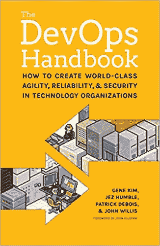

这本书也许是对 DevOps 的最好诠释。它的目的是作为凤凰计划的伙伴，它的目标是将凤凰的思想和模式编纂成一个更加正式和可操作的袖珍手册。(虽然你需要相当大的口袋。)

它以约翰·威利斯的一篇名为《DevOps 的融合》的文章开头。这是一篇短小精悍的文章，描述了各种相互关联的运动(精益、敏捷宣言、敏捷基础设施、持续交付、丰田 Kata)是如何在几乎相同的时间得出相似的结论，以及它们是如何汇聚在 DevOps 的旗帜下的。

然后，该手册使用 Kim 在凤凰计划中提出的“三种方法”作为逻辑结构，通过这种逻辑结构，它阐述了 DevOps 核心的许多关键思想和实践，包括价值流图、部署实践、测试、遥测、实验/学习。还有一个专门讨论安全性和合规性的部分。

写得也很好。通过参考其他伟大的书籍、文章和视频，这很容易理解。它还包括大量的现实世界的案例研究，以证明在实践中的理论。

DevOps 手册相对于[连续交付](#cd) (CD)或[现场可靠性工程](#sre) (SRE)的关键区别之一是其可访问性。它用简单明了且符合逻辑的术语解释了想法和概念，并将它们直接与商业价值联系起来，即使不是经验丰富的工程师或商业领袖的人也相对容易理解。这就是为什么它是缺乏近期技术经验的 it 经理或高层领导的好读物的一个原因。

这种易接近性也可能是它的缺点。在我已经熟悉的话题上，我想更深入，但我留下了疑问。

> “你应该如何处理这种不寻常的情况？”

> “这在实践中如何运作？”

例如，如果与 CD 或 SRE 相比，DevOps 手册不太详细，但范围更广，因此更容易阅读。不像 CD 或 SRE(相当密集)，你可能会发现自己从头到尾阅读手册。

DevOps 手册是 DevOps 新手或想更好地理解 DevOps 各部分如何结合的人的绝佳读物。读完之后，你很有希望受到启发，继续深入你最感兴趣的话题。

如果你还没有读过凤凰计划，它是 DevOps 手册的好伙伴，因为它讲述了一个 it 经理将“三种方法”付诸实践的故事。如果你想更深入地了解任何特定的主题，你可能会在《手册》中找到大量的参考资料。事实上，本帖中的大部分书籍都是在手册出版之前的，在某些时候会被引用。

如果您是高级管理人员，并且您对更多阅读材料感兴趣，以帮助您构建成功的 IT 组织，我建议您看一看 [Accelerate](#accelerate) ，它采用科学的、数据驱动的方法来分析来自 DevOps 报告的数据，以提供一个实证案例，说明为什么手册中的许多实践能够带来业务价值。您可能还会喜欢[团队拓扑](#tt)，它探索了各种团队结构，这些结构或者促进或者抑制流动。

更多评论，以及预览和采购选项:[在 GoodReads](https://www.goodreads.com/book/show/26083308-the-devops-handbook) 上查看这本书

上一页:[书籍索引](#book-index) /下一页:[优秀奖](#hon_mentions)

### 9.加速(福斯格伦、亨布尔、金:2018)

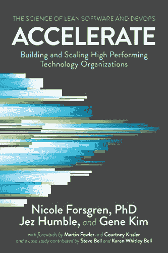

如果说[DevOps 手册](https://www.octopus.com/blog/devops-reading-list#handbook)解释了“如何”采用 devo PS，Accelerate 解释了“为什么”。对于那些对 DevOps 持怀疑态度或者对理解各种 DevOps 实践和商业成功之间的关系感兴趣的人来说，这是一个强有力的论据。这是向高级管理层推销 DevOps 的绝佳工具。

在许多方面，这本书是对“DevOps”是一个时髦词或邪教的批评的回应，充满了温暖而松散的想法，这些想法听起来很好，对小企业或初创企业来说很有意义，但实际上无法扩展到大型组织，或者与医疗保健或金融等受到严格监管的行业不兼容。

作者通过分析 2014-2017 年[devo PS 报告](https://www.devops-research.com/research.html)的数据实现了这一点。Forsgren，[一位备受尊敬并发表论文的研究人员](https://nicolefv.com/research)，将各种科学和统计方法应用于这些数据，看看它们能教给我们什么。她的发现是惊人的。

长话短说:DevOps 的商业利益是真实的和可预测的。

尽管《Accelerate》采用了非常科学和统计数据驱动的方法，但它是一本相对简短且易于理解的书，用简单的英语编写，其格式应该对任何企业中的技术人员或商业人员都有意义。

这本书分为三个部分，每个部分都很不同。

第 1 部分开门见山，用短短的 130 页，丰富的图表，详细介绍了非凡的发现。坦率地说，如果你是 DevOps 的新手，这 130 页将会是一本很好的 DevOps 入门书，即使你后来决定转到这个列表中的其他书。

就我个人而言，我是有声读物的粉丝，随着时间的推移，我逐渐提高了播放速度。我现在以大约两倍的速度听它们，任何慢一点的都感觉乏味。在前 covid 时代，我经常出差。我在不到 90 分钟的时间里听完了 Accelerate part 1 的全部内容，当时我正从一个“DevOps Health Check”式的咨询项目开车回家。这本书描述了这个客户和我的许多其他客户正在努力解决的许多问题。

我被我所听到的迷住了，一回到家，我就为自己订购了一份硬拷贝，以便第二天交付，这样我就可以更仔细地重读它。

Accelerate 帮助我了解和理解了我经常与客户一起遇到的许多问题。以前，我会凭直觉认为某些做法是有害的，但我努力权威地阐明原因。Accelerate 给了我向技术和商业利益相关者解释我的直觉反应的语言和证据。

虽然我发现第 1 部分非常有用，但我从未试图阅读第 2 部分。我不认为它是为我设计的。这是一场学术讨论，讨论的是用于得出第一部分中详细结论的科学和统计方法。我确信，对于任何对这些方法感兴趣的统计或数据爱好者，或者任何想找出逻辑缺陷的怀疑论者来说，这都是有价值的阅读材料。就我个人而言，尽管我是数据库专家，但我不确定我属于哪一类。

我喜欢驾驶，也喜欢编码，但我不会设计汽化器或中央处理器。同样，我认识到我更感兴趣的是应用 Accelerate 教授的课程，而不是理解用来提出这些课程的科学和统计模型。对我来说，重要的是作者的方法有效。鉴于这本书的受欢迎程度以及我没有听到对作者方法的任何严肃批评，我个人的结论是这些方法可能是可靠的。(如果他们不是，我也不太可能成为挑战他们的人。我承认妮可·福斯格伦比我更擅长研究和分析。)

尽管没有阅读第 2 部分，但我确实发现第 3 部分很有用。这是荷兰国际集团的一个案例研究。它讲述了一个应用了第 1 部分中的经验教训的特定组织的故事。作者给出了明确的警告，重要的是 ing 解释这些教训的方法，而不是他们实施的特定实践。这是完成这本书的一个有用的方法，因为它展示了如何将理论付诸实践。

那么有什么教训呢？

Accelerate 高度重视针对四个关键指标的同步和持续改进:

1.  研制周期
2.  部署频率
3.  平均恢复时间(MTTR)
4.  部署失败百分比

这四个指标相辅相成，形成良性循环，并通过盈利能力、市场份额和生产力来预测企业的成功。

为了实现业务成功，Accelerate 强调了 24 项实践能力(例如自动化部署和支持学习)，这些能力被证明可以推动针对四项指标的改进。

Accelerate 提供了可靠的证据和推理，这解释了为什么 DevOps 作为一种交付巨大商业价值的方法。这使得它成为一个伟大的第一 DevOps 书或一个缺乏技术经验的高级领导团队的伟大礼物。例如，如果你读过凤凰计划，想象一下，如果比尔·帕尔默(IT 运营副总裁)成功说服史蒂夫·马斯特斯(首席执行官)阅读第一章中的《加速》，他将会多么悲伤。

如果你的角色是一个技术角色，或者你是一个负责技术成果的高级经理，在读完 Accelerate 之后，你可能想继续看一本更实用的“如何做 DevOps”的书，像[的 DevOps 手册](#handbook)、[连续交付](#cd)、[站点可靠性工程](#sre)、[领域驱动设计:精华](#ddd)或者(如果你需要在解决技术问题之前解决人员、团队或文化问题)[团队的五大功能障碍](#dysfunc)或者

更多评论，以及预览和采购选项:[在 GoodReads 上查看这本书](https://www.goodreads.com/book/show/35747076-accelerate)

上一页:[书籍索引](#book-index) /下一页:[优秀奖](#hon_mentions)

### 10.团队拓扑(Skelton，Pais: 2019)

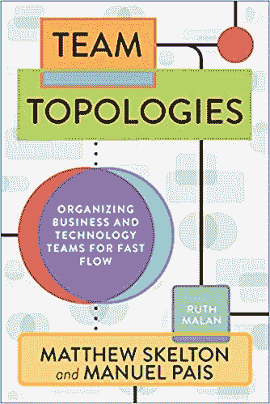

团队拓扑使用[康威定律](https://en.wikipedia.org/wiki/Conway%27s_law)来弥合关于设计有效软件架构的书籍(例如[领域驱动设计:提炼](https://www.octopus.com/blog/devops-reading-list#ddd))和关于创建有效团队的书籍(例如[团队的五个功能障碍](https://www.octopus.com/blog/devops-reading-list#dysfunc))之间的分歧，同时优化价值到最终用户的快速“流动”。

马修·斯凯尔顿(Matthew Skelton)深受英国持续交付运动的影响，这种影响闪耀着光芒。我个人知道这一点，因为在 2017 年的大约一年时间里，我和他共同组织了[伦敦连续交付会议小组](https://www.meetup.com/London-Continuous-Delivery/)。与会者有时会夹着一本[连续交付](#cd)——他们称之为“圣经”。斯凯尔顿主持的衍生[管道会议](https://pipelineconf.info/)，是我参加/支持过的最受欢迎、最多样化、最有启发性的科技会议。

《团队拓扑》是一本书，面向 IT 部门的高级经理。它认为软件体系结构从团队体系结构开始，并且它提供了一个设计你的团队的蓝图，以及他们之间的通信/协作协议，以这样一种方式，你喜欢的软件体系结构自然地出现。这从根本上减少了对有毒官僚机构的需求和糟糕的架构选择的风险，而糟糕的架构选择会累积大量的技术债务。

如果您喜欢团队拓扑，并且希望了解更多关于它所讨论的一些核心概念，那么上面前两段中提到的三本书是一个很好的开始。你可能也会喜欢 [Accelerate](#accelerate) ，这是另一本适合高级 IT 领导的理想书籍，它使用科学的、数据驱动的方法将各种技术和文化实践映射到业务成功。

更多评论，以及采购选项:[在 GoodReads 上查看这本书](https://www.goodreads.com/book/show/44135420-team-topologies)

上一页:[书籍索引](#book-index) /下一页:[优秀奖](#hon_mentions)

### 11.数据库可靠性工程(坎贝尔，专业:2018)

> “这本书绝对有价值:这是 250 页的谷歌网站可靠性工程书(我喜欢这本书)的概念版本，面向那些目前可能自称为数据库管理员，但想去快节奏、大规模公司工作的人。”

那些不是我说的话；它们是 Brent Ozar 在他自己对《DRE》的评论中写的。

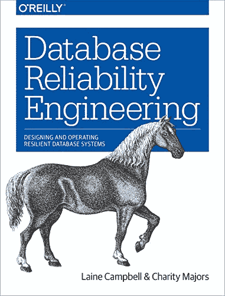

当我在编辑这篇文章时，我看到了布伦特的评论，坦白地说，我很喜欢它。他说的正是我想说的，但更好。他解释了读者应该如何阅读这本书，这取决于他们是 DBA、经理还是开发人员/系统管理员。

就我个人而言，我最喜欢从 DRE 学到的是对“弹性重于健壮性”的关注，以及无处不在地使用 SLO 作为一种方法来调整目标并改进开发和运营之间跨越“混乱之墙”的协作。我还欣赏对“操作可见性”的关注，而不是传统的监控，这是当前#可观察性辩论的核心。

布伦特的结束语是:

> “这本书很容易读懂，但很难实施。说真的，仅仅是实施第 2 章中描述的 SLO，就需要大多数传统公司花上几个月的时间来达成一致并进行监控。

> “随着时间的推移，品牌名称和开源工具会发生变化，但这些概念至少在十年内会坚如磐石。对于我们大多数人来说，这本书是一个很好的路标，设定了未来 5-10 年的时间，但它会让你兴奋地为之努力。”

[在这里查看 Brent 的完整评论](https://www.brentozar.com/archive/2017/11/book-review-database-reliability-engineering-campbell-majors/)(不过看完请回来)。

这差不多概括了“DRE”。谢谢你，布伦特，为我节省了一点时间！

如果你喜欢“DRE”，很可能你也会喜欢它的姐姐，[现场可靠性工程](#sre)，它的规模更大，范围更广。然而，如果你喜欢稍微轻松一点的东西，你可能会喜欢[凤凰计划](#phoenix)，在这个项目中，运营团队学会更有效地与开发人员和业务的其他部分合作，以避免重复的以数据为中心的灾难。你可能还会喜欢 Phoenix 的姊妹小说[《独角兽计划](#unicorn)》，它从一个继承了一个单一数据库的高级开发人员的角度讲述了同样的故事，并且有效地承担了创建和维护数据湖的任务。

如果您正在努力将一个整体数据库分解成一组更小的、更松散耦合的数据库，那么阅读[域驱动设计:精华](#ddd)也会让您受益。最后，如果您是一名老派的 DBA，并且您对 DevOps 仍然持怀疑态度，我鼓励您看一看 [Accelerate](#accelerate) 。

更多评论，以及预览和采购选项:[在 GoodReads 上查看这本书](https://www.goodreads.com/book/show/36523657-database-reliability-engineering)

上一页:[书籍索引](#book-index) /下一页:[优秀奖](#hon_mentions)

### 12.现场可靠性工程(拜尔、琼斯、佩托夫、墨菲:2016 年)

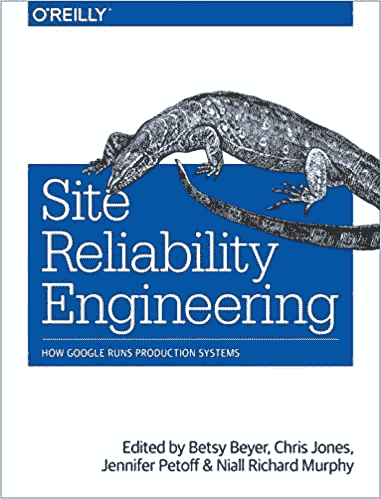

你已经找到了这本书里最重的一本书。

网站可靠性工程(SRE)详细介绍了谷歌如何持续交付和维护其庞大的产品组合。它在 DevOps 社区中如此受欢迎和有影响力，以至于现在有一个越来越多的子社区将“SRE”作为一个独特的事物，或者在“DevOps”内部。

阅读这本书是一项合理的时间投资，所以对于那些刚到 SRE 的人来说，我建议你在购买之前，先浏览以下链接:

1.  谷歌的这篇博客文章: [SRE vs DevOps:竞争的标准还是亲密的朋友？](https://www.googblogs.com/sre-vs-devops-competing-standards-or-close-friends/)
2.  Thomas A. Limoncelli 在纽约 USENIX 的 2012 年会议:[SRE @谷歌:自 2004 年以来成千上万的 DevOps】](https://www.youtube.com/watch?v=iIuTnhdTzK0)

这 10 分钟的阅读/ 45 分钟的观看应该会让你对谷歌的方法有一个很好的了解，涵盖了重要的主题，包括 DevOps 和 SRE 之间的差异，以及 SRE 的一些核心组件，包括 SLO、错误预算和客户可靠性工程。

然后你有 560 页，涵盖 34 个章节，详细介绍了谷歌用来管理其服务可靠性的一些技术和文化实践。这里面有太多的东西，我甚至不打算进一步探讨任何具体的技术。

尽管《SRE》是一本引人入胜的读物，但值得记住的是，我们大多数人并没有为接近“谷歌规模”的组织工作。考虑到这一点，SRE 与在超大型组织工作的人最为相关。

对 SRE 的批评之一是，它有效地规范和倡导了一个单独的 SRE (Ops/DevOps)团队的存在。我个人的观点是，DevOps 社区的大多数人认为，在绝大多数情况下，当然是在大多数中小型公司中，团队拥有其产品或服务的端到端生命周期比将“运营”问题交给单独的筒仓更好。

除了这一点，书中的许多实践可能具有广泛的适用性和相关性。它可能会给你一些如何解决你自己的挑战的想法。

《SRE》是一个很好的读物，适合那些自认为是 DevOps 系列中“Ops”端的人，也适合那些想方设法改善不同开发和 Ops 团队之间关系的人。对于那些想深入了解数据和数据库的人来说，也可以看看[数据库可靠性工程](#dre)。对于那些对连续交付挑战而不是可操作性挑战更感兴趣的人来说，可以考虑[连续交付](#cd)。对于那些想了解更多关于将单块系统分割成一个更松散耦合的服务集合的人来说，看看[领域驱动设计:精华](#ddd)。对于那些喜欢 SRE 但不明白它与 DevOps 有何不同的人来说，给自己买一本《DevOps 手册》作为比较(具体来说，仔细看看第 7 章)。对于那些犹豫是否要建立一个独特的 SRE 团队的人，你可以在[团队拓扑](#tt)中找到一些指导。

更多评论，以及预览和采购选项:[在 GoodReads 上查看这本书](https://www.goodreads.com/book/show/27968891-site-reliability-engineering)

上一页:[书籍索引](#book-index) /下一页:[优秀奖](#hon_mentions)

## 荣誉奖

上个月，我在 Twitter 上发布了我第一次尝试汇编这个列表的结果:

我很幸运地收到了一些精彩的反馈。总的来说，这是非常积极的:

然而，这都是非常主观的。这是一个大而多样的社区，有很多意见。有很多人建议我增加这本书或者删除那本书。我听取了建议，也做了一些改变。尤其是像安德鲁·克莱·谢弗这样的人给了我直接的建议。(对于不知道他是谁的人，姑且说[他的 Twitter 手柄有点谦虚](https://www.youtube.com/watch?v=o7-IuYS0iSE)。当我看到他的回复时，我感觉自己完全是个追星族。)

你可能会喜欢浏览各种 Twitter 帖子，看看其他人喜欢和不喜欢哪些书，我也希望你能回复自己的评论。(尤其是如果这篇帖子激发了你去读一些东西的话！)

还有一些不是传统书籍的读物。因此，它们并不完全符合上面的决策树。尽管如此，它们还是很值得你关注的。

### DevOps 年度状态报告

自 2012 年以来，来自 Puppet 和 DORA 的研究人员团队在各种赞助商的支持下，对数千名 IT 专业人士进行了民意调查，并分析了结果。[最初由岚娜·布朗领导，后来由妮可·福斯格伦](https://twitter.com/nicolefv/status/1328049610439360515)领导，该研究项目为 DevOps 运动提供了更多数据驱动、基于证据的基础，这是任何单个作者或演讲者分享其个人经历所无法实现的。

Forsgren、Humble 和 Kim 使用 2014-2017 年报告中的数据制作了 2018 年的 [Accelerate](#accelerate) ，我认为这仍然是我们行业拥有的关于 DevOps 价值的最佳证据。

[你可以在这里查看所有的 DORA State of DevOps 报告(2014-2019，撰写本文时)。](https://www.devops-research.com/research.html)

### 超越凤凰计划

超越凤凰计划从技术上来说是一本有声读物，但它更像是一个播客系列。这基本上是吉恩·金(凤凰计划的合著者，以及这篇文章中的其他标题)和约翰·威利斯(开发人员手册[的合著者)之间 7 个小时的谈话记录。](#handbook)

金和威利斯开始探索 DevOps 的历史，从其最早的起源(威利斯声称可以追溯到 1859 年查尔斯达尔文！)，他们一路挖掘各种有影响力的人物的生活和教义，包括威廉·戴明、大野泰一和埃利耶胡·戈德拉特。

然后，他们回顾了现代 DevOps 的一些最重要的理论基础，包括精益制造和安全文化，然后实际查看了凤凰项目中的各种 DevOps 想法。

他们以 2017 年 DevOps 企业峰会活动的一段录音结束，在那里，他们召集了一群专家来探索精益和安全文化之间的共性。

从头到尾，这是一次迷人的聆听，许多人会一遍又一遍地重复。

你可以在这里购买超越凤凰计划。

编辑:自从这篇文章首次发表后，我了解到[你可以在这里](https://itrevolution.com/book/beyond-phoenix-project/)买到对话的文字记录。

### 复杂系统如何失败

当探索 DevOps 的历史基础时，大多数人(包括我自己)立即跳到精益制造，这是很有道理的。然而，许多人没有认识到 DevOps 在很大程度上也归功于“安全文化”或“安全 2.0”运动，它有着完全独立和非常不同的历史。可以说，诸如敏捷基础设施、混沌工程、弹性高于稳健性、可观察性和无过失文化等理念更多地归功于安全文化，而不是精益制造。

安全文化是对复杂且经常是高风险环境中的灾难原因的研究。在 IT 中，我们经常陷入这样一个陷阱，认为我们的常规 IT 故障应该将我们的工作归类为高风险。这通常是一个错误，大多数认为这不是错误的人显然从未在军队、医院或航空业工作过，在这些行业，人们每天都要做出生死抉择。我们的部署失误通常比士兵、外科医生或飞行员的失误重要得多。这常常值得提醒我们自己。(想象一下，如果有人真的死了，进行无可指责的验尸会有多困难。)

然而，我们可以从那些真正必须每天管理严重风险的人身上学到很多东西。20 世纪 90 年代，Richard Cook 在卫生保健部门工作，研究病人安全。1998 年，他发表了一篇名为《复杂系统如何失败》的论文。这是一本相对简单易懂的书，总结了 18 个有效管理风险的核心理念。疯狂的是，作为一名 IT 人员，如果你不知道他写的是关于医院安全的文章，你可能会认为你正在阅读。

通过思考 Cook 的研究并想象对一个采用 DevOps 的虚构 it 组织和另一个支持老式瀑布式项目管理和官僚主义的 IT 组织的影响，很容易理解为什么瀑布式组织更有可能遭受更频繁和更严重的灾难。

我不会试图在这里总结安全文化的要点，因为这将花费太多时间，最终，我只是在解释库克为自己清楚表达的相同观点。我鼓励你读报纸；只有 10 分钟的阅读:[https://how.complexsystems.fail/](https://how.complexsystems.fail/)

### 其他著名的 DevOps 阅读书目

不要只相信我的话。我只是一个对 DevOps 着迷的不完美的人，尽我所能分享一些引起我共鸣的书籍。如果你想看其他著名来源的汇编，看看下面的列表。你会在这些列表中看到许多熟悉的标题，以及一些不同的标题。

## 最后的想法

不是每本书都适合所有人。比如很多人爱凤凰计划，但也有人不喜欢这个格式。我意识到我决定加入一本关于数据库的专业书籍反映了我的个人经历。为什么不写一本关于看板/scrum、测试、产品管理、混沌工程或安全的书呢？这些都是公平的问题。

这类帖子通常很快就会过时，这也是事实。我在 2020 年 10 月写这个帖子，上面的标题有一半是 2016 年以来发表的。我确信，在接下来的几年里，新书会被写出来，旧书会被重新发现，现在流行的书会过时。我们使用的技术在不断发展，DevOps 社区对学习和改进有着深厚的热情，所以如果未来几年没有发展，那将是一个惊喜和遗憾。

考虑到这些，亲爱的读者，我想让你反败为胜。你喜欢决策树吗？你喜欢还是不喜欢我单子上的书？你的个人书籍推荐合适吗？你读了吗，它有价值吗？有没有我忽略的书，你觉得应该被剔除？你的 DevOps 阅读清单会是什么样的？

请留言评论。期待看到大家的建议，也希望能在我的个人阅读清单上增加几条。

但更重要的是，如果你喜欢书，我鼓励你买一本，并留出一些时间开始阅读。在这个比以往任何时候都更加疯狂的时刻，我发现留出几个小时，打开水壶，关掉设备，拿着记事本、笔和一本关于如何在面对意想不到的挑战和不确定的市场条件时取得成功的好书坐下来，这是特别有益的。

阅读我们的 [Runbooks 系列的其余部分](https://octopus.com/blog/tag/Runbooks%20Series)或探索 [DevOps 工程师手册](https://octopus.com/devops/)以了解关于 DevOps 和 CI/CD 的更多信息。

愉快的部署！