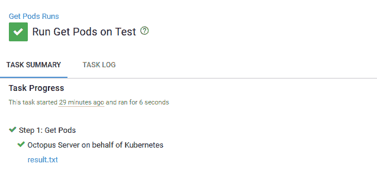

# DevOps、runbooks 和 kubectl - Octopus 部署

> 原文：<https://octopus.com/blog/devops-runbooks-and-kubectl>

可以肯定地说,[开发人员不应该学习 Docker、K8s 或 30 种其他东西来部署一个应用](https://www.theregister.co.uk/2018/02/22/ibm_java_cto_john_duimovich_interview/)是我们许多人都同意的观点。

实话实说吧，Kubernetes 并不容易。但是有办法让支持它不那么痛苦。Octopus 中的 Runbook 功能允许您编写多年来为 Octopus 部署提供动力的相同流程的脚本，以管理整个环境中的日常维护和紧急操作(事件响应)任务，而无需创建部署。

在这篇博文中，我们看一个简单的操作手册，并强调创建可重用操作手册相对于手动脚本和专门调试的优势。

Octopus 2021 Q3 包括对 Kubernetes 部署的更新支持，以及针对 Google Cloud、AWS 和 Azure 用户的 runbooks。在我们的[发布公告](https://octopus.com/blog/octopus-release-2021-q3)中了解更多信息。

## 一个简单的 Kubernetes runbook 示例

在支持 Kubernetes 集群时，列出 Kubernetes pods 以查看其状态是常见的第一步。这听起来很简单，很容易认为这个过程只不过是运行`kubectl get pods`。但是有了操作手册，就有可能丰富这个诊断过程。

下面是一个 **Get Pods** 脚本的示例，您可以将其创建为操作手册的一部分:

```
$arguments = @("get", "pods")

if ($Format -ieq "YAML") {$arguments += @("-o", "yaml")}
if ($Format -ieq "JSON") {$arguments += @("-o", "json")}

$result = & Start-Process `
    -FilePath 'kubectl.exe' `
    -ArgumentList $arguments `
    -NoNewWindow `
    -Wait `
    -RedirectStandardOutput "result.txt"

Get-Content "result.txt"

New-OctopusArtifact "result.txt"

# Add some intelligence to guide the troubleshooter
$notRunning = & kubectl get pods -o json |
    ConvertFrom-JSON |
    Select -ExpandProperty items |
    Where-Object {$_.status.phase -ne "Running"}

if ($notRunning.Count -ne 0) {
    Write-Host "The following pods are not in a Running state. These are worth investigating further."
    $notRunning |
    ForEach-Object {Write-Host "$($_.metadata.name) is not running."}
} 
```

我们通过构建一个要传递给`kubectl`的参数数组来开始这个脚本。基本参数是`get pods`，但是根据名为`Format`的提示变量的值，我们也可以在 JSON 或 YAML 中获得 pod 的详细信息。对`kubectl`调用的响应被保存到一个名为`result.txt`的文件中。

`New-OctopusArtifact` Cmdlet 获取文件并将其保存为 Octopus 工件，在流程完成后，可以从任务摘要中获得该工件。

[](#)

然后，脚本再次调用`kubectl`，这一次寻找不处于运行状态的 pod。输出中会列出找到的任何 pod。

这个脚本并不特别复杂或巧妙，但是它强调了使用 runbooks 的许多好处。

至少，与 Kubernetes 集群交互需要安装`kubectl`命令行工具。根据集群的不同，您可能还需要额外的身份验证可执行文件。

根据我的经验，*支持笔记本电脑*是放在桌子下面的东西，无论是在办公室还是在那个星期被呼叫的人的家里。如果事情做得正确，笔记本电脑很少使用，更新更不频繁。当您考虑用于与 Kubernetes 交互的命令行工具的范围时，这是一个问题，其中一些工具(如`helm`)在版本控制方面可能特别多变。

通过从 runbook 执行`kubectl`和其他 Kubernetes CLI 工具，您不再需要安装本地工具。您所需要的只是一个 web 浏览器，以及配置了所需工具的 Octopus 服务器(或 Workers)。

## 不需要额外权限

如果您遵循最佳安全实践，那么您的 Kubernetes 集群将不会只有一个管理员帐户，而是为集群中的每个功能区域提供有限的服务帐户。这些帐户的密码将经常刷新，以限制任何泄露的凭据的潜在损害。

但是，您如何与您的支持团队分享这些凭证呢？

使用操作手册减轻了最终用户维护基础架构凭据的负担。每个 Kubernetes 目标可以根据需要对集群进行或多或少的访问，Octopus 权限可以限制谁可以在哪个目标上运行哪个 runbook。

## 用商业智能丰富 Kubernetes 脚本

`kubectl`是一个大锤子，如果您有所需的权限，它几乎可以在 Kubernetes 集群上做任何事情。但是它永远不会拥有特定于您的用例的商业智能。

在上面的示例脚本中，我们专门向 Kubernetes 查询了处于非运行状态的 pod。对 Kubernetes 来说，不运行的 pod 只是 pod 可能处于的一种状态，但在您的业务中，这可能是进行故障诊断时首先要寻找的。

这种商业知识往往是在漫长的支持之夜中来之不易的，然后通过个人之间的战争故事来分享。但是有了操作手册，它就可以变成一个标准流程，任何人都可以看到。

## 详细的 Kubernetes 审计跟踪

停机期间的首要任务是让集群重新联机。但是第二天就花在了尝试逆向工程问题的根本原因上。

*   为什么那些特殊的豆荚被重启了？
*   日志文件里有什么？
*   在被删除之前，pod 使用了多少资源？

当运行`kubectl`的本地终端关闭时，这些问题的答案往往会丢失。

使用 runbooks，每个查询的结果都记录在日志文件中，每个操作的历史记录都记录在审计日志中。您还可以确保`kubectl delete pod`是*总是在`kubectl logs`或`kubectl describe pod`之前*，使得被删除的 pod 的状态易于在第二天查看。

## 共同的背景

连续部署的最佳实践包括在整个环境中推动变化。高可用性意味着将您的生产基础架构跨可用性区域或地区分布，跨多个云提供商部署，或者拥有混合的内部和云基础架构。

Octopus 长期以来支持多个云提供商和内部部署，通过目标和环境捕获拓扑结构。Runbooks 利用相同的上下文，允许在现有基础架构上执行任务，而无需重新定义基础架构。

## 结论

在这样一个世界里，你需要学习 30 种不同的东西来部署一个应用程序，Octopus 努力为你提供一个简单的**部署**按钮。

借助 Runbooks，推动 Octopus 部署的经过实战检验的流程现在也可用于 DevOps 支持和维护任务。

愉快的部署！