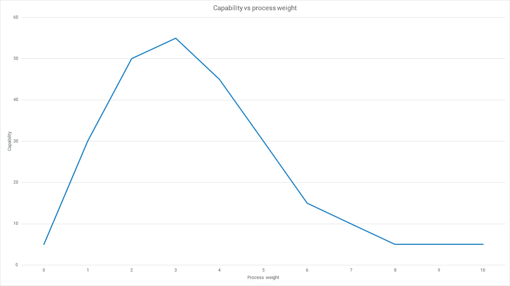

# DevOps 与 SDLC - Octopus 部署

> 原文：<https://octopus.com/blog/devops-versus-sdlc>

如果您使用传统的软件开发生命周期(SDLC ),您可能会对 DevOps 的适用范围有疑问。两者可以共存吗，还是冲突太多？

这篇文章阐述了这两种方法之间的区别。

## 什么是 SDLC？

生命周期的概念出现于 20 世纪 60 年代，它提供了一种构建和操作信息系统的结构化和系统化的方法。早期的系统开发项目包括软件和硬件，如[林肯项目和 SAGE 项目](https://www.ll.mit.edu/about/history/sage-semi-automatic-ground-environment-air-defense-system)，其中包括新的计算机内存技术的引入和软件的开发。

[系统开发生命周期](https://en.wikipedia.org/wiki/Systems_development_life_cycle)将阶段和控制步骤表达为一系列阶段，例如分析、设计和开发。整个生命周期涵盖了从最初构思到系统退役的所有内容。

*软件开发生命周期*最初将系统开发生命周期应用于软件项目。具体的阶段顺序是不同的，但是对于许多[早期软件交付模型](https://octopus.com/devops/history/early-software-delivery-models/)来说，总体概念是相同的。

最近，SDLC 被非正式地用来指代任何软件开发过程。由于我们不能将 DevOps 与每一个可能的过程进行比较(这是其中之一)，我们将坚持 SDLC 的正式定义，将其作为软件交付的传统分阶段方法。

## 为什么要创建 SDLC？

你需要回到过去去理解 SDLC 的动机。自 1950 年以来，我们的[软件交付的历史](https://www.octopus.com/devops/history/)遵循开发过程的演变。我们发现技术在改变需求方面发挥了重要作用。就像科学家受到他们实验可用设备的限制一样，早期开发人员也受到运行成本高、编译时间长、代码编辑工具有限的稀缺机器的限制。

作为早期的程序员，你没有一个带有语法高亮、代码导航或编译器警告的集成开发环境。非编程角色的人也缺乏软件工具来帮助他们的工作或改善角色之间的交流。

关键是，你不能在网上寻找答案。你必须在手册的帮助下自己解决这个问题。

*   1989 年的今天，蒂姆·伯纳斯·李发明了万维网
*   1997 年的今天，谷歌发布了
*   2008 -堆栈溢出到达

在引入 SDLC 之前，系统是使用专门的*代码和修复*方法创建的。由于没有定义过程或控制，并且有许多技术限制，分阶段模型解决了许多组织在创建大型应用程序时*遇到的问题。*

SDLC 解决了两类问题:

1.  将*代码和修复*方法扩展到大规模系统的问题
2.  当时的具体技术限制

最初的分阶段模型是在麻省理工学院的林肯实验室创建的。他们的模型有 9 个阶段，旨在直接解决 20 世纪 50 年代软件团队面临的问题。这让他们能够扩展他们的开发工作，共享关于系统的信息，并记录哪里出错了，这样知识就可以与现有的和未来的贡献者共享。

林肯实验室使用的阶段是:

1.  运营计划
2.  机器和操作规范
3.  程序规格
4.  编码规范
5.  编码
6.  参数测试
7.  组装测试
8.  勒索
9.  系统评价

SDLC 的许多变体是在不同的阶段创建的，随着业务和技术的发展而变化。

## 为什么 SDLC 成为一个问题

SDLC 中出现的问题有两个原因:

1.  组织增加了其 SDLC 阶段的数量和复杂性
2.  SDLC 没有跟上改进工具的步伐

当您解决软件交付问题的主要工具是一组阶段和控制步骤时，您倾向于通过添加更多的阶段和控制步骤来解决大多数问题。随着您的过程规模的增长，它增加了每个软件版本的交易成本。当机器越来越便宜，编译速度越来越快时，重量级过程的成本却在增加。

最初引入 SDLC 是为了解决两个问题:

1.  扩展软件开发以处理大规模系统
2.  当时的具体技术限制

虽然第一个问题依然存在，但 1990 年的技术限制与 1960 年的完全不同。随着技术约束的消失，SDLC 本身成为软件交付的一个限制因素。在将过程视为目标，而不是实现组织成果的方法的组织中，SDLC 是一个更大的问题。

SDLC 告诉我们有*就是*，比如*太多的进程*。

 

能力与过程权重:与代码和修复相比，添加过程改进了软件交付，直到过程本身成为约束因素

批量大小、部署频率和风险之间存在复杂的关系。无论您如何严格地测试系统的功能和质量属性，市场风险仍然存在，直到您将软件版本发布给用户。你只知道一个功能在人们使用它的时候是有用的。

大批量还会导致自动化经济学中的一个常见错误。常识告诉我们，要么将你最常做的任务自动化；或者您计算任务的人工工作量乘以其频率。

这就产生了一个悖论，因为你不经常执行一项任务的原因是它是手动的而且昂贵。自动化确实减少了手工工作，但也让你更频繁地执行任务。任何自动化的经济模型都应该考虑:

*   频率增加
*   更高的质量
*   更少的手动错误
*   延迟成本的降低

除了技术限制的转变，一种新的竞争格局出现了，那些对市场反应迟钝的组织被更小更快的公司抢走了生意。

SDLC 在当时是正确的解决方案。事情发生了如此大的变化，它不再是软件交付的有效方法。

## DevOps 有 SDLC 吗？

传统的 SDLC 不再被视为良好的实践。尽管通过适当的小心来避免它是可能的，但是对于传统的分阶段方法来说，更常见的是导致在专业团队之间传递的大批量。这与 DevOps 方法不兼容，devo PS 方法寻求减少批量的大小并增加不同学科之间的合作。

使用 SDLC，您可以将 20 个人分成 5 个专家团队，分别从事分析、设计、开发、测试和运营等阶段的工作。这些*水平团队*将执行他们的专业任务，工作从一个团队传递到另一个团队，就像接力赛中的接力棒。

在 DevOps 中，你可以将人们分成 4 个跨职能团队，他们可以交付软件而无需交接。你的*垂直团队*可以各自交付和运行一个独立的组件，就像橄榄球比赛中一排球员将球移向得分线。

如果你想了解更多关于团队设计的知识，马修·斯凯尔顿和曼纽尔·派斯创造了 [*团队拓扑*](https://teamtopologies.com/) 来描述不同的交互模式。你可以利用这些在你的组织中设计健康的沟通结构。

在 DevOps 和持续交付中，仍然需要完成一系列任务来交付软件。与结构化的 SDLC 不同，您专注于减少批量、创建自治的垂直团队，以及自动化您的部署管道。您可以设计一个补充 DevOps 文化和能力的过程。

## DevOps 过程

持续交付是 DevOps 过程的核心，但是您仍然需要一种发现和共享构建内容的方法。您的上下文将指导您的选择，但下面显示了一个示例流程:

1.  [影响图](https://www.impactmapping.org/):一种产生与目标相关的想法的协作技术。
2.  [通过实例的规格说明](https://en.wikipedia.org/wiki/Specification_by_example):一种使用实例来交流需求的方法，这可以转化为自动化的验收测试。
3.  [连续交付](https://octopus.com/devops/continuous-delivery/):围绕自动化部署管道构建的软件交付过程。

持续交付不依赖于任何产生想法的特定技术。例如，您可以从影响图切换到精益启动或您的产品管理工具包中的任何其他技术。DevOps 认识到您在持续交付的同时使用了适当的精益和敏捷技术。

## SDLC 的遗产

对于一些组织来说，SDLC 的持久部分是一组重量级的阶段和控制，这些阶段和控制限制了软件交付并产生了高水平的市场风险。这是多年发现的一个不幸的负面结果。

SDLC 的真正遗产应该是我们从最初 40 年的软件交付中学到的东西:

*   你应该小批量工作
*   您应该经常部署
*   从一个小的工作原型开始，然后发展它
*   有可能有太多的过程

有了正确的文化和能力，以及尽可能自动化的部署管道，您应该能够交付频繁的高质量软件版本。

## 结论

当您现在考虑软件开发生命周期时，只需采用您的现代 DevOps 过程并将其扩展到包含原始想法的创建，并考虑当软件不再有足够的价值来维护时，如何使其退役。最重要的部分(你不断增加软件价值和改进其操作的中间部分)是你花费大部分时间和金钱的地方。

考虑到潜在约束和竞争的变化，基于系统开发生命周期的传统形式化方法不再适合软件交付。

## 了解更多信息

如果您想了解更多关于 DevOps 和持续交付的信息，您可能会发现以下内容非常有用:

愉快的部署！