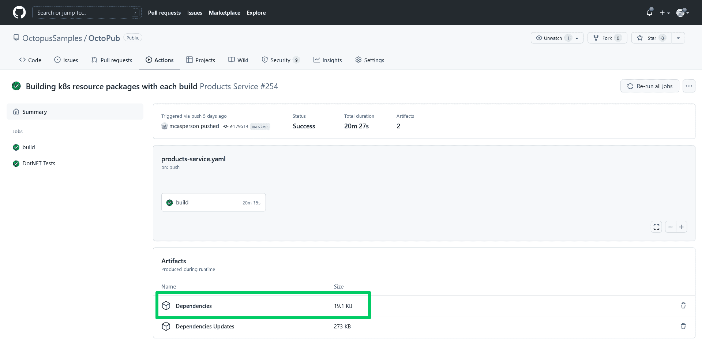
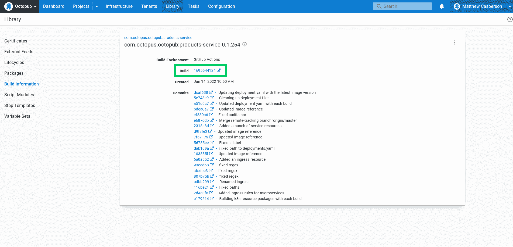
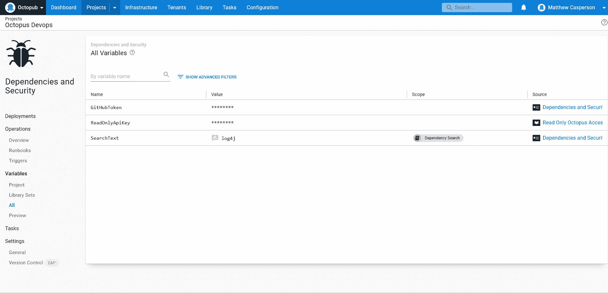

# 实施 DevSecOps 以应对漏洞- Octopus Deploy

> 原文：<https://octopus.com/blog/devsecops-respond-to-vulnerabilities>

Log4j 项目在 2021 年末因一个[关键漏洞](https://cve.mitre.org/cgi-bin/cvename.cgi?name=CVE-2021-45046)成为关注的焦点。它引发了来自全球公司和框架开发者的大量[“我们对 Log4j 的回应”](https://octopus.com/blog/octopus-deploy-log4j-response)公告，甚至更多的客户请求支持服务台和论坛来评估他们的暴露程度。

许多工程团队发现自己处于压力之下，需要识别任何受影响的代码库，提供描述任何暴露的准确报告，更新任何所需的依赖项，并尽快将新代码部署到生产环境中。

任何面临这一挑战的人都知道，这样的回应并不像听起来那么容易。像任何代码依赖一样，知道您的代码是否使用 Log4j 需要对您的应用程序的结构和当前部署的版本有深刻的理解。通常，这需要在表示应用程序部署版本的特定 git 提交处检查您的代码库，并深入研究您的直接依赖项及其子依赖项，以准确找到您的代码使用的库。

Runbooks 与[构建信息](https://octopus.com/docs/packaging-applications/build-servers/build-information)和对 CI/CD 管道的一些简单更改相结合，为查询部署的应用程序中包含的依赖项提供了一种方便的方法。

在这篇文章中，您将学习如何修改 GitHub Actions 工作流来捕获特定构建所使用的依赖项，并查看可以按需查询信息的示例操作手册。

## 先决条件

这篇文章使用 GitHub Actions 作为 CI 服务器。GitHub Actions 对公共 git 库是免费的，所以你只需要一个 GitHub 账户就可以开始了。

示例 runbook 脚本是针对 Python 3 编写的，可以从 [Python 网站](https://www.python.org/downloads/)下载。你可以在 [GitHub](https://github.com/OctopusSamples/DependencyQuery) 上找到示例 runbook 源代码。

## 在构建过程中捕获依赖关系

首先，作为 GitHub Actions 工作流的一部分，捕获构建过程所消耗的依赖项。如今，每种主要语言都提供了列出依赖项的能力，下面的列表显示了这些命令的示例，将输出捕获到一个名为`dependencies.txt`的文件中:

*   腹部—`mvn --batch-mode dependency:tree --no-transfer-progress > dependencies.txt`
*   度—`gradle dependencies --console=plain > dependencies.txt`
*   Npm - `npm list --all > dependencies.txt`
*   PHP - `composer show --all > dependencies.txt`
*   Python - `pip install pipdeptree; pipdeptree > dependencies.txt`
*   去- `go list > dependencies.txt`
*   红宝石- `gem dep > dependencies.txt`
*   点网核心- `dotnet list package > dependencies.txt`

必须向 GitHub Actions 工作流添加两个步骤，以将依赖项捕获为工件。下面的例子演示了如何捕获 Maven 依赖项，但是对于您的特定用例,`List Dependencies`步骤的`run`属性可以替换为上面的任何命令:

```
 - name: List Dependencies
      run: mvn --batch-mode dependency:tree --no-transfer-progress > dependencies.txt
      shell: bash
    - name: Collect Dependencies
      uses: actions/upload-artifact@v2
      with:
        name: Dependencies
        path: dependencies.txt 
```

下面的屏幕截图显示了与构建相关的工件:

[](#)

## 生成构建信息

[构建信息](https://octopus.com/docs/packaging-applications/build-servers/build-information)为 Octopus 部署或 runbook 中引用的包提供额外的元数据。构建信息包是存储在 Octopus 服务器上的单独的工件，具有与它们所代表的包相同的包 ID 和版本。这使得 Octopus 可以跟踪各种包的元数据，无论是存储在内置提要中还是托管在外部存储库中。

构建信息包捕获的一个属性是返回到生成该包的 CI 构建的链接。下面的截图显示了 GitHub 操作运行的链接:

[](#)

[XO-energy/action-octopus-build-information](https://github.com/xo-energy/action-octopus-build-information)动作提供了创建和上传构建信息包的能力。以下步骤显示了一个操作示例:

```
 - name: Generate Octopus Deploy build information
      uses: xo-energy/action-octopus-build-information@v1.1.2
      with:
        octopus_api_key: ${{ inputs.octopus_api_token }}
        octopus_project: Products Service
        octopus_server: ${{ inputs.octopus_server_url }}
        push_version: 0.1.${{ inputs.run_number }}${{ env.BRANCH_NAME != 'master' && format('-{0}', env.BRANCH_NAME) || ''  }}
        push_package_ids: com.octopus.octopub:products-service
        push_overwrite_mode: OverwriteExisting
        output_path: octopus
        octopus_space: "Octopub"
        octopus_environment: "Development" 
```

Octopus 只需要推送构建信息包就可以将元数据链接到发行版。只要构建信息包 ID 和版本与 Octopus 步骤中使用的包相匹配，构建信息就会链接到发布。

下一步是编写一个定制脚本来查询 Octopus API，以提取给定环境中 CI 服务器最新版本的链接。

## 查询构建信息以下载 CI 工件

现在您已经有了跟踪 Octopus 版本中使用的任何包的依赖关系的所有信息。可以手动遍历 Octopus UI 中显示的链接，返回到 GitHub 操作运行，下载依赖项工件，并扫描其中的文本文件。但是这种手动工作流不能随着应用程序数量的增加而扩展。相反，您希望通过执行自定义 Python 脚本的 runbook 来自动化该过程。

第一步是在文件`requirements.txt`中定义脚本的依赖关系。该脚本利用[请求](https://pypi.org/project/requests/)包来简化 HTTP 请求:

```
requests==2.27.1 
```

然后创建一个名为`main.py`的文件来保存脚本。完整的代码如下所示:

```
import os
import sys
from datetime import datetime
from functools import cmp_to_key
from requests.auth import HTTPBasicAuth
import tempfile
from requests import get
import zipfile
import argparse

parser = argparse.ArgumentParser(description='Scan a deployment for a dependency.')
parser.add_argument('--octopusUrl', 
                    dest='octopus_url', 
                    action='store', 
                    help='The Octopus server URL',
                    required=True)
parser.add_argument('--octopusApiKey', 
                    dest='octopus_api_key', 
                    action='store', 
                    help='The Octopus API key',
                    required=True)
parser.add_argument('--githubUser', 
                    dest='github_user', 
                    action='store', 
                    help='The GitHub username',
                    required=True)
parser.add_argument('--githubToken', 
                    dest='github_token', 
                    action='store', 
                    help='The GitHub token/password',
                    required=True)
parser.add_argument('--octopusSpace', 
                    dest='octopus_space', 
                    action='store', 
                    help='The Octopus space',
                    required=True)
parser.add_argument('--octopusProject', 
                    dest='octopus_project', 
                    action='store',
                    help='A comma separated list of Octopus projects', 
                    required=True)
parser.add_argument('--octopusEnvironment', 
                    dest='octopus_environment', 
                    action='store', 
                    help='The Octopus environment',
                    required=True)
parser.add_argument('--searchText', 
                    dest='search_text', 
                    action='store',
                    help='The text to search for in the list of dependencies',
                    required=True)
parser.add_argument('--githubDependencyArtifactName', 
                    default="Dependencies", 
                    dest='github_dependency_artifact',
                    action='store',
                    help='The name of the GitHub Action run artifact that contains the dependencies')

args = parser.parse_args()

headers = {"X-Octopus-ApiKey": args.octopus_api_key}
github_auth = HTTPBasicAuth(args.github_user, args.github_token)

def compare_dates(date1, date2):
    # Python 3.6 doesn't handle the colon in the timezone of a string like "2022-01-04T04:23:02.941+00:00".
    # So we need to manually strip it out.
    date1_parsed = datetime.strptime(date1["Created"][:-3] + date1["Created"][-2:], '%Y-%m-%dT%H:%M:%S.%f%z')
    date2_parsed = datetime.strptime(date2["Created"][:-3] + date2["Created"][-2:], '%Y-%m-%dT%H:%M:%S.%f%z')
    if date1_parsed < date2_parsed:
        return -1
    if date1_parsed == date2_parsed:
        return 0
    return 1

def get_space_id(space_name):
    url = args.octopus_url + "/api/spaces?partialName=" + space_name.strip() + "&take=1000"
    response = get(url, headers=headers)
    spaces_json = response.json()

    filtered_items = [a for a in spaces_json["Items"] if a["Name"] == space_name.strip()]

    if len(filtered_items) == 0:
        sys.stderr.write("The space called " + space_name + " could not be found.\n")
        return None

    first_id = filtered_items[0]["Id"]
    return first_id

def get_resource_id(space_id, resource_type, resource_name):
    if space_id is None:
        return None

    url = args.octopus_url + "/api/" + space_id + "/" + resource_type + "?partialName=" \
        + resource_name.strip() + "&take=1000"
    response = get(url, headers=headers)
    json = response.json()

    filtered_items = [a for a in json["Items"] if a["Name"] == resource_name.strip()]
    if len(filtered_items) == 0:
        sys.stderr.write("The resource called " + resource_name + " could not be found in space " + space_id + ".\n")
        return None

    first_id = filtered_items[0]["Id"]
    return first_id

def get_release_id(space_id, environment_id, project_id):
    if space_id is None or environment_id is None or project_id is None:
        return None

    url = args.octopus_url + "/api/" + space_id + "/deployments?environments=" + environment_id + "&take=1000"
    response = get(url, headers=headers)
    json = response.json()

    filtered_items = [a for a in json["Items"] if a["ProjectId"] == project_id]
    if len(filtered_items) == 0:
        sys.stderr.write("The project id " + project_id + " did not have a deployment in " + space_id + ".\n")
        return None

    sorted_list = sorted(filtered_items, key=cmp_to_key(compare_dates), reverse=True)
    release_id = sorted_list[0]["ReleaseId"]

    return release_id

def get_build_urls(space_id, release_id, project):
    if space_id is None or release_id is None:
        return None

    url = args.octopus_url + "/api/" + space_id + "/releases/" + release_id
    response = get(url, headers=headers)
    json = response.json()

    build_information_with_urls = [a for a in json["BuildInformation"] if "github.com" in a["BuildUrl"]]
    build_urls = list(map(lambda b: b["BuildUrl"], build_information_with_urls))

    if len(build_urls) == 0:
        sys.stderr.write("No build information results contained build URLs to GitHub for project "
                         + project.strip() + ".\n")
        sys.stderr.write("This script assumes GitHub Actions were used to build the packages deployed by Octopus.\n")

    return build_urls

def download_file(url):
    with tempfile.NamedTemporaryFile(delete=False, suffix=".zip") as tmp_file:
        # get request
        response = get(url, auth=github_auth)
        # write to file
        tmp_file.write(response.content)
        return tmp_file.name

def get_artifacts(build_urls, dependency_artifact_name):
    if build_urls is None:
        return None

    files = []

    for url in build_urls:
        # turn https://github.com/OctopusSamples/OctoPub/actions/runs/1660462851 into
        # https://api.github.com/repos/OctopusSamples/OctoPub/actions/runs/1660462851/artifacts
        artifacts_api_url = url.replace("github.com", "api.github.com/repos") + "/artifacts"
        response = get(artifacts_api_url, auth=github_auth)
        artifact_json = response.json()

        filtered_items = [a for a in artifact_json["artifacts"] if a["name"] == dependency_artifact_name]

        if len(filtered_items) == 0:
            print("No artifacts were found in the GitHub Action run called " + dependency_artifact_name)

        for artifact in filtered_items:
            artifact_url = artifact["archive_download_url"]
            files.append(download_file(artifact_url))

    return files

def unzip_files(zip_files):
    if zip_files is None:
        return None

    text_files = []
    for file in zip_files:
        with zipfile.ZipFile(file, 'r') as zip_ref:
            with tempfile.TemporaryDirectory() as tmp_dir:
                zip_ref.extractall(tmp_dir)
                for extracted_file in os.listdir(tmp_dir):
                    filename = os.fsdecode(extracted_file)
                    if filename.endswith(".txt"):
                        with open(os.path.join(tmp_dir, extracted_file)) as f:
                            content = f.read()
                            text_files.append(content)
    return text_files

def search_files(text_files, text, project):
    found = False
    for file in text_files:
        if text in file:
            found = True
            print(text + " found in the following list of dependencies for project " + project.strip())
            print(file)

    return found

def scan_dependencies():
    space_id = get_space_id(args.octopus_space)
    environment_id = get_resource_id(space_id, "environments", args.octopus_environment)
    found = False
    for project in args.octopus_project.split(","):
        project_id = get_resource_id(space_id, "projects", project)
        release_id = get_release_id(space_id, environment_id, project_id)
        urls = get_build_urls(space_id, release_id, project)
        files = get_artifacts(urls, args.github_dependency_artifact)
        text_files = unzip_files(files)
        if search_files(text_files, args.search_text, project):
            found = True

    print("Searching project(s) " + args.octopus_project + " for dependency " + args.search_text)
    if found:
        print("\n\nSearch text " + args.search_text + " was found in the list of dependencies.")
        print("See the logs above for the complete text file listing the application dependencies.")
    else:
        print("\n\nSearch text " + args.search_text + " was not found in any dependencies.")

scan_dependencies() 
```

让我们分解这段代码，了解它在做什么。

您的脚本接受来自命令行参数的参数，使其可以跨多个 Octopus 实例和空间重用。参数由 [argparse 模块](https://docs.python.org/3/library/argparse.html)解析。在 Real Python 的帖子[中了解更多关于使用`argparse`的信息，如何用 argparse 在 Python 中构建命令行接口](https://realpython.com/command-line-interfaces-python-argparse/):

```
parser = argparse.ArgumentParser(description='Scan a deployment for a dependency.')
parser.add_argument('--octopusUrl', 
                    dest='octopus_url', 
                    action='store', 
                    help='The Octopus server URL',
                    required=True)
parser.add_argument('--octopusApiKey', 
                    dest='octopus_api_key', 
                    action='store', 
                    help='The Octopus API key',
                    required=True)
parser.add_argument('--githubUser', 
                    dest='github_user', 
                    action='store', 
                    help='The GitHub username',
                    required=True)
parser.add_argument('--githubToken', 
                    dest='github_token', 
                    action='store', 
                    help='The GitHub token/password',
                    required=True)
parser.add_argument('--octopusSpace', 
                    dest='octopus_space', 
                    action='store', 
                    help='The Octopus space',
                    required=True)
parser.add_argument('--octopusProject', 
                    dest='octopus_project', 
                    action='store',
                    help='A comma separated list of Octopus projects', 
                    required=True)
parser.add_argument('--octopusEnvironment', 
                    dest='octopus_environment', 
                    action='store', 
                    help='The Octopus environment',
                    required=True)
parser.add_argument('--searchText', 
                    dest='search_text', 
                    action='store',
                    help='The text to search for in the list of dependencies',
                    required=True)
parser.add_argument('--githubDependencyArtifactName', 
                    default="Dependencies", 
                    dest='github_dependency_artifact',
                    action='store',
                    help='The name of the GitHub Action run artifact that contains the dependencies')

args = parser.parse_args() 
```

该脚本向 Octopus 和 GitHub APIs 发出许多请求，所有请求都需要认证。

Octopus API 使用`X-Octopus-ApiKey`头来传递用于认证请求的 API 密钥。你可以在 [Octopus 文档](https://octopus.com/docs/octopus-rest-api/how-to-create-an-api-key)中找到更多关于如何创建 API 的信息。

GitHub API 使用标准的 HTTP 基本认证，密码使用个人访问令牌。GitHub 文档提供了创建令牌的细节。

下面的代码捕获包含凭证的对象，这些凭证通过脚本的其余部分随每个 API 请求传递:

```
headers = {"X-Octopus-ApiKey": args.octopus_api_key}
github_auth = HTTPBasicAuth(args.github_user, args.github_token) 
```

这个脚本的一个重要方面是能够找到部署到给定环境的最新版本。这意味着比较由 Octopus API 返回的日期。

Octopus API 返回 ISO 8601 格式的日期，看起来像`2022-01-04T04:23:02.941+00:00`。不幸的是， [Python 3.6 不支持包含冒号](https://bugs.python.org/issue15873)的时区偏移量，这迫使您在解析和比较日期之前将它们去掉。

`compare_dates`函数将两个日期作为字符串，去掉冒号，解析结果，并返回一个值`1`、`0`或`-1`，表示`date1`与`date2`相比如何:

```
def compare_dates(date1, date2):
    # Python 3.6 doesn't handle the colon in the timezone of a string like "2022-01-04T04:23:02.941+00:00".
    # So we need to manually strip it out.
    date1_parsed = datetime.strptime(date1["Created"][:-3] + date1["Created"][-2:], '%Y-%m-%dT%H:%M:%S.%f%z')
    date2_parsed = datetime.strptime(date2["Created"][:-3] + date2["Created"][-2:], '%Y-%m-%dT%H:%M:%S.%f%z')
    if date1_parsed < date2_parsed:
        return -1
    if date1_parsed == date2_parsed:
        return 0
    return 1 
```

这个脚本(以及大多数使用 Octopus API 的脚本)中的一个常见模式是查找命名资源的 ID。`get_space_id`函数获取 Octopus 空间的名称，并查询 API 以返回空间 ID:

```
def get_space_id(space_name): 
```

`/api/spaces`端点返回 Octopus 服务器中定义的空间列表。`partialName`查询参数将结果限制为名称包含所提供值的空格，而`take`参数被设置为一个较大的数字，以确保您不需要循环任何分页的结果:

```
 url = args.octopus_url + "/api/spaces?partialName=" + space_name.strip() + "&take=1000" 
```

对端点发出 GET HTTP 请求，包括 Octopus 身份验证头，JSON 结果被解析到 Python 嵌套字典中:

```
 response = get(url, headers=headers)
    spaces_json = response.json() 
```

返回的结果可以匹配名称为或包含所提供的空间名称的任何空间。这意味着如果我们搜索名为`MySpace`的空间，将返回名为`MySpace`和`MySpaceTwo`的空间。

为了确保用正确的名称返回空间的 ID，一个[列表理解](https://docs.python.org/3/tutorial/datastructures.html#list-comprehensions)将返回的空间过滤为与提供的空间名称完全匹配的空间:

```
 filtered_items = [a for a in spaces_json["Items"] if a["Name"] == space_name.strip()] 
```

如果没有空格与提供的空格名称匹配，该函数将返回`None`:

```
 if len(filtered_items) == 0:
        sys.stderr.write("The space called " + space_name + " could not be found.\n")
        return None 
```

如果有匹配的空格，则返回 ID:

```
 first_id = filtered_items[0]["Id"]
    return first_id 
```

空间是 Octopus 中的顶级资源，而您在该脚本中与之交互的所有其他资源都是空间的子资源。正如您对`get_space_id`函数所做的一样，`get_resource_id`函数将一个已命名的 Octopus 资源转换成它的 id。这里唯一的区别是所请求的端点在路径中包含了空间 ID，并且提供了资源类型来构建路径中的第二个元素。否则`get_resource_id`遵循为`get_space_id`功能描述的相同模式:

```
def get_resource_id(space_id, resource_type, resource_name):
    if space_id is None:
        return None

    url = args.octopus_url + "/api/" + space_id + "/" + resource_type + "?partialName=" \
        + resource_name.strip() + "&take=1000"
    response = get(url, headers=headers)
    json = response.json()

    filtered_items = [a for a in json["Items"] if a["Name"] == resource_name.strip()]
    if len(filtered_items) == 0:
        sys.stderr.write("The resource called " + resource_name + " could not be found in space " + space_id + ".\n")
        return None

    first_id = filtered_items[0]["Id"]
    return first_id 
```

现在，您需要提供一种方法来确定最后一次部署到所选项目的所选环境中的版本。

发布是部署过程、包版本和变量的快照。这是当您单击 Octopus UI 中的 **CREATE RELEASE** 按钮时创建的资源。

然后，部署是对环境发布的执行。

因此，为了找到哪个包版本被部署到指定的环境中(在处理漏洞时，我们通常指的是生产环境)，您必须列出一个环境的部署，将它们过滤到指定项目的部署中，对部署进行排序以确保您找到最新的版本，并返回部署执行的版本的 ID。

`get_release_id`函数实现了这个查询:

```
def get_release_id(space_id, environment_id, project_id):
    if space_id is None or environment_id is None or project_id is None:
        return None 
```

您查询`/deployments`端点以返回部署列表，并传递`environments`查询参数以将结果限制为指定环境的那些部署:

```
 url = args.octopus_url + "/api/" + space_id + "/deployments?environments=" + environment_id + "&take=1000"
    response = get(url, headers=headers)
    json = response.json() 
```

结果列表被过滤为与指定项目相关的项目:

```
 filtered_items = [a for a in json["Items"] if a["ProjectId"] == project_id]
    if len(filtered_items) == 0:
        sys.stderr.write("The project id " + project_id + " did not have a deployment in " + space_id + ".\n")
        return None 
```

对过滤后的列表进行排序，以确保最新部署是第一项:

```
 sorted_list = sorted(filtered_items, key=cmp_to_key(compare_dates), reverse=True) 
```

然后返回最新部署的发布 ID:

```
 release_id = sorted_list[0]["ReleaseId"]

    return release_id 
```

正如您在前面看到的，当构建信息可用于发布中引用的包时，详细信息(如返回到创建该包的 CI 构建的链接)也是可用的。这个链接暴露在 Octopus API 返回的 release 资源中，由`get_build_urls`函数提取:

```
def get_build_urls(space_id, release_id, project):
    if space_id is None or release_id is None:
        return None 
```

您查询 Octopus API 以从指定的发布 ID 返回完整的发布资源:

```
 url = args.octopus_url + "/api/" + space_id + "/releases/" + release_id
    response = get(url, headers=headers)
    json = response.json() 
```

每个版本可以有多个相关的构建信息资源，每个资源都被过滤以找到任何包含`github.com`的构建 URL，这表明该包是使用 GitHub Actions 构建的:

```
 build_information_with_urls = [a for a in json["BuildInformation"] if "github.com" in a["BuildUrl"]] 
```

包含所有构建信息的字典被展平为一个链接数组:

```
 build_urls = list(map(lambda b: b["BuildUrl"], build_information_with_urls)) 
```

如果没有找到返回 GitHub 的链接，则会显示一条警告消息:

```
 if len(build_urls) == 0:
        sys.stderr.write("No build information results contained build URLs to GitHub for project "
                         + project.strip() + ".\n")
        sys.stderr.write("This script assumes GitHub Actions were used to build the packages deployed by Octopus.\n") 
```

然后返回 URL 列表:

```
 return build_urls 
```

GitHub 动作工件是简单的 zip 文件，可以像普通文件一样从任何其他 web 服务器上下载。`download_file`函数创建一个临时文件，并将提供的 URL 的内容写入其中，返回文件名:

```
def download_file(url):
    with tempfile.NamedTemporaryFile(delete=False, suffix=".zip") as tmp_file:
        # get request
        response = get(url, auth=github_auth)
        # write to file
        tmp_file.write(response.content)
        return tmp_file.name 
```

`get_artifacts`函数向 GitHub API 查询与运行相关的工件的链接:

```
def get_artifacts(build_urls, dependency_artifact_name):
    if build_urls is None:
        return None

    files = [] 
```

由构建信息捕获的 GitHub 链接指向公共的、可浏览的网页，显示 GitHub 操作运行的结果。为了以编程方式与运行细节进行交互，您需要与 GitHub API 进行交互。

GitHub 有两个相关的 URL 结构。以`https://github.com/`开头的 URL 公开网页浏览器的 HTML 页面，而以`https://api.github.com/repos/`开头的 URL 公开 GitHub API。除了前缀之外，这两个 URL 结构基本相同。

这意味着我们必须将类似于`https://github.com/OctopusSamples/OctoPub/actions/runs/1660462851`的 URL 转换成`https://api.github.com/repos/OctopusSamples/OctoPub/actions/runs/1660462851`才能访问 GitHub API:

```
 for url in build_urls:
        # turn https://github.com/OctopusSamples/OctoPub/actions/runs/1660462851 into
        # https://api.github.com/repos/OctopusSamples/OctoPub/actions/runs/1660462851/artifacts
        artifacts_api_url = url.replace("github.com", "api.github.com/repos") + "/artifacts"
        response = get(artifacts_api_url, auth=github_auth)
        artifact_json = response.json() 
```

对工件列表进行过滤，以返回与预期工件名称相匹配的工件:

```
 filtered_items = [a for a in artifact_json["artifacts"] if a["name"] == dependency_artifact_name] 
```

如果没有匹配的工件，将显示一个错误:

```
 if len(filtered_items) == 0:
            print("No artifacts were found in the GitHub Action run called " + dependency_artifact_name) 
```

对于每个匹配的工件，提取下载 URL，并返回 URL 列表:

```
 for artifact in filtered_items:
            artifact_url = artifact["archive_download_url"]
            files.append(download_file(artifact_url))

    return files 
```

GitHub 工件应该是包含文本文件的 zip 文件。`unzip_files`函数提取提供的文件，扫描结果文件中的文本文件，读取文本文件，并返回文本:

```
def unzip_files(zip_files):
    if zip_files is None:
        return None

    text_files = []
    for file in zip_files:
        with zipfile.ZipFile(file, 'r') as zip_ref:
            with tempfile.TemporaryDirectory() as tmp_dir:
                zip_ref.extractall(tmp_dir)
                for extracted_file in os.listdir(tmp_dir):
                    filename = os.fsdecode(extracted_file)
                    if filename.endswith(".txt"):
                        with open(os.path.join(tmp_dir, extracted_file)) as f:
                            content = f.read()
                            text_files.append(content)
    return 
```

`search_files`函数从提取的文本文件的内容中打印任何包含指定搜索字符串的依赖列表:

```
def search_files(text_files, text, project):
    found = False
    for file in text_files:
        if text in file:
            found = True
            print(text + " found in the following list of dependencies for project " + project.strip())
            print(file)

    return found 
```

在`scan_dependencies`函数中，上面的所有代码被组合在一起，以扫描所提供文本的依赖关系列表:

```
def scan_dependencies(): 
```

空间名称被转换成一个 ID:

```
 space_id = get_space_id(args.octopus_space) 
```

环境名被转换成一个 ID:

```
 environment_id = get_resource_id(space_id, "environments", args.octopus_environment) 
```

这些项目可以以逗号分隔的列表形式提供，您可以对其进行循环:

```
 found = False
    for project in args.octopus_project.split(","): 
```

项目名称被转换成一个 ID:

```
 project_id = get_resource_id(space_id, "projects", project) 
```

找到与项目到环境的最新部署相关联的版本:

```
 release_id = get_release_id(space_id, environment_id, project_id) 
```

找到了工件下载 URL:

```
 urls = get_build_urls(space_id, release_id, project) 
```

然后下载每个 URL:

```
 files = get_artifacts(urls, args.github_dependency_artifact) 
```

解压缩 zip 文件，并读取其中包含的任何文本文件:

```
 text_files = unzip_files(files) 
```

扫描这些文本文件的内容以查找搜索字符串:

```
 if search_files(text_files, args.search_text, project):
            found = True 
```

然后打印汇总信息:

```
 print("Searching project(s) " + args.octopus_project + " for dependency " + args.search_text)
    if found:
        print("\n\nSearch text " + args.search_text + " was found in the list of dependencies.")
        print("See the logs above for the complete text file listing the application dependencies.")
    else:
        print("\n\nSearch text " + args.search_text + " was not found in any dependencies.") 
```

最后一步是调用`scan_dependencies`函数，这将启动脚本:

```
scan_dependencies() 
```

脚本写好了，是时候在 runbook 中执行它了。

## 在操作手册中运行脚本

第一步是公开将传递给脚本的 3 个变量:

*   `GitHubToken`是一个保存 GitHub 个人访问令牌的秘密，用于认证 GitHub API 调用。
*   `ReadOnlyApiKey`是一个 Octopus API 密钥，分配给一个对 Octopus 服务器具有只读访问权限的帐户(因为这个脚本只查询 API，从不修改任何资源)。
*   `SearchText`是一个提示变量，定义在依赖文本文件中搜索的文本。

[](#)

runbook 由单个**运行脚本**步骤和以下 Bash 脚本组成:

```
cd DependencyQuery

echo "##octopus[stdout-verbose]"
python3 -m venv my_env
. my_env/bin/activate
pip --disable-pip-version-check install -r requirements.txt
echo "##octopus[stdout-default]"

python3 main.py \
    --octopusUrl https://tenpillars.octopus.app \
    --octopusApiKey "#{ReadOnlyApiKey}" \
    --githubUser mcasperson \
    --githubToken "#{GitHubToken}" \
    --octopusSpace "#{Octopus.Space.Name}" \
    --octopusEnvironment "#{Octopus.Environment.Name}" \
    --octopusProject "Products Service, Audits Service, Octopub Frontend" \
    --searchText "#{SearchText}" 
```

这个脚本中发生了一些有趣的事情，所以让我们来分析一下。

您输入 Octopus 解压包含 Python 脚本的包的目录:

```
cd DependencyQuery 
```

打印[服务消息](https://octopus.com/docs/deployments/custom-scripts/logging-messages-in-scripts#service-message) `##octopus[stdout-verbose]`指示 Octopus 将所有后续日志消息视为冗余:

```
echo "##octopus[stdout-verbose]" 
```

创建并激活一个名为`my_env`的新 [Python 虚拟环境](https://realpython.com/python-virtual-environments-a-primer/)，并安装脚本依赖项:

```
python3 -m venv my_env
. my_env/bin/activate
pip --disable-pip-version-check install -r requirements.txt 
```

服务消息`##octopus[stdout-default]`被打印，指示 Octopus 再次以默认级别处理后续日志消息:

```
echo "##octopus[stdout-default]" 
```

然后执行 Python 脚本。有些参数，如`octopusUrl`、`githubUser`、`octopusProject`，需要根据您的具体用例进行定制。将`octopusSpace`和`octopusEnvironment`参数设置为运行 runbook 的空间和环境允许您在运行 runbook 的任何环境中查找依赖关系:

```
python3 main.py \
    --octopusUrl https://tenpillars.octopus.app \
    --octopusApiKey "#{ReadOnlyApiKey}" \
    --githubUser mcasperson \
    --githubToken "#{GitHubToken}" \
    --octopusSpace "#{Octopus.Space.Name}" \
    --octopusEnvironment "#{Octopus.Environment.Name}" \
    --octopusProject "Products Service, Audits Service, Octopub Frontend" \
    --searchText "#{SearchText}" 
```

## 执行操作手册

当 runbook 被执行时，它会扫描每个项目以获取当前环境的最新部署，从构建信息中找到 GitHub Action run 链接，下载依赖项工件，提取工件，并扫描文本文件以获取搜索文本。

只需单击一下 **RUN** 按钮，您就可以快速搜索 Octopus 部署的任何项目，这些项目都有相关的构建信息和所需的构建工件:

[](#)

## 结论

Log4j 让许多工程团队认识到依赖漏洞是生活中的一个事实，及时的响应不仅对限制您暴露于漏洞是至关重要的，而且对减少支持团队回答客户问题的压力也是至关重要的。同样清楚的是，Log4j 不会是最后一个广泛传播的漏洞，您的代码库受到泄漏的影响只是时间问题。

在这篇文章中，您了解了如何将应用程序构建所消耗的依赖项列表保存为 GitHub 操作中的工件，如何使用构建信息将运行链接到它们生成的包，然后使用运行手册执行自定义 Python 脚本，对部署到环境中的包中包含的依赖项执行简单的文本匹配。最终结果是能够在几分钟内知道您的应用程序是否暴露于依赖关系中报告的漏洞，并几乎立即开始响应。

阅读我们的 [Runbooks 系列](https://octopus.com/blog/tag/Runbooks%20Series)的其余部分。

愉快的部署！