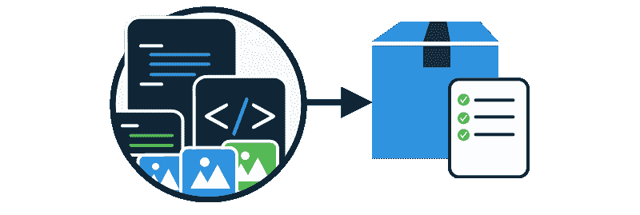
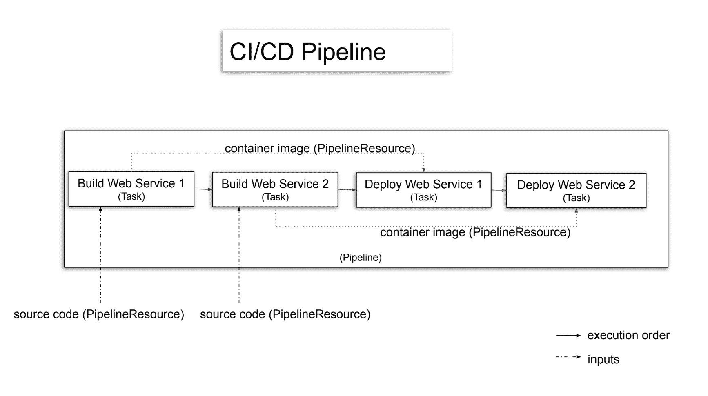
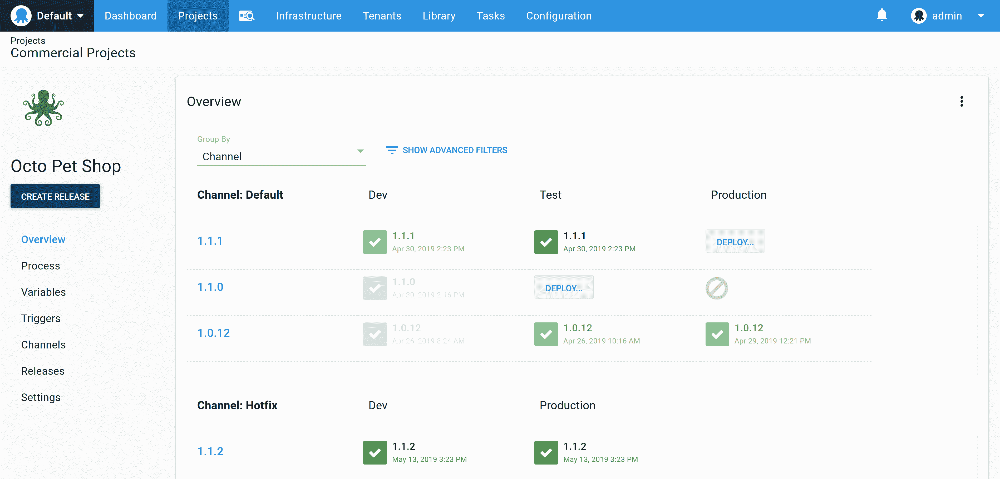

# 持续集成与持续部署——Octopus 部署

> 原文：<https://octopus.com/blog/difference-between-ci-and-cd>

术语*持续集成*和*持续交付/部署*倾向于组合成首字母缩写词 CI/CD 来描述构建和部署软件的过程，通常两者之间没有区别。这些术语描述了不同的过程，即使将它们组合起来意味着持续交付和持续部署是持续集成的扩展，并且两个过程的执行是单个工具的责任。

假设 CI/CD 是*只是 CI 和部署步骤*忽略了两个过程之间的一些基本差异。在本帖中，我们来看看:

*   CI 和 CD 是不同过程的原因
*   好的 CD 工具所提供的特性
*   为什么您会考虑为您的 CI/CD 工作流程使用单独的工具

## 什么是持续集成？

在高层次上，持续集成工具涉及到:

*   将开发人员编写的代码编译成工件
*   运行自动化测试
*   捕获日志文件，以便可以解决任何失败的构建或测试

持续集成服务器通过在每次提交时运行构建和测试来促进这一过程。

持续集成服务器可以描述为求解以下等式:

`code + dependencies + build tools + execution environment = test results + logs + compiled artifact`

等式的左边是开发人员编写的代码、代码的任何依赖项、构建工具以及执行构建和测试的环境。当这些输入可用时，持续集成服务器完成构建以产生等式右侧的元素。

当持续集成服务器被正确配置后，每次提交到存储库都会导致构建运行，从而[无需人工干预](https://octopus.com/devops/continuous-delivery/continuous-delivery-capabilities/#1-continuous-integration-ci)即可求解方程。

这意味着持续集成服务器实现的过程是机器驱动的，以至于持续集成服务器通常具有只读用户界面，如 Jenkins Blue Ocean UI。

持续集成等式的另一个重要方面是开发人员提供输入，而输出是为开发人员或其他技术角色创建的。IT 部门以外的员工很少与持续集成服务器进行交互。

## 什么是持续部署和持续交付？

[持续部署](https://octopus.com/devops/continuous-delivery/what-is-continuous-deployment/)从持续集成服务器执行的成功构建中提取已编译的工件，并将它们部署到生产环境中，从而形成完全自动化的部署工作流。在这个场景中，持续部署是持续集成的扩展，两者之间的区别变得有些随意。

这种提交给消费者的工作流在简单的项目中很常见。如果有适当的测试和监控系统，更复杂的项目也可以有完全自动化的部署工作流。

虽然全自动部署有很多好处，但涉及人工决策的部署并不少见。有许多正当的理由不将对主分支的每个提交自动部署到生产中，包括:

*   协调与遗留系统的部署
*   获得产品负责人的签署
*   不可能自动化的可用性测试
*   监管要求
*   狗食你自己的产品
*   将部署与后端更改(如数据库)相集成
*   对你的测试没有 100%的信心

术语[连续交付](https://octopus.com/devops/continuous-delivery/what-is-continuous-deployment/#addressing-the-confusion-between-continuous-delivery-and-continuous-deployment)用于区分包含人工决策的工作流和完全自动化的连续部署工作流。

对于许多团队来说，持续集成工具是机器驱动的，而持续交付是人驱动的。执行部署的大部分繁重工作仍然是自动化的，但是将发布升级到生产环境是人的决定。重要的是，决策可能不是由技术人员做出的，而是由产品负责人、经理或熬夜点击部署按钮的人做出的。

*典型的 CI/CD 管道，两者没有区别。*

这张幻灯片来自题为[如何在 Kubernetes](https://developers.redhat.com/blog/2019/07/22/how-to-build-cloud-native-ci-cd-pipelines-with-tekton-on-kubernetes/?sc_cid=701f2000000RtqCAAS%5D) 上使用 Tekton 构建云原生 CI/CD 管道的演讲。这是一个简单项目如何将持续集成和持续部署合并到一个过程中的经典例子，在这个过程中，代码一经编译，生产部署就开始了。

这一过程没有任何问题，如果管道的每个部分都保持完全自动化，它就会按预期工作。但是，如果人们需要在应用程序发布之前对其进行测试和批准，会发生什么呢？

为了做出这个决定，必须中断部署过程。例如，我们首先将应用程序部署到一个测试环境中，允许适当的人员验证变更，当每个人都满意时，发布就被提升到生产环境中。

这个单一的决策点意味着我们曾经由机器驱动的等式现在变成了:

*   需要一个 UI 来公开已经发布到测试环境中的版本
*   引入了审计和安全问题，因此我们可以限制并审查谁向哪些环境发布了哪些版本
*   需要一个 UI 来允许部署提升到下一个环境
*   需要一个能够以一流方式模拟环境的系统，以便能够通过 UI、API 和报告界面可靠地保护和管理环境

【T2 

*带人类展开按钮的章鱼仪表盘。*

当 CI/CD 仅仅作为一个部署步骤，在代码编译后自动执行时，这种对人的因素的关注经常会丢失。例如， [Jenkins 文档](https://jenkins.io/doc/pipeline/tour/deployment/#stages-as-deployment-environments)建议将测试和生产环境建模为持续集成管道中的阶段。

乍一看，这个例子似乎提供了流程中的一个点来批准部署，但是对于一个从来没有打算推向生产的构建会发生什么呢？这样的构建会在应用程序向客户公开之前被取消，导致构建失败。这些失败的构建很难与编译失败或测试失败的构建区分开来，即使在这种情况下，不提升到生产是连续交付过程的预期行为。

简而言之，一个好的部署工具，如 Octopus Deploy，可以促进部署中常见的(如果不是必需的)人工决策过程，或者至少可以显示环境之间部署的当前状态，并自动执行部署，因此环境之间的提升是容易和可靠的。

## 结论

认识到机器驱动的持续集成过程和人工驱动的持续交付过程之间的不同需求，对于以快速、可靠和可重复的方式向客户交付特性是至关重要的。这就是为什么使用专用工具进行持续集成和持续交付是有意义的。你可以试试用 GitHub[构建，用 Octopus](https://octopus.com/github) 部署。

如果你以前没用过八达通，你可以[注册免费试用](https://octopus.com/start)。

探索 [DevOps 工程师手册](https://octopus.com/devops/)以了解关于 DevOps 和 CI/CD 的更多信息，或者阅读我们的[持续集成系列](https://octopus.com/blog/tag/CI%20Series)的其余部分。

愉快的部署！