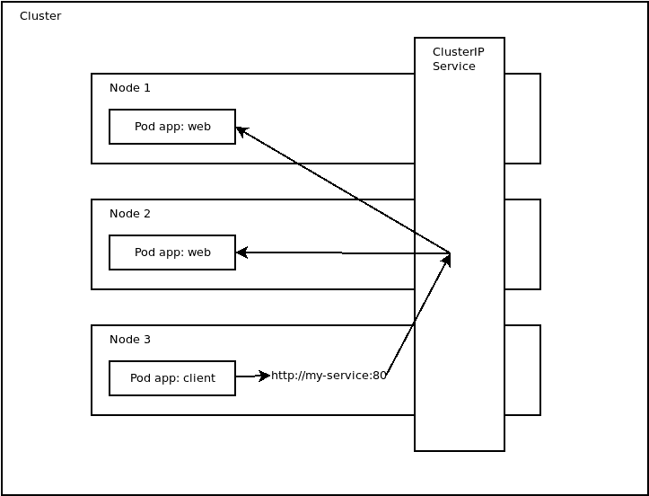
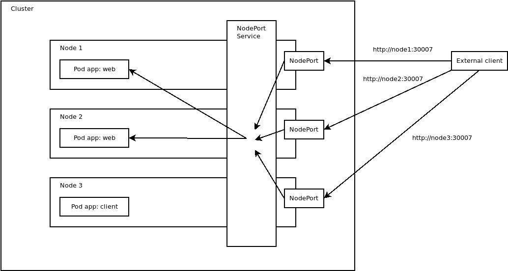
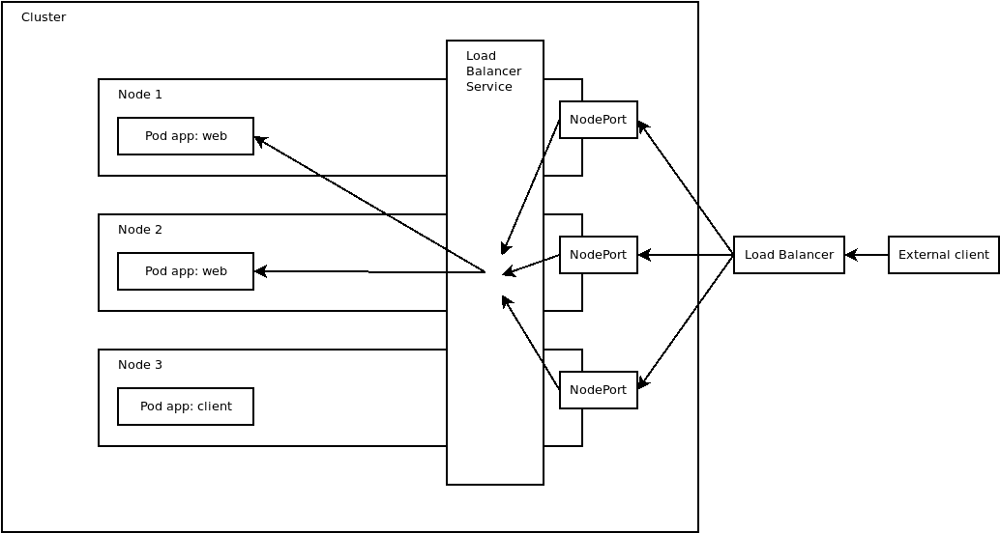

# ClusterIP、NodePort 和负载平衡器 Kubernetes 服务之间的区别——Octopus Deploy

> 原文：<https://octopus.com/blog/difference-clusterip-nodeport-loadbalancer-kubernetes>

Kubernetes 服务提供三种不同类型:

*   `ClusterIP`
*   `NodePort`
*   `LoadBalancer`

知道要配置哪种类型的服务对于允许客户端建立网络连接同时不将服务暴露给不必要的流量是至关重要的。

在这篇文章中，我将讨论这三种类型的服务以及何时应该使用它们。

## ClusterIP 服务类型

下面的 YAML 定义了一个类型为`ClusterIP`的服务，该服务在标签`app`设置为`web`(由`selector`属性定义)的任何 pod 上将端口 80(由`port`属性定义)上的流量定向到端口 8080(由`targetPort`属性定义):

```
apiVersion: v1
kind: Service
metadata:
  name: my-service
spec:
  type: ClusterIP
  selector:
    app: web
  ports:
    - protocol: TCP
      port: 80
      targetPort: 8080 
```

服务将 pod 暴露给内部网络流量。例如，您可以通过一个`ClusterIP`服务向其他 pods 公开一个数据库，因为外部客户机永远不应该直接访问数据库。

`ClusterIP`服务暴露的表面积最小，应该用于只需要暴露给集群中其他 pod 的 pod。

下图显示了同一集群中的 pod 如何通过`ClusterIP`服务进行通信:

[](#)

## 节点端口服务类型

下面的 YAML 定义了一个`NodePort`服务，它将每个节点上端口 30007(由`nodePort`属性定义)上的流量定向到标签`app`设置为`web`的任何 pod 上的端口 8080(由`targetPort`属性定义):

```
apiVersion: v1
kind: Service
metadata:
  name: my-service
spec:
  type: NodePort
  selector:
    app: web
  ports:
    - protocol: TCP
      port: 80
      targetPort: 8080
      nodePort: 30007 
```

`NodePort`服务在内部公开 pod 的方式与`ClusterIP`服务相同。此外，`NodePort`服务允许外部客户通过 Kubernetes 节点上开放的网络端口访问 pod。这些端口通常在 30000-32768 的范围内，尽管该范围是可定制的。

`NodePort`服务对于将 pod 暴露给外部流量非常有用，其中客户端可以通过网络访问 Kubernetes 节点。例如，如果您的节点有主机名`node1`和`node2`，上面的示例服务让客户机访问 http://node1:30007 或 http://node2:30007。外部客户端连接到哪个节点并不重要，因为 Kubernetes 配置网络路由，将所有流量从任何*节点上的端口 30007 定向到适当的 pods。*

在实践中，我还没有看到`NodePort`服务在生产系统中被大量使用。不寻常的端口经常受到限制性防火墙规则的限制，并且很难理解您使用像 http://node1:30007 这样的 URL 与什么服务进行通信。`NodePort`服务非常适合测试，因为它们可能不需要任何额外的基础设施来将 pod 暴露给外部流量，这使得它们成为调试 pod 的快速而简单的方法。

下图显示了外部客户端如何通过由`NodePort`服务公开的节点上的端口与 pods 通信:

[](#)

## 负载平衡器服务类型

下面的 YAML 定义了一个`LoadBalancer`服务，它将流量从公共负载平衡器上的端口 80(由`port`属性定义)和内部服务定向到标签`app`设置为`web`的任何 pod 上的端口 8080(由`targetPort`属性定义):

```
apiVersion: v1
kind: Service
metadata:
  name: my-service
spec:
  type: LoadBalancer
  selector:
    app: web
  ports:
    - protocol: TCP
      port: 80
      targetPort: 8080 
```

`LoadBalancer`服务在内部公开 pod 的方式与`NodePort`服务相同。此外，`LoadBalancer`服务创建外部网络基础设施，将网络请求定向到集群中的 pod。在云平台上，如 Azure、AWS 和 GCP，外部负载平衡器通常由云提供商的现有负载平衡器服务之一提供。例如，AWS 上的一个 [EKS 集群](https://aws.amazon.com/eks/)可能会创建一个[弹性负载均衡器(ELB)](https://aws.amazon.com/elasticloadbalancing/) 来将 pods 暴露给公共网络流量。

当 pod 需要通过可预测的 URL 向外部客户端公开时，或者当需要对外部客户端建立的连接进行额外控制时，服务是最佳选择。通过使用云提供商提供的现有负载平衡器解决方案，`LoadBalancer`服务使管理员能够配置额外的设置，如扩展、防火墙、路由等，以及以 pod 为目的地的外部流量。

`LoadBalancer`服务的缺点是通常会产生额外的费用。例如，如果一个 ELB 实例一天 24 小时运行，每月的成本大约为 16 美元，这还不包括任何与网络流量相关的成本。

下图显示了外部客户端如何通过由`LoadBalancer`服务创建的负载平衡器与 pods 通信:

[](#)

## 结论

不同类型的 Kubernetes 服务提供了多种方式将 pod 暴露给网络流量。选择正确的服务取决于您是否需要在集群内部向能够访问非标准端口的外部客户端，或者向需要专用负载平衡器的规模和灵活性的外部客户端公开 pod。

在这篇文章中，您了解了`ClusterIP`、`NodePort`和`LoadBalancer`服务之间的区别，以及每种服务何时可以使用。

愉快的部署！