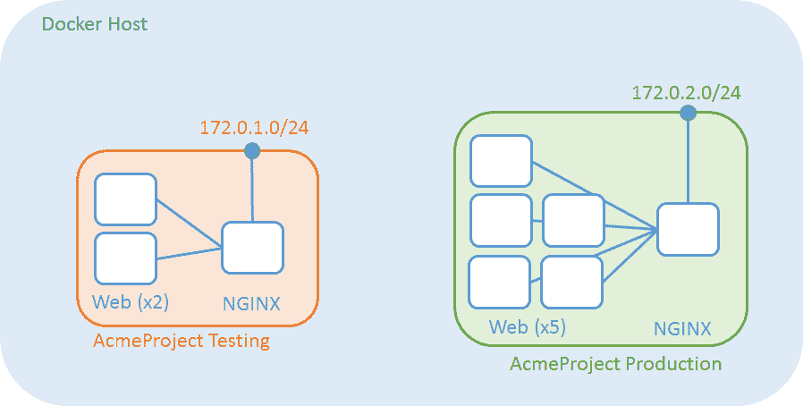
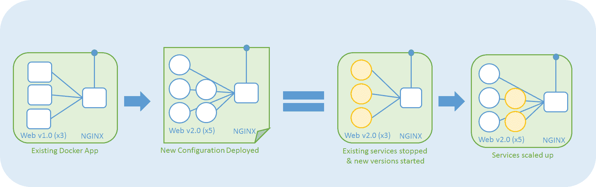
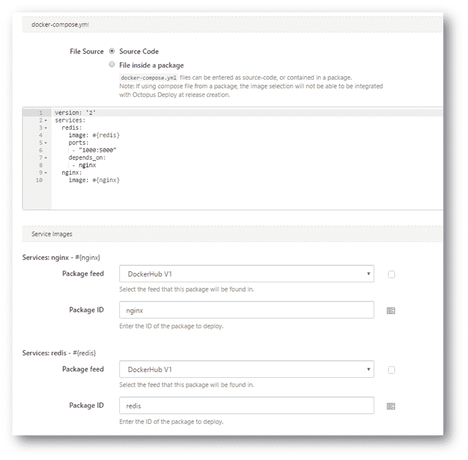

# Docker 编写 RFC - Octopus 部署

> 原文：<https://octopus.com/blog/docker-compose-naming>

在 Octopus Deploy `3.5.1` build 中发布了对 [Docker 引擎步骤](https://octopus.com/blog/docker-engine-in-octopus-deploy)的一些基本支持之后，我们将注意力转向了下一个抽象层次...*码头工人作曲*

> 现在已经开始为 Docker **提供一流的支持，我们仍然希望您对下一步的反馈(双关语)。**

## 命名很难

[Docker Compose](https://docs.docker.com/compose/overview/) 允许你通过一个`docker-compose.yml`配置文件管理多个容器、网络和卷。它使用一个名为的[项目来隔离资源组，以允许在单个主机内管理多个环境，通过这种方式，您可以让几个 Docker 组合应用程序在给定的主机上运行，并在它们自己的网络内隔离。](https://docs.docker.com/compose/reference/envvars/#compose-project-name)

我们正在尝试的一个想法是在部署时根据 Octopus Deploy `project` + `step` + `environment`的组合来命名这些应用。这将允许部署跨 Octopus 环境启动多个 Docker Compose 应用程序，但是确保当部署发生并且我们只想更新现有服务时，只有那些容器得到更新和重新启动(根据对配置文件的更改，如映像版本更新的定义)。例如，下一个版本可能涉及更新用于 web 容器的图像版本，以及增加该应用程序中 web 容器的数量。那么理想情况下，只有相关 Docker Compose 应用程序中的 web 容器会受到该部署的影响。Docker Compose 为我们提供了这样一种能力，即针对一组容器，一次性更新它们，而不是分别执行多个停止/运行步骤，但是要实现这一点，需要一些命名约定。

另一方面，这与 Octopus Deploy 使用的标准包提取略有不同，在这种情况下，部署项目的多个版本可能同时存在于同一个环境中，因为它们只是存储在文件系统的不同位置。如果需要，潜在地向标识符提供用户提供的元素(例如频道名称)将允许类似的行为。

## 配置源

如上所述，Docker 编写步骤的必需元素是描述应用程序的 [docker-compose.yml](https://docs.docker.com/compose/compose-file/) 文件。为了提供与 Octopus 部署包生命周期的集成，我们希望用户通过 Octopus 部署包选择过程将一个或多个映像绑定到 Docker 映像。当一个发布被创建时，在该步骤中绑定到服务的所有包版本将可供用户选择。该配置还能够与标准变量替换一起工作，以允许在部署时解析的特定于环境的配置。*如果支持变量替换，你认为你会需要使用[多个合成文件](https://docs.docker.com/compose/extends/#/multiple-compose-files)？*

*也许从一个版本化的包中提取配置文件会更好*(类似于来自包的[脚本当前的工作方式)？在这种情况下，您可能需要提供在版本创建时选择的映像列表的选项*，而不需要从配置中自动提取服务列表。*](http://docs.octopusdeploy.com/display/OD/Standalone+scripts)

## 部署时构建

通过提供一种从单独的包中获取配置的机制，它可能会额外提供提供`Dockerfiles`的能力，该能力可用于在部署时作为`docker-compose`过程的一部分[构建映像](https://docs.docker.com/compose/compose-file/#/build)。我们有意避免在我们的第一个`3.5.1`版本中提供一个`docker build`步骤，因为这感觉像是一个应该在 CI 渠道的构建阶段进行的过程。单一的不可变构建工件，即映像，应该被创建一次，并在相关的环境中进行。*考虑到 Octopus Deploy 和 Docker 的理念，您认为创建映像在部署过程中有用吗？*

> 微软也落后于 Docker，并宣布在 Visual Studio 2017 中为直接部署到容器的[提供一流的支持](https://blogs.msdn.microsoft.com/webdev/2016/11/16/new-docker-tools-for-visual-studio/)(因此仅比我们和我们的第一个 Docker 集成落后一点点；))*...Docker 可能很快会在您的 CI/CD 渠道中扮演更重要的角色。*

## 征求意见

希望你有机会尝试一下`3.5.1`中提供的新 Docker 步骤，感受一下我们在 Octopus Deploy 中的这些特性。最终，这项工作是为了让您在部署应用程序时更加轻松，所以您的意见最重要。

*   你如何看待 Docker 编写组的命名空间，以便在升级时方便修改？
*   您首选的提供配置文件的机制是什么，内联还是包源？
*   您认为提供映像构建功能有意义吗？
*   我们还完全错过了什么？

如果您对 Docker Compose 的外观有任何其他想法或意见，请在下面添加您的评论或评论并关注开放的 [GitHub ticket #2875](https://github.com/OctopusDeploy/Issues/issues/2875) 。