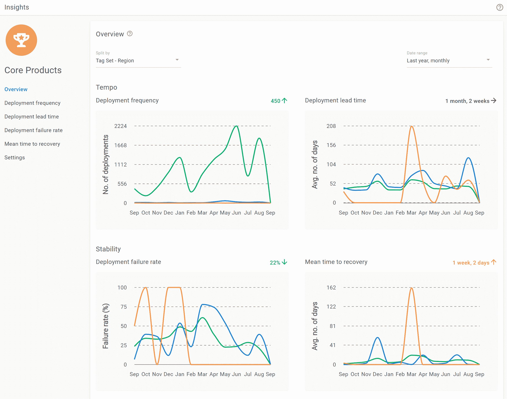

# DORA metrics-devo PS 实践和业务成果之间的预测链接- Octopus Deploy

> 原文：<https://octopus.com/blog/dora-metrics-devops-business-outcomes>

> **成功变革的关键是衡量和理解正确的事情**关注能力，而不是成熟度。"
> 
> *摘自《加速》,作者 Nicole Forsgren、Gene Kim 和 Jez Humble，2018 年。*

2009 年，受约翰·奥斯鲍和保罗·哈蒙兹的演讲《速度》的启发，帕特里克·德博伊斯组织了一次会议。为了向约翰和保罗表示敬意，帕特里克将他的会议称为“德沃普斯日”。这样做，他无意中给了一个广泛而分散的极客联盟一个统一的名字和身份。“DevOps”现在是一个东西…但众所周知，它很难定义。

一个充满激情、多元化的技术人员社区[汇聚到了一起](https://itrevolution.com/the-convergence-of-devops/)。他们就一些宽泛的想法(涵盖各种主题)达成一致，但努力将它们作为一个单一的事物简明地表达出来。很难将[这么多关于文化、自动化、精益 It、指标和共享的想法](https://octopus.com/devops/)整齐地结合到一个简短而集中的电梯演讲中。

更糟糕的是，公众的看法是…复杂的。对一些人来说，这个羽翼未丰的运动显得幼稚而危险。这些 DevOps 嬉皮士积极宣传开发者应该直接投入生产！在早期，没有多少“严肃”企业的高层人士认真对待这些 DevOps 先驱。

像《精益创业》这样的书挑战了既定的 IT 项目管理教条。像“快速移动和打破东西”这样的咒语似乎是故意与重视安全和可靠性的人作对。“NoOps”亚文化似乎呼吁大规模解雇整个功能。Clickbait-y 博文明确声称“[数据库管理员死了](https://thenextweb.com/news/dba-dead)”。

DevOps 本该团结我们。哪里出了问题？

由于 DevOps 很难定义，甚至更难衡量，很难提出令人信服的支持或反对理由。当然，DevOps 的支持者可以对他们最喜欢的 DevOps 案例研究大放厥词:Flickr、Etsy、网飞，等等……但另一方会理所当然地指责他们挑肥拣瘦，并抛出他们自己的例子，如阿波罗计划，或任何其他不能允许失败的软件系统(如航空航天或医疗保健)。

这对我们毫无益处。我们需要清晰。我们需要数据。我们需要一点科学的严谨。

## 德文郡报告

2012 年，在 Puppet，岚娜·布朗认识到了这一需求，并开始编写年度 DevOps 报告。后来她又请来了其他人，包括吉恩·金、妮可·福斯格伦和杰斯·亨布尔。(好一个团队！)

妮可，[博士，有一些严肃的研究证书](https://nicolefv.com/research)，[在 2013 年至 2017 年](https://twitter.com/nicolefv/status/1328040951449677824)领导这项研究。每年，该团队都会调查全球数万名技术人员，涵盖不同的工作岗位和行业领域。他们检查结果，找出结论，并公布数据和他们的发现。

他们提升了关于 DevOps 的讨论。这不再是部落价值信号的问题了。我们有冰冷、坚硬的数据。我们可以谈论事实而不是观点。我们可以谈论全球趋势，而不是个案研究。

最重要的是，我们可以权威地向人们展示金钱。

2018 年，妮可与 Gene 和 Jez(他们现在已经组成了 DORA (DevOps 研究和评估)编写了 [Accelerate](https://octopus.com/blog/devops-reading-list#accelerate) 。在这篇文章中，他们回顾了 2013-17 年报告中的数据，并解释了数据揭示的内容。

他们的结论是惊人的。

## 如何衡量科技领域的表现

Nicole、Gene 和 Jez 想了解为什么有些团队比其他团队表现得更好。为此，他们首先需要一个标准来衡量 IT 团队的“绩效”。这不是一个小壮举。作者讨论了各种传统度量的挑战，例如代码行数、故事点和利用率等。仅仅根据个人或团队投入的工作来定义他们的表现是有问题的。

相反，作者选择关注结果而不是产出。当他们这样做时，他们注意到了 4 个具体指标的独特之处，这些指标涵盖了性能和稳定性的平衡。这些指标被称为“ [DORA 指标](https://octopus.com/devops/metrics/#what-are-dora-metrics)”:

*   部署频率
*   研制周期
*   平均恢复时间(MTTR)
*   变更失败百分比

当团队表现更好时，特别是对照这些指标，他们会看到业务成果中独特的、具有统计意义的、可预测的改进，包括:

*   收益性
*   市场占有率
*   生产力

这种联系不仅仅在“科技公司”(那些以软件产品闻名的公司)中观察到。所有商业领域都是如此。到 2018 年，高性能的技术团队在每项业务中都提供了竞争优势。此外，多拉继续讨论了其他“非营利”组织，在这些组织中，积极的结果不仅仅由银行存款余额来定义。他们再次发现 DORA 指标是成功的可靠预测指标。

现在每个公司都是软件公司。

如果你想让你的股东、高管或关键利益相关者参与你的 DevOps 转型，你需要让他们阅读 [Accelerate](https://octopus.com/blog/devops-reading-list#accelerate) 。

## 为什么 DORA 指标有效？

这里面有一个古老的神话:出于速度、质量和成本的考虑，你必须选择两个。我是来告诉你那是垃圾。

DORA 指标很有趣，因为它们促进了各种正反馈循环，同时强化了关于速度和质量的良好实践。这种结合允许团队更快地交付质量更好的软件。(因此，花费更少。)

### 部署频率

正如查克·罗西在脸书观察到的:“如果我们想要更多的变化，我们需要更多的部署。”

Chuck 面临着加快开发速度的压力。为了实现更多的变化，脸书的部署变得越来越大，越来越复杂。然而，随着部署的增长，它们变得越来越不可靠。当他们失败时，他们失败得很惨。找到问题就像在数据中心里大海捞针。脸书未能通过增加部署规模来实现其生产力目标。

如果目标是发布更多的变更，那么“向外扩展”部署就很重要，而不是“向上扩展”。

通过从根本上提高部署频率，而不是部署规模，脸书取得了更大的成功。他们能够交付更多的变更，同时遭受更少的重大部署失败。当出现问题时，诊断起来更容易，修复起来也更快。

他们了解到生产力是部署*频率*的函数，而不是部署*规模*的函数。

然而，为了从根本上增加部署频率，我们需要从不同的角度考虑交付过程(在组织层面)。如果每次部署都需要两周的测试周期、过度官僚化的审查流程和 48 小时的停机时间，我们就无法一周执行多次部署，更不用说一天 10 次部署了！(就像约翰和保罗在《速度》中介绍的那样。)

如果目标是增加部署频率，我们需要了解交付时间。

### 研制周期

提前期是一个有内涵的术语。Accelerate 的作者以一种特定的方式定义了它。

他们在与选择*建造什么*(他们称之为“模糊前端”)相关的创造力、创新、研究和决策与交付它所需的实际工程工作之间划了一条线。在 Accelerate 中，交付周期被定义为从开发人员开始某项工作到该工作在生产中交付(和验证)之间的时间。

(他们明确地*不*计算一些 bug 修复或特性请求在更高优先级的 JIRA 票的长尾后面等待的时间量。)

由于表现差的团队以月为单位来衡量交付周期，而表现好的团队以小时为单位来衡量交付周期，对于两个阵营中的人来说，想象另一个团队是如何在不破坏东西的情况下交付软件的是令人难以置信的。对于表现不佳的人来说，他们的很多长时间都花在了测试、批准和验证上，所以他们很自然地会认为加快速度需要牺牲质量或安全。

然而，对于大多数以前没有认真考虑过交付时间的组织来说，他们可能会通过寻求理解最长等待、延迟和错误发生在哪里，然后做出改变或自动化步骤来避免/减少它们，来看到大的改进。通过将大批量的变更分解成更小的、可独立交付的批量，他们将会看到另一个巨大的提升。这些不仅交付起来更快更安全，而且在一些更广泛的史诗完成之前，如果需要的话，在不牺牲当前进展的情况下，更容易进行调整。

持续的短交付时间不是匆忙的开发工作或跳过测试阶段的结果。它们是更聪明的团队工作和更好的自动化工作的结果。它们导致代码被及时地审查，错误被更快地捕获，质量提高，部署更安全，以及更好的灵活性。

### 平均恢复时间(MTTR)

欣赏 MTTR 的最佳方式是将其与 MTBF(平均无故障时间)进行对比。

对 MTTR 的关注清楚地表明，我们更关心减少失败的影响，而不是完全避免失败。这并不是说我们不在乎避免失败。我们当然知道。(稍后将详细介绍。)我们只是更关心我们失败后的恢复能力。我们认识到，应该避免显著降低部署频率和交付时间的安全措施，因为它们会产生自身形式的系统风险。(更长的交付时间、更大的批量、更高风险的部署等。)

断然: [Accelerate 已经证明了朵拉指标的重要性](https://octopus.com/blog/change-advisory-boards-dont-work)。(而 MTBF 没有。)

如果我们的故障在几分钟内得到修复，如果它们只影响我们用户的极小一部分，如果所有的数据都可以快速恢复……如果我们时不时地犯一个错误，真的有那么可怕吗？难道我们不应该把更多的精力放在从失败中恢复的能力上，而不是追求抓住每一个错误这个不可能的目标吗？

当我们展示 MTTR(而不是 MTBF)方面的持续改进时，就更容易证明减少官僚主义的合理性。这缩短了交付时间，提高了部署频率，减小了部署规模。这将带来更安全的部署，以及更好的 MTTR。

我们将恶性循环转化为良性循环。

### 更改失败百分比

测试是 DevOps 中经常被遗忘的部分。没有适当测试的持续部署是一种比以前更快地将 bug 部署到产品中的可靠方法。

虽然我们对 MTTR 而不是 MTBF 的关注表明我们接受失败会发生，但这并不意味着我们对失败感到高兴。DevOps 是关于构建质量的，就像它是关于部署小型和经常性的一样。我们希望我们的部署枯燥乏味，而不是扣人心弦。我们希望确信它们会起作用。

但是我们需要用快速检查代替慢速检查。

我们需要投资自动化单元测试、集成测试、模拟部署和冒烟测试。我们需要投资于频繁的、快速的、小型的代码评审，而不是缓慢的、由委员会分批进行的评审。毕竟，一次审查的代码越多，可能出现的问题就越少。

注意:虽然我们试图减少部署失败的可能性，但我们并不试图减少部署失败的总数。这可能会发生，但这不是我们的首要任务。担心失败的总数是在增加还是在减少是一种干扰。

如果这听起来有些鲁莽，请考虑以下哪家公司提供更高质量的产品:

| **A 公司(每季度部署)** | **B 连(每天部署 10 次)** |
| --- | --- |
| 2021 年部署 4 架 | 2021 年部署 3650 人 |
| 50%的故障率 | 1%的故障率 |
| MTTR:两天 | MTTR: 1 小时 |
| 2 次故障 x 48 小时恢复时间= 96 小时停机时间 | 36 次故障 x 1 小时恢复时间= 36 小时停机时间 |

B 公司遭受更频繁的失败。然而，它可能被用户认为是更可靠的服务。公司 A 的停机时间大约增加了 3 倍，我们将在未来几年内记住这些令人沮丧的多日停机。

通过将对 MTTR 的关注(减少失败的影响)与共同努力提高部署的可靠性(由变更失败百分比定义)结合起来，在提高质量的同时从根本上提高部署频率是切实可行的。(即使失败的总数实际上增加了。)

## 如何提高性能

当然，我们应该跟踪和报告我们在 DORA 指标方面的进展。任何使用自动售票系统和发布协调工具(如 Octopus Deploy)的人都可能获得他们需要的大部分数据。

想象一下，每个人都可以访问一个仪表板，报告每个产品或团队的 DORA 指标。团队将会受到激励去模仿表现最好的人的做法。管理层将会看到哪些团队最需要他们的支持。快乐的日子。

> 成功变革的关键是衡量和理解正确的事情**，关注能力——而不是成熟度**。"
> 
> *摘自《加速》,作者 Nicole Forsgren、Gene Kim 和 Jez Humble，2018 年。*

然而，Accelerate 不只是给我们一个记分牌。他们的研究还强调了一组 24 项实践能力，这些能力已被证明可以提高绩效。[列出的 24 项功能](https://itrevolution.com/24-key-capabilities-to-drive-improvement-in-software-delivery/)大体上符合 DevOps 爱好者多年来推广的实践。

老实说，自从 Accelerate 之后,“DevOps”这个词就不那么重要了。这 24 种能力已经成为公认的良好实践的默认约定。已经证明它们是有效的。

列表中的源代码控制、自动化部署和持续集成特性可能不足为奇。事实上，他们是前三名。但这是一个很长的列表，而且不是按优先级排序的。Accelerate 接受了这样一个事实，即开发运维不仅仅是部署管道。

能力列表很长，令人望而生畏。没关系。一个人不可能负责实施所有的变革，任何试图一次进行太多变革的组织都不太可能成功。不要问自己“我要花多长时间才能完成这些？”相反，选择从哪里开始。

根据我的经验，让一个跨职能团队花几个小时在白板上绘制 *[【价值流】](https://cloud.google.com/architecture/devops/devops-process-work-visibility-in-value-stream)* 是很好的第一步。突出那些容易造成最多延迟或失败的领域，可以将注意力集中在首先要解决的最重要的问题上。同样令人欣慰的是，您已经完成了研究，并且能够对修复一些瓶颈将如何影响您的 DORA 指标做出一些估计。

说到这里，Gene Kim 在超越凤凰计划的[中给了我们一个很好的指示。从个人经验来说，他的观察反映了我职业生涯中对数百名客户的观察:](https://www.goodreads.com/en/book/show/38714647-beyond-the-phoenix-project)

> 我发现令人惊奇的是，当一个组织从几个月，甚至几个季度的代码部署交付时间减少到几分钟时，约束以一些相当可预测的方式移动。"
> 
> *吉恩·金，《超越凤凰计划》，2018 年。*

他接着按顺序列出了以下瓶颈:

1.  环境创造
2.  部署
3.  测试
4.  体系结构
5.  新产品创意

假设您的价值流映射练习返回类似的结果，从投资于使这些任务更容易、更快、更可靠的能力开始可能是一个好主意。可能的结果是提高 DORA 指标分数。

我们知道，强大的 DORA metrics 得分预示着商业上的成功。

## 行动的号召

你已经读到这里了。要么我让你相信了 DORA 指标的价值，要么我没有。

**如果你不相信:**

我鼓励你去读[加速](https://www.goodreads.com/en/book/show/35747076-accelerate)。

事实上，只需阅读第 1 部分。目前，这是唯一重要的一点。

回到疫情之前，作为一名顾问，我经常开车。我在结束咨询工作开车回家的路上，用有声读物的形式听完了第 1 部分的全部内容。只花了大约一个小时。(以双倍速度。我现在觉得其他事情都很慢。)Nicole 等人简明扼要地阐述了我一整天都在目睹的问题，但我很难向我的客户解释清楚。

我一到家就订购了一份硬拷贝，准备第二天送达。

如果 Nicole 的研究是正确的(我从未见过任何严肃的学术尝试来挑战她的方法或发现)，我保证 Accelerate 的第 1 部分值得您花一两个小时的时间。

**如果你确信:**

我要求你回答以下问题:

*   您的团队在 DORA 指标上表现如何？
*   在接下来的几年里，您计划如何根据 DORA 指标跟踪您的绩效？
*   你打算做什么改变来推动改进？

## Octopus 中的 DORA 度量

Octopus Deploy 2022.3+包括对内置 DORA 指标的 DevOps Insights 的支持。该内置报告通过呈现 4 个关键的 DORA 指标，让您更好地了解贵公司的开发运维绩效:

*   部署提前期
*   部署失败率
*   部署频率
*   平均恢复时间

这些指标有助于您做出明智的决策，以改进和庆祝您的成果。

**项目洞察**适用于所有 Octopus 项目，包括现有项目。

**空间层次洞察**可用于[企业](https://octopus.com/pricing)客户的[空间](https://octopus.com/docs/administration/spaces)层次，并涵盖该空间中的所有项目。

空间级洞察可通过 **Insights** 选项卡获得，并为跨一组项目、环境或租户的更复杂场景提供可操作的 DORA 指标。这使经理和决策者能够根据他们的业务环境，如团队、组合或平台，更深入地了解他们组织的 DevOps 性能。

空间层面的见解:

*   汇总整个空间的数据，以便您可以比较和对比项目间的指标，从而确定哪些可行，哪些不可行
*   为更好的决策提供信息:发现问题，跟踪改进，庆祝成功
*   根据数据显示的实际情况，帮助您量化 DevOps 性能

这些指标一起帮助您在您的项目和投资组合中鉴定您的 DevOps 性能的结果。

在我们的文档中了解关于 [DevOps Insights 的更多信息。浏览](https://octopus.com/docs/insights) [DevOps 工程师手册](https://octopus.com/devops/)了解更多关于 DevOps 和 CI/CD 的信息。

愉快的部署！