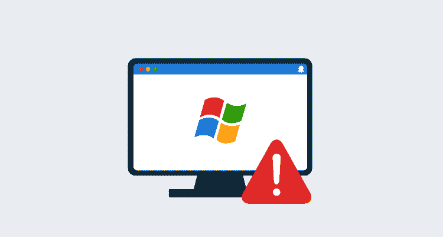

# 不支持的 Windows 和版本。网络-章鱼部署

> 原文：<https://octopus.com/blog/dotnet-and-windows-ciphers>

[](#)

如果你在跑步。在不支持的 Windows 版本上运行. NET 应用程序时，您可能会惊讶地看到类似`Authentication failed`这样的错误，因为您运行的软件或其配置方式似乎没有任何变化。为了理解这些错误，我们需要深入了解 Windows 支持的密码套件，因此也需要了解。NET 应用程序。

在这篇博文中，我诊断了一个在不受支持的 Windows 版本上通过. NET 应用程序进行 HTTPS 连接失败的例子。

## 示例应用程序

我们的示例应用程序使用`HttpClient`类对作为第一个参数传入的 URL 执行 HTTP GET 请求:

```
using System;
using System.Net.Http;
using System.Threading.Tasks;

namespace DotNetHttpClientExample
{
    class Program
    {
        static async Task<int> Main(string[] args)
        {
            using var client = new HttpClient();
            var result = await client.GetAsync(args[0]);
            Console.WriteLine("Result was " + result.StatusCode);
            return (int) result.StatusCode >= 200 && (int) result.StatusCode <= 299 ? 0 : 1;
        }
    }
} 
```

为了演示一个在旧版本 Windows 上失败的网站的例子(在撰写本文时)，我们将把 URL[https://getambassador . io](https://getambassador.io)传递给它。

在我的 Windows 10 机器上，应用程序产生了预期的输出`Result was OK`。但是，在旧版本的 Windows(如 Windows 7)上，结果会出现以下异常:

```
Unhandled exception. System.Net.Http.HttpRequestException: The SSL connection could not be established, see inner exception.
 ---> System.Security.Authentication.AuthenticationException: Authentication failed because the remote party sent a TLS alert: 'HandshakeFailure'.
 ---> System.ComponentModel.Win32Exception (0x80090326): The message received was unexpected or badly formatted.
   --- End of inner exception stack trace ---
   at System.Net.Security.SslStream.ForceAuthenticationAsync[TIOAdapter](TIOAdapter adapter, Boolean receiveFirst, Byte[]reAuthenticationData, Boolean isApm)
   at System.Net.Http.ConnectHelper.EstablishSslConnectionAsyncCore(Boolean async, Stream stream, SslClientAuthenticationOptions sslOptions, CancellationToken cancellationToken)
   --- End of inner exception stack trace ---
   at System.Net.Http.ConnectHelper.EstablishSslConnectionAsyncCore(Boolean async, Stream stream, SslClientAuthenticationOptions sslOptions, CancellationToken cancellationToken)
   at System.Net.Http.HttpConnectionPool.ConnectAsync(HttpRequestMessage request, Boolean async, CancellationToken cancellationToken)
   at System.Net.Http.HttpConnectionPool.CreateHttp11ConnectionAsync(HttpRequestMessage request, Boolean async, CancellationToken cancellationToken)
   at System.Net.Http.HttpConnectionPool.GetHttpConnectionAsync(HttpRequestMessage request, Boolean async, CancellationToken cancellationToken)
   at System.Net.Http.HttpConnectionPool.SendWithRetryAsync(HttpRequestMessage request, Boolean async, Boolean doRequestAuth, CancellationToken cancellationToken)
   at System.Net.Http.RedirectHandler.SendAsync(HttpRequestMessage request, Boolean async, CancellationToken cancellationToken)
   at System.Net.Http.HttpClient.SendAsyncCore(HttpRequestMessage request, HttpCompletionOption completionOption, Boolean async, Boolean emitTelemetryStartStop, CancellationToken cancellationToken)
   at DotNetHttpClientExample.Program.Main(String[] args)
   at DotNetHttpClientExample.Program.<Main>(String[] args) 
```

像`Authentication failed`这样的消息表面上看没有多大意义，因为我们没有在这个网络请求中传递任何凭证。那么，为什么这个示例应用程序只能在一个 Windows 版本上运行，而不能在另一个版本上运行呢？

## 匹配网站和操作系统之间的密码

使用像 [ScanSSL](https://github.com/rbsec/sslscan) 这样的工具，我们可以询问网站，看看它会接受哪些密码。结果显示了一个非常有针对性的密码列表:

```
 Supported Server Cipher(s):
Preferred TLSv1.3  256 bits  TLS_AES_256_GCM_SHA384        Curve 25519 DHE 253
Accepted  TLSv1.3  256 bits  TLS_CHACHA20_POLY1305_SHA256  Curve 25519 DHE 253
Accepted  TLSv1.3  128 bits  TLS_AES_128_GCM_SHA256        Curve 25519 DHE 253
Preferred TLSv1.2  256 bits  ECDHE-RSA-AES256-GCM-SHA384   Curve 25519 DHE 253
Accepted  TLSv1.2  256 bits  ECDHE-RSA-CHACHA20-POLY1305   Curve 25519 DHE 253
Accepted  TLSv1.2  128 bits  ECDHE-RSA-AES128-GCM-SHA256   Curve 25519 DHE 253 
```

这里报告的密码名称基于 OpenSSL。Windows 引用的密码使用 IANA 命名约定。要在两者之间转换，使用[https://testssl.sh/openssl-iana.mapping.html](https://testssl.sh/openssl-iana.mapping.html)处的表格。这为我们提供了以下 IANA 密码名称:

*   TLS_AES_256_GCM_SHA384
*   TLS_CHACHA20_POLY1305_SHA256
*   TLS_AES_128_GCM_SHA256
*   TLS _ ECD he _ RSA _ WITH _ AES _ 256 _ GCM _ sha 384
*   TLS _ ECD he _ RSA _ WITH _ AES _ 128 _ GCM _ sha 256

微软维护着[文档，其中列出了当前和以前版本的 Windows](https://docs.microsoft.com/en-au/windows/win32/secauthn/cipher-suites-in-schannel) 支持的所有密码。浏览列表，不支持的 Windows 版本(如 Server 2012 和 8.1)不会列出网站接受的任何密码。因为。NET 应用程序依赖于底层操作系统公开的密码，我们的示例应用程序无法建立安全的 HTTPS 连接。

## 为什么你的浏览器仍然工作

人们很容易认为，因为 web 浏览器可以成功打开网站，所以所有应用程序都应该可以工作。然而事实并非如此。像 Chrome 和 Firefox 这样的浏览器维护和发布自己的密码。这意味着如果你的浏览器是最新的，它可能会包括建立大多数 HTTPS 连接所需的现代密码。

像 Go 和 Java 这样的平台也有自己的密码，所以用这些语言编写的应用程序在旧版本的 Windows 上运行时可能支持新的密码。

。然而，NET 应用程序依赖于操作系统提供的密码，而将新密码装入操作系统的唯一方法是通过微软的补丁。不受支持的 Windows 版本通常不会收到这些补丁，因此随着时间的推移，越来越多的网站将停止使用这些补丁。NET 应用程序。

## 结论

不建议运行不支持的 Windows 版本，这通常用“这不安全”这样的模糊陈述来解释。虽然这种说法是正确的，但这篇博客文章展示了一个具体的例子，说明不受支持的 Windows 版本不再能够与对 HTTPS 连接实施严格要求的外部服务进行交互。

愉快的部署！