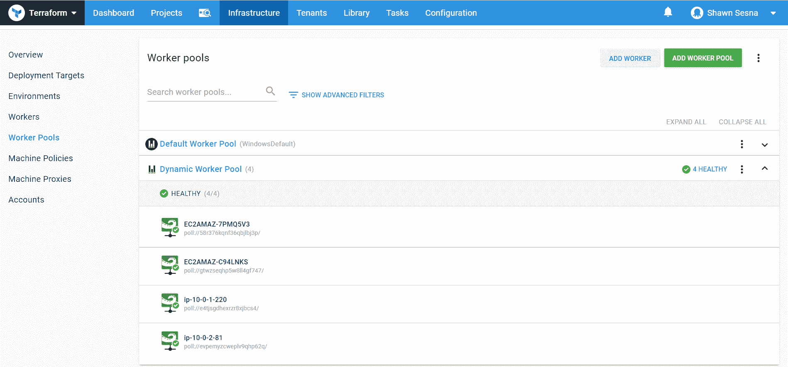

# 用 Terraform 和 AWS 自动伸缩组构建动态工人大军- Octopus Deploy

> 原文：<https://octopus.com/blog/dynamic-worker-army>

[](#)

基础设施即代码(IaC)的出现是一个巨大的飞跃，尤其是在云领域。以编程方式定义基础设施外观的能力带来了环境一致性和更可预测的应用程序行为。

云提供商已经将基础设施作为代码，提供定制的 IaC 实现来供应和配置他们产品上的资源。不幸的是，这意味着您必须学习多种工具来与不同的提供商合作；例如，亚马逊网络服务(AWS) CloudFormation 或微软 Azure 资源管理器(ARM)模板。HashiCorp 创建了 Terraform 来解决这个问题，这是一个与多个提供商合作的单一工具。

在本文中，我将向您展示如何使用 Terraform 和 AWS autoscaling 为 Octopus Deploy 动态创建工人。

Octopus 中的 Workers 使您能够将部署工作转移到池中运行的其他机器上。这可以大大减少在 Octopus 服务器上执行的工作，使其能够更容易地执行更多的部署。工人池可以通过启用可由多个项目和团队使用的专用机器池来提高可伸缩性。这方面的例子包括利用员工进行数据库部署，部署到云基础设施，如 Azure、AWS 和 Kubernetes (K8s)等。

## 什么是 AWS 自动缩放？

AWS 自动缩放是基于指定标准增加或减少资源的能力。自动缩放的一个常见用例是电子商务网站。随着需求的增加，需要创建更多的服务器来处理负载。当负载减少时，可以自动取消供应额外的资源。这使得电子商务保持最少数量的服务器运行，并保持主机成本下降。

在这篇文章中，我们使用 AWS autoscaling 来动态添加更多的工人，以使团队尽可能高效地执行他们的部署。

## 使用 Terraform 调配我们的云基础架构

使用声明性配置文件，Terraform 可以创建新资源，管理现有资源，或者销毁不再需要的资源。

有了 Terraform，我们能够在一个文件中定义我们所有的资源，或者在逻辑上将它们分开。在这篇文章中，我们将把我们的文件分开，以便于使用。

我们将使用八个文件:

*   自动缩放. tf
*   autoscalingpolicy.tf
*   后端. tf
*   installTentacle.sh
*   provider.tf
*   安全组. tf
*   vars.tf
*   vpc.tf

### 自动缩放. tf

该文件包含用于创建 AWS 自动缩放组的资源声明和用于我们的工人的启动配置。我创建了两个启动配置，一个用于 Windows，一个用于 Linux。每个启动配置执行一个脚本，自动安装和配置 Octopus Deploy 触手软件，然后将它作为一个工作器连接到我们的 Octopus Deploy 服务器。为了说明脚本如何连接到启动配置，Linux 启动配置读取一个包含命令的文件(installTentacle.sh ),而 Windows 启动配置内联了脚本。对于 Windows 和 Linux，我们正在配置轮询触角。

```
 resource "aws_launch_configuration" "dynamic-linux-worker-launchconfig" {
    name_prefix = "dynamic-linux-worker-launchconfig"
    image_id = "${var.LINUX_AMIS}"
    instance_type = "t2.micro"

    security_groups = ["${aws_security_group.allow-octopusserver.id}"]

    # script to run when created
user_data = "${file("installTentacle.sh")}"

}

resource "aws_launch_configuration" "dynamic-windows-worker-launchconfig" {
    name_prefix = "dynamic-windows-worker-launchconfig"
    image_id = "${var.WINDOWS_AMIS}"
    instance_type = "t2.micro"

    security_groups = ["${aws_security_group.allow-octopusserver.id}"]

    user_data = <<-EOT
<powershell>
Set-ExecutionPolicy Bypass -Scope Process -Force; [System.Net.ServicePointManager]::SecurityProtocol = [System.Net.ServicePointManager]::SecurityProtocol -bor 3072; iex ((New-Object System.Net.WebClient).DownloadString('https://community.chocolatey.org/install.ps1'))

$OctopusName = (Invoke-RestMethod http://169.254.169.254/latest/meta-data/hostname)

choco install octopusdeploy.tentacle -y

& "C:\Program Files\Octopus Deploy\Tentacle\Tentacle.exe" create-instance --config "c:\octopus\home"

& "C:\Program Files\Octopus Deploy\Tentacle\Tentacle.exe" new-certificate --if-blank

& "C:\Program Files\Octopus Deploy\Tentacle\Tentacle.exe" configure --noListen True --reset-trust --app "c:\octopus\applications"

Write-Host "Running register with..."

& "C:\Program Files\Octopus Deploy\Tentacle\Tentacle.exe" register-worker --server "#{Project.Octopus.Server.Url}" --apiKey "#{Project.Octopus.Server.ApiKey}"  --comms-style "TentacleActive" --server-comms-port "#{Project.Octopus.Server.PollingPort}" --workerPool "#{Project.Octopus.Server.WorkerPool}" --policy "#{Project.Octopus.Server.MachinePolicy}" --space "#{Project.Octopus.Server.Space}" --name $OctopusName

Write-Host "Finished register with..."

& "C:\Program Files\Octopus Deploy\Tentacle\Tentacle.exe" service --install

& "C:\Program Files\Octopus Deploy\Tentacle\Tentacle.exe" service --start

</powershell>

  EOT
}

resource "aws_autoscaling_group" "dynamic-linux-worker-autoscaling" {
    name = "dynamic-linux-worker-autoscaling"
    vpc_zone_identifier = ["${aws_subnet.worker-public-1.id}", "${aws_subnet.worker-public-2.id}", "${aws_subnet.worker-public-3.id}"]
    launch_configuration = "${aws_launch_configuration.dynamic-linux-worker-launchconfig.name}"
    min_size = 2
    max_size = 3
    health_check_grace_period = 300
    health_check_type = "EC2"
    force_delete = true

    tag {
        key = "Name"
        value = "Octopus Deploy Linux Worker"
        propagate_at_launch = true
    }
}

resource "aws_autoscaling_group" "dynamic-windows-worker-autoscaling" {
    name = "dynamic-windows-worker-autoscaling"
    vpc_zone_identifier = ["${aws_subnet.worker-public-1.id}", "${aws_subnet.worker-public-2.id}", "${aws_subnet.worker-public-3.id}"]
    launch_configuration = "${aws_launch_configuration.dynamic-windows-worker-launchconfig.name}"
    min_size = 2
    max_size = 3
    health_check_grace_period = 300
    health_check_type = "EC2"
    force_delete = true

    tag {
        key = "Name"
        value = "Octopus Deploy Windows Worker"
        propagate_at_launch = true
    }
} 
```

### autoscalingpolicy.tf

该文件包含策略和触发器定义，用于扩大和缩小我们的 EC2 实例:

```
# scale up alarm

resource "aws_autoscaling_policy" "linux-worker-cpu-policy" {
  name                   = "linux-worker-cpu-policy"
  autoscaling_group_name = "${aws_autoscaling_group.dynamic-linux-worker-autoscaling.name}"
  adjustment_type        = "ChangeInCapacity"
  scaling_adjustment     = "1"
  cooldown               = "300"
  policy_type            = "SimpleScaling"
}

resource "aws_cloudwatch_metric_alarm" "linux-worker-cpu-alarm" {
  alarm_name          = "linux-worker-cpu-alarm"
  alarm_description   = "linux-worker-cpu-alarm"
  comparison_operator = "GreaterThanOrEqualToThreshold"
  evaluation_periods  = "2"
  metric_name         = "CPUUtilization"
  namespace           = "AWS/EC2"
  period              = "120"
  statistic           = "Average"
  threshold           = "30"

  dimensions = {
    "AutoScalingGroupName" = "${aws_autoscaling_group.dynamic-linux-worker-autoscaling.name}"
  }

  actions_enabled = true
  alarm_actions   = ["${aws_autoscaling_policy.linux-worker-cpu-policy.arn}"]
}

# scale down alarm
resource "aws_autoscaling_policy" "linux-worker-cpu-policy-scaledown" {
  name                   = "linux-worker-cpu-policy-scaledown"
  autoscaling_group_name = "${aws_autoscaling_group.dynamic-linux-worker-autoscaling.name}"
  adjustment_type        = "ChangeInCapacity"
  scaling_adjustment     = "-1"
  cooldown               = "300"
  policy_type            = "SimpleScaling"
}

resource "aws_cloudwatch_metric_alarm" "linux-worker-cpu-alarm-scaledown" {
  alarm_name          = "linux-worker-cpu-alarm-scaledown"
  alarm_description   = "linux-worker-cpu-alarm-scaledown"
  comparison_operator = "LessThanOrEqualToThreshold"
  evaluation_periods  = "2"
  metric_name         = "CPUUtilization"
  namespace           = "AWS/EC2"
  period              = "120"
  statistic           = "Average"
  threshold           = "5"

  dimensions = {
    "AutoScalingGroupName" = "${aws_autoscaling_group.dynamic-linux-worker-autoscaling.name}"
  }

  actions_enabled = true
  alarm_actions   = ["${aws_autoscaling_policy.linux-worker-cpu-policy-scaledown.arn}"]
}

resource "aws_autoscaling_policy" "windows-worker-cpu-policy" {
  name                   = "windows-worker-cpu-policy"
  autoscaling_group_name = "${aws_autoscaling_group.dynamic-windows-worker-autoscaling.name}"
  adjustment_type        = "ChangeInCapacity"
  scaling_adjustment     = "1"
  cooldown               = "300"
  policy_type            = "SimpleScaling"
}

resource "aws_cloudwatch_metric_alarm" "windows-worker-cpu-alarm" {
  alarm_name          = "windows-worker-cpu-alarm"
  alarm_description   = "windows-worker-cpu-alarm"
  comparison_operator = "GreaterThanOrEqualToThreshold"
  evaluation_periods  = "2"
  metric_name         = "CPUUtilization"
  namespace           = "AWS/EC2"
  period              = "120"
  statistic           = "Average"
  threshold           = "30"

  dimensions = {
    "AutoScalingGroupName" = "${aws_autoscaling_group.dynamic-windows-worker-autoscaling.name}"
  }

  actions_enabled = true
  alarm_actions   = ["${aws_autoscaling_policy.windows-worker-cpu-policy.arn}"]
}

# scale down alarm
resource "aws_autoscaling_policy" "windows-worker-cpu-policy-scaledown" {
  name                   = "windows-worker-cpu-policy-scaledown"
  autoscaling_group_name = "${aws_autoscaling_group.dynamic-windows-worker-autoscaling.name}"
  adjustment_type        = "ChangeInCapacity"
  scaling_adjustment     = "-1"
  cooldown               = "300"
  policy_type            = "SimpleScaling"
}

resource "aws_cloudwatch_metric_alarm" "windows-worker-cpu-alarm-scaledown" {
  alarm_name          = "windows-worker-cpu-alarm-scaledown"
  alarm_description   = "windows-worker-cpu-alarm-scaledown"
  comparison_operator = "LessThanOrEqualToThreshold"
  evaluation_periods  = "2"
  metric_name         = "CPUUtilization"
  namespace           = "AWS/EC2"
  period              = "120"
  statistic           = "Average"
  threshold           = "5"

  dimensions = {
    "AutoScalingGroupName" = "${aws_autoscaling_group.dynamic-windows-worker-autoscaling.name}"
  }

  actions_enabled = true
  alarm_actions   = ["${aws_autoscaling_policy.windows-worker-cpu-policy-scaledown.arn}"]
} 
```

### 后端. tf

从本地机器执行 Terraform 时，状态文件存储在本地。Octopus Deploy 不会在执行应用后保留状态文件，因此有必要将我们的状态文件存储在外部存储上。该文件告诉 Terraform 使用 AWS S3 存储桶来存储状态文件:

```
terraform {
    backend "s3" {
        bucket = "#{Project.AWS.S3.Bucket}"
        key = "#{Project.AWS.S3.Key}"
        region = "#{Project.AWS.Region}"
    }
} 
```

### installTentacle.sh

这是 Linux 变体的 autoscaling.tf 启动配置中引用的 bash 脚本文件。其中包含下载、安装和配置 Octopus Deploy 触手软件以及将其连接到 Octopus Deploy 服务器所需的命令:

```
#!/bin/bash
serverUrl="#{Project.Octopus.Server.Url}"
serverCommsPort="#{Project.Octopus.Server.PollingPort}"
apiKey="#{Project.Octopus.Server.ApiKey}"
name=$HOSTNAME
configFilePath="/etc/octopus/default/tentacle-default.config"
applicationPath="/home/Octopus/Applications/"
workerPool="#{Project.Octopus.Server.WorkerPool}"
machinePolicy="#{Project.Octopus.Server.MachinePolicy}"
space="#{Project.Octopus.Server.Space}"

sudo apt-key adv --fetch-keys "https://apt.octopus.com/public.key"
sudo add-apt-repository "deb https://apt.octopus.com/ stretch main"
sudo apt-get update
sudo apt-get install tentacle

sudo /opt/octopus/tentacle/Tentacle create-instance --config "$configFilePath" --instance "$name"
sudo /opt/octopus/tentacle/Tentacle new-certificate --if-blank
sudo /opt/octopus/tentacle/Tentacle configure --noListen True --reset-trust --app "$applicationPath"
echo "Registering the worker $name with server $serverUrl"
sudo /opt/octopus/tentacle/Tentacle register-worker --server "$serverUrl" --apiKey "$apiKey" --name "$name"  --comms-style "TentacleActive" --server-comms-port $serverCommsPort --workerPool "$workerPool" --policy "$machinePolicy" --space "$space"
sudo /opt/octopus/tentacle/Tentacle service --install --start 
```

### provider.tf

provider.tf 通知 Terraform 我们正在使用哪个提供程序。在我们的例子中，这就是 AWS:

```
provider "aws" {
  region     = "${var.AWS_REGION}"
} 
```

### 安全组. tf

在与云提供商打交道时，安全组就是防火墙规则。securitygroup.tf 文件包含 EC2 实例的入口和出口规则。在这种情况下，端口 22 和 3389 出于调试目的而打开，可以省略:

```
resource "aws_security_group" "allow-octopusserver" {
  vpc_id      = "${aws_vpc.worker_vpc.id}"
  name        = "allow-octopusserver"
  description = "Security group that allows traffic to the worker from the Octpus Server"
  egress {
    from_port   = 0
    to_port     = 0
    protocol    = "-1"
    cidr_blocks = ["0.0.0.0/0"]
  }

  ingress {
    from_port = 22
    to_port = 22
    protocol = "tcp"
    cidr_blocks = ["0.0.0.0/0"]
  }

  ingress {
    from_port = 3389
    to_port = 3389
    protocol = "tcp"
    cidr_blocks = ["0.0.0.0/0"]
  }

  tags = {
    Name = "allow-octopusserver"
  }
} 
```

### vars.tfs

该文件包含我们的 Terraform 脚本中使用的不同变量。在这个文件中，我们定义了哪个 Amazon 机器映像(AMI)用于我们的 EC2 实例。AMI 值被硬编码在这个文件中，但是它们可以很容易地用 Octopus Deploy 中的变量替换，比如使用[Octopus tache 语法](https://github.com/OctopusDeploy/Octostache)替换`AWS_REGION`变量。该文件定义了以下变量:

*   `AWS_REGION`:我们正在使用的 AWS 区域。
*   `LINUX_AMIS`:我们的 Linux EC2 实例的 AMI。
*   `WINDOWS_AMIS`:我们的 Windows EC2 实例的 AMI。
*   `PATH_TO_PRIVATE_KEY`:与 AWS 密钥对相关联的私有密钥的路径，用于登录我们的实例(用于调试，不包括在内)。
*   `PATH_TO_PUBLIC_KEY`:与 AWS 密钥对相关联的公共密钥的路径，该密钥对用于登录我们的实例(用于调试，不包括在内)。

```
variable "AWS_REGION" {
  default = "#{Project.AWS.Region}"
}

variable "LINUX_AMIS" {
  default =  "ami-084a6c14d8630bb68"
}

variable "WINDOWS_AMIS"{
  default = "ami-087ee25b86edaf4b1"
}

variable "PATH_TO_PRIVATE_KEY" {
  default = "mykey"
}

variable "PATH_TO_PUBLIC_KEY" {
  default = "mykey.pub"
} 
```

### vpc.tf

该文件包含在 AWS 中创建虚拟私有云(VPC)所需的资源。它包含以下内容的定义:

*   VPC
*   子网
*   互联网网关
*   路由表
*   路由表关联

```
# Internet VPC
resource "aws_vpc" "worker_vpc" {
  cidr_block           = "10.0.0.0/16"
  instance_tenancy     = "default"
  enable_dns_support   = "true"
  enable_dns_hostnames = "true"
  enable_classiclink   = "false"
  tags = {
    Name = "worker_vpc"
  }
}

# Subnets
resource "aws_subnet" "worker-public-1" {
  vpc_id                  = "${aws_vpc.worker_vpc.id}"
  cidr_block              = "10.0.1.0/24"
  map_public_ip_on_launch = "true"
  availability_zone       = "${var.AWS_REGION}a"

  tags = {
    Name = "worker-public-1"
  }
}

resource "aws_subnet" "worker-public-2" {
  vpc_id                  = "${aws_vpc.worker_vpc.id}"
  cidr_block              = "10.0.2.0/24"
  map_public_ip_on_launch = "true"
  availability_zone       = "${var.AWS_REGION}b"

  tags = {
    Name = "worker-public-2"
  }
}

resource "aws_subnet" "worker-public-3" {
  vpc_id                  = "${aws_vpc.worker_vpc.id}"
  cidr_block              = "10.0.3.0/24"
  map_public_ip_on_launch = "true"
  availability_zone       = "${var.AWS_REGION}c"

  tags = {
    Name = "worker-public-3"
  }
}

resource "aws_subnet" "worker-private-1" {
  vpc_id                  = "${aws_vpc.worker_vpc.id}"
  cidr_block              = "10.0.4.0/24"
  map_public_ip_on_launch = "false"
  availability_zone       = "${var.AWS_REGION}a"

  tags = {
    Name = "worker-private-1"
  }
}

resource "aws_subnet" "worker-private-2" {
  vpc_id                  = "${aws_vpc.worker_vpc.id}"
  cidr_block              = "10.0.5.0/24"
  map_public_ip_on_launch = "false"
  availability_zone       = "${var.AWS_REGION}b"

  tags = {
    Name = "worker-private-2"
  }
}

resource "aws_subnet" "worker-private-3" {
  vpc_id                  = "${aws_vpc.worker_vpc.id}"
  cidr_block              = "10.0.6.0/24"
  map_public_ip_on_launch = "false"
  availability_zone       = "${var.AWS_REGION}c"

  tags = {
    Name = "worker-private-3"
  }
}

# Internet GW
resource "aws_internet_gateway" "worker-gw" {
  vpc_id = "${aws_vpc.worker_vpc.id}"

  tags = {
    Name = "worker"
  }
}

# route tables
resource "aws_route_table" "worker-public" {
  vpc_id = "${aws_vpc.worker_vpc.id}"
  route {
    cidr_block = "0.0.0.0/0"
    gateway_id = "${aws_internet_gateway.worker-gw.id}"
  }

  tags = {
    Name = "worker-public-1"
  }
}

# route associations public
resource "aws_route_table_association" "worker-public-1-a" {
  subnet_id      = "${aws_subnet.worker-public-1.id}"
  route_table_id = "${aws_route_table.worker-public.id}"
}

resource "aws_route_table_association" "worker-public-2-a" {
  subnet_id      = "${aws_subnet.worker-public-2.id}"
  route_table_id = "${aws_route_table.worker-public.id}"
}

resource "aws_route_table_association" "worker-public-3-a" {
  subnet_id      = "${aws_subnet.worker-public-3.id}"
  route_table_id = "${aws_route_table.worker-public.id}"
} 
```

现在你知道了！创建 AWS 自动缩放工人大军所需的所有 Terraform 脚本。剩下的工作就是将这些文件打包成. zip 或。使用构建服务器或 Octopus CLI。在创建包并上传到我们的 Octopus 服务器后，我们可以将它包含在我们的部署过程中。

## 章鱼部署

建立 Terraform 文件是整个过程中最难的部分。在 Octopus Deploy 中创建部署的步骤非常短。出于我们的目的，我们只需要两个环境，`Spinup`和`Teardown`。

### 环境

要创建我们的环境，请导航至基础设施➜环境➜添加环境:

[](#)

创建以下内容:

对于本演示，我们使用默认的生命周期。如果其他项目已经存在，可能有必要为此项目创建新的生命周期。

### AWS 帐户

要使用 AWS，我们需要一个拥有创建我们的资源的必要权限的帐户。在 AWS 中创建之后，我们需要将这个帐户添加到 Octopus Deploy 中。为此，我们将点击基础设施➜帐户➜添加帐户:

[](#)

选择 AWS 帐户:

[](#)

填写访问密钥和密钥。请务必点击**保存并测试**以确保您的帐户正常工作:

[](#)

### 工人池

在这篇文章中，我们将把有活力的员工放入他们自己的人才库。为此，我们首先创建池。

导航至基础设施➜工人池➜添加工人池:

[](#)

为工人池命名并点击**保存**:

[](#)

### 项目

随着环境的创建，我们可以创建我们的项目来创建我们的工人。

点击项目➜添加项目:

[](#)

在您给它命名并点击**保存**后，您将被带到您的全新项目。

#### 变量

我们上面创建的 Terraform 脚本有需要在部署时替换的八进制变量。要定义我们的变量，单击**变量**选项卡并创建以下变量(我用名字隔开我的变量，以便更容易识别它们来自哪里):

[](#)

*   `Project.AWS.Account`:我们上面创建的 AWS 账户。
*   `Project.AWS.Region`:我们正在使用的 AWS 中的区域。
*   `Project.AWS.S3.Bucket`:我们将要存储状态文件的桶。
*   `Project.AWS.S3.Key`:存储我们状态的钥匙。
*   `Project.Octopus.Server.ApiKey`:将 worker 连接到 Octopus 服务器时使用的 API 密匙(敏感)。
*   `Project.Octopus.Server.MachinePolicy`:工作者将附加到的机器策略的名称。
*   `Project.Octopus.Server.PollingPort`:Octopus 服务器用于轮询触须的端口。
*   `Project.Octopus.Server.Space`:工作人员将被附加到的空间的名称(默认为空)。
*   `Project.Octopus.Server.Url`:八达通服务器网址。
*   `Project.Octopus.Server.WorkerPool`:工作者将加入的工作者池的名称。

[](#)

#### 步伐

我们的部署过程将包括两个步骤:地形应用步骤和地形破坏步骤。

##### Terraform 应用模板

点击处理➜添加步骤:

[](#)

单击 Terraform 类别，然后选择应用 Terraform 模板:

[](#)

为该步骤命名，并让它在默认池中的工作线程上执行:

[](#)

启用帐户集成，选择 AWS 帐户并指定区域:

[](#)

选择包含 Terraform 文件的包。取消选中默认 Terraform 文件中的替换变量。在目标文件部分，添加两个条目:

[](#)

在条件下，仅在`Spinup`环境中执行该步骤:

【T2 

这就是应用 Terraform 模板的步骤。

##### 地形破坏模板

为了节约成本，当我们知道自己创造的资源不会被使用时，比如在一天工作结束时，我们可以把它们拆掉。在本演示中，我们选择将此作为我们部署的一部分，但是，我们可以轻松地将其实现为预定的[运行手册](https://octopus.com/docs/operations-runbooks/)。

点击**添加步骤**，选择地形类别，然后选择破坏地形资源:

[](#)

除了要在哪个环境中运行之外，为该模板填充与我们为应用 Terraform 模板所做的相同的值。对于销毁步骤，我们只希望它在`Teardown`环境中运行。

仅此而已！我们现在准备创建我们的版本并部署我们的 Terraform 模板。

### 应用模板

点击**创建发布**按钮:

[](#)

点击**保存**:

[](#)

在`SpinUp`环境行上点击**部署启动**或**部署**按钮；

[](#)

最后，点击**部署**:

[](#)

部署完成后，您将在动态工作线程池中看到四个工作线程。

Linux 工作者会比 Windows 工作者更早出现。如果一开始您没有看到四个工作人员，请给 Windows 工作人员多一点时间来完成资源调配。

[](#)

[](#)

## 结论

在这篇文章中，我带您创建了一些 Terraform 配置文件，这些文件将生成 AWS 自动伸缩组，以根据需求动态创建 Octopus Deploy worker 基础架构伸缩。