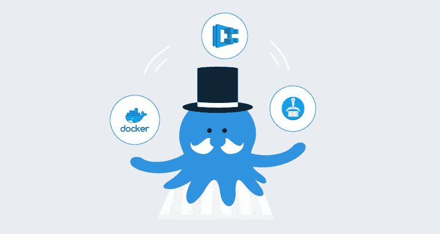
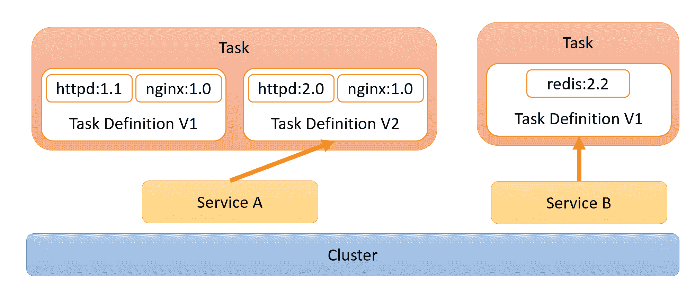
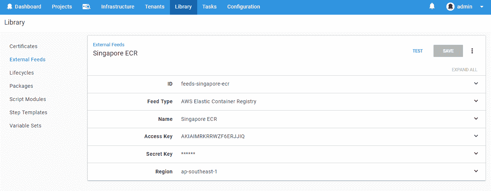
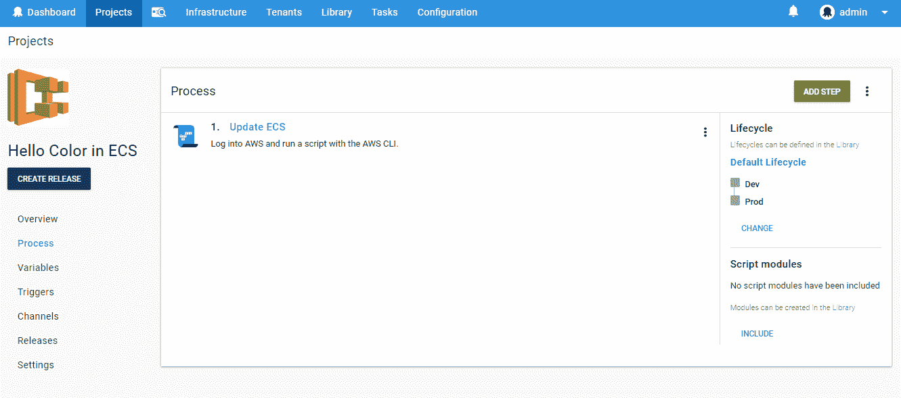
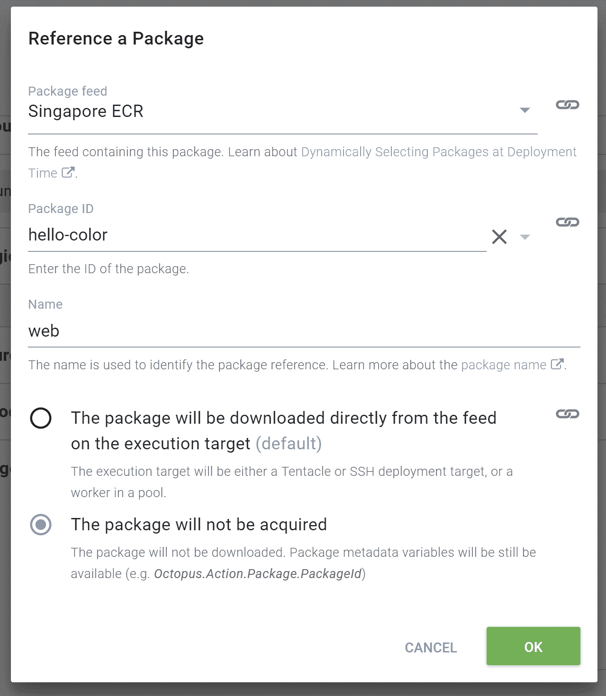
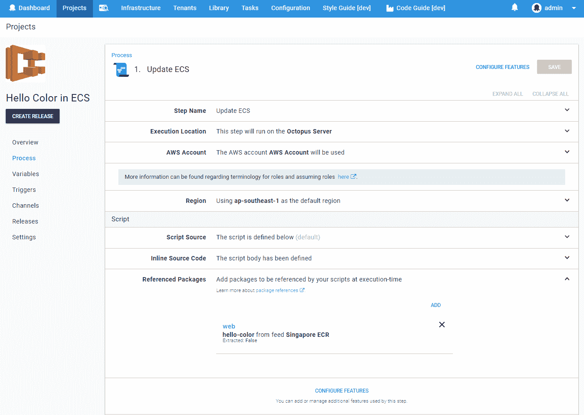
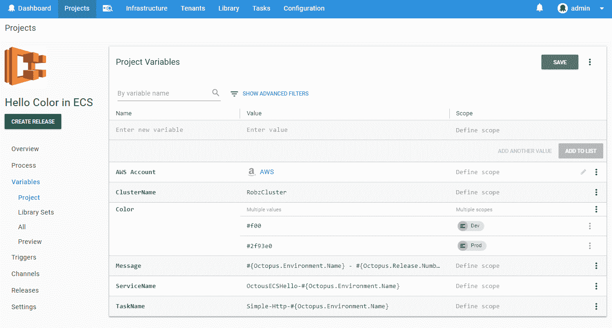
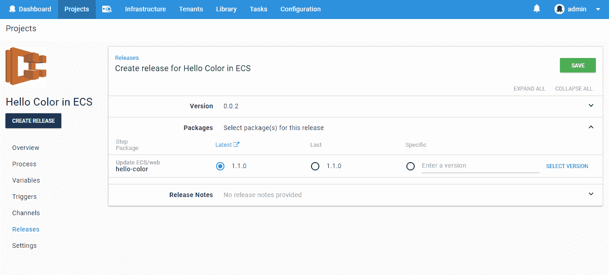
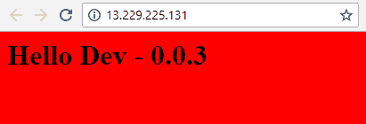
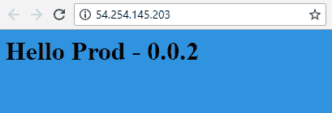

# 使用 ECR - Octopus Deploy 中的容器部署 AWS ECS 任务

> 原文：<https://octopus.com/blog/ecs>

[](#)

Amazon 的弹性容器服务(ECS)提供了一种简化的方式来编排 Docker 容器的运行，这是 Kubernetes 的一种流行替代方案。通过从版本`2018.8.0`开始的 Octopus Deploy 中可用的多包脚本步骤，您现在可以使用 Octopus 的版本控制和变量管理的所有好处来指导 ECS 的部署。这个版本还支持 Amazon 的弹性容器注册中心(ECR)作为一级提要类型。为了演示这可能如何为您工作，下面的帖子通过一个例子从 Dockerfile 到 Deployment。

但首先要了解一些背景。

## 弹性集装箱服务

在 Kubernetes 成为容器编排的领导者之前，AWS 提出了自己的抽象，帮助管理跨多个容器实例的伸缩和负载平衡。ECS 定义了容器部署的配置，这种方式感觉上更接近于他们如何接近 [AWS Lambdas](https://aws.amazon.com/lambda) 类似于 Lambdas，主配置在每次更新时都被版本化，并且[服务](https://docs.aws.amazon.com/AmazonECS/latest/developerguide/ecs_services.html)提供了一种抽象，它(类似于 Lambda 的[别名](https://docs.aws.amazon.com/lambda/latest/dg/versioning-aliases.html))可以指向特定版本。这些服务都位于一个由节点组成的[集群](https://docs.aws.amazon.com/AmazonECS/latest/developerguide/ECS_clusters.html)中，在此之前，这些节点是您必须管理的一堆 EC2 实例。随着 [Fargate](https://aws.amazon.com/fargate/) 的发布，AWS 现在将高兴地完全抽象和管理单个机器。

[](#)

服务在集群中运行，它们的活动任务基于特定版本的任务定义。

## 弹性容器注册

自从 2016 年第一个 Docker 步骤可用以来，在 Octopus Deploy 中使用 Docker 容器注册表的能力已经成为可能。尽管 AWS 在弹性容器注册中心(ECR)下提供了 Docker 容器注册中心，但是有一个小小的障碍使得使用它非常困难。Octopus 集成的标准 V2 Docker 注册 API 采用用户名和密码进行身份验证。尽管 ECR 没有提供静态的凭证集，但是它们通过一个`get-login` API 请求提供了登录细节。然而，问题是这些凭证只在 12 小时内有效。这意味着要在 Octopus Deploy 中使用 ECR 提要，您需要确保至少每 12 小时检索一次凭证并更新提要细节。对于任何构建自动化部署管道的尝试来说，这显然有点扫兴。

在`2018.8.0`版本中，我们提供了一种将 AWS ECR 提要添加为一级提要类型的方法。通过提供适当的 AWS 凭证，Octopus 可以处理这个两步认证过程，这样您就可以使用标准的 IAM 角色。

## 使用 Octopus 的部署

### 为 ECR 建立形象

我们的示例图像是一个基本的 HTML 网站，它构建在`httpd`容器图像之上，并根据我们计划提供的一些环境变量更改其内容:

```
FROM httpd:2.4

ENV OCTO_COLOR="#f00"
ENV OCTO_ENV="DEFAULT"
CMD echo "<html>\
    <head>\
        <title>Octopus Container</title>\
        <style>body {background-color: $OCTO_COLOR;} </style>\
    </head>\
    <body><h1>Hello $OCTO_ENV</h1></body>\
</html>" > /usr/local/apache2/htdocs/index.html && httpd-foreground\ 
```

像任何好的连续部署系统一样，我们希望构建一次并部署多次，所以在构建阶段，构建映像将在 Octopus Deploy 之外进行。我建议阅读一些 AWS 的广泛的[文档](https://docs.aws.amazon.com/AmazonECR/latest/userguide/docker-push-ecr-image.html)来了解将图像推送到 ECR 的细节。

### 将 ECR 馈送添加到 Octopus 部署

准备好部署我们的映像后，我们可以继续将 ECR 添加到 Octopus 作为一级提要类型。

从`Library`部分，添加一个新进给并选择类型`AWS Elastic Container Registry`。然后，您需要提供您的 AWS 凭证和注册中心所在的区域。

[](#)

当我们保存并测试新的提要时，Octopus 应该会找到我们之前配置的注册表。Octopus 正在做的是使用提供的凭证联系 AWS，并获得 Docker 用来与远程存储库交互的标准用户名/密码凭证。然后，它使用检索到的用户名和密码与 AWS 公开的 v2 Docker 注册表进行交互，就像标准的 Docker 提要类型一样。

因为 Octopus 服务器本身需要访问注册表来列出图像和标签(当创建一个发布时作为版本)，所以假定的 IAM 角色目前不支持这个提要类型。虽然这个*将来可能会得到支持，但它也需要 Octopus 服务器本身运行在 AWS 基础设施中才能工作。目前，AWS ECR 提要类型需要标准的 AWS 凭证才能运行。*

### 将映像部署到 AWS ECS

尽管 Octopus 目前没有特定于 ECS 的部署步骤，但我们仍然可以利用多包脚本步骤来更新我们的 ECS 任务和服务。这将允许我们使用 Octopus 来控制整个部署管道中发布的映像版本，以及管理需要提供给运行容器的不同变量。向您的项目添加一个`Run an AWS CLI Script`步骤。

[](#)

输入 ECR 服务所在的 AWS 区域，并选择拥有创建 ECR 任务和更新 ECR 服务所需权限的 AWS 帐户。该帐户可能会因阶段和生产而异，因此最好通过一个适用于不同环境的项目变量来提供该帐户。

跳过`Referenced Packages`部分，添加我们添加到 ECR 提要中的 Docker 图像。对于这个映像，我们不需要进行任何包获取，因为这将由 AWS 自己处理，所以选择`The package will not be acquired`选项。我们还为它取了一个简单的名称，我们将使用它来访问脚本中的这些变量，但是，这个字段可以留空，然后它将默认为 packageId。

[](#)

当在脚本中引用一个[包时，我们可以访问一堆变量，这些变量由我们上面提供的名字索引。](https://octopus.com/docs/deployment-examples/custom-scripts/standalone-scripts#accessing-package-references-from-a-custom-script)

*   `Octopus.Action.Package[web].PackageId`:包 ID。对于 docker 图像，这大致与存储库名称(“hello-color”)相关。
*   `Octopus.Action.Package[web].PackageVersion`:发布中包含的软件包版本。在 docker 图像的情况下，这与图像标签相关。
*   提要 ID("提要-新加坡-ECR ").

还提供了一个 docker 特定变量`Octopus.Action.Package[web].Image`,它解析为完全限定的图像名。在这个包的例子中，它可能看起来有点像`918801671493.dkr.ecr.ap-southeast-1.amazonaws.com/hello-color:1.0.1`。我们需要在下面的脚本中使用这个`Image`变量。

我们可以将脚本分成 3 个基本部分:

#### 1.定义容器

```
$PortMappings = New-Object "System.Collections.Generic.List[Amazon.ECS.Model.PortMapping]"
$PortMappings.Add($(New-Object -TypeName "Amazon.ECS.Model.PortMapping" -Property @{ HostPort=80; ContainerPort=80; Protocol=[Amazon.ECS.TransportProtocol]::Tcp}))

$EnvironmentVariables = New-Object "System.Collections.Generic.List[Amazon.ECS.Model.KeyValuePair]"
$EnvironmentVariables.Add($(New-Object -TypeName "Amazon.ECS.Model.KeyValuePair" -Property @{ Name="OCTO_COLOR"; Value=$OctopusParameters["Color"]}))
$EnvironmentVariables.Add($(New-Object -TypeName "Amazon.ECS.Model.KeyValuePair" -Property @{ Name="OCTO_MSG"; Value=$OctopusParameters["Message"]}))

Write-Host "Adding Container Definition for" $OctopusParameters["Octopus.Action.Package[web].Image"]
$ContainerDefinitions = New-Object "System.Collections.Generic.List[Amazon.ECS.Model.ContainerDefinition]"
$ContainerDefinitions.Add($(New-Object -TypeName "Amazon.ECS.Model.ContainerDefinition" -Property @{ `
    Name="web"; `
    Image=$OctopusParameters["Octopus.Action.Package[web].Image"]; `
    PortMappings=$PortMappings; `
    Environment=$EnvironmentVariables
    Memory=256;})) 
```

我们必须在该任务的容器定义中显式设置环境变量。虽然在集群上直接运行任务时可以覆盖环境变量，但是当通过服务运行时，目前没有这样的选项，动态配置由用户根据[环境元数据](https://aws.amazon.com/about-aws/whats-new/2017/11/amazon-ecs-allows-containers-to-directly-access-environmental-metadata/)来决定。有一个公开的 ECS [GitHub 问题](https://github.com/aws/amazon-ecs-agent/issues/3)要求更好的支持，然而，这个问题已经存在了将近四年，所以可能不会很快得到解决。因此，我建议为每个环境保留一个单独的任务，并根据部署使用项目变量来改变更新的任务。

注意，在提供图像细节时，我们使用了上面描述的`Octopus.Action.Package[web].Image`变量。该值将从发布期间选择的映像版本中获得。

#### 2.使用容器定义创建任务

```
$Region = $OctopusParameters["Octopus.Action.Amazon.RegionName"]
$TaskName = $OctopusParameters["TaskName"]
$ExecutionRole = $(Get-IAMRole -RoleName "ecsTaskExecutionROle").Arn

Write-Host "Creating New Task Definition $TaskName"
$TaskDefinition = Register-ECSTaskDefinition `
    -ContainerDefinition $ContainerDefinitions `
    -Cpu 256 `
    -Family $TaskName `
    -TaskRoleArn $ExecutionRole `
    -ExecutionRoleArn $ExecutionRole `
    -Memory 512 `
    -NetworkMode awsvpc `
    -Region $Region `
    -RequiresCompatibility "FARGATE" 
```

虽然您可以加载一个以前构建的任务配置作为模板，并且只更新映像，但是这种方法确保 Octopus 部署过程成为预期运行的事实的来源。此外，这意味着该脚本可以在还没有设置*之前的脚本的地方运行，例如，当您想要为新的测试环境配置新的端点时。*

通过从环境变量中加载任务名称，我们可以根据环境(和租户，如果相关的话)改变任务，这允许我们为不同的部署上下文拥有多个任务定义。

#### 3.升级服务以使用新任务

```
$ClusterName = $OctopusParameters["ClusterName"]
$ServiceName = $OctopusParameters["ServiceName"]

Write-Host "Updating Service $ServiceName"
$ServiceUpdate = Update-ECSService `
    -Cluster $ClusterName `
    -ForceNewDeployment $true `
    -Service $ServiceName `
    -TaskDefinition $TaskDefinition.TaskDefinitionArn `
    -DesiredCount 2 `
    -DeploymentConfiguration_MaximumPercent 200 `
    -DeploymentConfiguration_MinimumHealthyPercent 100 
```

为了让我们可以为每个环境运行多个服务，服务的名称是通过一个项目变量提供的，该项目变量使用随环境变化的命名约定(详见本文末尾的项目变量截屏)。

本文中描述的另一种方法可能是不使用服务，直接在集群中运行任务。这实际上只对特定的任务有用，而对可伸缩的应用程序没有用，因为使用服务可以更容易地设置更高级的配置，比如包括一个负载平衡器，以便在多个任务之间分配流量，或者设置自动伸缩规则。

#### 把所有的放在一起

如果我们将所有这些脚本放在一起，并添加一些日志功能，它应该看起来像下面这样:

```
# Define Container
$PortMappings = New-Object "System.Collections.Generic.List[Amazon.ECS.Model.PortMapping]"
$PortMappings.Add($(New-Object -TypeName "Amazon.ECS.Model.PortMapping" -Property @{ HostPort=80; ContainerPort=80; Protocol=[Amazon.ECS.TransportProtocol]::Tcp}))

$EnvironmentVariables = New-Object "System.Collections.Generic.List[Amazon.ECS.Model.KeyValuePair]"
$EnvironmentVariables.Add($(New-Object -TypeName "Amazon.ECS.Model.KeyValuePair" -Property @{ Name="OCTO_COLOR"; Value=$OctopusParameters["Color"]}))
$EnvironmentVariables.Add($(New-Object -TypeName "Amazon.ECS.Model.KeyValuePair" -Property @{ Name="OCTO_MSG"; Value=$OctopusParameters["Message"]}))

Write-Host "Adding Container Definition for" $OctopusParameters["Octopus.Action.Package[web].Image"]
$ContainerDefinitions = New-Object "System.Collections.Generic.List[Amazon.ECS.Model.ContainerDefinition]"
$ContainerDefinitions.Add($(New-Object -TypeName "Amazon.ECS.Model.ContainerDefinition" -Property @{ `
    Name="web"; `
    Image=$OctopusParameters["Octopus.Action.Package[web].Image"]; `
    PortMappings=$PortMappings; `
    Environment=$EnvironmentVariables
    Memory=256;}))

# Create Task
$Region = $OctopusParameters["Octopus.Action.Amazon.RegionName"]
$TaskName = $OctopusParameters["TaskName"]
$ExecutionRole = $(Get-IAMRole -RoleName  "ecsTaskExecutionROle").Arn
Write-Host "Creating New Task Definition $TaskName"
$TaskDefinition = Register-ECSTaskDefinition `
    -ContainerDefinition $ContainerDefinitions `
    -Cpu 256 `
    -Family $TaskName `
    -TaskRoleArn $ExecutionRole `
    -ExecutionRoleArn $ExecutionRole `
    -Memory 512 `
    -NetworkMode awsvpc `
    -Region $Region `
    -RequiresCompatibility "FARGATE"

if(!$?) {
    Write-Error "Failed to register new task definition"
    Exit 0
}
Write-Host "Created Task Definition $($TaskDefinition.TaskDefinitionArn)"
Write-Verbose $($TaskDefinition | ConvertTo-Json)

# Update Service
$ClusterName = $OctopusParameters["ClusterName"]
$ServiceName = $OctopusParameters["ServiceName"]
Write-Host "Updating Service $ServiceName"
$ServiceUpdate = Update-ECSService `
    -Cluster $ClusterName `
    -ForceNewDeployment $true `
    -Service $ServiceName `
    -TaskDefinition $TaskDefinition.TaskDefinitionArn `
    -DesiredCount 2 `
    -DeploymentConfiguration_MaximumPercent 200 `
    -DeploymentConfiguration_MinimumHealthyPercent 100
if(!$?) {
    Write-Error "Failed to register new task definition"
    Exit 0
}
Write-Host "Updated Service $($ServiceUpdate.ServiceArn)"
Write-Verbose $($ServiceUpdate | ConvertTo-Json) 
```

[](#)

然后，我们添加以下变量，这些变量为 ECS 基础设施本身和我们希望推入容器的细节提供配置。

[](#)

### 部署

创建发布时，系统会提示您提供想要部署的映像版本。Octopus 直接从容器注册中心获得这些信息，因此您可以准确地看到哪些图像已经部署，哪些图像尚未发布。版本号实际上是通过解析图像标签获得的，因此尽管您可以提供任何标签作为“版本”，但是只有可以被解析为 [semver 2](https://semver.org/) 的标签才是可见的。

[](#)

开始部署时，您会注意到，虽然我们使用的是一个包(映像)，但没有发生任何获取。这是因为 Octopus 只是提供描述包的值*供我们的脚本使用。当部署执行时，ECS 服务将运行新任务，并根据`DesiredCount`、`DeploymentConfiguration_MaximumPercent`和`DeploymentConfiguration_MinimumHealthyPercent`配置，确保在任何给定时间点都有正确数量的任务处于活动状态。这导致滚动更新风格的部署。*

让我们看一下我们的开发和生产部署:

[](#)

[](#)

Huzzzah！颜色和信息，当我考虑这个应用程序的流量时，我很高兴我们有这样的负载平衡！

### 留给读者的活动

这个部署脚本可能比您在现实世界中想要的要简单得多。您可能需要配置卷装载、CPU 限制、自定义缩放规则或 AWS APIs 公开的任意数量的各种配置选项。该脚本主要关注“Fargate”产品，该产品抽象了集群中服务器的管理，但是，如果您使用 ECS 的“EC2”配置，同样的原理只需稍加修改即可。

## Octopus 部署 ECS 的未来计划

虽然 Kubernetes 最近在容器领域引起了业界的注意，但 ECS 仍然是一个受欢迎的选择，我们预计可能会有更多一流的 ECS 步骤出现。根据“Octopus 是真理之源”的理念，我希望 ECS 的任何特定步骤最终都能够反映目前通过 AWS 门户可获得的许多配置选项，但是，与 Octopus 变量和包选择的集成更加紧密。

Octopus 的每个版本都提供了与各种云提供商更丰富、更有用的集成，AWS 也不例外。如果你现在正在使用 ECS，希望这篇文章能给你一些关于如何使用 Octopus Deploy 进行部署的想法，利用 Octopus 擅长的所有东西。让我们知道您使用 Octopus 到 ECS 的成功(或失败)部署！