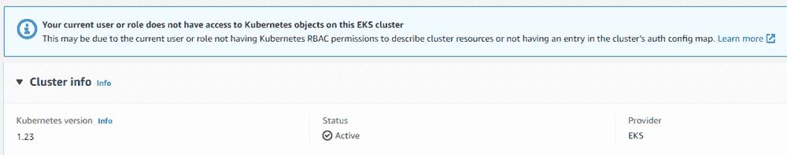
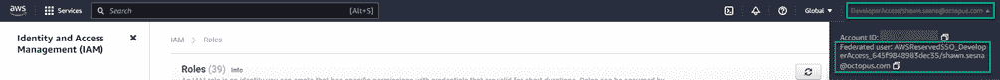
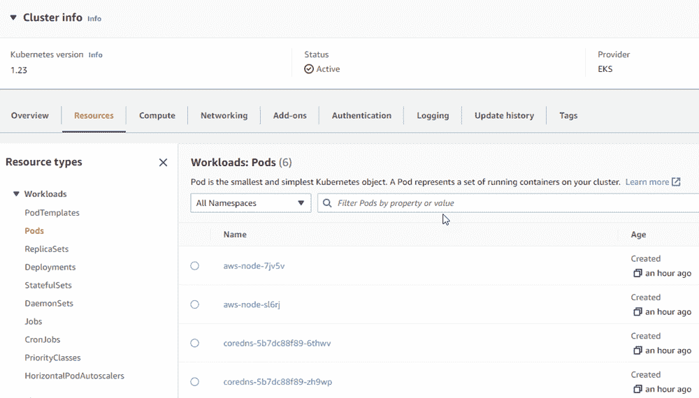
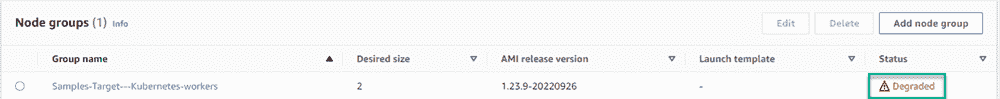
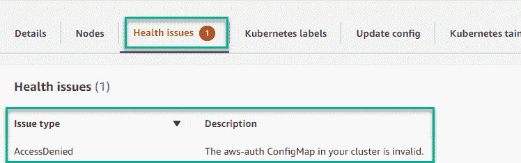

# 将联合用户帐户授予 EKS 集群- Octopus 部署

> 原文：<https://octopus.com/blog/eks-federated-users>

如果你在 AWS 上使用过弹性 Kubernetes 服务(EKS ),你很可能经历过权限的挫败感。如果您不是 EKS 集群的创建者，那么您在 AWS 控制台中看到的唯一信息就是集群的整体状态。

有许多关于添加额外用户帐户的教程；然而，并没有一个明确的演示向您展示如何添加一个联合用户帐户。

在本文中，我将带您了解如何向 EKS 集群授予一个联合用户帐户。

## 你会学到什么

在与 EKS 合作完成我们的[样本](https://samples.octopus.app)实例后，我决定写这篇文章。我需要查看由项目创建的集群上的部署资源的详细信息。该项目使用一个[操作手册](https://octopus.com/docs/runbooks)来创建使用 AWS 账户的 EKS 集群。尽管对我们的 AWS 帐户有完全访问权限，但我看不到集群的详细信息。更复杂的是，我使用一个联邦用户帐户登录 AWS 控制台。在研究这个话题的时候，我找到了一些教程，但是没有一个涵盖了整个过程。

在本演练中，您将学习如何:

*   使用不同的帐户创建 EKS 群集
*   查找联合帐户的信息
*   将联合帐户添加到集群中

### 创建 EKS 集群

向 EKS 集群授予联合用户帐户时，如果您不是 EKS 集群的创建者，就会出现问题。不同的用户需要首先创建集群。

在我的例子中，我创建了一个拥有足够权限来创建 EKS 集群的用户帐户。我在 Octopus 中添加了 [AWS 帐户](https://octopus.com/docs/infrastructure/accounts/aws),并使用操作手册中的以下步骤创建了一个集群:

*   **创建 EKS 集群**
*   **添加集群作为部署目标**

我使用的是 Octopus Deploy runbook，但是**创建 EKS 集群**部分并不是 Octopus 特有的，因为它使用 AWS CLI 来创建集群。

#### 创建 EKS 集群

该步骤使用 Octopus Deploy 中的**运行 AWS CLI 脚本**步骤来创建 EKS 集群。

CLI 需要以下变量来创建集群:

*   群集 Name
*   地区
*   阿恩的角色
*   前节点角色阿恩
*   子网 id(我使用 2)
*   安全组 ID

这篇文章假设你对 AWS 有足够的了解，知道这些值应该是什么。以下脚本使用 CLI 首先创建 EKS 集群，然后创建节点组。在这些活动完成之后，它将集群的 URL 端点存储在一个[输出变量](https://octopus.com/docs/projects/variables/output-variables)中，供后续步骤使用。

```
# Get variables
$clusterName = $OctopusParameters['AWS.Kubernetes.Cluster.Name']
$region = $OctopusParameters['AWS.Region.Name']
$eksRoleArn = $OctopusParameters['AWS.EKS.Role.Arn']
$nodeRoleArn = $OctopusParameters['AWS.Node.Role.Arn']
$subnet1Id = $OctopusParameters['AWS.Network.Subnet1.Id']
$subnet2Id = $OctopusParameters['AWS.Network.Subnet2.Id']
$securityGroupId = $OctopusParameters['AWS.Network.SecurityGroup.Id']

# Create EKS cluster
$eksCluster = aws eks create-cluster --name $clusterName --role-arn $eksRoleArn --resources-vpc-config subnetIds=$subnet1Id,$subnet2Id,securityGroupIds=$securityGroupId
$eksCluster = $eksCluster | ConvertFrom-JSON

Write-Host "Waiting for cluster to be done creating..."
while ($eksCluster.Cluster.Status -eq "CREATING")
{
    # Wait for cluster to be done creating
    $eksCluster = aws eks describe-cluster --name $clusterName
    $eksCluster = $eksCluster | ConvertFrom-JSON
}

Write-Host "Status of cluster: $($eksCluster.Cluster.Status)" 

Write-Host "Creating node group..."
aws eks create-nodegroup --cluster-name $clusterName --nodegroup-name "$clusterName-workers" --subnets $subnet1Id $subnet2Id --instance-types "t3.medium" --node-role $nodeRoleArn --remote-access ec2SshKey="<Your EC2 keypair>"

Set-OctopusVariable -name "EKSURL" -value $eksCluster.Cluster.Endpoint 
```

#### 将集群添加为部署目标

该步骤将新创建的集群作为目标添加到 Octopus Deploy 中。如果您不使用 Octopus，可以转到下一节，[查找联邦帐户的信息](#info-federated)。

此步骤在**运行脚本**步骤中使用[New-octopuskubernetarget](https://octopus.com/docs/infrastructure/deployment-targets/dynamic-infrastructure/kubernetes-target)cmdlet 将新创建的 EKS 集群添加到 Octopus Deploy。`$eksUrl`变量从上一步的输出变量中检索它的值。

```
# Get the variables
$clusterName = $OctopusParameters['AWS.Kubernetes.Cluster.Name']
$region = $OctopusParameters['AWS.Region.Name']
$eksUrl = $OctopusParameters['Octopus.Action[Create EKS Cluster].Output.EKSURL']

# Add new Kubernetes cluster target
New-OctopusKubernetesTarget -Name "Samples-#{Octopus.Space.Name | Replace " "}-EKS" -clusterName $clusterName -octopusRoles "PetClinic,EKS" -octopusAccountIdOrName "#{AWS.Account.Name}" -namespace "default" -skipTlsVerification $true -clusterUrl $eksUrl 
```

### 查找联合帐户的信息

在 AWS 控制台中导航到集群，您会看到以下消息:

`Your current user or role does not have access to Kubernetes objects on this EKS cluster. This may be due to the current user or role not having Kubernetes RBAC permissions to describe cluster resources or not having an entry in the cluster’s auth config map.`

[](#)

您可以看到群集处于活动和健康状态，但仅此而已。

解决方案是将您的用户帐户添加到`aws-auth`配置图中。然而，对于联合帐户，这个过程是不同的，因为它们不会出现在 AWS 控制台的 **IAM 用户**部分。

联合用户被映射到一个 **AWS 角色**，因此您需要确定您的帐户被映射到哪个角色。幸运的是，这可以通过点击 AWS 控制台右上角的您的帐户轻松完成。这将显示您的联合帐户映射到的角色。

在这种情况下，您可以看到我的帐户被映射到`AWSReservedSSO_DeveloperAccess_645f9848983dec35`角色。

[](#)

### 将联合帐户添加到集群中

在添加联邦用户之前，您必须首先获得`aws-auth`配置映射的当前值。这可以使用`kubectl`命令`kubectl get configmap/aws-auth -n kube-system`来完成。

为了更容易地处理他的文件，我将命令输出到 JSON，并将其写入文件。这让我可以将 JSON 反序列化为 PowerShell 对象。

```
# Get current aws-auth configmap
kubectl get configmap/aws-auth -n kube-system -o json | Set-Content aws-auth.json

# Load the JSON as an object
$jsonPayload = (Get-Content aws-auth.json | Out-String | ConvertFrom-Json) 
```

加载到`$jsonPayload`变量后，您可以通过导航到变量的`.data.mapRoles`属性来访问相关数据。

默认情况下，`mapRoles`的值应该如下所示:

尽管对象被从 JSON 反序列化为 PowerShell 对象，`mapRoles`部分仍然是 YAML。

```
- groups: 
  - system:bootstrappers 
  - system:nodes 
  rolearn: arn:aws:iam::<AWS account ID>:role/<Role used to create cluster>
  username: system:node:{{EC2PrivateDNSName}} 
```

要添加您的联合用户，请附加以下内容:

```
- rolearn: arn:aws:iam:<AWS account ID>:role/<role name>
  username: "{{SessionName}}"
  groups:
    - system:masters 
```

整个部分应该如下所示:

```
- rolearn: arn:aws:iam:<AWS account ID>:role/AWSReservedSSO_DeveloperAccess_645f9848983dec35
  username: "{{SessionName}}"
  groups:
    - system:masters
- groups: 
  - system:bootstrappers 
  - system:nodes 
  rolearn: arn:aws:iam::<AWS account ID>:role/<Role used to create cluster>
  username: system:node:{{EC2PrivateDNSName}} 
```

最后一步是用修改后的版本替换现有的`aws-auth`配置图。使用 kubectl CLI 的`replace`命令来完成此操作。因为我是在 Octopus Deploy runbook 中这样做的，所以我使用了下面的 PowerShell 来进行修改:

```
# Get current aws-auth configmap
kubectl get configmap/aws-auth -n kube-system -o json | Set-Content aws-auth.json

# Load the JSON as an object
$jsonPayload = (Get-Content aws-auth.json | Out-String | ConvertFrom-Json)

# Create federated users rolearn piece
$federatedUsers = 
@"
`n
- rolearn: arn:aws:iam::<AWS Account ID>:role/AWSReservedSSO_DeveloperAccess_645f9848983dec35
  username: "{{SessionName}}"
  groups:
    - system:masters
- groups:
    - system:bootstrappers 
    - system:nodes
  username: system:node:{{EC2PrivateDNSName}} 
  rolearn: arn:aws:iam::<Your AWS Account ID>:role/<Role used to create cluster>
"@

# Add federated users to maproles
$jsonPayload.data.mapRoles = $federatedUsers

# Write the new information to file
Set-Content aws-auth.json -Value ($jsonPayload | ConvertTo-Json -depth 10)

# Replace the config map
kubectl replace -n kube-system -f aws-auth.json 
```

添加了联合用户帐户后，您现在可以看到集群的详细信息:

[](#)

## 解决纷争

应用更新后，您可能会注意到`Node group`处于降级状态:

[](#)

如果您注意到这一点，请检查节点组的**健康问题**。如果**问题类型**是带有描述`The aws-auth ConfigMap in your cluster is invalid.`的**拒绝访问**，请确保将联合账户 YAML 的`{{SessionName}}`部分用双引号括起来:

```
- rolearn: arn:aws:iam::<Your AWS Account ID>:role/AWSReservedSSO_DeveloperAccess_645f9848983dec35
  username: "{{SessionName}}"
  groups:
    - system:masters 
```

[](#)

更新可能需要大约 10 分钟，但健康问题应该会解决。

## 结论

我花了大量时间搜索和收集将联合用户帐户添加到 EKS 集群所需的信息。解决`{{SessionName}}`需要用双引号括起来的问题特别耗时。我希望这篇文章通过引导你完成这个过程来节省你的时间。

愉快的部署！