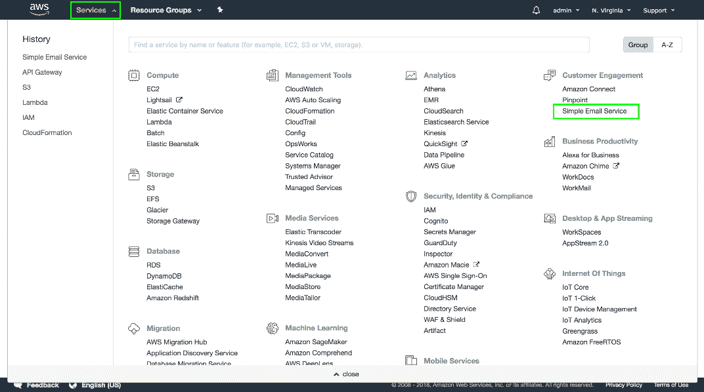
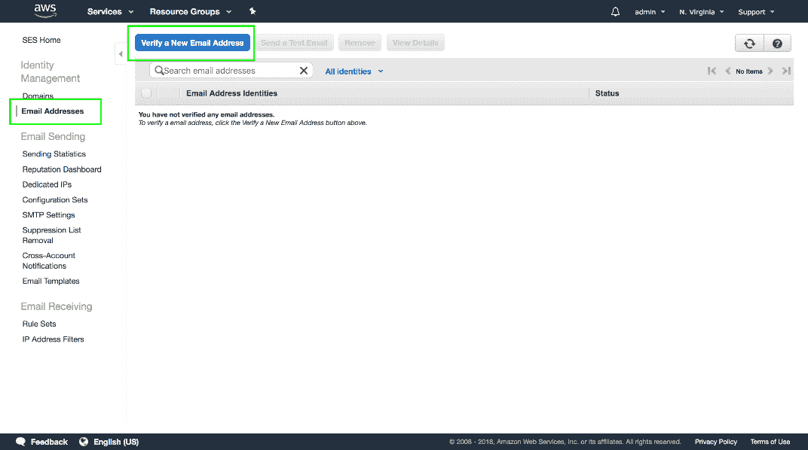
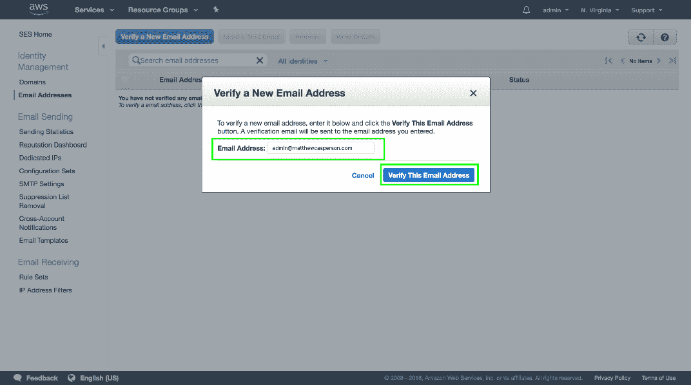
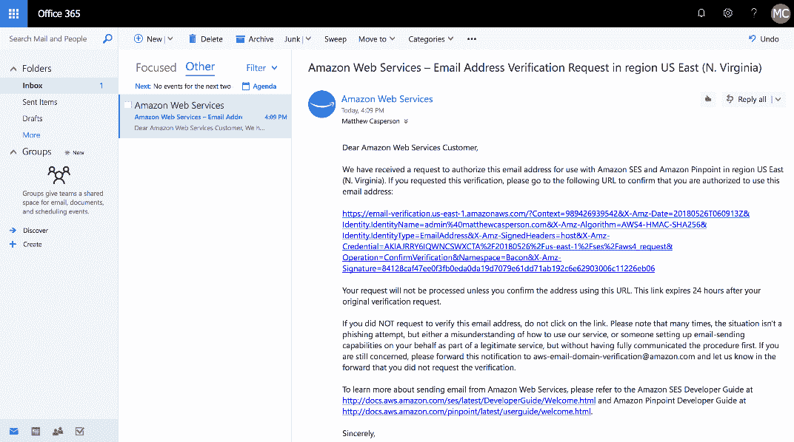
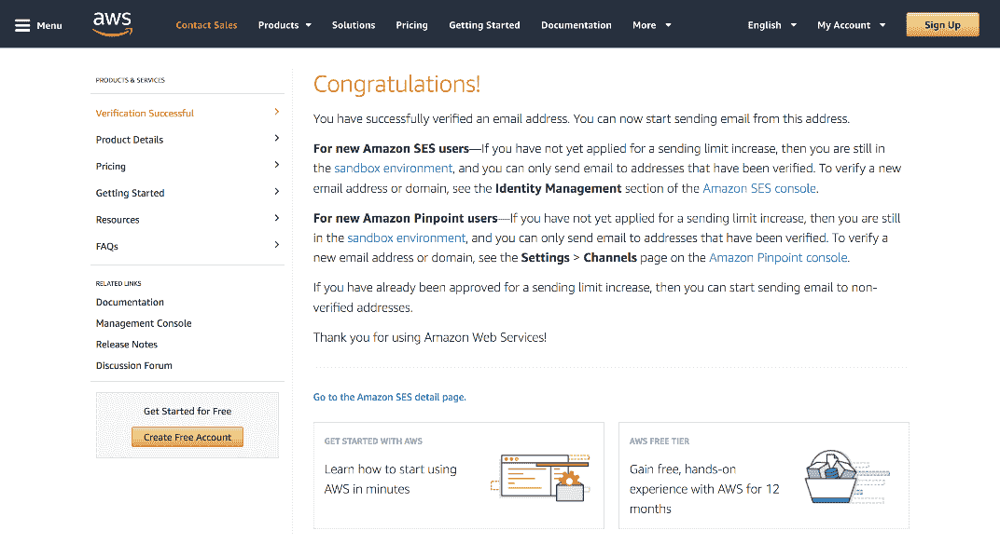
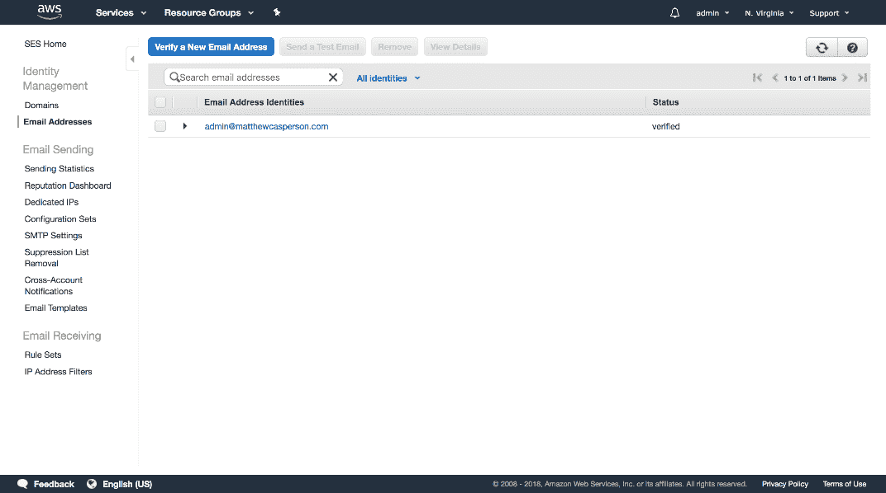
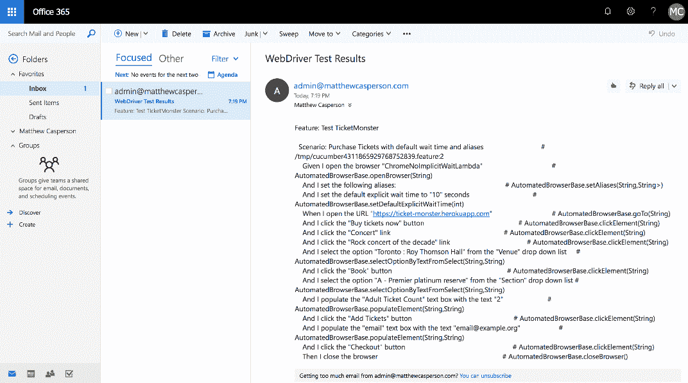

# Selenium 系列:通过电子邮件发送结果- Octopus 部署

> 原文：<https://octopus.com/blog/selenium/34-emailing-the-results/emailing-the-results>

这篇文章是关于[创建 Selenium WebDriver 测试框架](/blog/selenium/0-toc/webdriver-toc)的系列文章的一部分。

我们现在能够从转发给 AWS Lambda 的 HTTP POST 请求中运行 Gherkin 特性文件，但是由于 API Gateway 和 Lambda 请求的时间限制不同，我们被迫以异步方式运行测试。这意味着我们最初的 HTTP 请求不再接收测试的输出，所以我们需要另一个返回测试结果的解决方案。

一个简单的解决办法是在测试结果出来后，通过电子邮件发给我们。通过发送电子邮件，`runCucumber`功能可以使用您已有的通信平台通知我们结果，让我们不必实施定制解决方案。

好消息是 AWS 提供了发送电子邮件的服务，我们可以很容易地将它绑定到我们的 Lambda 函数中。这项服务被称为简单电子邮件服务(SES)。

在我们可以使用 SES 之前，我们需要验证我们将显示的发送电子邮件的电子邮件地址。这个验证过程是亚马逊防止 SES 被用来发送垃圾邮件的方法之一。

要打开 SES 控制台，请单击`Services`链接，然后单击`Simple Email Service`链接。

[](#)

点击左侧菜单中的`Email Addresses`链接，然后点击`Verify a New Email Address`按钮。

[](#)

输入您有权访问的电子邮件地址，然后单击`Verify This Email Address`按钮。

[](#)

您将看到一个提示，告诉您已经发送了一封验证电子邮件。

[](#)

邮件中会有一个你需要打开的链接。

[](#)

单击该链接会将您带到一个页面，告诉您该电子邮件地址已成功验证。

[](#)

回到 SES 控制台，我们现在可以看到电子邮件地址已经过验证。您可能需要单击“刷新”按钮，将状态更新为“已验证”。

[](#)

既然我们已经配置了 SES，我们需要将它合并到我们的代码中。

在`pom.xml`文件中，添加`com.amazonaws:aws-java-sdk-ses`依赖项。这个库包含我们用 ses 创建和发送电子邮件所需的类:

```
<project 
xmlns:xsi="http://www.w3.org/2001/XMLSchema-instance"
xsi:schemaLocation="http://maven.apache.org/POM/4.0.0
http://maven.apache.org/xsd/maven-4.0.0.xsd">

  <modelVersion>4.0.0</modelVersion>
  <!-- ... -->
  <dependencies>
    <!-- ... -->
    <dependency>
      <groupId>com.amazonaws</groupId>
      <artifactId>aws-java-sdk-ses</artifactId>
      <version>${aws.sdk.version}</version>
    </dependency>
    <!-- ... -->
  </dependencies>
</project> 
```

在`LambdaEntry`类中，我们将创建一个名为`sendEmail()`的新方法:

```
package com.octopus;

import com.amazonaws.services.simpleemail.AmazonSimpleEmailService;
import com.amazonaws.services.simpleemail.AmazonSimpleEmailServiceClientBuilder;
import com.amazonaws.services.simpleemail.model.*;
// ...
public class LambdaEntry {
  // ...
  private void sendEmail(final String to, final String results) {
    try {
      final AmazonSimpleEmailService client = AmazonSimpleEmailServiceClientBuilder.standard()
        .withRegion(Regions.US_EAST_1).build();

      final SendEmailRequest request = new SendEmailRequest()
        .withDestination(

      new Destination().withToAddresses(to))
        .withMessage(new Message()
          .withBody(new Body()
            .withText(new Content()
        .withCharset("UTF-8").withData(results)))
        .withSubject(new Content()
          .withCharset("UTF-8").withData("WebDriver Test Results")))
        .withSource("admin@matthewcasperson.com");

      client.sendEmail(request);
    } catch (final Exception ex) {
      System.out.println("The email was not sent. Error message: " + ex.getMessage());
    }
  }
} 
```

这个方法有两个参数:接收结果的电子邮件地址和结果本身:

```
private void sendEmail(final String to, final String results) { 
```

然后我们创建一个新的`AmazonSimpleEmailService`实例，配置为在美国东部 1 区工作:

```
try {
  final AmazonSimpleEmailService client = AmazonSimpleEmailServiceClientBuilder.standard()
    .withRegion(Regions.US_EAST_1).build(); 
```

`SendEmailRequest`类用于构造电子邮件本身。它有一个流畅的界面，允许我们定义目的地，邮件正文，电子邮件主题和发件人地址。请注意，此处使用的发件人地址必须是 ses 控制台中已验证的电子邮件地址之一:

```
final SendEmailRequest request = new SendEmailRequest()
  .withDestination(

new Destination().withToAddresses(to))
  .withMessage(new Message()
  .withBody(new Body()
    .withText(new Content()
    .withCharset("UTF-8").withData(results)))
  .withSubject(new Content()
    .withCharset("UTF-8").withData("WebDriver Test Results")))
  .withSource("admin@matthewcasperson.com"); 
```

最后一步是向客户端发送请求:

```
client.sendEmail(request); 
```

如果出现任何问题，我们会向控制台发送一条消息:

```
 } catch (final Exception ex) {
    System.out.println("The email was not sent. Error message: " + ex.getMessage());
  }
} 
```

要发送电子邮件，我们需要对`runCucumber()`方法做一些小的改动:

```
public String runCucumber(String feature) throws Throwable {

  File driverDirectory = null;
  File chromeDirectory = null;
  File outputFile = null;
  File txtOutputFile = null;
  File featureFile = null;

  try {
    driverDirectory = downloadChromeDriver();
    chromeDirectory = downloadChromeHeadless();
    outputFile = Files.createTempFile("output", ".json").toFile();
    txtOutputFile = Files.createTempFile("output", ".txt").toFile();
    featureFile = writeFeatureToFile(feature);

    cucumber.api.cli.Main.run(
      new String[]{
        "--monochrome",
        "--glue", "com.octopus.decoratorbase",
        "--format", "json:" + outputFile.toString(),
        "--format", "pretty:" + txtOutputFile.toString(),
        featureFile.getAbsolutePath()},
      Thread.currentThread().getContextClassLoader());

    sendEmail("admin@matthewcasperson.com", FileUtils.readFileToString(txtOutputFile, Charset.defaultCharset()));

    return FileUtils.readFileToString(outputFile, Charset.defaultCharset());

  } finally {
    FileUtils.deleteQuietly(driverDirectory);
    FileUtils.deleteQuietly(chromeDirectory);
    FileUtils.deleteQuietly(outputFile);
    FileUtils.deleteQuietly(txtOutputFile);
    FileUtils.deleteQuietly(featureFile);
  }
} 
```

我们创建一个变量来保存测试结果将被写入的临时文件:

```
File txtOutputFile = null; 
```

该变量由扩展名为`.txt`的临时文件初始化:

```
txtOutputFile = Files.createTempFile("output", ".txt").toFile(); 
```

然后，我们向`cucumber.api.cli.Main.run()`方法传递一个额外的参数，将测试结果保存为一个文本文件。Cucumber 中漂亮的输出格式会生成漂亮的纯文本日志文件:

```
"--format", "pretty:" + txtOutputFile.toString(), 
```

就在我们返回 JSON 响应之前，我们调用`sendEmail()`方法来发送纯文本结果。这样，即使不再有任何进程监听该方法的返回值，我们也可以得到结果:

```
sendEmail("admin@matthewcasperson.com", FileUtils.readFileToString(txtOutputFile, Charset.defaultCharset())); 
```

最后的改变是给`runCucumber()`函数使用 SES 发送邮件的权限。

身份和访问管理(IAM)服务为 AWS 中运行的代码和服务提供安全性。我们在前面创建用于无服务器应用程序的访问和密钥时看到了这个服务。

除了管理用户，IAM 还管理授予其他 AWS 服务的权限，包括 Lambda。在我们的例子中，我们需要授予 Lambda 函数用 SES 发送电子邮件的能力。我们通过在`serverless.yml`文件的 provider 部分下添加一个`iamRoleStatements`部分来授予这个许可。

在这里，我们将`Effect`设置为`Allow`,以表明我们正在授予执行某些动作的能力。`Resource`设置被设置为`"*"`，这是该选项的唯一有效值。`Action`设置被设置为`ses:SendEmail`，这是与在 SES 中发送电子邮件相关的动作的名称。

```
provider:
  name: aws
  runtime: java8
  region: us-east-1
  iamRoleStatements:
    - Effect: Allow
      Resource: "*"
      Action:
        - ses:SendEmail 
```

用 Maven 重新编译代码，用 Serverless 重新部署。然后向`runCucumber` URL 发出另一个请求。

和以前一样，我们得到一个空响应，但是过了一段时间，传递给`sendEmail()`方法的电子邮件地址将收到一条消息，其中包含测试结果。

如果您没有看到该电子邮件，请检查您的垃圾邮件文件夹。Outlook 365 不断将这些电子邮件识别为垃圾邮件，其他提供商可能也会这样做。

[](#)

我们现在有了一个完整的解决方案，可以从 HTTP 请求启动 Lambda 中的 WebDriver 测试，并通过电子邮件接收结果。无论我们启动 1 次测试还是 1000 次测试，我们在这里部署的基础设施都将无缝、可靠地扩展，以满足我们的要求。这就是使用 AWS 这样的云服务的威力。

这篇文章是关于[创建 Selenium WebDriver 测试框架](/blog/selenium/0-toc/webdriver-toc)的系列文章的一部分。