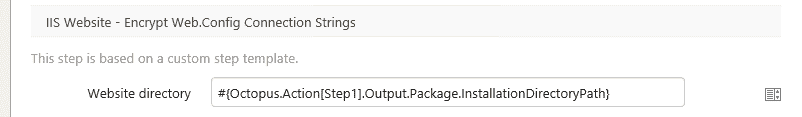

# 加密 Web.config 中的连接字符串- Octopus Deploy

> 原文：<https://octopus.com/blog/encrypting-connection-strings>

当指定连接字符串时，通常最好使用 Windows 身份验证，因为您不需要将密码放在 Web.config 文件中。然而，这并不是在每种情况下都有效，所以如果你必须在你的连接字符串中使用密码，那么[最好加密它](http://hugoware.net/blog/dude-for-real-encrypt-your-web-config)。Step 模板是增强 Octopus Deploy 本机功能的一个很好的方法。因此，为了使加密连接字符串部分更容易，我创建了一个新模板来完成这项工作。

可以抢新的 [IIS 网站——加密网页。Octopus 部署库中的配置连接字符串](https://library.octopusdeploy.com/#!/step-template/actiontemplate-iis-website-encrypt-web.config-section)。在幕后，该模板使用了`aspnet_regiis`工具来加密 Web.Config。将该步骤添加到您的部署流程将会带您进入配置的步骤详细信息页面。



这个模板有一个名为 Website directory 的参数，通常在包部署步骤中设置为`InstallationDirectoryPath`。请注意，您必须将包部署步骤的名称指定为变量的一部分。

```
#{Octopus.Action[MyDeployPackageStep].Output.InstallationDirectoryPath} 
```

此步骤设计为在将包部署到 web 服务器后运行。不幸的是，这意味着如果您使用`IIS web site and application pool`特性，会有一个微小的窗口，其中 Web.config 不会被加密。为了绝对安全，最好在将 IIS 重新打印到新网站之前应用加密。要解决此问题，请关闭该功能并使用自定义 PowerShell 脚本来更新 IIS。

将该步骤添加到部署过程之后，您的下一个部署将有一个精心加密的连接字符串部分。