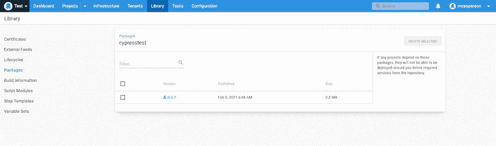
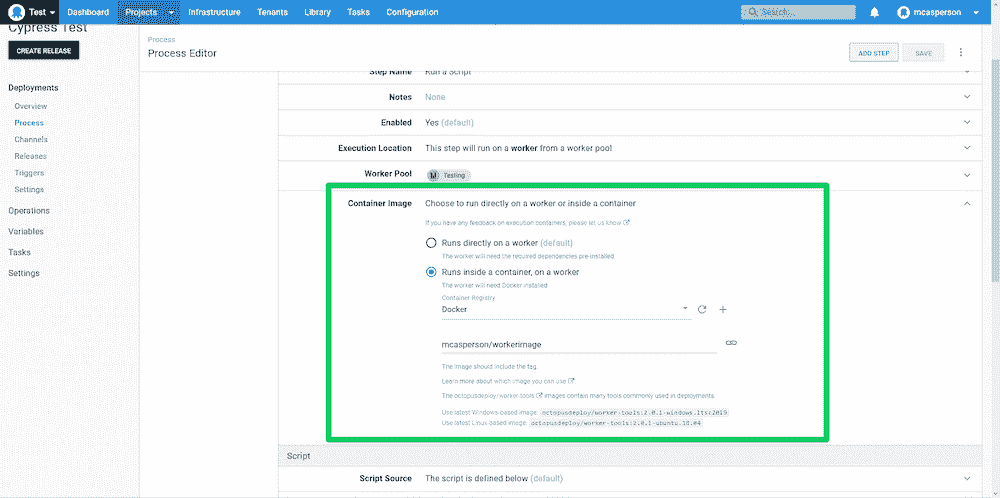
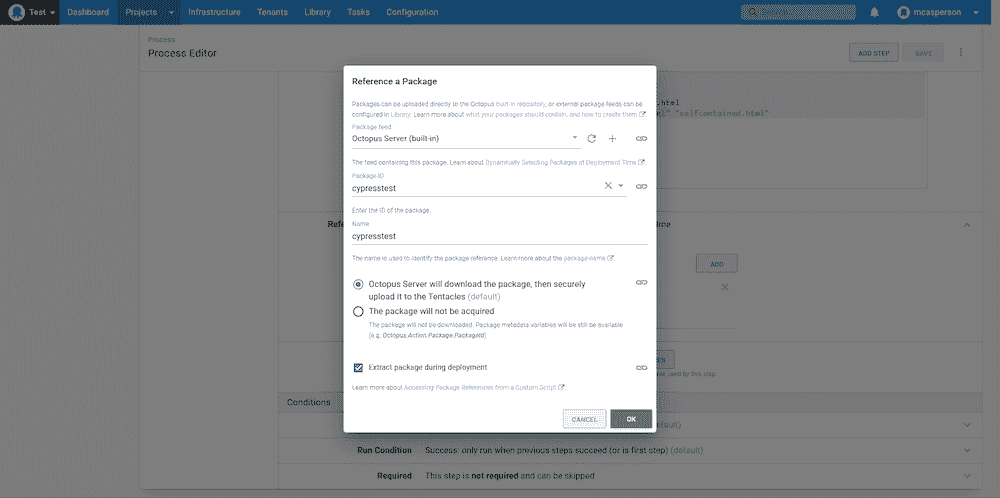
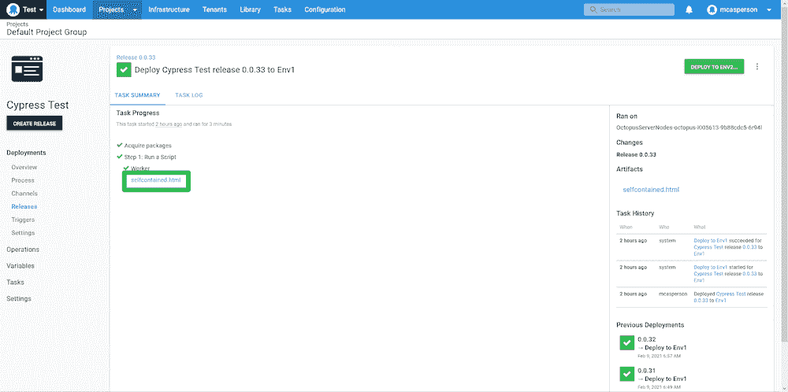
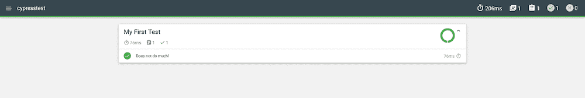
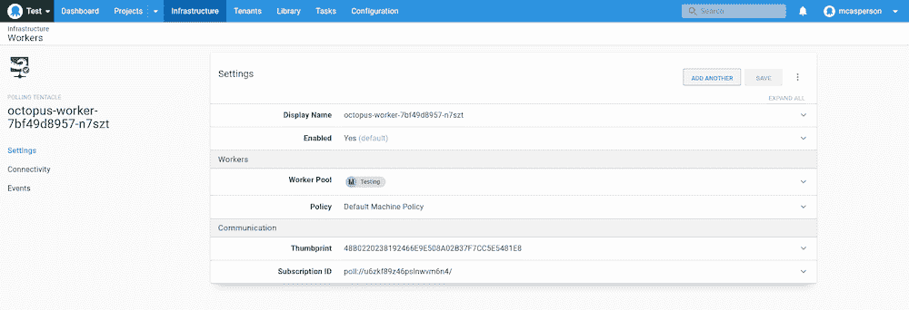

# 使用 Cypress - Octopus Deploy 进行端到端测试

> 原文：<https://octopus.com/blog/end-to-end-testing-with-cypress>

[](#)

将测试代码作为开发过程的一部分的想法几乎已经被普遍接受。单元测试现在是大多数复杂代码库的共同特征。

然而，测试并没有随着单元测试而停止。描述应用程序生命周期中执行的测试模式的典型例子是测试金字塔(尽管有许多替代方案，如[测试蜂巢](https://engineering.atspotify.com/2018/01/11/testing-of-microservices/))，它描述了某些策略，如端到端测试，通常需要应用程序的实时运行实例来执行测试。

端到端测试的一个例子是通过像 Cypress 这样的工具，它与网页的交互方式与人类非常相似。这些测试必然要求 web 应用程序正在运行，这使得它们成为在测试环境中部署和运行 web 应用程序之后，在部署过程的最后阶段中包含的理想候选。

在这篇博客文章中，我们来看看在 Octopus 部署期间运行 Cypress 的一些实际问题。我还提出了一个解决方案，允许 Cypress 测试在最常见的场景中运行。

## 在您的部署过程中包括 Cypress

要解决的第一个也是最紧迫的问题是让 Cypress 进入您的部署管道。

也许实现这一点最明显的方法是在虚拟机或物理机上安装 Cypress 和 web 浏览器。有许多像 Ansible、Puppet 和 Chef 这样的工具可以以可重复的方式自动化这个过程。

直接安装工具的缺点是，当您在托管的 Octopus 实例中使用动态工作器时，没有简单的方法做到这一点，并且在 Kubernetes 这样的平台中，没有 VM 的概念供您预先配置。

一个更通用的解决方案是[从 Docker 容器](https://github.com/cypress-io/cypress-docker-images)运行 Cypress。这很方便，因为 Cypress 团队已经完成了在其 Docker 映像中配置所有必需软件的艰苦工作。您还可以通过运行不同的 Docker 镜像版本，随心所欲地切换浏览器版本。

## 参考 Cypress 测试

我们需要解决的下一个问题是如何在部署中包含单独的 Cypress 测试。

将测试放入定制的 Docker 映像中是可能的，如果您的测试没有太大的变化，这可能是一个非常合理的解决方案。

然而，我怀疑大多数投资于端到端测试的团队会希望继续快速更新他们的测试脚本，而没有将它们包含在新的 Docker 映像中的负担。拥有一个通用的 Cypress Docker 映像来执行随机的测试脚本不是很好吗？

直接运行 Docker 的时候，这个相对容易。您只需将包含您的测试脚本的本地目录挂载到通用的 Cypress Docker 映像中。Cypress [文档](https://github.com/cypress-io/cypress-docker-images/tree/master/included)为此提供了一个例子，它将当前目录挂载为 Docker 容器中的`e2e`目录:

```
docker run -it -v $PWD:/e2e -w /e2e cypress/included:6.4.0 
```

不幸的是，Kubernetes 不支持这种卷安装。[您可以将配置图的内容作为文件](https://stackoverflow.com/questions/33415913/whats-the-best-way-to-share-mount-one-file-into-a-pod)挂载，但是该选项[不支持目录结构](https://github.com/kubernetes/kubernetes/issues/62421)。当用 Cypress 进行测试时，这是一个明显的限制，因为 [Cypress 目录结构包括许多子目录](https://docs.cypress.io/guides/core-concepts/writing-and-organizing-tests.html#Folder-Structure)。

Octopus 通过 [worker containers](https://octopus.com/docs/projects/steps/execution-containers-for-workers) 提供了一个解决方案，worker containers 在一个由适当配置的 Docker 映像生成的容器内执行一个部署步骤。Octopus 步骤然后可以下载并解压缩一个包，并运行一个定制脚本。

在我们的例子中，我们将基于 Cypress 映像创建一个定制的(但仍然是通用的)Docker 映像，Octopus 可以在其中执行，以提取包含我们的测试脚本的包并执行 Cypress。

我们的 Docker 形象由以下`Dockerfile`组成:

```
FROM cypress/included:6.4.0
RUN apt-get update; apt-get install -y libicu-dev
RUN npm install -g inline-assets
ENTRYPOINT [] 
```

这个`Dockerfile`，是以柏树形象`cypress/included:6.4.0`为原型，安装`libicu-dev`(是需要的。NET Core applications)并安装 [inline-assets](https://www.npmjs.com/package/inline-assets) 工具来处理 Cypress HTML 报告(稍后将详细介绍)并清除`ENTRYPOINT`以便 Octopus 可以覆盖运行图像时使用的命令。

这个 Docker 映像可以用下面的命令构建和发布，用您自己的 Docker Hub 用户名替换`dockerhubusername`:

```
docker build . -t dockerhubusername/workerimage
docker push dockerhubusername/workerimage 
```

在我的例子中，我创建了一个名为`mcasperson/workerimage`的图像。我们现在可以使用这个图像来创建 Octopus 执行容器。

## 创建样本 Cypress 测试

对于这个例子，我们将创建一个简单的介绍性 Cypress 测试，它不执行实际的工作，但是允许我们模拟运行端到端测试的过程。这个样本测试的代码可以在 [GitHub](https://github.com/OctopusSamples/simple-cypress-test) 上找到。

我们从文件`package.json`开始，文件[安装 Mochawesome reporter](https://docs.cypress.io/guides/tooling/reporters.html#Examples) 来生成 HTML 报告:

```
{
  "name": "cypress-test",
  "version": "0.0.1",
  "description": "A simple cypress test",
  "dependencies": {
    "mochawesome-merge": "^4.2.0",
    "mochawesome": "^6.2.1",
    "mocha": "^8.2.1"
  }
} 
```

接下来我们有了`cypress.json`文件，它配置了我们测试的基本细节。请注意，我们已经启用了`<!-- -->` HTML 报告:

```
{
  "baseUrl": "https://google.com",
  "reporter": "mochawesome",
  "reporterOptions": {
    "charts": true,
    "overwrite": false,
    "html": true,
    "json": false,
    "reportDir": "."
  }
} 
```

最后，我们在`sample_spec.js`文件中有测试本身。这个测试总是通过，不与任何网页交互，但它证明了 Cypress 正在按预期运行:

```
describe('My First Test', () => {
  it('Does not do much!', () => {
    expect(true).to.equal(true)
  })
}) 
```

在运行`npm install`下载 Mocha 报告库之后，这些文件被打包成一个 ZIP 文件，我们可以将它上传到 Octopus 的内置提要中。为了方便起见， [GitHub 发布页面](https://github.com/OctopusSamples/simple-cypress-test/releases)已经预先打包了 ZIP 文件，可以随时使用。

下面是上传到 Octopus 内置提要的 Cypress 测试:

[](#)

## 运行测试

我们现在准备运行测试，作为我们部署的一部分。在**运行脚本**步骤中，我们将脚本配置为在**容器映像**部分下的 worker 映像中执行:

[](#)

接下来，我们运行以下 Bash 脚本:

```
cd cypresstest
cypress run > output.txt
RESULT=$?
inline-assets mochawesome.html selfcontained.html
new_octopusartifact "${PWD}/selfcontained.html" "selfcontained.html"
exit ${RESULT} 
```

第一行输入我们的 Cypress 测试包将被提取并运行的目录`cypress`。输出被定向到一个名为`output.txt`的文件:

```
cd cypresstest
cypress run > output.txt 
```

然后，我们捕获 Cypress 的退出代码，这将决定该步骤是成功还是失败:

```
RESULT=$? 
```

为了能够在 Octopus 中方便地查看测试结果，我们需要将构成 HTML 报告的所有单个文件(HTML、CSS 和脚本文件)捆绑成一个单独的、自包含的 HTML 文件。这就是我们在工人映像中安装的`inline-assets`工具的用武之地。它将读取报告 HTML 文件，内联所有外部资源，并创建一个名为`selfcontained.html`的自包含 HTML 文件:

```
inline-assets mochawesome.html selfcontained.html 
```

我们将报告文件捕获为 Octopus 工件:

```
new_octopusartifact "${PWD}/selfcontained.html" "selfcontained.html" 
```

然后，我们脚本的退出代码被设置为 Cypress 的退出代码:

```
exit ${RESULT} 
```

最后，我们配置下载和提取包含 Cypress 脚本的包的步骤:

[](#)

当这个脚本运行时，我们自包含的 HTML 报告文件作为工件被捕获，并作为链接在**任务摘要**中公开:

[](#)

我们可以直接在浏览器中打开此报告:

[](#)

这样，我们现在就有了一种方法，可以在由通用的共享 Docker 映像创建的容器中运行定制的 Cypress 测试。为了更新测试，我们只需上传一个新的包到 Octopus，它们将包含在我们的下一个部署中。

## 在 Kubernetes 测试

我们选择使用 worker 容器的原因之一是它允许我们在 Kubernetes 集群中运行相同的测试。为了验证这一点，我们需要在 Kubernetes 集群中运行一个 Octopus worker。以下部署启动了 Kubernetes 集群中的一个触手:

```
apiVersion: apps/v1
kind: Deployment
metadata:
  name: octopus-worker
  labels:
    app: tentacle
spec:
  selector:
    matchLabels:
      octopusexport: OctopusExport
  revisionHistoryLimit: 1
  replicas: 1
  strategy:
    type: RollingUpdate
  template:
    metadata:
      labels:
        app: tentacle
        octopusexport: OctopusExport
    spec:
      containers:
        - name: worker
          image: index.docker.io/octopusdeploy/tentacle
          env:
            - name: Space
              value: Test
            - name: ACCEPT_EULA
              value: 'Y'
            - name: TargetWorkerPool
              value: Testing
            - name: ServerUrl
              value: 'https://mattc.octopus.app'
            - name: ServerApiKey
              value: API-xxx
            - name: ServerPort
              value: '10943'
          securityContext:
            privileged: true 
```

要在您自己的集群中运行这个 worker，请确保更改`ServerUrl`、`ServerApiKey`、`TargetWorkerPool`和`Space`环境变量，以匹配您的服务器配置。

重要的是，这个部署创建的 pod 具有设置为`true`的`privileged`标志。这是支持 Docker-in-Docker 所必需的，它在 Linux 触手映像中启用。Docker-in-Docker 允许我们的触手以与 VM 上的触手相同的方式执行工作容器。

当这个部署应用到集群时，您的 Octopus 实例将显示一个新的轮询工作器，如下所示:

[](#)

此时，我们可以对这个基于 Kubernetes 的 worker 运行相同的脚本步骤，就像我们对一个基于 VM 的 worker 运行测试一样。因为 Octopus 负责传输测试脚本，所以我们巧妙地避开了必须在 pod 中装载脚本的限制。

## 结论

正如测试代码现在是常见的做法一样，通过端到端测试来验证部署越来越常见，以确保应用程序生命周期的这一阶段按预期工作。如今，我们被像 Cypress 这样的高质量测试平台宠坏了，通过使用定制的工人映像做一些基础工作，跨多个平台运行端到端测试变得很容易。

在这篇博文中，我们讨论了为什么 worker 容器对于运行测试如此有用，创建了一个定制的 worker 映像来执行我们的测试，查看了一个简单的 Cypress 测试脚本，并编写了一个简单的 bash 脚本来运行测试并收集结果。然后，我们看到了如何在 Kubernetes 集群中运行一个 worker，该集群被配置为使用 Docker-in-Docker 运行相同的测试。

结果是一个可重用的测试过程，允许 Cypress 测试脚本跨多个平台快速开发、部署和执行。通过一些小的调整，可以用端到端测试来验证您的 web 应用程序部署，确保在应用程序到达最终用户之前，应用程序生命周期的每个阶段都经过测试和验证。

愉快的部署！