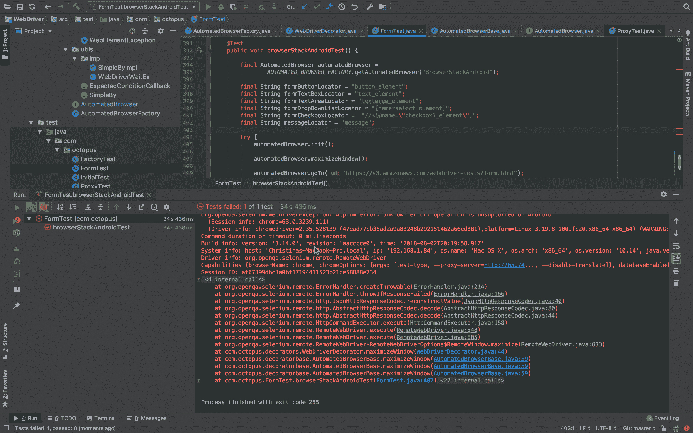

# Selenium 系列:特定环境处理- Octopus 部署

> 原文：<https://octopus.com/blog/selenium/19-environment-specific-handling/environment-specific-handling>

这篇文章是关于[创建 Selenium WebDriver 测试框架](/blog/selenium/0-toc/webdriver-toc)的系列文章的一部分。

您可能已经注意到，在 BrowserStack 中对 Edge 浏览器运行测试时，窗口没有最大化。在最大化的窗口中运行测试通常是有意义的，以确保测试是在以一致的分辨率显示网页的情况下运行的，所以让我们添加一个新的方法来最大化窗口。

首先，我们将方法`maximizeWindow()`添加到`AutomatedBrowser`类中:

```
package com.octopus;

import org.openqa.selenium.WebDriver;
import org.openqa.selenium.remote.DesiredCapabilities;

public interface AutomatedBrowser {

  // ...

  void maximizeWindow();
} 
```

然后我们将默认实现添加到`AutomatedBrowserBase`类中:

```
package com.octopus.decoratorbase;

import com.octopus.AutomatedBrowser;
import org.openqa.selenium.WebDriver;
import org.openqa.selenium.remote.DesiredCapabilities;

public class AutomatedBrowserBase implements AutomatedBrowser {

  // ...

  @Override
  public void maximizeWindow() {
    if (getAutomatedBrowser() != null) {
      getAutomatedBrowser().maximizeWindow();
    }
  }
} 
```

然后在`WebDriverDecorator`类中，我们添加代码来最大化浏览器窗口:

```
package com.octopus.decorators;

import com.octopus.AutomatedBrowser;
import com.octopus.decoratorbase.AutomatedBrowserBase;
import com.octopus.utils.SimpleBy;
import com.octopus.utils.impl.SimpleByImpl;
import org.openqa.selenium.By;
import org.openqa.selenium.WebDriver;
import org.openqa.selenium.support.ui.ExpectedConditions;
import org.openqa.selenium.support.ui.Select;
import org.openqa.selenium.support.ui.WebDriverWait;

public class WebDriverDecorator extends AutomatedBrowserBase {

  // ...

  @Override
  public void maximizeWindow() {
    webDriver.manage().window().maximize();
  }
} 
```

现在，在我们的测试中，我们可以在 URL 打开之前最大化窗口，调用`automatedBrowser.maximizeWindow()`:

```
@Test
public void browserStackEdgeTest() {
    final AutomatedBrowser automatedBrowser =
            AUTOMATED_BROWSER_FACTORY.getAutomatedBrowser("BrowserStackEdge");

    final String formButtonLocator = "button_element";
    final String formTextBoxLocator = "text_element";
    final String formTextAreaLocator = "textarea_element";
    final String formDropDownListLocator = "[name=select_element]";
    final String formCheckboxLocator = "//*[@name=\"checkbox1_element\"]";

    final String messageLocator = "message";

    try {
        automatedBrowser.init();

        automatedBrowser.maximizeWindow();

        automatedBrowser.goTo("https://s3.amazonaws.com/webdriver-testing-website/form.html");

        automatedBrowser.clickElement(formButtonLocator);
        assertEquals("Button Clicked", automatedBrowser.getTextFromElement(messageLocator));

        automatedBrowser.populateElement(formTextBoxLocator, "test text");

        assertEquals("Text Input Changed", automatedBrowser.getTextFromElement(messageLocator));

        automatedBrowser.populateElement(formTextAreaLocator, "test text");

        assertEquals("Text Area Changed", automatedBrowser.getTextFromElement(messageLocator));

        automatedBrowser.selectOptionByTextFromSelect("Option 2.1", formDropDownListLocator);
        assertEquals("Select Changed", automatedBrowser.getTextFromElement(messageLocator));

        automatedBrowser.clickElement(formCheckboxLocator);
        assertEquals("Checkbox Changed", automatedBrowser.getTextFromElement(messageLocator));
    } finally {
        automatedBrowser.destroy();
    }
} 
```

该测试现在将运行，正如预期的那样，Edge 浏览器窗口将在 URL 打开之前最大化。

但是如果我们在手机浏览器上运行同样的测试会发生什么呢？让我们在一个测试中添加对`automatedBrowser.maximizeWindow()`的调用，该测试利用了当我们将字符串`BrowserStackAndroid`传递给工厂类时生成的`AutomatedBrowser`实例:

```
@Test
public void browserStackAndroidTest() {

    final AutomatedBrowser automatedBrowser =
            AUTOMATED_BROWSER_FACTORY.getAutomatedBrowser("BrowserStackAndroid");

    final String formButtonLocator = "button_element";
    final String formTextBoxLocator = "text_element";
    final String formTextAreaLocator = "textarea_element";
    final String formDropDownListLocator = "[name=select_element]";
    final String formCheckboxLocator =  "//*[@name=\"checkbox1_element\"]";
    final String messageLocator = "message";

    try {
        automatedBrowser.init();

        automatedBrowser.maximizeWindow();

        automatedBrowser.goTo("https://s3.amazonaws.com/webdriver-tests/form.html");

        automatedBrowser.clickElement(formButtonLocator);
        assertEquals("Button Clicked", automatedBrowser.getTextFromElement(messageLocator));

        automatedBrowser.populateElement(formTextBoxLocator, "test text");
        assertEquals("Text Input Changed", automatedBrowser.getTextFromElement(messageLocator));

        automatedBrowser.populateElement(formTextAreaLocator, "test text");
        assertEquals("Text Area Changed", automatedBrowser.getTextFromElement(messageLocator));

        automatedBrowser.selectOptionByTextFromSelect("Option 2.1", formDropDownListLocator);
        assertEquals("Select Changed", automatedBrowser.getTextFromElement(messageLocator));

        automatedBrowser.clickElement(formCheckboxLocator);
        assertEquals("Checkbox Changed", automatedBrowser.getTextFromElement(messageLocator));
    } finally {
        automatedBrowser.destroy();
    }
} 
```

这一次我们得到一个异常:

```
org.openqa.selenium.WebDriverException: Appium error: unknown error:
operation is unsupported on Android.

May 04, 2018 3:17:00 PM org.openqa.selenium.remote.ProtocolHandshake
createSession

INFO: Detected dialect: OSS

org.openqa.selenium.WebDriverException: Appium error: unknown error:
operation is unsupported on Android

(Session info: chrome=63.0.3239.111)

(Driver info: chromedriver=2.35.528139
(47ead77cb35ad2a9a83248b292151462a66cd881),platform=Linux
3.19.8-100.fc20.x86_64 x86_64) (WARNING: The server did not provide
any stacktrace information)

Command duration or timeout: 0 milliseconds

Build info: version: '3.11.0', revision: 'e59cfb3', time:
'2018-03-11T20:26:55.152Z'

System info: host: 'Christinas-MBP', ip: '192.168.1.84', os.name:
'Mac OS X', os.arch: 'x86_64', os.version: '10.13.4',
java.version: '10'

Driver info: org.openqa.selenium.remote.RemoteWebDriver

Capabilities {browserName: chrome, chromeOptions: {args: [test-type,
--proxy-server=http://65.74..., --disable-translate]},
databaseEnabled: false, deviceManufacturer: samsung, deviceModel:
SM-N950F, deviceName: ce051715d1a6a708017e, deviceScreenSize: 1440x2960,
deviceUDID: ce051715d1a6a708017e, enablePerformanceLogging: false,
javascriptEnabled: true, locationContextEnabled: false, loggingPrefs:
org.openqa.selenium.logging..., networkConnectionEnabled: true,
newCommandTimeout: 300, platform: LINUX, platformName: LINUX,
platformVersion: 7.1.1, realMobile: true, systemPort: 8203,
takesScreenshot: true, udid: ce051715d1a6a708017e, warnings: {},
webStorageEnabled: false}

Session ID: 1a34a4609f63d6bc8749bd3a09f5001ea5a93dd7 
```

[](#)

这个例外是有意义的，因为移动浏览器没有可调整大小的窗口的概念。它们总是全屏显示，因此尝试修改窗口大小是无效的。

不过，这确实给我们留下了一个问题。理想情况下，我们希望在任何浏览器上运行我们的测试代码。尽管在这些文章中，我们一直在创建新的测试方法来演示新的浏览器，但在实践中，最好有一个针对不同浏览器多次调用的单一测试方法。运行单一的测试方法减少了重复代码的数量，使得测试更容易维护。

我们可以尝试在测试中检测运行测试的设备，并在一个`if`语句中包装调用以最大化窗口。下面的代码提取了设备制造商的名称，如果不是`samsung`，我们假设测试正在桌面设备上运行，并调用`automatedBrowser.maximizeWindow()`:

```
String manufacturer = ((RemoteWebDriver) automatedBrowser.getWebDriver()).getCapabilities().getCapability("deviceManufacturer").toString();

if (!manufacturer.equalsIgnoreCase("samsung")) {
  automatedBrowser.maximizeWindow();
} 
```

这种解决方案是可行的，但不是很优雅。只有当我们测试的唯一移动设备是由三星制造的时候，代码才起作用，这意味着我们测试的每个新设备都需要新的代码来检查它是否是移动设备。它还用大量代码扰乱了我们的测试，分散了我们真正感兴趣的交互的注意力。

一个更好的解决方案是覆盖`BrowserStackAndroidDecorator`装饰类中的`maximizeWindow()`方法:

```
package com.octopus.decorators;

import com.octopus.AutomatedBrowser;
import com.octopus.decoratorbase.AutomatedBrowserBase;
import org.openqa.selenium.remote.DesiredCapabilities;

public class BrowserStackAndroidDecorator extends AutomatedBrowserBase {

  // ...

  @Override
  public void maximizeWindow() {
    // do nothing
  }
} 
```

这里我们添加了一个不做任何事情的`maximizeWindow()`方法的实现。我们知道，任何时候使用`BrowserStackAndroidDecorator`类，我们都必须使用移动浏览器，所以我们简单地忽略任何最大化窗口的请求。

这个解决方案意味着我们的测试代码在桌面浏览器或移动浏览器上运行时不需要修改。那些编写和维护测试的人不再需要考虑将运行最终测试的设备的种类，这使得测试更加健壮和易于维护。

这篇文章是关于[创建 Selenium WebDriver 测试框架](/blog/selenium/0-toc/webdriver-toc)的系列文章的一部分。