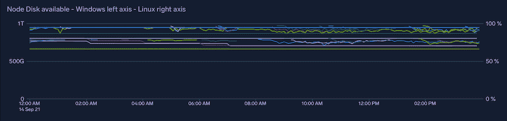

# 如何从 AKS - Octopus Deploy 中的 Windows Kubernetes 节点导出指标

> 原文：<https://octopus.com/blog/export-metrics-from-windows-kubernetes-nodes-in-aks>

在 Octopus，我们使用 Azure Kubernetes 服务( [AKS](https://azure.microsoft.com/en-au/services/kubernetes-service/) )来管理一个 [Kubernetes](https://kubernetes.io) 集群，我们将其用于一系列内部工具，以及构建和测试工作负载。

为了有效地使用这种资源，我们需要监控它的使用量以及几个方面——CPU、内存、磁盘、网络带宽等等。

对于 Linux [节点](https://kubernetes.io/docs/concepts/architecture/nodes/)，我们使用 [Sumo Logic 的解决方案从 Kubernetes](https://github.com/SumoLogic/sumologic-kubernetes-collection) 收集指标，但它目前不支持从 Windows 收集指标。我们在集群中使用 Windows 节点，所以我们也需要一种方法来监控它们。

在本帖中，我将向你介绍我们的解决方案。如果您还需要 Windows 节点度量，我希望您可以使用这篇文章找到适合您的解决方案。

## 收集 Windows 主机上的指标

收集关于 Kubernetes (K8s)节点的指标对于 Linux 节点来说有一个既定的模式:

*   在所有 Linux 节点上运行一组特权 pods，并使用 [node_exporter](https://github.com/prometheus/node_exporter) 收集主机级指标
*   给它们贴上普罗米修斯能自动刮除的标签

这在 Windows 上不起作用，因为 Windows 容器不能([目前是](https://github.com/Azure/AKS/issues/1975))被赋予特权——这意味着它们不能看到主机 VM 的“外部世界”。所以我们需要其他方法来窥视宿主。

基于 GitHub 用户 aidapsibr 的一个奇妙的[解决方案，我们构建了一个非常接近 Linux 标准模式的方法。在我们的集群中工作的其他人现在可以理解监控管道是如何工作的，而不会有太多的困惑。](https://github.com/aidapsibr/aks-prometheus-windows-exporter)

有三个组成部分:

1.  一个虚拟机规模集扩展，它在创建时在每个实例上安装 [windows 导出器](https://github.com/prometheus-community/windows_exporter) Windows 服务
2.  一个[反向代理](https://en.wikipedia.org/wiki/Reverse_proxy)容器，用于将节点上运行的 windows-exporter 公开为集群中的服务
3.  Prometheus 将一些 Windows 指标转发到 Sumo 逻辑管道的两个远程写入规则

### 虚拟机规模集扩展

aidapsibr 的解决方案使用 PowerShell 脚本安装该扩展一次，但是当我们使用 Terraform 和连续部署部署 AKS 集群时，我们需要一种方法来确保任何 Windows 节点池中的任何虚拟机最终都使用该扩展。幸运的是，[Azure provider for Terraform](https://registry.terraform.io/providers/hashicorp/azurerm/latest/docs/resources/virtual_machine_scale_set_extension)已经有了一个 scale set 扩展资源，所以我们将下面的内容添加到我们的 terra form 文件中:

```
data "azurerm_virtual_machine_scale_set" "blue_bldwin" {
  depends_on = [
    azurerm_kubernetes_cluster_node_pool.blue_nautilus_buildwindows
  ]
  name                = "aksbldwin"
  resource_group_name = join("", ["MC_", var.environment, var.name, "_", var.environment, var.name, "aks_australiaeast"])
}
resource "azurerm_virtual_machine_scale_set_extension" "blue_windows_exporter" {
  depends_on = [
    data.azurerm_virtual_machine_scale_set.blue_bldwin
  ]
  name                         = "windows-exporter-dsc"
  virtual_machine_scale_set_id = data.azurerm_virtual_machine_scale_set.blue_bldwin.id
  publisher                    = "Microsoft.Powershell"
  type                         = "DSC"
  type_handler_version         = "2.80"
  # ensure that the AKS custom script extension has already run
  provision_after_extensions = ["vmssCSE"]
  auto_upgrade_minor_version = false
  settings = jsonencode({
    wmfVersion = "latest"
    configuration = {
      url      = var.vmss_metrics_extension_zip
      script   = "aks_setup"
      function = "Setup"
    }
    privacy = {
      dataEnabled = "Disable"
    }
  })
} 
```

我们单独建立一个 DSC。zip 文件，上面引用为`var.vmss_metrics_extension_zip`，并将其作为 GitHub 发布工件托管。这个。zip 文件包含 windows-exporter。msi 安装程序和 PowerShell DSC 模块文件，一旦 VM 启动并运行，扩展将调用该文件。该模块只安装。msi 安装程序。

部署完成后，我们从集群内部手动抓取 Windows 节点，并获得普罗米修斯格式的指标:

```
# curl 10.240.0.4:9100/metrics | grep windows_cpu_time
# HELP windows_cpu_time_total Time that processor spent in different modes (idle, user, system, ...)
# TYPE windows_cpu_time_total counter
windows_cpu_time_total{core="0,0",mode="dpc"} 486.953125
windows_cpu_time_total{core="0,0",mode="idle"} 19035.953125
windows_cpu_time_total{core="0,0",mode="interrupt"} 18.53125
windows_cpu_time_total{core="0,0",mode="privileged"} 2327.78125
windows_cpu_time_total{core="0,0",mode="user"} 5324.1875
... 
```

现在，我们需要一种方法来允许 Kubernetes 服务(和 Prometheus ServiceMonitors)发现和收集这些指标——相当于用于 Linux 节点的 DaemonSet。

### 反向代理

我们将 nginx(一个广泛使用的[反向代理](https://en.wikipedia.org/wiki/Reverse_proxy))打包成一个容器，带有一个入口点，该入口点接收一个环境变量并将其用作这个配置文件中的上游服务器:

```
http {
    include       mime.types;
    default_type  application/octet-stream;
    sendfile        on;
    keepalive_timeout  65;
    upstream backendhostname {
            server PROXY_HOSTIP:PROXY_PORT;
    }
    server {
        listen       9100;
        server_name  localhost;
        location /health {
            return 200;
        }
        location /metrics {
            proxy_pass http://backendhostname/metrics;
            proxy_http_version 1.1; 
            proxy_set_header Upgrade $http_upgrade; 
            proxy_set_header Connection "upgrade"; 
        }
    }
} 
```

通过将 nginx 容器部署为具有以下定义的 DaemonSet，将`PROXYHOSTIP`设置为节点的内部 IP:

```
apiVersion: apps/v1
kind: DaemonSet
metadata:
  name: # a useful name
  namespace: # your monitoring namespace
  labels:
    # labels that match any existing Prometheus ServiceMonitors
spec:
  selector:
    matchLabels:
      # labels that match any existing Prometheus ServiceMonitors
  updateStrategy:
    type: RollingUpdate
  template:
    metadata:
      labels:
        # labels that match any existing Prometheus ServiceMonitors
    spec:
      hostNetwork: false
      containers:
        - name: windows-metric-proxy
          image: # your docker container location
          imagePullPolicy: Always
          ports:
            - name: metrics
              containerPort: 9100
              protocol: TCP
          env:
            - name: PROXY_HOSTIP
              # this will get the current node's internal IP and forward metric scrapes to the windows-exporter service running on the node
              valueFrom:
                fieldRef:
                  fieldPath: status.hostIP
            - name: PROXY_PORT
              value: '9100'
      securityContext:
        runAsNonRoot: false
      nodeSelector:
        kubernetes.io/os: windows 
```

如果您的标签与您现有的 Linux 节点度量管道的`ServiceMonitor`相匹配，Prometheus 将自动挑选这些标签进行清理。对于相扑逻辑，这意味着:

```
labels:
  app: prometheus-node-exporter
  release: collection 
```

现在，集群中的 Prometheus 实例正在收集指标，我们将它们发送到 Sumo Logic 进行长期保留。

## 转发到相扑逻辑

Sumo Logic 收集解决方案是一个舵图，它安装了收集 Kubernetes 监控数据所需的一切(不仅仅是指标，还有事件、日志和各种各样的东西)。我们升级图表是我们持续部署集群基础架构的一部分。

该图表允许我们指定额外的远程写入规则，告诉 Prometheus 将指标发送到该图表也安装的 fluentd 实例——因此我们在我们的`values.yaml`覆盖文件中添加了两个规则，以将这些新的 Windows 指标发送到与 Linux 相同的位置。这是必要的，因为 windows 导出器不使用与 Linux 导出器相同的度量名称。

```
prometheus:
  prometheusSpec:
    nodeSelector:
      agentpool: default
    # Add new remote writes (toward fluentd) for our windows metrics, which are unfortunately prefixed with windows_
    # We don't need to use new fluentd targets because these represent the same measurements as the existing ones.
    remoteWrite:
      - url: http://$(FLUENTD_METRICS_SVC).$(NAMESPACE).svc.cluster.local:9888/prometheus.metrics.container
        remoteTimeout: 5s
        writeRelabelConfigs:
          - action: keep
            # regex: job-name;metric-name-regex
            regex: node-exporter;(?:windows_container_cpu_usage_seconds_total|windows_container_memory_working_set_bytes|windows_container_fs_usage_bytes|windows_container_fs_limit_bytes|windows_container_cpu_cfs_throttled_seconds_total|windows_container_network_receive_bytes_total|windows_container_network_transmit_bytes_total)
            sourceLabels: [job, __name__]
      - url: http://$(FLUENTD_METRICS_SVC).$(NAMESPACE).svc.cluster.local:9888/prometheus.metrics.node
        remoteTimeout: 5s
        writeRelabelConfigs:
          - action: keep
            regex: node-exporter;(?:windows_cpu_time_total|windows_logical_disk_free_bytes|windows_logical_disk_size_bytes|windows_memory_.*|windows_net_bytes_received_total|windows_net_bytes_sent_total|windows_os_.*|windows_system_.*)
            sourceLabels: [job, __name__] 
```

注意:我们需要包含原始图表中所有其他的`remoteWrite`规则，因为如果我们只使用上面的值，它们就不再存在了。

## 结论

连接上面的一切使我们能够在一个地方监视(例如)整个集群的节点磁盘消耗。这使得试验工作负载的变化变得非常容易，因为我们不再有耗尽集群资源的风险。

[](#)

愉快的部署！

## 了解更多信息