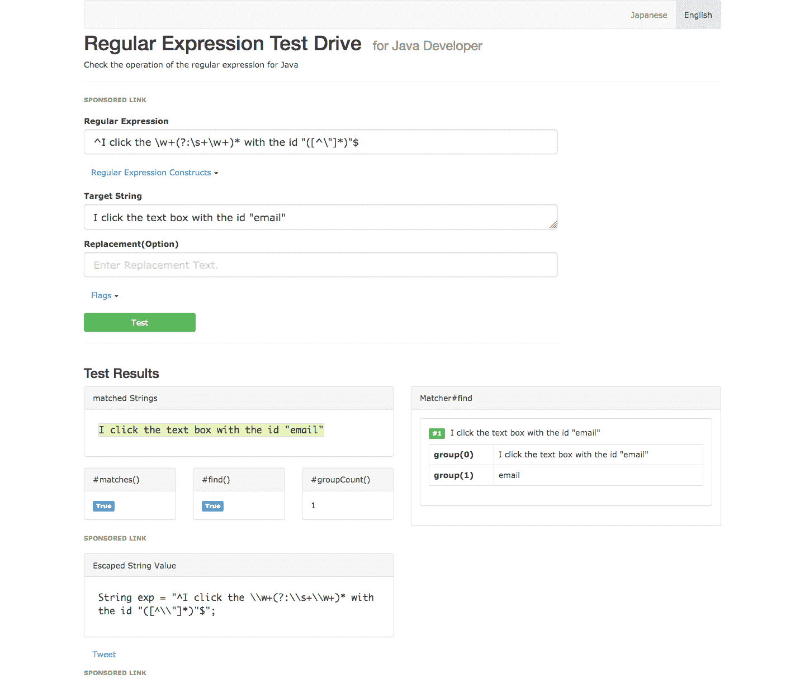
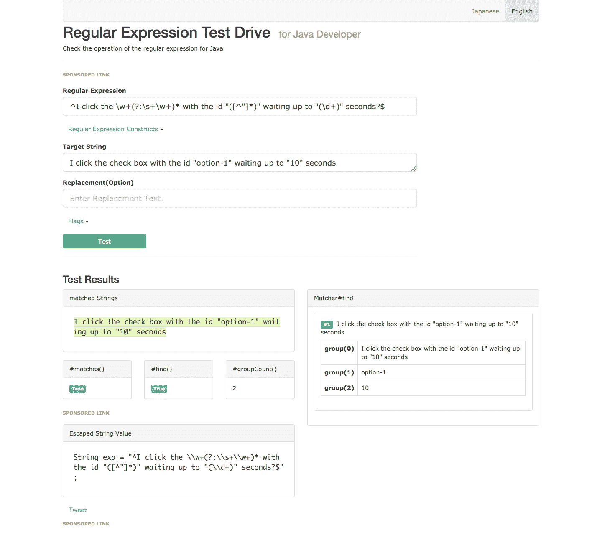
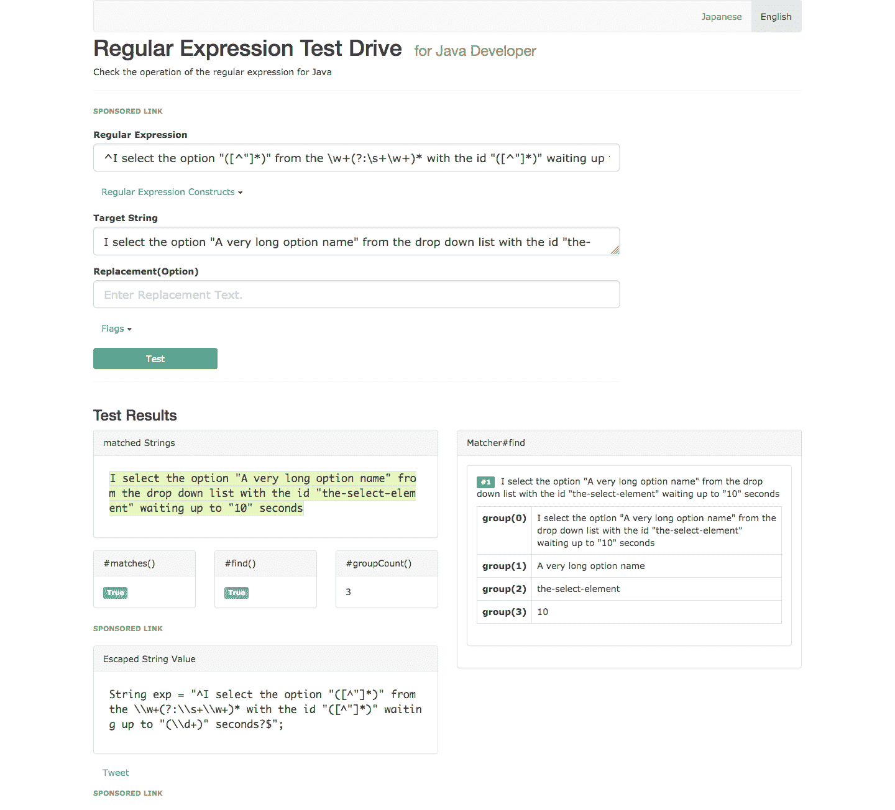

# 硒系列:暴露小黄瓜步骤-章鱼部署

> 原文：<https://octopus.com/blog/selenium/26-exposing-gherkin-steps/exposing-gherkin-steps>

这篇文章是关于[创建 Selenium WebDriver 测试框架](/blog/selenium/0-toc/webdriver-toc)的系列文章的一部分。

现在我们已经有了将`AutomatedBrowserBase`类与 Cucumber 集成的基础，是时候开始充实我们可以用来编写 WebDriver 测试的小黄瓜方言了。

在大多数测试中，打开浏览器后的下一步是打开一个 URL。我们可以通过注释`goTo()`方法来揭示这一点。

我们将使用正则表达式`^I open the URL "([^\"]*)"$`来捕获我们希望打开的 URL，并将其传递给`url`参数。这个正则表达式遵循我们熟悉的模式，即使用脱字符号和美元符号来匹配字符串的开头和结尾，一些必须进行字面匹配的纯文本，以及单组引号:

```
@And("^I open the URL \"([^\"]*)\"$")
@Override
public void goTo(String url) {
  // ...
} 
```

现在我们需要公开一些方法来与网页交互。这里我们已经注释了`clickElementWithId()`方法:

```
@And("^I click the \\w+(?:\\s+\\w+)* with the id \"([^\"]*)\"$")
@Override
public void clickElementWithId(String id) {
  // ...
} 
```

我们用来作为一个步骤公开这个方法的正则表达式包含一些新概念。

我们使用了一些字符类来匹配常见的字符类型。字符类是一个反斜杠，后跟一个定义类的字符。

`\w`字符类匹配任何单词字符，这意味着它匹配任何小写字符、任何大写字符和任何数字。

字符类匹配任何空白字符，比如空格或制表符。

您可以在 [Oracle 文档](https://docs.oracle.com/javase/tutorial/essential/regex/pre_char_classes.html)中找到关于正则表达式字符类的更多信息。

在这个正则表达式中，我们还使用了一个非捕获组。非捕获组以`(?:`开始，以`)`结束。非捕获组很有用，因为它们定义了我们可以选择或重复的匹配，而当模式与字符串匹配时，不会被捕获为一个不同的组。这对于与 Cucumber 的集成非常重要，因为非捕获组不会作为参数传递给相关的方法。

模式`\\w+(?:\\s+\\w+)*`匹配由空格分隔的零个或多个单词。因此，以下字符串将全部匹配此模式:

*   文字框
*   下拉列表
*   文本区域
*   单选按钮
*   检验盒

我们使用这种模式来允许以最自然的方式描述交互的元素。因为该模式使用非捕获组，Cucumber 不会将匹配的文本作为参数传递给该方法。

下表将正则表达式分解为各个部分:

| 模式 | 意义 |
| --- | --- |
| `^` | 匹配字符串的开头 |
| `I click the` | 匹配文字字符串`I click the` |
| `\\w+` | 匹配一个或多个单词字符 |
| `(?:` | 启动非捕获组 |
| `\\s+` | 匹配一个或多个空白字符 |
| `\\w+` | 匹配一个或多个单词字符 |
| `)*` | 结束非捕获组，并进行零次或多次匹配 |
| `with the id \"` | 匹配文字字符串`with the id "` |
| `(` | 启动捕获组 |
| `[^"]*` | 匹配除双引号以外的任何字符零次或多次 |
| `)` | 结束捕获组 |
| `\"` | 匹配文字字符串`"` |
| `$` | 匹配字符串的结尾 |

要了解匹配该正则表达式的步骤，请将其输入到[http://regex-testdrive.com/en/dotest](http://regex-testdrive.com/en/dotest)中，并测试以下示例:

*   我单击 id 为“email”的文本框
*   我单击 id 为“option-1”的复选框
*   我点击 id 为“提交”的红色大按钮

[](#)

注意，只捕获了两个组:组 0 是整个字符串，组 1 是我们想要单击的元素的 ID。然后，Group 1 作为第一个参数传递给该方法。

接下来，我们公开实现显式等待的重载版本`clickElementWithId()`。这个方法有第二个名为`waitTime`的参数，它接受一个`int`:

```
@And("^I click the \\w+(?:\\s+\\w+)* with the id \"([^\"]*)\" waiting up to \"(\\d+)\" seconds?$")
@Override
public void clickElementWithId(String id, int waitTime) {
  // ...
} 
```

这个方法的正则表达式与前一个相似，但是增加了一个捕获组来捕获等待元素可点击的时间。

这个正则表达式使用了一个新的字符类`\d`，它匹配任何数字。

下表将正则表达式分解为各个部分:

| 模式 | 意义 |
| --- | --- |
| `^` | 匹配字符串的开头 |
| `I click the` | 匹配文字字符串`I click the` |
| `\\w+` | 匹配一个或多个单词字符 |
| `(?:` | 启动非捕获组 |
| `\\s+` | 匹配一个或多个空白字符 |
| `\\w+` | 匹配一个或多个单词字符 |
| `)*` | 结束非捕获组，并进行零次或多次匹配 |
| `with the id \"` | 匹配文字字符串`with the id "` |
| `(` | 启动捕获组 |
| `[^"]*` | 匹配除双引号以外的任何字符零次或多次 |
| `)` | 结束捕获组 |
| `\" waiting up to \"` | 匹配文字字符串`" waiting up to "` |
| `(` | 启动捕获组 |
| `\\d+` | 匹配一个或多个数字字符 |
| `)` | 结束捕获组 |
| `\" second` | 匹配文字字符串`" second` |
| `s?` | 匹配零个或一个`s`字符 |
| `$` | 匹配字符串的结尾 |

要了解匹配该正则表达式的步骤，请将其输入到[http://regex-testdrive.com/en/dotest](http://regex-testdrive.com/en/dotest)中，并测试以下示例:

*   我点击 id 为“email”的文本框，等待“1”秒
*   我单击 id 为“option-1”的复选框，等待“10”秒
*   我点击 id 为“提交”的红色大按钮，等待“5”秒

[【](#)

这个正则表达式有三个捕获组。同样，组 0 是整个字符串。与前面的正则表达式一样，group 1 是要单击的元素的 ID，Cucumber 将它作为第一个参数传递给方法。新的 group 2 捕获显式等待时间，Cucumber 将其作为第二个参数传递给该方法。

让我们看看我们将用来定义一个步骤的最复杂的正则表达式。`selectOptionByTextFromSelectWithId()`方法接受下拉列表中要选择的选项的名称、下拉列表的 ID 以及等待下拉列表可点击的时间。这个正则表达式有 3 个捕获组:

```
@And("^I select the option \"([^\"]*)\" from the \\w+(?:\\s+\\w+)* with the id \"([^\"]*)\" waiting up to \"(\\d+)\" seconds?$")
@Override
public void selectOptionByTextFromSelectWithId(String optionText, String id, int waitTime) {
// ...
} 
```

下表将正则表达式分解为各个部分:

| 模式 | 意义 |
| --- | --- |
| `^` | 匹配字符串的开头 |
| `I select the option \"` | 匹配文字字符串`I select the option "` |
| `(` | 启动捕获组 |
| `[^"]*` | 匹配除双引号以外的任何字符零次或多次 |
| `)` | 结束捕获组 |
| `\"` | 从匹配的文字字符串`" from the` |
| `\\w+` | 匹配一个或多个单词字符 |
| `(?:` | 启动非捕获组 |
| `\\s+` | 匹配一个或多个空白字符 |
| `\\w+` | 匹配一个或多个单词字符 |
| `)*` | 结束非捕获组并匹配它零次或多次 |
| `with the id \"` | 匹配文字字符串`with the id "` |
| `(` | 启动捕获组 |
| `[^"]*` | 匹配除双引号以外的任何字符零次或多次 |
| `)` | 结束捕获组 |
| `\" waiting up to \"` | 匹配文字字符串`" waiting up to "` |
| `(` | 启动捕获组 |
| `\\d+` | 匹配一个或多个数字字符 |
| `)` | 结束捕获组 |
| `\"` | 第二个匹配文字字符串`" second` |
| `s?` | 匹配零个或一个`s`字符实例 |
| `$` | 匹配字符串的结尾 |

要了解匹配该正则表达式的步骤，请将其输入到[http://regex-testdrive.com/en/dotest](http://regex-testdrive.com/en/dotest)中，并测试以下示例:

*   我从 id 为“dropdownlist”的下拉列表中选择选项“Option One ”,等待“1”秒
*   我从下拉列表中选择了选项“一个很长的选项名”, id 为“the-select-element ”,等待了“10”秒
*   我从 id 为“alongid”的选项列表中选择“这也是一个长名字”选项，等待“5”秒

【T2 

现在我们有 4 个捕获组。因为 group 0 总是整个字符串，所以第一个捕获组是要选择的选项的名称，第二个是下拉列表的 ID，第三个是等待元素可点击的时间。

正如您所看到的，正则表达式非常强大，我们只涉及了正则表达式匹配字符串的一小部分方法。然而，这些正则表达式展示了我们将方法映射到小黄瓜步骤时使用的所有技术。剩下的所有方法都将使用正则表达式，其中包含我们在前面的方法中演示的捕获组、非捕获组、字符类和特殊字符的某种组合。

这篇文章是关于[创建 Selenium WebDriver 测试框架](/blog/selenium/0-toc/webdriver-toc)的系列文章的一部分。