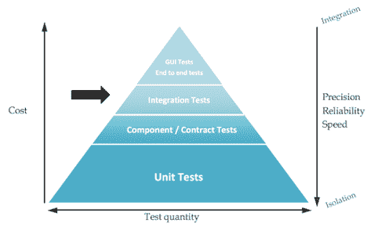
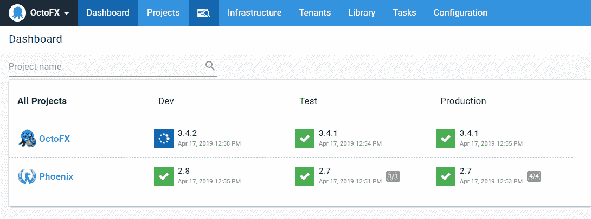
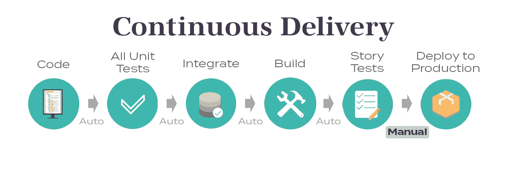
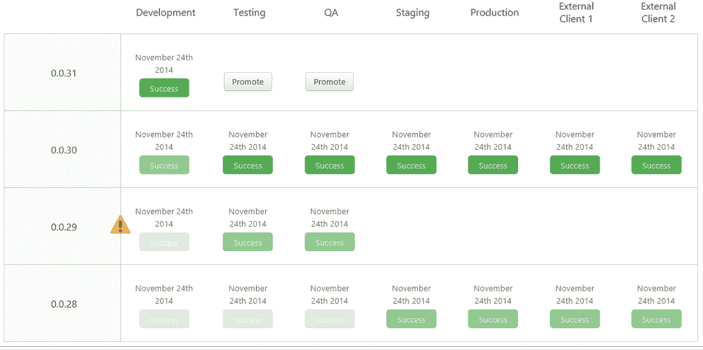

# 在您的 CI/CD 渠道中快速跟踪代码推广- Octopus 部署

> 原文：<https://octopus.com/blog/fast-tracking-code-promotion-in-your-ci-cd-pipeline>

[](#)

软件开发团队在 2020 年面临的最大挑战之一是需要更快地将代码交付给生产。为了无缝地做到这一点，我们需要一个完全自动化的部署过程，并且它必须可以在多个环境中重复。此外，为了放心地部署到生产环境而不中断服务，我们必须在测试金字塔的每一层都成功通过测试。

定义这个过程可能具有挑战性，而可视化它可能更加困难；谢天谢地，Octopus Deploy 让我们两者都变得容易了！在这篇文章中，我定义了一个*预先批准的*生产就绪的[部署管道](https://octopus.com/devops/continuous-delivery/what-is-a-deployment-pipeline/)，并讨论了所涉及的每个步骤的细节。

## 自动化测试金字塔

在深入我们的场景之前，让我们从定义我们的测试金字塔开始。一个完整的测试金字塔有四个模块。较低的块具有较高的测试数量，而较高的块具有较高的测试质量。完整的测试金字塔为我们的部署成功率提供了高度的信心:

[](#)

来源:[https://blog . octo . com/WP-content/uploads/2018/10/integration-tests-1024 x634 . png](https://blog.octo.com/wp-content/uploads/2018/10/integration-tests-1024x634.png)

如图所示，四层测试是:

*   **单元测试**:这些测试需要在我们管道的持续集成阶段取得成功。
*   **组件测试**:这些测试需要在我们管道的持续集成阶段取得成功。
*   **集成测试**:这些测试需要在我们管道的连续交付阶段取得成功。
*   端到端测试:在我们管道的连续交付阶段，这些测试必须成功。

## 方案

我们有一个正在生产中运行的`/hello/world`微服务，它当前返回一个 JSON 字段`message`，值为`hello world!`，我们希望在它成功返回时添加另一个名为`status`，值为`200`的响应字段:

```
{
    "message":"Hello World!",
    "status":200
} 
```

## 环境

[](#)

组织策略规定，任何提升到生产环境的代码都必须部署在以下环境中:

*   发展
*   试验
*   质量保证
*   预生产
*   生产

这些环境中的每一个都是静态集成环境，这意味着我们的应用程序的所有组件都存在于这些环境中。我们希望确保不会出现配置偏差。在后面的博文中，我将讨论如何让静态集成环境和短暂的动态环境共存于我们的 CI/CD 管道中。现在，我们将保持简单。

## 持续集成阶段

我们任何代码升级的目标都是构建一次，部署到任何地方。构建可部署对象显然是我们开始考虑部署它之前的第一步。在构建时，我们必须经历几个阶段:

1.  预构建:代码林挺/格式化
2.  预构建:单元测试
3.  预构建:组件测试
4.  预构建:静态代码分析
5.  预构建:第三方库安全性分析
6.  构建:二进制构建和打包
7.  后期构建:将二进制文件推送到工件存储库

这些是在我们预先批准的部署流程中必须发生的最小可定义单元或阶段。每个阶段都必须根据由我们的工具管理员、信息安全和软件架构师配置的预定义规则成功通过。在连续集成阶段成功通过之后，我们就为连续交付阶段做好了准备。

## 连续交货

[](#)

首先，我们来定义一下[连续交付](https://octopus.com/devops/continuous-delivery/)和[连续部署](https://octopus.com/devops/continuous-delivery/what-is-continuous-deployment/)的区别。来自[易消化的 DevOps:7 个 devo PS 实践](https://levelup.gitconnected.com/digestible-devops-the-7-devops-practices-8bd8b34e1418):

> 交付:“一旦自动化测试验证了源代码的每一处变更，就为产品发布做好准备的实践。这包括自动构建、测试和部署。”

> 部署:“持续部署是努力实现端到端自动化生产部署的实践。”

对于连续交付，我们希望将可部署的二进制文件放到最低的集成环境中，以确保二进制文件:

1.  根据需要执行。
2.  运行我们最低要求的第三和第四阶段自动化测试，他们成功通过。
3.  代码升级(或自动升级)的阶段。

通常，我们管道的持续交付方面作为持续集成管道的第二阶段来执行。对于开发人员来说，这是最容易混淆和最难解决的问题，因为这是传统的*操作*人员介入的地方。与管道的持续集成部分不同，我们在这里引入了许多新的故障点，包括:

*   网络连接。
*   名称空间冲突。
*   事件驱动/事件触发的步骤未完成。
*   混合部署问题和自动化测试问题。
*   集成多种工具并对这些集成进行故障排除。

Octopus Deploy 的一个优点是它有一个内置的工件存储库，因此我们不必通过将工件存储在第三方位置或工具中来引入另一个潜在的故障点。这意味着我们可以确信，事实上，新的工件事件确实触发了我们管道中的连续交付步骤。我们应该清楚地定义我们的连续交付自动化和我们的集成/端到端测试阶段之间的区别，以便弄清楚在我们的管道中什么地方可能出现了故障。这些步骤可以定义为:

*   CD 二进制部署。
*   CD 二进制验证。
*   集成测试光盘。
*   端到端测试时的 CD。

有一个 CD 二进制文件验证阶段是很重要的，它可以确保我们不仅得到了需要的二进制文件，而且它确实按照预期执行了。在这种情况下，如果我们有一个坏的二进制文件(由于损坏或错误的代码逻辑等。)，我们可以通过尽早失败并快速将反馈反馈给开发人员来节省大量时间。

## 什么时候测试？

代码升级的一个冲突方面是试图确保代码以相同的方式部署在每个环境中，同时只运行必要的测试以确保新的部署按预期工作。这方面的一个例子是在我们的 QA 环境中运行*负载测试*，而不是在其他环境中。在每个环境中运行负载测试将会非常耗时，并且会延长部署时间(这与我们试图实现的目标相反)。此外，我们可能不会在生产环境中运行负载测试，因为我们不想为实时服务的服务可靠性冒不必要的风险。

这就引出了一个问题，哪些测试需要运行，它们需要在什么时候运行，如何区分运行的测试，以及它们应该在什么环境中运行？

这些都是很好的问题，可以分为两类:

*   预先批准的 CI/CD 管道。
*   广泛的 CI/CD 渠道。

## 哪些变更可以通过预先批准的渠道进行？

并不是每一个代码变更都需要经过数小时的回归测试和负载测试。事实上，如果您遵循精益/敏捷开发方法，大多数代码更改不应该需要。如果变更很简单，并且没有从数据库中提取新数据或进行任何高级计算，那么该变更可能会被部署到生产环境中，而不需要进行全套测试，因为风险低且可信度高。

所有管道事件都应该从源代码控制中触发。为了确保更改将通过预先批准的 CI/CD 管道运行，我将创建一个新的 Git 分支，其命名约定如下:

`feature-pa-eado-4287-add_status_response`

*   `feature`:这意味着新的分支正在向代码库添加新的功能。
*   `pa`:这是一项预先批准的变更，将通过快速通道进行。
*   这是我的 JIRA 项目。
*   `<number>`:这是我项目的一张 JIRA 门票。
*   `add_status_response`:这是对变更的快速描述。

默认情况下，所有更改将通过完整的 CI/CD 管道运行。这确保了开发人员对他们的变更投入足够的思考，以确定它是否可以被*快速跟踪*以部署到生产中。

在以后的博文中，我们将讨论非预先批准的变更将如何贯穿我们完整的 CI/CD 管道。

## 完整的预批准 CI/CD 渠道

[](#)

1.  部署前步骤(GitHub/吉拉):
    1.  一名开发人员被分配到 JIRA 机票 EADO-4287。根据需求，确定这是一个小的变化，并创建一个特征分支`feature-pa-eado-4287-add_status_response`。
    2.  编写满足验收标准的单元测试。
    3.  编写满足单元测试的代码。
    4.  验证测试在本地成功通过，`git push`到源代码控制。
2.  持续集成(Jenkins):
    1.  预构建:代码林挺/格式化。
    2.  预构建:单元测试。
    3.  预构建:组件测试。
    4.  预构建:静态代码分析。
    5.  预构建:第三方库安全分析。
    6.  预构建:请求已打开，暂停等待批准。
    7.  预构建:请求批准、合并、标记主分支(`rc-<version>`、`pa`)。
    8.  构建:二进制构建并打包。
    9.  后期构建:将二进制文件推送到工件存储库(Octopus Deploy)。
3.  开发环境(Octopus 部署):
    1.  CD 二进制部署:将包复制并解压缩到 web 服务器。
    2.  CD 二进制验证:验证 web 服务器返回 200 响应。
    3.  集成测试中的 CD:验证来自负载平衡 URI 的 200 个响应。
    4.  端到端测试时的 CD:验证发出 API 调用的前端是否返回成功响应。
    5.  CD post git 标签:`dev_success`。
4.  测试环境:
    1.  Git 标签`dev_success`触发 CD 二进制部署:将包复制并解压缩到 web 服务器。
    2.  CD 二进制验证:验证 web 服务器返回 200 响应。
    3.  集成测试中的 CD:验证来自负载平衡 URI 的 200 个响应。
    4.  端到端测试时的 CD:验证发出 API 调用的前端是否返回成功响应。
    5.  CD post git 标签:`test_success`。
5.  质量保证环境:
    1.  Git 标签`test_success`触发 CD 二进制部署。将包复制并解压缩到 web 服务器。
    2.  CD 二进制验证:验证 web 服务器返回 200 响应。
    3.  集成测试中的 CD:验证来自负载平衡 URI 的 200 个响应。
    4.  端到端测试时的 CD:验证发出 API 调用的前端是否返回成功响应。
    5.  CD post git 标签:`qa_success`。
6.  生产前环境:
    1.  Git 标签`qa_success`触发 CD 二进制部署:将包复制并解压缩到 web 服务器。
    2.  CD 二进制验证:验证 web 服务器返回 200 响应。
    3.  集成测试中的 CD:验证来自负载平衡 URI 的 200 个响应。
    4.  端到端测试时的 CD:验证发出 API 调用的前端是否返回成功响应。
    5.  CD post git 标签:`preprod_success`。
7.  生产环境:
    1.  Git 标签`preprod_success`触发 CD 二进制部署:将包复制并解压缩到 web 服务器。
    2.  CD 二进制验证:验证 web 服务器返回 200 响应。
    3.  集成测试中的 CD:验证来自负载平衡 URI 的 200 个响应。
    4.  端到端测试时的 CD:验证发出 API 调用的前端是否返回成功响应。
    5.  CD post git 标签:`v<version>`。
    6.  CD post git 删除标签:
        1.  `rc-<version>`
        2.  `dev_success`
        3.  `test_success`
        4.  `qa_success`
        5.  `preprod_success`

## 结论

将代码快速部署到生产环境中是开发团队面临的最大挑战。代码推广和部署都是关于自信的。为了获得这种信心，我们的 CI/CD 渠道必须包含测试金字塔的四层。确定何时在哪个部署环境中执行测试金字塔的每一层成为下一个挑战，但是为小的、低风险的更改定义预先批准的部署管道有助于平衡速度和质量，并且使用 Git 分支和标签来触发您预先批准的管道有助于将部署责任交给最了解代码的人，即开发人员。

浏览 [DevOps 工程师手册](https://octopus.com/devops/)以了解更多关于 DevOps、CI/CD 以及软件测试在持续交付中的作用。