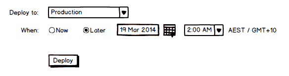

# 特征优先化:投票胜过一切吗？-章鱼部署

> 原文：<https://octopus.com/blog/feature-prioritization>

在我们的用户之声网站上，功能需求和建议通常介于两个极端之间:

1.  使我能够做一些目前不可能做的事情
2.  让目前可能做的事情变得稍微容易一点

作为一个软件发行商，我们的资源是有限的，我们不能对每一个建议都采取行动。对要采取行动的建议进行优先排序是很重要的，但这通常看起来是随机的，尤其是当投票数很少的项目在投票数很多的项目之前实施时。区分特性的优先级应该完全由投票决定吗？或者这应该是一个判断电话？

在决定采纳哪些建议时，我认为有许多因素需要考虑:

*   有多少人想要这个功能，他们想要多少(投票)？
*   有可接受的变通方法吗？
*   变通方法有多困难/理想？
*   该特性实现起来有多困难？
*   支持该功能的持续成本是多少？
*   我们能从这个特性中获益多久？

## 三个例子

举例来说，这里有三个关于 [Octopus Deploy UserVoice 网站](https://octopusdeploy.uservoice.com/)的建议:

1.  [安排发布](http://octopusdeploy.uservoice.com/forums/170787-general/suggestions/3262950-schedule-a-release) (18 票)
2.  [选择多个环境部署到](http://octopusdeploy.uservoice.com/forums/170787-general/suggestions/3032550-select-multiple-environments-to-deploy-to) (40 票)
3.  [恢复对 ie 8 的支持](http://octopusdeploy.uservoice.com/forums/170787-general/suggestions/5673167-support-internet-explorer-8) (3 票)

当您在 Octopus 中部署一个版本时，部署当前会立即执行。第一个建议意味着用户可以指定部署开始的时间。它可能看起来像这样:

当前的解决方法是要么在凌晨 2 点进入办公室，要么在凌晨 2 点安排一个可能运行也可能不运行的任务，该任务使用我们的 API 或命令行工具来触发部署。

第二个建议是，我们可以选择多个环境，而不是选择一个环境进行部署:

解决方法是简单地部署到一个环境，回到这个屏幕，选择下一个环境，然后再次部署。或者使用我们的 API 或命令行工具并指定要部署到的多个环境。

第三个建议不言自明——恢复对 IE8 的支持。目前我们只支持 IE9 或以上版本。

## 我们应该先做哪一个？

前两个建议可能有相同的难度——它们都可以很快完成。它们也是非常**孤立的**特性，不会影响产品中的许多其他特性。一旦我们构建了它们，并添加了一些测试来确保它们能够工作，这些就是我们可以忘记的特性。我喜欢这类功能。

“多种环境”比“预定部署”的票数多。但是“预定部署”的解决方法远不如“多环境”的解决方法理想。所以总的来说，我们可能会首先实现“预定部署”，尽管它有一半的票数。

## IE 8 支持怎么样？

这个很有意思。第一，很难；我们使用的一些库也不能很好地支持 IE8，所以我们必须解决这个问题。然后，在我们说我们“支持它”之前，我们必须测试应用程序的所有/大部分都是可用的。

但像这样的功能伴随着持续的成本:每当我们实现一个新功能，我们也必须用 IE 8 测试它。不像其他两个，我们永远不能“忘记”这个特性。与自动化浏览器验收测试相比，编写一个集成测试来确保预定的部署在正确的时间发生要容易得多。

IE8 的变通办法也很有趣:变通办法是存在的(升级 IE，换一个不同的浏览器)。但由于成本(或政治)的原因，这些变通办法虽然简单，但并不是所有客户都能接受的。老实说，我发现当一个解决方案存在，但由于这些原因被拒绝时，我比解决方案很难(例如，凌晨 2 点上班)时更少同情。

还有一个事实是，IE8 的市场份额正在萎缩；我们可以花一周的时间来增加对它的支持，再加上额外的时间来测试我们增加的每个功能/回应关于 IE8 问题的错误报告，然后在 6 个月内，无论如何没有人会需要它。

为此，我决定将 IE8 建议标记为*拒绝*。不仅仅是比其他两个特性优先级低；由于持续的支持成本和最终的淘汰，这实际上是一个负面特性。我可以让它开放，以避免伤害建议者的感情，但现实是，即使它有 50 票，我们只是永远不会这样做。

我很想知道:你同意这个推理吗？确定功能优先级时，还应该考虑哪些因素？建议的受欢迎程度应该是关键驱动因素吗？