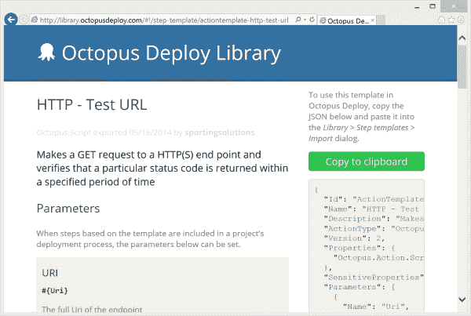
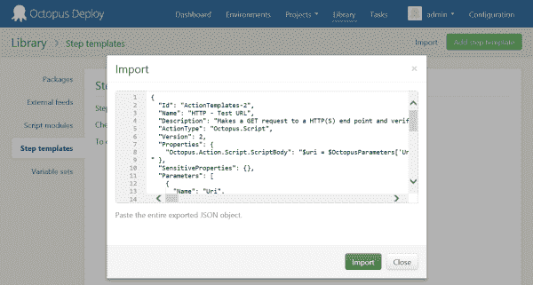
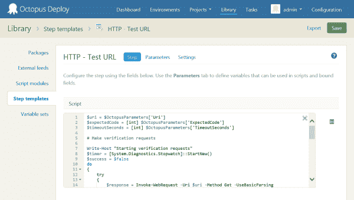
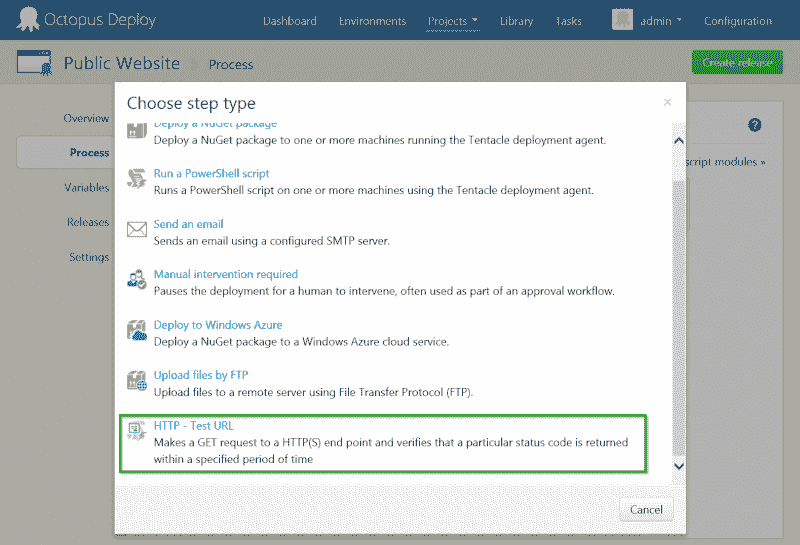
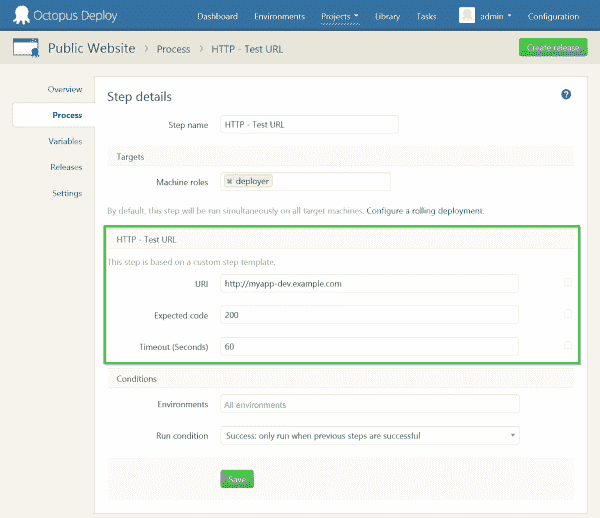
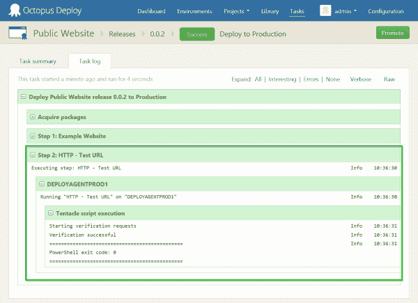

# 特色步骤模板:HTTP -测试 URL - Octopus Deploy

> 原文：<https://octopus.com/blog/featured-step-template-http-test-url>

无论是预热 web 服务器还是简单地测试一个新的部署，点击一个 URL 并验证结果是 web 应用程序部署过程中常见的事情。

虽然总是有可能用 Octopus Deploy 为这个编写一个 *PowerShell* 步骤， [Sporting Solutions](https://github.com/sportingsolutions) 已经足够友好地将这个打包到一个易于重用的模板中，用于 [Octopus Deploy 库](https://library.octopusdeploy.com)。

因为这是我们第一次在 Octopus Deploy 博客上展示贡献的 step 模板，所以让我们来看看如何将它引入到您的 Octopus 项目中。

## 导入模板

首先要做的是访问库并找到模板。你可以在这里找到 [HTTP - Test URL 模板。](http://library.octopusdeploy.com/#!/step-template/actiontemplate-http-test-url)

该库本身提供了模板的快速概述，以便您可以确定它是否符合您的要求；不出所料，这个页面上最重要的是绿色的**“复制到剪贴板”**按钮。

现在按它来检索描述模板的 JSON 文档。

接下来，登录你的 Octopus Deploy 服务器，访问*库>步骤模板*。在页面的右上角有一个*导入*链接——点击它，然后粘贴你刚刚从网站上复制的 JSON。

一旦您点击了 *Import* ，就会显示模板——如果您愿意，现在可以调整参数或脚本，但除此之外，模板已经准备好用于您的部署过程。

## 使用模板

假设您有一个安装 web app 的部署流程的项目，第一步是打开*项目>流程*选项卡，并选择*添加步骤*按钮。在显示的列表底部，您会看到刚刚导入的模板的名称。

当您单击模板名称来创建新步骤时，您将看到每个模板参数的输入字段。在 *HTTP - Test URL* 的情况下，这是要测试的 URL、预期的状态代码和超时值。

本例中的 URL 等步骤模板参数的工作方式就像普通的 Octopus 步骤参数一样——它们可以使用`#{Variable}`替换来绑定，每个参数本身作为一个变量公开，可以在其他地方使用，例如在 *PowerShell* 脚本中。

## 结果！

最后——这是最激动人心的部分:)—当您创建并部署项目的新版本时，该步骤将会运行，结果将会打印到部署日志中。

我们真的很喜欢 *HTTP - Test URL* 模板，因为尽管它非常简单，但它是使用 step 模板和 [Octopus Deploy 库](https://library.octopusdeploy.com)可以做什么的一个很好的例子。如果您还没有浏览过这个库，您可能会惊讶地发现有多少模板已经可用了。

> 如果你已经在编写 step 模板并想与 Octopus 社区分享，现在参加我们的[库竞赛](http://octopusdeploy.com/blog/build-octopus-library)还不算太晚；如果你提交一个模板，并在 6 月底前被接受，你就可以自豪地拥有一个 Octopus Deploy 马克杯！

愉快的部署！