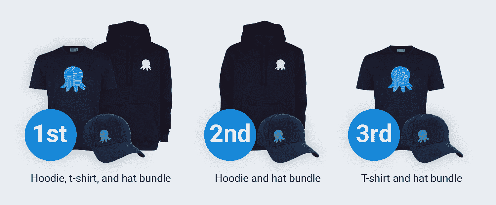

# 节日科技日历-八达通黑客马拉松-八达通部署

> 原文：<https://octopus.com/blog/festive-tech-calendar-hackathon>

Octopus Deploy 是今年[节日科技日历](https://festivetechcalendar.com)的一部分，举办黑客马拉松比赛。

黑客马拉松的目标是使用 Octopus Deploy 部署 Azure Web 应用程序。

## 什么是节日科技日历？

[Festive Tech Calendar](https://festivetechcalendar.com) 是一个为期一个月的免费社区科技活动。邀请所有技术社区的人提交演讲、内容和竞赛，并参与活动。

## 章鱼黑客马拉松

**什么**:使用 Octopus Deploy 部署一个 Azure Web 应用，然后填写我们的[黑客马拉松提交表单](https://forms.gle/PeGkA92uhnGsHy268)

**何时**:在 2021 年 12 月 1 日星期三至 12 月 15 日星期三之间完成练习

**奖品**:三个八爪鱼布包之一

### 黑客马拉松指南

我们的指导方针很宽松:

*   我们不介意你如何配置你的部署或者最终的 web 应用是什么，只要你使用 Octopus Deploy 部署 Azure
*   无论您的应用程序和流程是简单还是复杂
*   您可以构建一个新的 web 应用程序或使用 Octopus 示例之一:
*   你可以使用对你来说新的或者你熟悉的技术，从 ARM 模板、PowerShell、Terraform 到 GitHub 动作等等

首先，我们只是想让你玩得开心，学点东西！

### 如何进入

*   使用现有的 Azure 帐户或注册一个 [Azure 免费帐户](https://azure.microsoft.com/free)
    *   如果你注册了 Azure 免费帐户，你将自动获得 30 天 200 美元的 Azure 点数和 12 个月有限数量的额外免费服务
*   使用现有的 Octopus Deploy 实例或注册一个 [Octopus Cloud 免费试用版](https://octopus.com/start/cloud)
*   使用 Octopus Deploy 部署 Azure Web 应用程序
*   完成黑客马拉松后，请在 2021 年 12 月 15 日星期三格林威治时间下午 5 点之前填写我们的[黑客马拉松提交表格](https://forms.gle/PeGkA92uhnGsHy268)中的所有必填字段

### 优胜者

我们将从提交的作品中随机选出三名获胜者，他们将获得我们的一个礼品包:

我们将在 2021 年 12 月 20 日星期一格林威治时间下午 2 点左右宣布获胜者。

随意写一篇博客，创建一个视频，或者发一条关于你的黑客马拉松实现的微博，标记[@ octopus deploy](https://www.twitter.com/OctopusDeploy)；我们希望收到您的来信。

这些可选的活动不会给你额外的学分，但会传播一些社区精神。

#### 细则

*   购买或付款不是必要的，也不会增加你中奖的机会。
*   我们将只考虑每人一份参赛作品。
*   黑客马拉松不向 Octopus Deploy 的员工、代表或代理人开放，包括他们的所有直系亲属和家庭成员。
*   黑客马拉松不向参与设计、制作、推广、执行或分发黑客马拉松的任何其他个人开放，包括他们的所有直系亲属和家庭成员。
*   黑客马拉松提交期:格林威治时间 2021 年 12 月 1 日上午 8 点–格林威治时间 2021 年 12 月 15 日下午 5 点。
*   获胜者将于 2021 年 12 月 20 日(星期一)格林威治时间下午 2 点左右宣布。

## Octopus Deploy 入门

如果您以前没有使用过 Octopus Deploy，请查看以下资源:

愉快的部署！