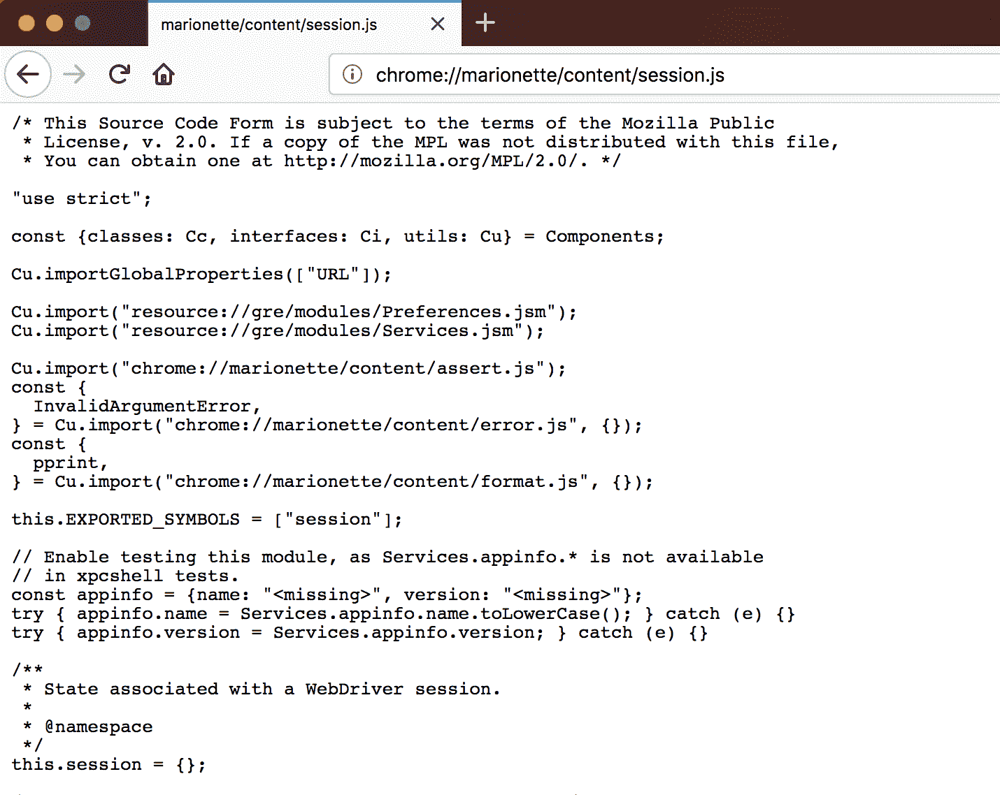

# Selenium 系列:Firefox 调试技巧- Octopus 部署

> 原文：<https://octopus.com/blog/selenium/12-firefox-debugging-tips/firefox-debugging-tips>

这篇文章是关于[创建 Selenium WebDriver 测试框架](/blog/selenium/0-toc/webdriver-toc)的系列文章的一部分。

我在使用代理时多次遇到的一个常见问题是 Firefox 中一个微妙的错误配置，它会导致抛出错误。

为了模拟这个错误，让我们尝试在`BrowserMobDecorator`类中配置 SOCKS 代理。

SOCKS 代理用于代理 TCP 数据包，这意味着它们可以用于 HTTP、HTTPS、FTP 和一系列其他高级协议。我们不会使用 BrowserMob 作为 SOCKS 代理，但是在这里配置它是演示错误配置错误的一个有用的方法。

我们通过调用`seleniumProxy.setSocksProxy(proxyStr)`来配置 SOCKS 代理:

```
@Override
public DesiredCapabilities getDesiredCapabilities() {

  proxy = new BrowserMobProxyServer();

  proxy.start(0);

  final Proxy seleniumProxy = new Proxy();
  final String proxyStr = "localhost:" + proxy.getPort();
  seleniumProxy.setHttpProxy(proxyStr);
  seleniumProxy.setSslProxy(proxyStr);
  seleniumProxy.setSocksProxy(proxyStr);

  final DesiredCapabilities desiredCapabilities =
    getAutomatedBrowser().getDesiredCapabilities();

  desiredCapabilities.setCapability(CapabilityType.PROXY, seleniumProxy);

  return desiredCapabilities;
} 
```

在 Firefox 中以这种配置运行测试将导致抛出下面的异常:

```
org.openqa.selenium.SessionNotCreatedException: InvalidArgumentError: Expected [object Undefined] undefined to be an integer
Build info: version: '3.12.0', revision: '7c6e0b3', time: '2018-05-08T14:04:26.12Z'
System info: host: 'Christinas-MBP', ip: '192.168.1.84', os.name:
'Mac OS X', os.arch: 'x86_64', os.version: '10.13.5', java.version: '1.8.0_144'
Driver info: driver.version: FirefoxDriver
remote stacktrace: WebDriverError@chrome://marionette/content/error.js:178:5
InvalidArgumentError@chrome://marionette/content/error.js:305:5
assert.that/<@chrome://marionette/content/assert.js:405:13
assert.integer@chrome://marionette/content/assert.js:256:10
assert.positiveInteger@chrome://marionette/content/assert.js:274:3
fromJSON@chrome://marionette/content/session.js:291:28
match_@chrome://marionette/content/session.js:458:23
fromJSON@chrome://marionette/content/session.js:427:12
GeckoDriver.prototype.newSession@chrome://marionette/content/driver.js:693:25
despatch@chrome://marionette/content/server.js:293:20
execute@chrome://marionette/content/server.js:267:11
onPacket/<@chrome://marionette/content/server.js:242:15
onPacket@chrome://marionette/content/server.js:241:8
_onJSONObjectReady/<@chrome://marionette/content/transport.js:500:9 
```

[](#)

从异常中的消息来看，似乎某些远程 JavaScript 代码导致了一个错误。但是这段 JavaScript 代码在哪里，我们如何调试错误呢？

查看 JavaScript 堆栈跟踪，错误的来源似乎在这两行代码中。一个名为`fromJSON()`的方法断言一个整数是正的，这个断言失败了:

```
assert.positiveInteger@chrome://marionette/content/assert.js:274:3
fromJSON@chrome://marionette/content/session.js:291:28 
```

调试这个错误的关键是要理解文件`chrome://marionette/content/session.js`是和 Firefox 捆绑在一起的。如果你在 Firefox 中输入这个网址，你可以看到文件的来源。

[](#)

在这种情况下，有问题的代码行是:

```
p.socksVersion = assert.positiveInteger(json.socksVersion); 
```

[](#)

从这段代码中，我们可以推断出我们需要定义 SOCKS 代理的版本。

理论上，您可以用下面的代码在`BrowserMobDecorator`类中定义 SOCKS 代理版本:

```
@Override
public DesiredCapabilities getDesiredCapabilities() {
  // ...
  seleniumProxy.setSocksVersion(5);
  // ...
} 
```

实际上，WebDriver 库中的错误仍然会导致代码失败。然而，从这篇文章中得到的重要信息是，当您看到 Firefox stack traces 带有以`chrome://marionette/`开头的 URL 时，您可以通过直接在 Firefox 中输入 URL 来访问这些文件的源代码，以便调试根本原因。

这篇文章是关于[创建 Selenium WebDriver 测试框架](/blog/selenium/0-toc/webdriver-toc)的系列文章的一部分。