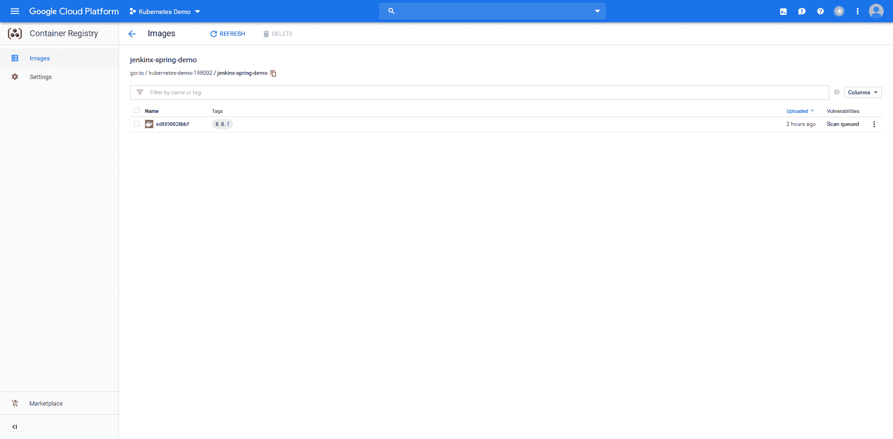

# 詹金斯 X - Octopus 部署初探

> 原文：<https://octopus.com/blog/first-look-at-jenkins-x>

[](#)

作为一个免费的开源构建服务器，Jenkins 被数百万人使用，所以大多数开发者都使用过或者至少听说过 Jenkins。像大多数构建服务器一样，Jenkins 通常安装在服务器上，以使用源代码，在构建代理上执行构建过程，并部署或发布生成的工件。

从概念上讲，这个构建服务器的模型对我来说很容易理解，它适用于当今大多数流行的解决方案，如 Team City、Azure DevOps、Bamboo 等。所以第一次和 [Jenkins X](https://jenkins-x.io/about/) 合作的时候，很自然的，我尝试用同样的概念模型去理解。这被证明是一个错误。

我真的很难理解 Jenkins X 是什么，但是在一些尝试和错误之后，我回去重读了关于第页的[Jenkins X。深藏在文本中的两句话对于理解詹金斯 X 至关重要:](https://jenkins-x.io/about/what/)

> 詹金斯 X 固执己见。

> 要注意的关键是，你需要从你可能已经有的任何詹金斯经验中清除你的头脑。

内化这两个陈述对于理解詹金斯 X 是什么是至关重要的。考虑到这一点，让我们从高层次上来看看詹金斯 x。

## 它始于库伯内特星团

从字面上看，Kubernetes 是一个容器编排器。你描述你想要运行的容器，它们如何相互通信，它们需要什么资源，Kubernetes 做执行一切的艰苦工作。通常，Kubernetes 托管长期运行的应用程序，如不断等待请求的 web 服务器，Kubernetes 的一个重要特性是它将监控这些长期运行的进程，并在它们失败时重新启动它们。

这种对 Kubernetes 的传统看法是你首先要忘记的。要理解 Jenkins X，可以把 Kubernetes 更像一个云操作系统。

你使用`apt-get`在 Linux 中安装一个应用程序，同样，Kubernetes 可以使用 [Helm](https://helm.sh/) 安装应用程序。

就像您可以使用`docker` CLI 运行短期命令来构建您的应用程序和 Docker 映像一样，Kubernetes 可以使用[ska fold](https://github.com/GoogleContainerTools/skaffold)构建软件和 Docker 映像。

由于您将托管 Docker 图像或其他图像工件库，如 [Nexus](https://www.sonatype.com/nexus-repository-sonatype) 作为随操作系统启动的服务，因此您可以将这些相同的应用程序部署到 Kubernetes。

Jenkins X 将您的 Kubernetes 集群视为一个运行构建的环境，一种托管工件存储库的方式，一个 Helm charts 的安装目标，最后，一个部署和运行您构建的应用程序的地方。

通过安装 Jenkins X，您将拥有一个自包含的 Kubernetes 集群，其中包含精选和定制配置的服务，可以开始构建和部署应用程序。

## 这扩展到了您的本地开发环境

我习惯于我的本地开发环境与中央构建服务器完全分离。为了让我的代码进入构建服务器，我通常将它推到一个中央 GIT 存储库，转到 CI 服务器，将一个项目指向 GIT repo，配置构建，然后启动它。

如果我的 CI 服务器提供了 CLI 工具，它专门用于管理 CI 服务器。这样的工具对我正在处理的代码没有任何概念。

同样，忘记您从传统 CI 服务器中学到的一切。Jenkins X 对如何构建和部署您的代码有自己的看法，并不羞于为您配置一切。

要让 Jenkins X 构建您的现有代码，您可以运行`jx import`。运行该命令将向您的项目添加几个文件，包括`jenkins-x.yml`(这是 [Jenkins X 管道](https://jenkins-x.io/architecture/jenkins-x-pipelines/))、`Dockerfile`(这构建了 [Docker 映像](https://docs.docker.com/engine/reference/builder/))、`skaffold.yaml`(这是[ska fold 项目配置](https://skaffold.dev/docs/references/yaml/))和一个`charts`目录(这提供了[掌舵图模板](https://helm.sh/docs/chart_template_guide/))。

Jenkins X 然后将所有代码放入 GIT 存储库中，推送它，并开始构建。

正如您从下面的输出中看到的，Jenkins X 将许多不同的工具和服务结合在一起，以创建一个可重复的构建过程:

```
PS C:\Users\Matthew\Downloads\ThymeleafSpring> jx import
WARNING: No username defined for the current Git server!
? Do you wish to use mcasperson as the Git user name: Yes
The directory C:\Users\Matthew\Downloads\ThymeleafSpring is not yet using git
? Would you like to initialise git now? Yes
? Commit message: Initial import

Git repository created
selected pack: C:\Users\Matthew\.jx\draft\packs\github.com\jenkins-x-buildpacks\jenkins-x-kubernetes\packs\maven
? Which organisation do you want to use? mcasperson
replacing placeholders in directory C:\Users\Matthew\Downloads\ThymeleafSpring
app name: thymeleafspring, git server: github.com, org: mcasperson, Docker registry org: kubernetes-demo-198002
skipping directory "C:\\Users\\Matthew\\Downloads\\ThymeleafSpring\\.git"
Using Git provider GitHub at https://github.com
? Using organisation: mcasperson
? Enter the new repository name: ThymeleafSpring
Creating repository mcasperson/ThymeleafSpring
Pushed Git repository to https://github.com/mcasperson/ThymeleafSpring
Creating GitHub webhook for mcasperson/ThymeleafSpring for url http://hook.jx.35.194.232.107.nip.io/hook

Watch pipeline activity via:  jx get activity -f ThymeleafSpring -w
Browse the pipeline log via:  jx get build logs mcasperson/ThymeleafSpring/master
You can list the pipelines via: jx get pipelines
When the pipeline is complete: jx get applications

For more help on available commands see: https://jenkins-x.io/developing/browsing/ 
```

## 构建和部署将它们联系在一起

如果说传统 CI 服务器有一个好处的话，那就是因为您手动设置了一切，所以您对代码如何从源代码库流向最终部署有一个相当好的想法。

因为 Jenkins X 为我们做了这么多工作，所以很难理解构建过程中实际发生了什么。所以让我们来看看幕后的一些工作。

作为 Kubernetes 集群初始化的一部分，Jenkins X 安装了 Nexus 存储库管理器。构建完成后，我们可以看到我们的应用程序所依赖的 Java 依赖项现在被缓存在本地。这种缓存意味着任何后续构建都将更快地完成。

[](#)

Jenkins X 安装的另一个服务是 ChartMuseum，这是一个 Helm 存储库。通过下载`index.yaml`文件，我们可以看到 Jenkins X 已经创建了一个舵图并发布到这个内部存储库中:

```
curl http://chartmuseum.jx.35.194.232.107.nip.io/index.yaml
apiVersion: v1
entries:
  jenkinx-spring-demo:
  - apiVersion: v1
    appVersion: 0.0.1
    created: "2019-08-28T19:25:22.445582847Z"
    description: A Helm chart for Kubernetes
    digest: 9e048b78247da2a28562771742454484dbaf35b10d14a0c0a668c3ba826d02c4
    icon: https://raw.githubusercontent.com/jenkins-x/jenkins-x-platform/master/images/java.png
    name: jenkinx-spring-demo
    urls:
    - charts/jenkinx-spring-demo-0.0.1.tgz
    version: 0.0.1
generated: "2019-08-28T19:32:00Z" 
```

Jenkins X 还负责将 Docker 映像发布到本地容器注册中心。因为我们在 Google Cloud Kubernetes 集群中运行 Jenkins X，所以 Jenkins X 默认使用 Google 容器注册表。然而，如果该服务不可用，Jenkins X 就会在 Kubernetes 集群中安装 Docker 注册中心。

[](#)

最后，我们可以看到 Helm 图表已经部署在集群中，并且入口规则已经由 [exposecontroller](https://jenkins-x.io/faq/technology/#whats-is-exposecontroller) 创建，这导致我们的应用程序公开了一个自定义主机名。

[](#)

## 结论

当你第一次遇到 Jenkins X 时，可能很难理解它到底是什么。如果从这篇文章中有什么收获的话，那就是忘记你所知道的关于 CI 服务器的一切，并欣赏 Jenkin X 本身。

Jenkins X 不仅仅是一种运行构建的方式，它提供了一个完整的构建生态系统和自以为是的工作流，从准备本地代码结构开始，到部署 Kubernetes 应用程序结束。

欣赏 Jenkins X 需要从大多数开发人员与开发管道交互的方式上进行思维转变，但好处是一个结构良好的工作流和紧密配置的工具链。