# 使用 Flyway 和 Octopus 执行容器的数据库部署——Octopus Deploy

> 原文：<https://octopus.com/blog/flyway-deployments-with-execution-containers>

[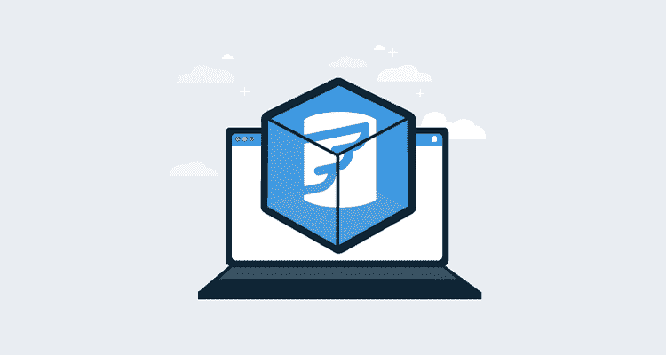](#)

我最近使用了 [Flyway](https://flywaydb.org) 和 Octopus Deploy 来部署数据库更改。Flyway 给我留下了深刻的印象，除了我必须将工具和 Java 运行时引擎(JRE)捆绑在一起，或者将它们预安装在一个 worker 上。

在 Octopus Deploy 的 **2020.2** 版本中，我们引入了[执行容器](https://octopus.com/blog/execution-containers)特性。执行容器使用 Docker 映像来管理依赖性。

这篇文章介绍了如何使用执行容器和 Flyway 在 Octopus Deploy 中配置数据库部署。

## 执行容器基础

我不喜欢在我的包中包含所有运行 Flyway 的二进制文件，因为这会导致包膨胀。在我的例子中，差别是 10 KB 对 90 MB。

作为一名开发人员，我还负责升级二进制文件，并将它们包含在我的 Git repo 中。我还避免在员工身上预装工具，因为这意味着每个人都在同一版本上，升级可能会影响每个人。

执行容器通过使用 Docker 映像来管理依赖性，从而解决了这两个问题。Docker 映像拥有所有必要的工具(JRE、Flyway、PowerShell 等。)已安装。您可以指定部署过程中使用的 Docker 映像和标记。当部署使用执行容器运行时，Calamari 执行 Docker run 命令。此外，Calamari 会自动将文件夹挂载到容器中。

任务日志显示类似于以下内容的命令:

```
docker run --rm  --env TentacleHome=/home/Octopus  -w /home/Octopus/Work/20210329204922-325128-24   -v /home/Octopus/Work/20210329204922-325128-24:/home/Octopus/Work/20210329204922-325128-24  -v /home/Octopus:/home/Octopus  index.docker.io/octopuslabs/flyway-workertools:latest 
```

您拥有的任何包都会自动提取到`/home/Octopus/Work/[DATETIME]`文件夹中。这发生在幕后。要从直接在 worker 上运行改为在执行容器上运行，只需单击一个单选按钮并提供包名。其他都一样。

## 飞行路线执行容器

Octopus Deploy 提供了你可以使用的官方 Docker 图片。不幸的是，这些图像不能在这个例子中使用，原因有二:

1.  它们包括几十种需要从 Docker Hub 下载千兆字节以上数据的工具。
2.  没有一张图片包含飞行路线。

为了克服这一点，我创建了一个 [Docker 图像](https://hub.docker.com/r/octopuslabs/flyway-workertools)，你可以在这个例子中使用。我还创建了一个 [GitHub 动作](https://github.com/OctopusDeployLabs/flyway-workertools/blob/main/.github/workflows/docker-build-push.yml)，它将每天运行一次，并在检测到新版本时构建一个新映像。

这个 Docker 映像的[基础映像](https://hub.docker.com/r/octopuslabs/workertools)包括我们支持的最流行的脚本语言:PowerShell 和 Python。基于 Ubuntu 的镜像也支持 Bash。

## 脚手架

需要完成两个脚手架步骤:

1.  安装 [Flyway 数据库迁移步骤模板](https://library.octopus.com/step-templates/ccebac39-79a8-4ab4-b55f-19ea570d9ebc/actiontemplate-flyway-database-migrations)。
2.  添加一个 Docker 容器注册表外部提要，并将其指向`https://index.docker.io`。

[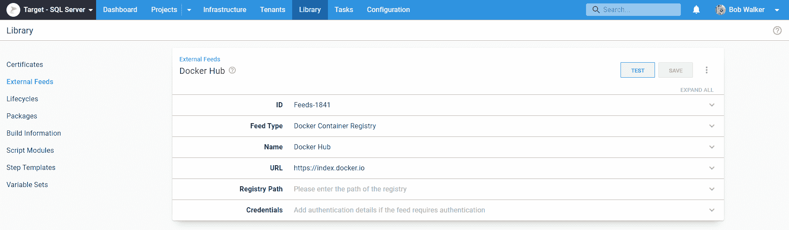](#)

## Flyway 数据库迁移步骤模板

如果您在我们的[社区步骤模板库](https://library.octopus.com)中搜索`Flyway`，您会注意到许多 Flyway 步骤模板。 **Flyway 数据库迁移**步骤模板旨在取代旧的步骤模板。

这个新步骤模板的主要区别在于:

1.  您可以选择任何命令(migrate、info、validate 等。)飞行路线支持。
2.  我和 Redgate 的 Flyway 团队一起寻找流行的命令行开关。
3.  支持免费和付费版本的 Flyway，使您能够进行模拟迁移，并能够使用 undo 命令。
4.  它既可以在 Linux 上运行，也可以在 Windows 上运行。
5.  它试图找到 Flyway 可执行文件，使得将 Flyway 包含在包中(如果您喜欢的话)或在执行容器中运行它变得容易。
6.  SQL 和 JAR 迁移都受支持。

我遵循了类似的模式，在最近的其他步骤模板中包含了更多的参数，例如:

我这样做是为了确保任何以`-`开头的参数都是 Flyway 命令行工具中的[命令行开关](https://flywaydb.org/documentation/configuration/parameters/)。

## 打包迁移脚本

我们的文档指导你构建你的包。然而，如果您只有 SQL 文件，就没有什么可构建的了。你只需要把文件夹打包到你的构建服务器上，然后推给 Octopus。

考虑这个例子: [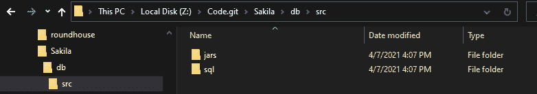](#)

您需要在构建服务器上的`db/src`文件夹中运行 Octo Pack 命令。该包将包含这些文件夹和内容。

[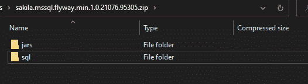](#)

在构建包之后，您需要将它发布到 Octopus Deploy。为了验证概念，您不需要构建服务器。可以使用 7-Zip 之类的工具将文件夹压缩成`Flyway.Test.1.0.0.zip`，手动[上传包](https://octopus.com/docs/packaging-applications/package-repositories/built-in-repository#pushing-packages-to-the-built-in-repository)。这就是我为这篇文章所做的。

然而，在概念验证之后，如果集成一个构建服务器是有意义的，我们有文档和博客文章来帮助你。

构建服务器的示例:

## 配置项目

现在我们可以配置项目了，因为我们已经上传了步骤模板、Docker 提要和包。

首先，创建一个项目。在这个例子中，我将使用名称 [Flyway - Azure SQL 执行容器](https://samples.octopus.app/app#/Spaces-106/projects/flyway-azure-sql-execution-containers/deployments)。参见我们的 samples 实例中的 Flyway 示例，了解如何使用执行容器。

### 变量

创建项目后，导航至**变量**并添加必要的变量。

我推荐命名空间变量，例如项目变量使用`Project.[Component].[VariableName]`，库变量集变量使用`[VariableSetName].[Component].[VariableName]`。这将使在流程中插入变量时更容易找到它们。

*   `Project.Database.ConnectionString`:我要部署到的数据库的连接字符串。**请注意:**这是我的例子使用 SQL Server 和将其改为 Oracle、MySQL、PostgreSQL、Maria、Snowflake 等之间唯一的*真正的区别。*
*   `Project.Database.Name`:要部署到的数据库的名称。
*   `Project.Database.Password`:进行部署的数据库用户的密码。
*   `Project.Database.UserName`:执行部署的数据库用户的用户名。
*   `Project.Database.Server.Name`:数据库所在服务器的名称。
*   `Project.Flyway.LicenseKey`:fly way 许可证密钥需要利用诸如模拟运行部署和撤消等功能。**请注意:**如果没有提供许可证密钥，Flyway 将恢复为社区版。
*   `Project.Worker.Pool`:工人池，工作将在这里完成。

[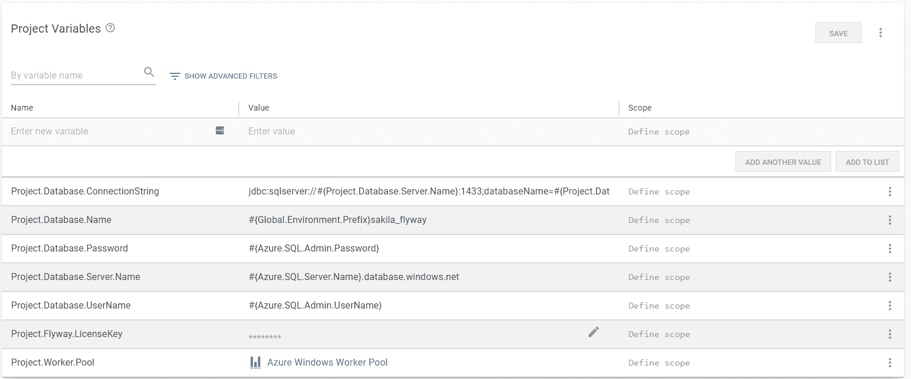](#)

### 部署流程

在[我们的文档](https://octopus.com/docs/deployments/databases/common-patterns/manual-approvals)中，我们建议从以下数据库部署流程开始:

1.  生成一个 delta 脚本，并将其作为一个[工件](https://octopus.com/docs/projects/deployment-process/artifacts)进行附加。
2.  通知数据库管理员等待批准(仅在生产中)。
3.  数据库管理员通过人工干预批准增量脚本[(仅在生产中)。](https://octopus.com/docs/projects/built-in-step-templates/manual-intervention-and-approvals)
4.  部署数据库更改。
5.  通知团队成功或失败。

[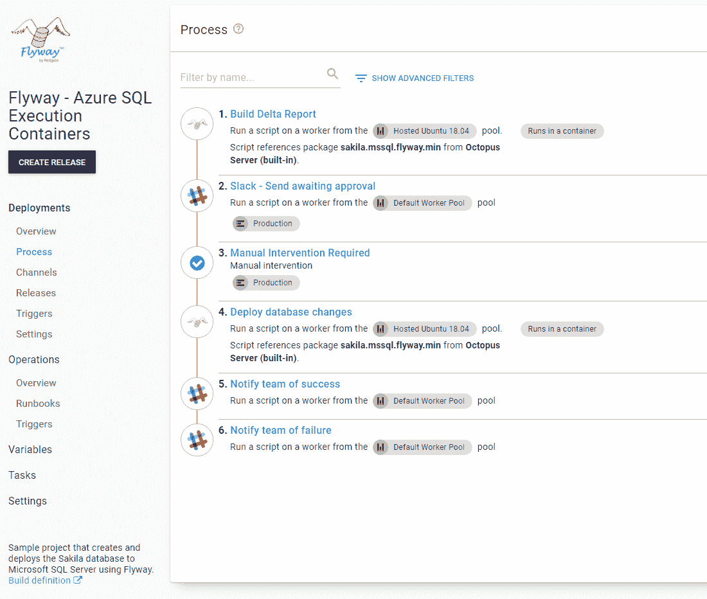](#)

通知步骤可以是电子邮件、Slack、微软团队或您选择的任何工具。手动干预是不言自明的，我们在文档中包含了这些信息。

### 使用 Flyway 数据库迁移步骤模板

生成增量报告和部署数据库更改是使用 Flyway 数据库迁移步骤模板完成的。当您将其添加到流程中时，请进行以下更改:

1.  更新步骤的名称。
2.  把它改成在一个工人身上运行。
3.  选择一个工作池。
4.  将容器图像更改为`runs inside a container, on a worker`。
5.  输入`octopuslabs/flyway-workertools:latest`作为 Docker 图像；Docker 会根据主机运行的内容自动下载正确的架构(Ubuntu 或 Windows)。

工人必须安装 Docker 才能工作。章鱼云提供了已经在运行 Docker 的托管工人。如果你想自己托管你的工人，Linux 工人必须运行 Linux 容器，而 Windows 工人只能运行 Windows 容器。

[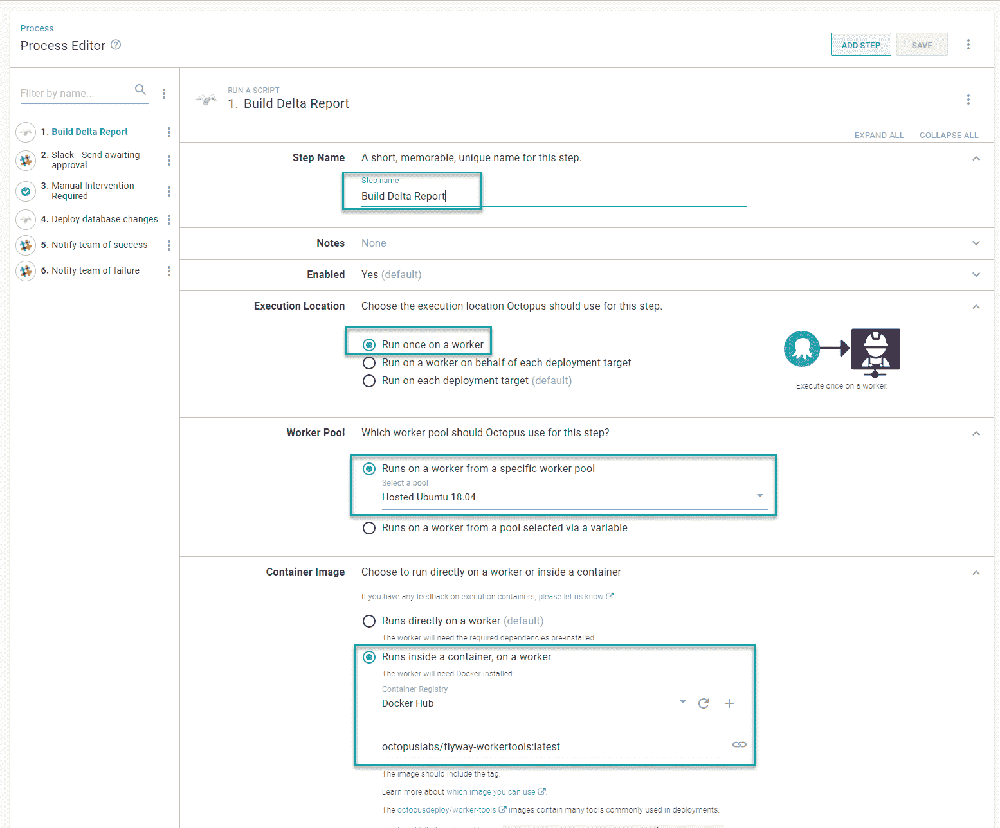](#)

步骤模板将在哪里运行现在已经配置好了。接下来，我们配置参数:

*   选择包含您希望 Flyway 运行的脚本的包。
*   可选:输入飞行路线所在的路径。

如果你在`octopuslabs/flyway-workertools`执行容器上运行这个，你不需要输入任何东西。步骤模板将自动找到要运行的可执行文件。

*   选择希望该步骤运行的命令。

[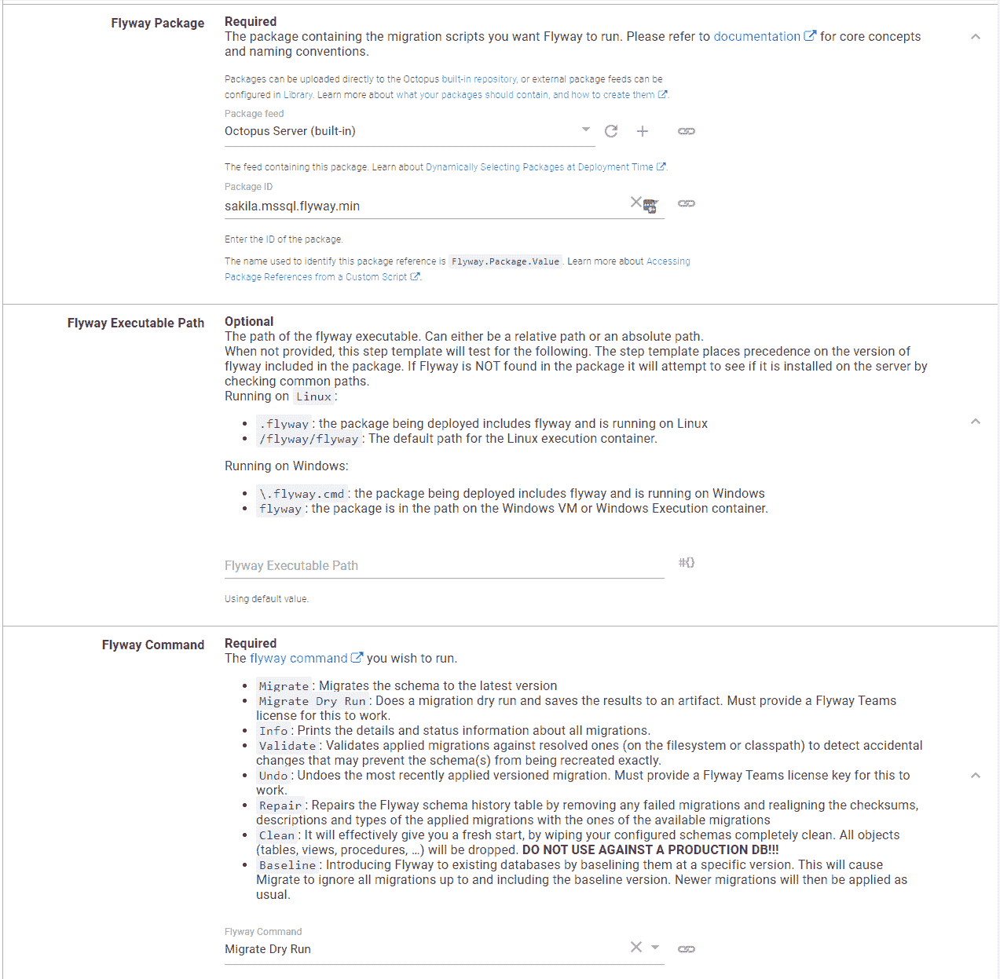](#)

Octopus 中最常用的命令是:

*   `info`:这将生成一个列表，列出所有找到的脚本以及它们相对于正在部署的数据库的状态。当使用 community edition 时，info 命令是理想的，您需要列出将在数据库上运行的脚本。

[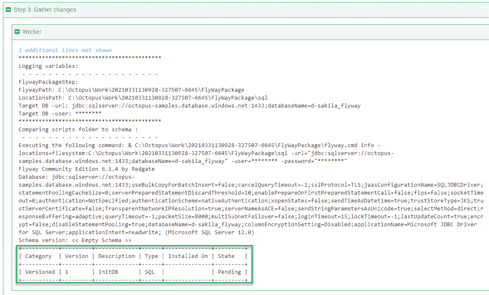](#)

*   `migrate dry run`:这将生成一个包含所有待定 SQL 脚本的文件，它将被保存为一个工件，DBA 可以下载和查看。这优于`info`，但仅当您提供一个 Flyway 许可密钥时才受支持。

[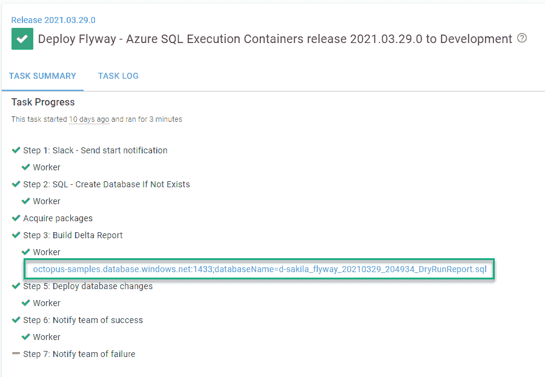](#)

*   `migrate`:这将获取包中的所有 SQL 脚本和 JAR 文件，并在目标数据库上运行它们。这是执行实际工作的命令。

[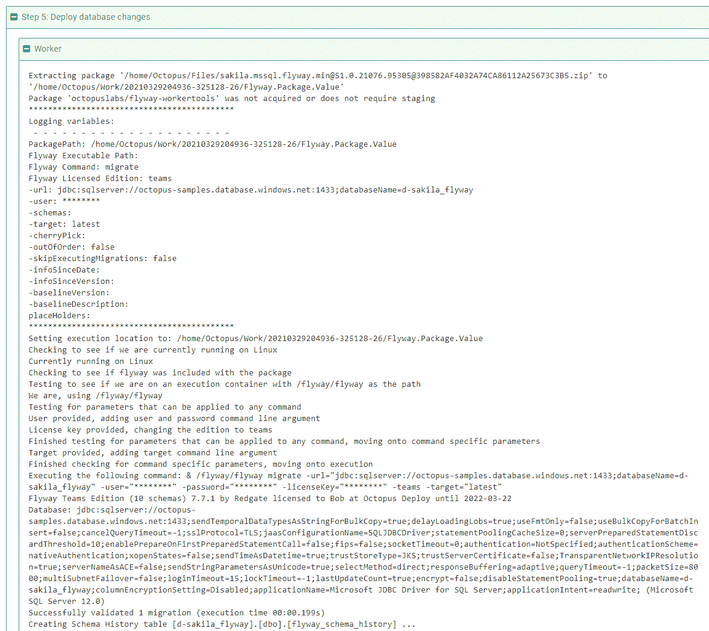](#)

接下来是许可参数，接下来是连接参数，最后是 Flyway 支持的各种命令行开关。

*   因为我有许可证密钥，所以把版本改成了`Teams`。
*   下一个选项是传递许可证密钥。
*   然后，使用连接字符串格式提供数据库的 URL。
*   之后是可选的[参数](https://flywaydb.org/documentation/configuration/parameters/)，供 Flyway 运行。

[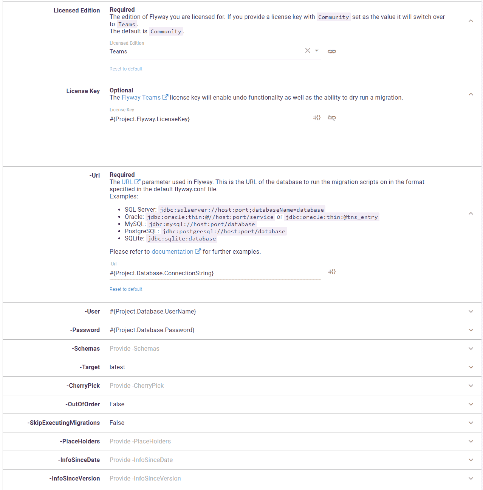](#)

step 模板包括每个参数的详细帮助文本以及相应文档的链接。

[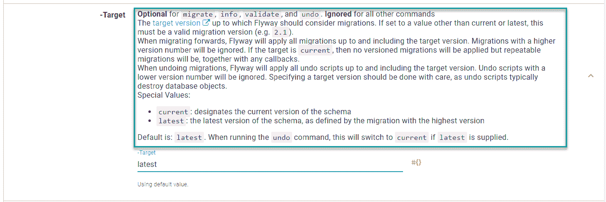](#)

并非所有命令都支持所有命令行参数。步骤模板足够智能，可以排除命令不支持的参数。

### 生成增量脚本步骤

生成供 DBA 批准的增量脚本的步骤设置了以下参数。我有一个许可证密钥，所以我正在使用`migrate dry run`命令。如果我没有许可证密钥，我会选择`info`作为命令。

[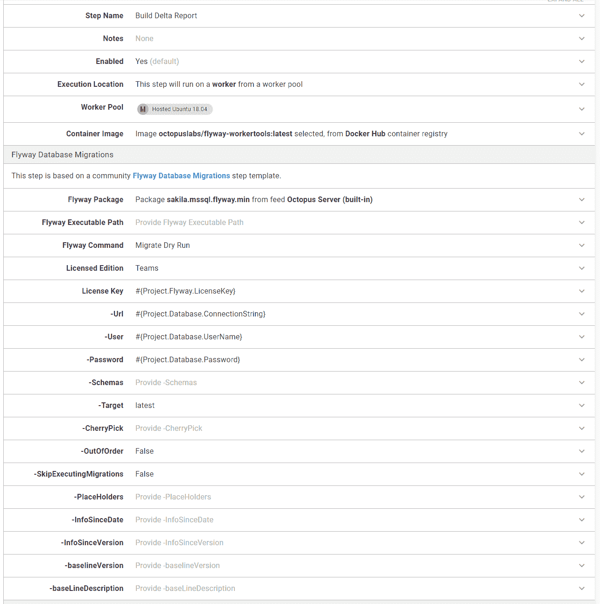](#)

### 部署数据库更改步骤

从包中部署数据库变更的步骤实际上与**生成增量脚本**步骤相同。唯一的区别是使用命令`migrate`而不是`migrate dry run`。

[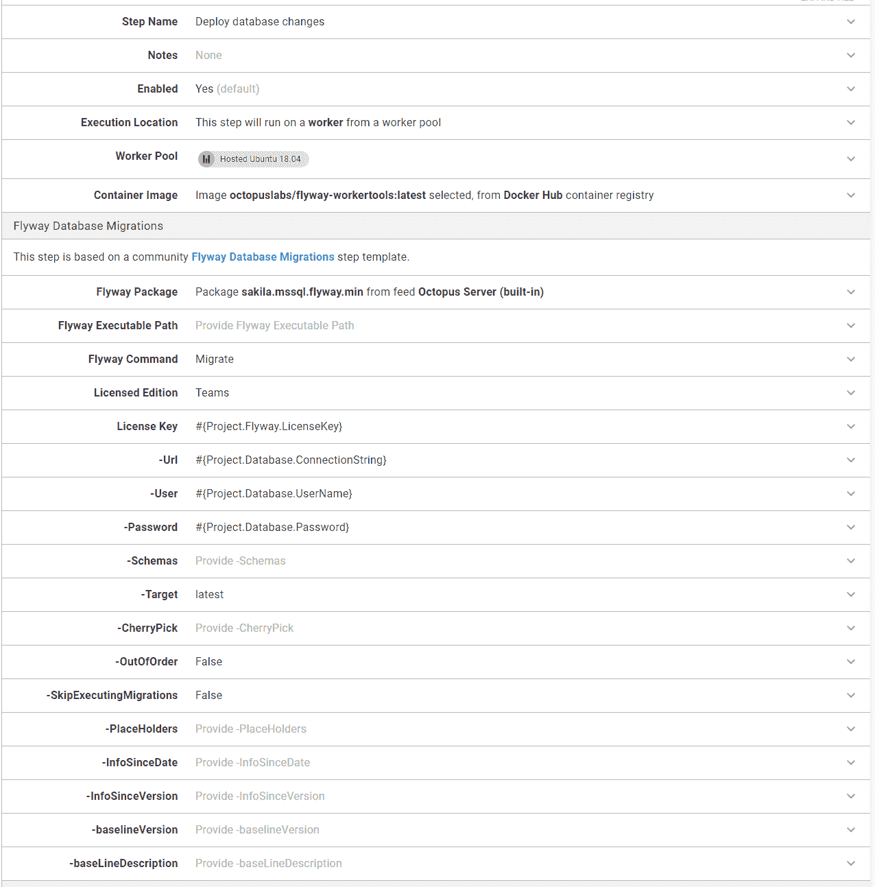](#)

## 结论

正如本文所展示的，更新您的流程以在执行容器中运行并不复杂，尤其是如果您使用的是 Octopus Cloud。添加 Docker 容器注册表外部提要后，只需为应该在执行容器上运行的每个步骤单击一个单选按钮。

这是一个很小的变化，但是它使部署过程和管道更加健壮。您可以利用运行您需要的 Flyway 的精确版本的工具，而无需所有维护开销。

愉快的部署！