# Java CI/CD:从持续集成到 Kubernetes 部署——Octopus 部署

> 原文：<https://octopus.com/blog/java-ci-cd-co/from-ci-to-cloud>

[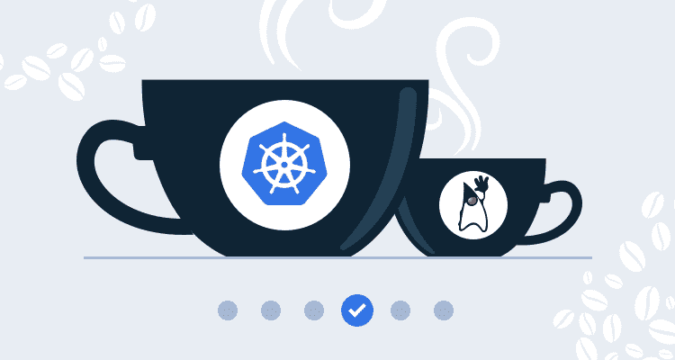](#)

本文是展示 Jenkins、Docker 和 Octopus 示例部署管道系列的一部分:

[在之前的博文](/blog/java-ci-cd-co/from-local-to-ci)中，我们用 Jenkins 配置了一个 CI 服务器，它提供了一个中心位置来构建和发布我们的 Docker 映像。该映像现在可以从 Docker Hub 公开获得，下一步是创建可以托管我们的 Docker 容器的基础设施。

在本文中，我们将从 Octopus 的 AWS 中创建一个弹性 Kubernetes 服务(EKS)实例。

## 获取 Octopus 云实例

我们将使用 Octopus 编写 EKS 星团的创建脚本。获得 Octopus 的最简单方法是注册一个免费的 Octopus Cloud 实例。启动并运行一个实例只需要几分钟时间。

第一步是在 Octopus 中创建一个 AWS 帐户，该帐户将用于创建并连接到 EKS 集群。AWS 帐户由帐户密钥和密钥组成:

[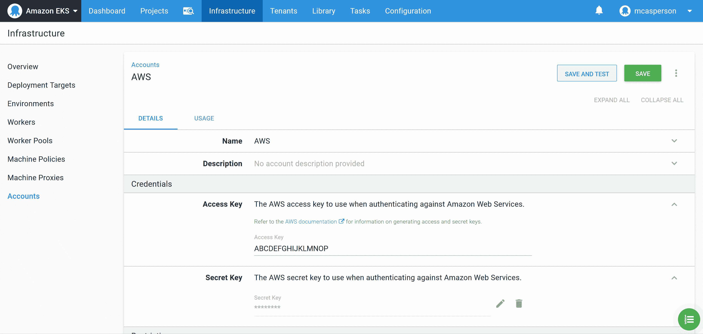 ](#) *一个 AWS 账户的例子。*

名为**eks CTL-Create Cluster(bash)**的社区步骤可以添加到 runbook 中，以便在 Octopus 中快速创建 EKS 集群和相关的 Kubernetes 目标。该脚本执行 [EKS CLI 工具](https://aws.amazon.com/blogs/opensource/eksctl-eks-cli/)来创建 EKS 集群:

[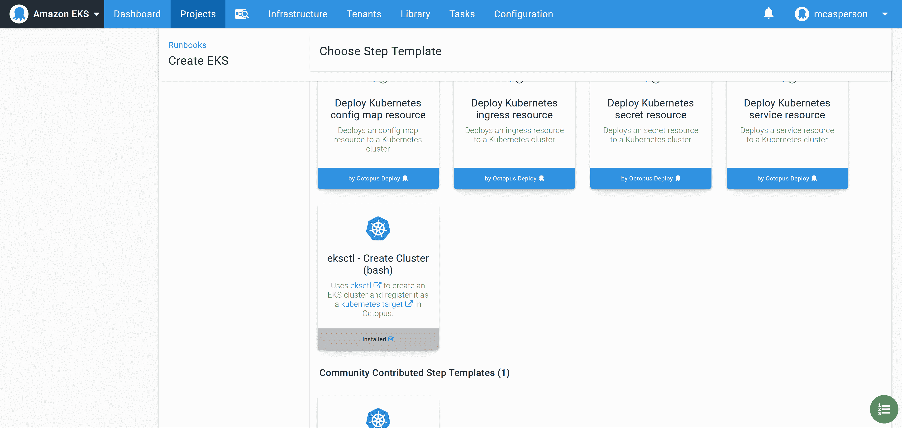 ](#) *社区一步创建一个 EKS 集群。*

为了方便使用 **ekscli** 工具，Octopus 支持基于图像在 Docker 容器内运行一个步骤，并且[为图像](https://hub.docker.com/r/octopusdeploy/worker-tools)提供了广泛的常用云工具选择，包括 **ekscli** 。

要使用 Octopus Cloud 中的 Docker 映像，我们需要选择 Ubuntu 动态工作器:

[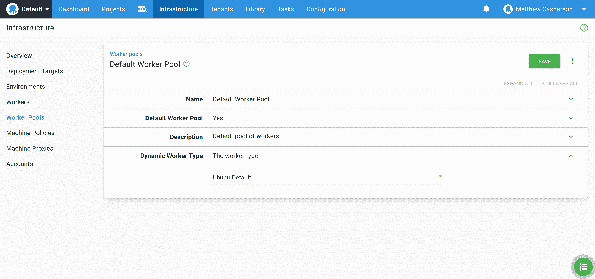](#)

为了使用工人工具图像，我们在**容器图像**部分选择它:

[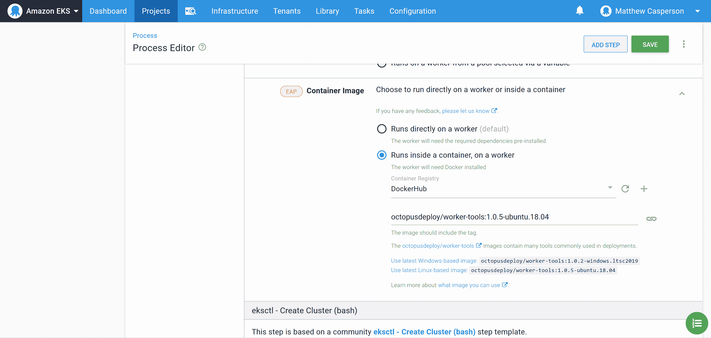](#)

用要创建的 EKS 集群的详细信息填充该步骤。对于本例，下面的 **eksctl 配置** YAML 创建了一个包含两个 t3a.small 节点的集群:

```
apiVersion: eksctl.io/v1alpha5
kind: ClusterConfig

metadata:
  name: k8s-cluster
  region: us-east-1

nodeGroups:
  - name: ng-1
    instanceType: t3a.small
    desiredCapacity: 2
    volumeSize: 80 
```

[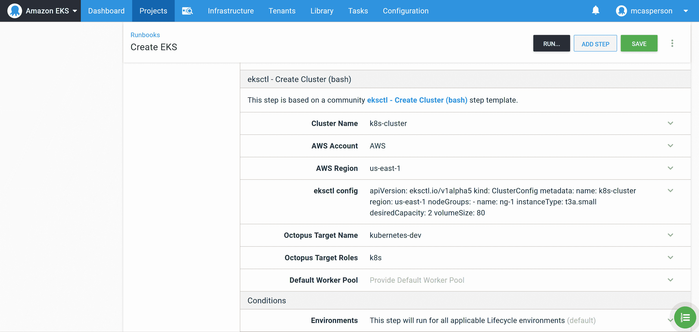 ](#) *人口密集的一步。*

如果在`us-east-1`中出现`UnsupportedAvailabilityZoneException`错误，请尝试另一个可用区域。eksctl 文档指出`us-east-1`容易出现这种错误。

在执行 runbook 之前，我们需要允许将动态创建的目标放置在目标环境中，在本例中称为 **Dev** 。启用此设置允许脚本步骤(如我们刚刚配置的社区步骤模板)创建 Octopus 目标:

[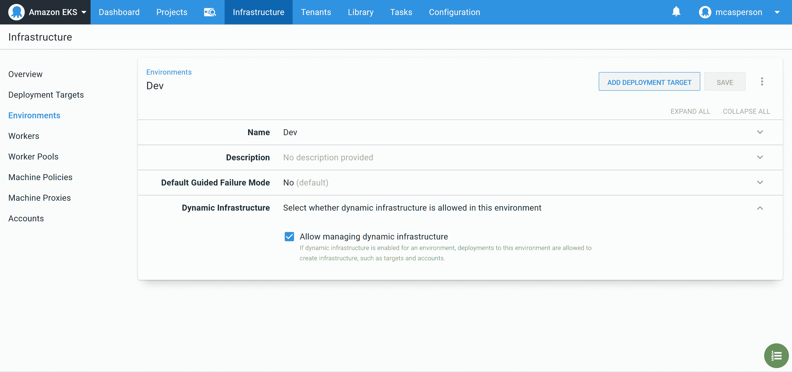 ](#) *在开发环境中启用动态基础设施。*

现在执行操作手册。当 runbook 完成时，一个新的 Kubernetes 目标被创建，我们可以将我们的应用程序部署到:

[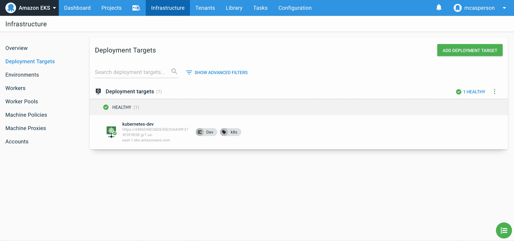 ](#) *章鱼目标。*

[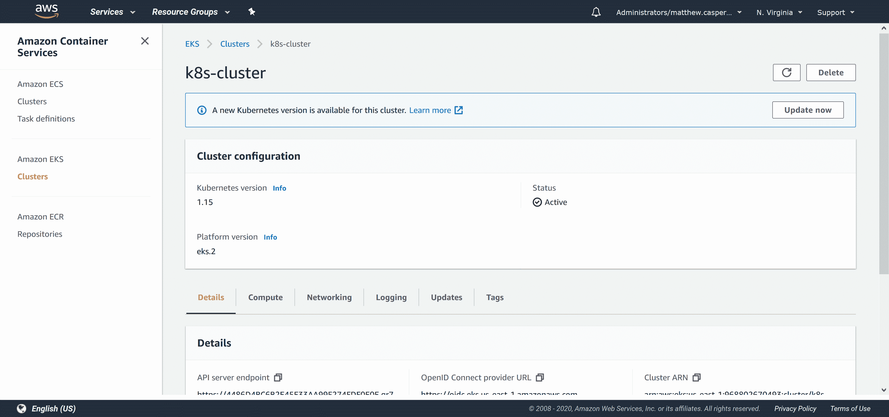](#)*EKS 集群。*

## 创建 Docker 提要

为了使用 Docker 图像，我们需要在 Octopus 中创建一个 Docker 提要。这个提要指向 https://index.docker.io ，这是 Docker Hub 注册表的 URL:

[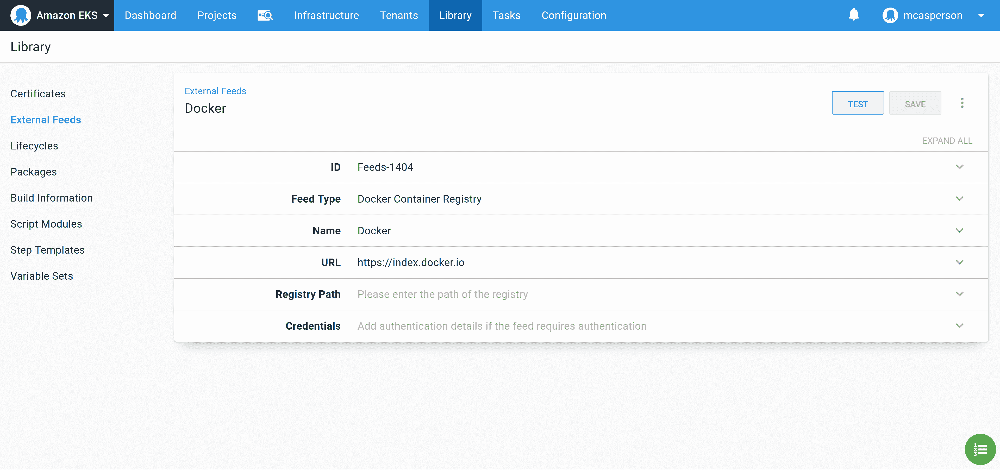 ](#) *将 Docker 集线器馈入章鱼。*

然后我们可以测试提要，以确保 Octopus 可以找到我们的 **Petclinic** 图像:

[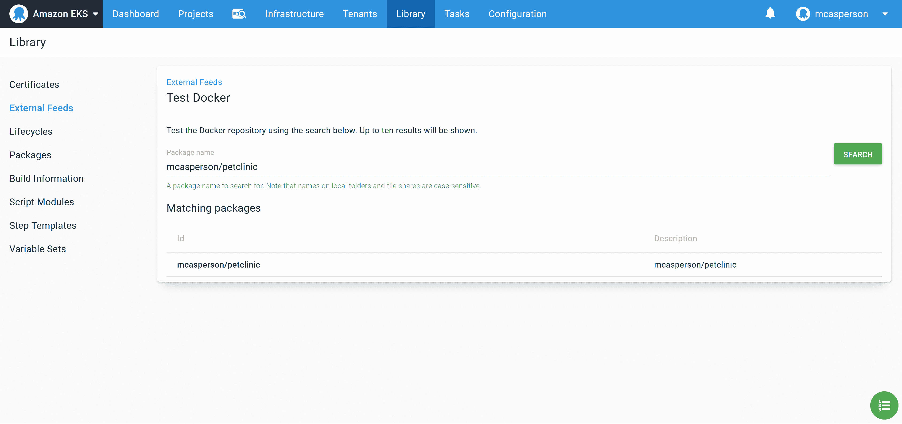 ](#) *测试对接器进给。*

## 将映像部署到 Kubernetes

现在，我们已经完成了部署到 Kubernetes 集群的所有配置。我们将使用**部署 Kubernetes 容器**步骤来配置 Kubernetes 部署资源，并通过负载平衡器服务公开它:

[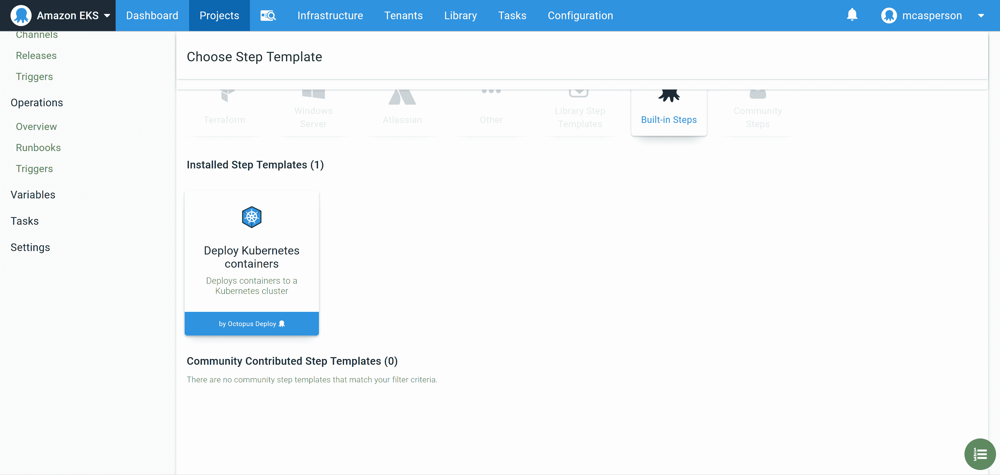 ](#) *部署 Kubernetes 容器的步骤。*

您可以通过两种方式与此步骤进行交互。

第一种方法是使用 UI 来构建 Kubernetes 部署。当您不太熟悉 Kubernetes YAML 酒店时，这很方便，因为您可以通过专用的表单字段构建资源。

使用该步骤的第二种方法是通过点击**编辑 YAML** 按钮时显示的 YAML 表示法来编辑值:

[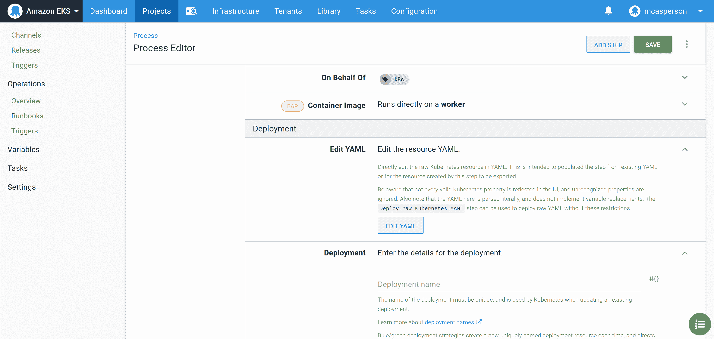 ](#) *编辑 YAML 章节。*

然后，您可以直接以 YAML 的身份编辑部署资源，这很方便，因为复制和粘贴现有的 YAML 只需一个操作就可以填充该步骤。通过将下面的 YAML 粘贴到文本框中，我们创建了一个引用 Docker 映像的部署:

```
apiVersion: apps/v1
kind: Deployment
metadata:
  name: petclinic
spec:
  selector:
    matchLabels:
      octopusexport: OctopusExport
  replicas: 1
  strategy:
    type: RollingUpdate
    rollingUpdate: {}
  template:
    metadata:
      labels:
        octopusexport: OctopusExport
    spec:
      containers:
        - name: petclinic
          image: mcasperson/petclinic
          ports:
            - name: web
              containerPort: 8080 
```

[ ](#) *通过 YAML 编辑步骤。*

我们希望将我们的部署放在每个环境的单独名称空间中。这是通过将**名称空间**字段设置为 **petclinic-#{Octopus 来实现的。Environment.Name | ToLower}** :

[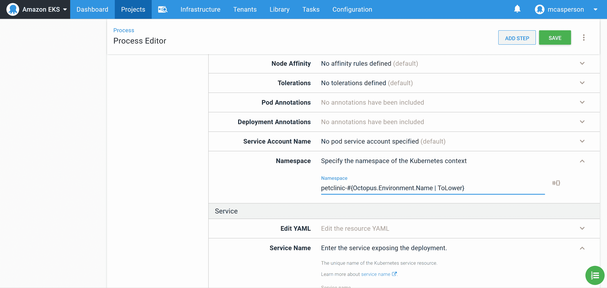](#)

以与配置部署相同的方式，我们可以用下面的 YAML 填充服务的详细信息。这个 YAML 创建一个负载平衡器服务，这将导致创建一个弹性负载平衡器(ELB)来公开部署。这个 ELB 有一个公共主机名，我们可以从我们的 web 浏览器访问:

```
apiVersion: v1
kind: Service
metadata:
  name: petclinic
spec:
  type: LoadBalancer
  ports:
    - name: web
      port: 80
      targetPort: 8080
      protocol: TCP 
```

[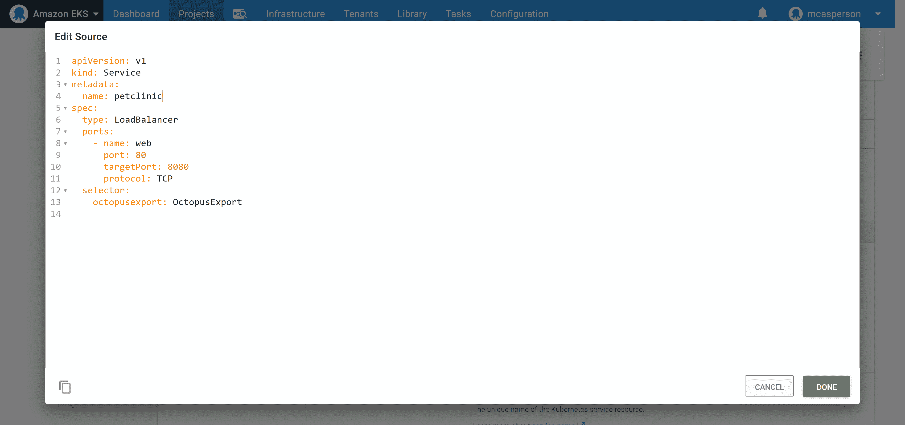 ](#) *为 YAML 服务。*

有了这些设置，我们就可以部署到 EKS 集群了。日志显示 Kubernetes 部署和服务资源已成功创建:

[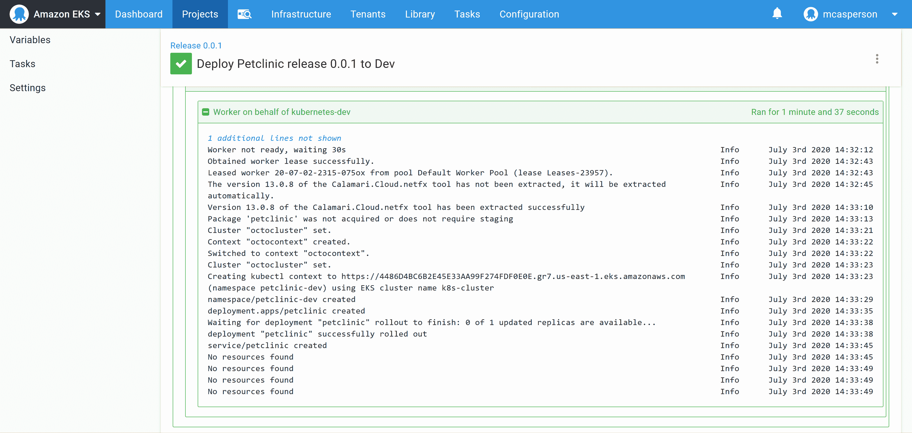 ](#) * PetClinic 已成功部署。*

所以现在唯一的问题是*我们如何访问应用程序？*

## 查询群集

我们将经常需要查询集群，以找到我们需要的信息，或者调试一个问题。通常，设置部署的人会在本地配置 kubectl，并使用特定命令快速查询集群的状态。

虽然这是可行的，并且有时确实是必要的，但是执行这样的特别命令忽略了这样一个事实，即如果这些命令是成功完成初始部署所必需的，那么它们也可能是解决未来部署问题所必需的。

查找我们刚刚创建的负载平衡器的主机名就是一个很好的例子。我们可以通过多种方式获取这些信息，要么从 AWS 控制台获取，要么调用 kubectl。然而，为了在我们完成后维护这个集群的人的利益，我们将通过另一个操作手册找到这个信息。

为了获得服务信息，使用名为**Kubernetes-Inspect Resources**的社区步骤模板创建一个 runbook:

[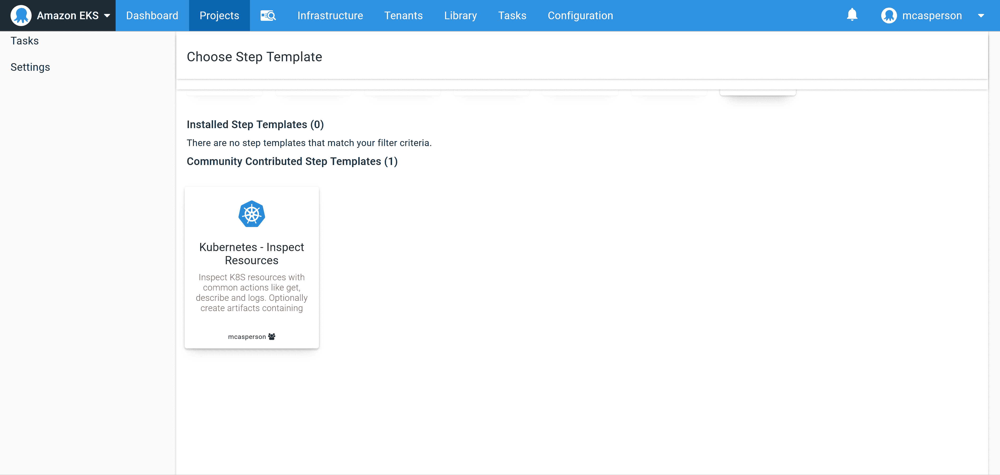](#)*Kubernetes-Inspect 资源社区步骤模板。*

配置从 **petclinic-#{Octopus 获取服务资源的步骤。Environment.Name | ToLower}** 命名空间:

[ ](#) *获取服务详情。*

运行 runbook 将代表我们用 kubectl 查询集群，在响应中显示负载平衡器的主机名:

[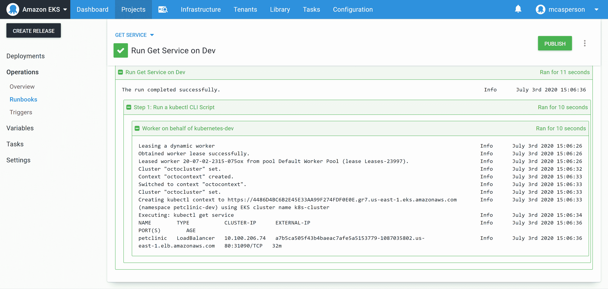 ](#) *服务详情。*

这个过程比直接跳到控制台并运行 kubectl 稍不方便，但好处是我们已经启动了一个 runbook 库，其中包含了我们知道对使用我们的集群有用的步骤。这个库将非常有价值，因为我们希望将对这个基础设施的支持交给另一个团队。当您考虑到下一个团队只需要对 Octopus 的适当访问，而不需要 kubectl 或任何凭证时，这一点尤其正确，当您的寻呼机在凌晨 3 点响起时，这是受欢迎的。

现在我们知道了 ELB 的主机名，我们可以访问我们公开托管的应用程序:

[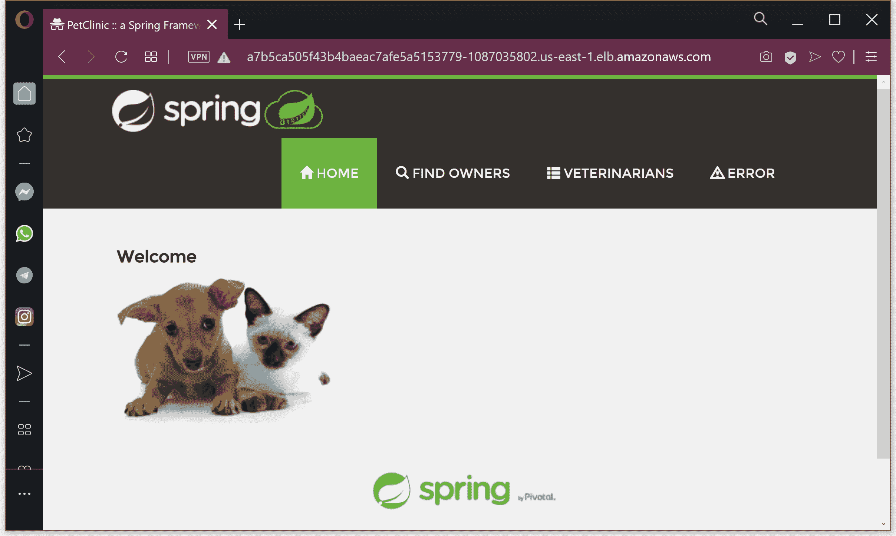 ](#) * PetClinic live 和 public。*

## 结论

在本文中，我们使用 EKS 服务在 AWS 中创建了一个 Kubernetes 集群，并通过 Octopus 将我们的 PetClinic 应用程序部署到其中。我们还致力于通过 runbooks 调试集群，这提供了一个小但重要的基础，我们可以将它传递给在我们继续前进后最终负责该集群的团队。

我们还没有实现连续部署，因为 Jenkins 和 Octopus 之间没有集成。在下一篇文章的[中，我们将连接我们的管道，以实现一个完整的 CI/CD 管道。](/blog/java-ci-cd-co/from-ci-to-cd)