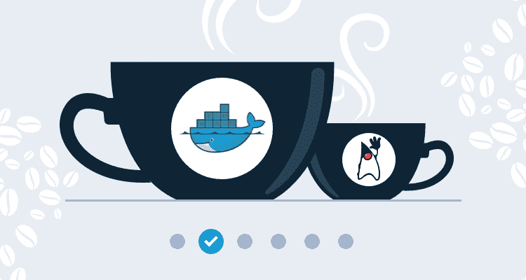
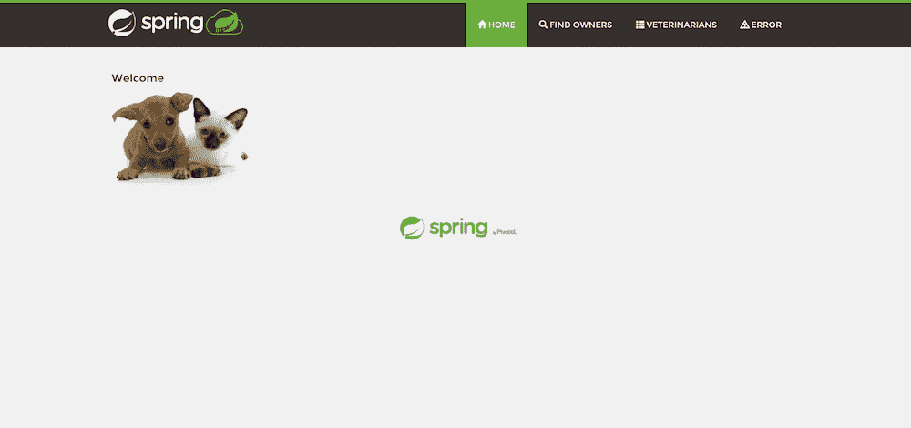

# Java CI/CD:从 JAR 到 Docker——Octopus 部署

> 原文：<https://octopus.com/blog/java-ci-cd-co/from-jar-to-docker>

[](#)

本文是展示 Jenkins、Docker 和 Octopus 示例部署管道系列的一部分:

[](#)

也许没有哪个公共项目比 [Spring PetClinic](https://projects.spring.io/spring-petclinic/) 更好地展示了一个长寿的 Java 应用程序。它诞生于 21 世纪初，至今仍自豪地出现在 Spring 网站上。

我们的 DevOps 生命周期之旅从本地工作站上 PetClinic 的本地构建开始。在这篇博客文章的结尾，我们已经用 Docker 封装了这个应用程序，提供了一个[可重复的构建和执行环境](https://octopus.com/devops/continuous-delivery/what-is-a-deployment-pipeline/)。

## 从本地构建开始

首先，我们克隆 PetClinic GIT 存储库，并使用与应用程序源代码一起签入的 Maven 包装器来构建和运行本地 JAR 文件:

```
git clone https://github.com/spring-projects/spring-petclinic.git
cd spring-petclinic
./mvnw spring-boot:run 
```

这个初始构建需要一些时间，因为 Maven 下载了组成应用程序的各种 Spring 库。幸运的是，这些库都被缓存了，所以后续的构建会完成得更快。

要查看该应用程序，请打开 http://localhost:8080:

[ ](#) * PetClinic 本地运行。*

要创建可分发的 JAR 文件，请运行以下命令:

```
./mvnw package 
```

这会运行单元测试，然后在`target`目录下创建一个独立的 JAR 文件，类似于`petclinic.2.3.1.BUILD-SNAPSHOT.jar`。我们可以使用以下命令运行该文件:

```
java -jar .\target\petclinic.2.3.1.BUILD-SNAPSHOT.jar 
```

这个本地测试、构建和运行的过程是每个应用程序的起点。

公平地说，PetClinic 实现了许多特性来使这些构建可重复，并且结果易于分发。`mvnw`脚本是 [Maven 包装器](https://github.com/takari/maven-wrapper)，它提供了跨平台的脚本，如果本地机器没有安装 Maven 的适当版本，这些脚本可以被签入源代码控制。然后，Spring boot 创建易于版本化、复制和部署的自包含 JAR 文件。

然而，您仍然需要 Java 开发工具包(JDK)来构建应用程序，并且需要 JDK 或 Java 运行时环境(JRE)来运行它。PetClinic 依赖于一个相当老的 Java 版本，鉴于每六个月就会发布一个新的 Java 版本，不难想象开发人员必须修改 Java 安装来执行本地构建。

为了提供一个真正自包含的构建和执行环境，我们将把这个应用程序迁移到 Docker。

## 用 Docker 进行独立构建和执行

Docker 的主要特性之一是它能够将整个应用程序生态系统捆绑在一个自包含的映像中，该映像可以在一个隔离的环境中运行。对我们来说，这意味着我们可以用所需版本的 Java 和我们编译的应用程序构建和分发 Docker 映像，任何安装了 Docker 的人都可以运行它。

PetClinic repo 的一个分支已经用下面的代码在 [GitHub](https://github.com/mcasperson/spring-petclinic) 中创建，以便于访问。

Docker 映像由名为`Dockerfile`的文件中列出的步骤定义。我们的`Dockerfile`的内容如下所示:

```
FROM maven:3.6.3-jdk-8 AS build-env
WORKDIR /app

COPY pom.xml ./
RUN mvn dependency:go-offline
RUN mvn spring-javaformat:help

COPY . ./
RUN mvn spring-javaformat:apply
RUN mvn package -DfinalName=petclinic

FROM openjdk:8-jre-alpine
EXPOSE 8080
WORKDIR /app

COPY --from=build-env /app/target/petclinic.jar ./petclinic.jar
CMD ["/usr/bin/java", "-jar", "/app/petclinic.jar"] 
```

这个`Dockerfile`利用了一个叫做[多阶段构建](https://docs.docker.com/develop/develop-images/multistage-build/)的特性。这允许我们创建一个更小的最终 Docker 映像来发布，因为它不包含构建应用程序所需的工具。

我们的构建基于 Maven 团队提供的现有 Docker 映像。这个映像预装了 JDK 和 Maven 工具:

```
FROM maven:3.6.3-jdk-8 AS build-env 
```

然后我们创建并移入一个名为`/app`的目录:

```
WORKDIR /app 
```

Maven `pom.xml`文件被复制到`/app`目录中:

```
COPY pom.xml ./ 
```

然后我们运行 Maven `dependency:go-offline`目标，它下载了构建应用程序所需的大多数库和 Maven 插件。

由于 Docker 缓存构建的方式，只要`pom.xml`文件没有改变，该映像的任何后续重建都将重用 Maven 的这次执行所执行的下载。对于 PetClinic 应用程序，这可以节省几分钟时间和数百兆字节:

```
RUN mvn dependency:go-offline 
```

Spring 包括一个源代码格式化工具，可以确保所有代码都有一致的风格。我们将调用 help 函数来确保 Maven 下载插件，这意味着 Docker 将依次缓存下载内容。这将为我们节省一次下载和随后的 Docker 映像重建:

```
RUN mvn spring-javaformat:help 
```

我们现在可以复制应用程序源代码的其余部分。Docker 检测被复制的源代码何时发生了变化，并从这一步重新运行映像构建过程来捕获变化。但是，所有的应用程序依赖项都已被缓存，因此从这一步开始的构建过程会相对较快:

```
COPY . ./ 
```

将源代码从 Windows 工作站复制到 Linux Docker 映像通常会导致格式化插件抱怨行尾。在这里，我们运行格式插件来自动修复复制文件的任何问题:

```
RUN mvn spring-javaformat:apply 
```

我们现在可以以 Maven `package`为目标构建应用程序。注意，我们还将变量`finalName`设置为`petclinic`。这将覆盖默认文件名`petclinic.2.3.1.BUILD-SNAPSHOT.jar`，生成一个名为`petclinic.jar`的一致文件:

```
RUN mvn package -DfinalName=petclinic 
```

我们的应用程序现在已经构建好了，我们进入多阶段构建的下一个阶段，生成我们想要分发的 Docker 映像。这个图像基于 OpenJDK JRE。

JRE 可以运行已编译的应用程序，但不包括编译应用程序所需的工具。这减小了最终图像的尺寸。

```
FROM openjdk:8-jre-alpine 
```

我们公开端口`8080`，这是我们的 Spring 应用程序监听的端口:

```
EXPOSE 8080 
```

我们创建并移入一个名为`/app`的目录:

```
WORKDIR /app 
```

在前一阶段编译的 JAR 文件被复制到当前映像中:

```
COPY --from=build-env /app/target/petclinic.jar ./petclinic.jar 
```

然后，我们指示映像在运行时执行 JAR 文件:

```
CMD ["/usr/bin/java", "-jar", "/app/petclinic.jar"] 
```

要构建 Docker 映像，请运行以下命令:

```
docker build . -t petclinic 
```

这将构建 Docker 映像，并给它分配标签`petclinic:latest`。请注意，如果没有指定其他标签，默认情况下会应用`latest`。

最后，使用以下命令运行 Docker 映像:

```
docker run petclinic 
```

和以前一样，这个应用程序可以在 http://localhost:8080 上找到。

我们现在有了一个`Dockerfile`，它包含了构建和运行我们的应用程序所需的所有步骤。现在，除了 Docker 之外，无需任何其他工具，就可以从源代码构建这个应用程序。我们现在有了一个真正独立的构建过程。

## 分发 Docker 图像

Docker 图像可以与许多 Docker 注册中心在线共享。最受欢迎的是 [Docker Hub](https://hub.docker.com/) ，它为托管公开可用的 Docker 图像提供免费账户。

为了共享 PetClinic Docker 图像，我们需要注册一个 Docker Hub 帐户。我的账号叫`mcasperson`。

创建帐户后，使用命令`docker login`登录 Docker Hub:

```
docker login
Login with your Docker ID to push and pull images from Docker Hub. If you don't have a Docker ID, head over to https://hub.docker.com to create one.
Username: mcasperson
Password:
Login Succeeded 
```

要分享图片，需要用你的用户名进行标记。在我的例子中，我需要构建一个名为`mcasperson/petclinic`的映像(其中`mcasperson`是我的 Docker Hub 用户名):

```
docker build . -t mcasperson/petclinic 
```

构建应该会很快完成，因为没有文件被更改，所有步骤都被缓存。

要上传图像，运行以下命令，用您的 Docker Hub 用户名替换`mcasperson`:

```
docker push mcasperson/petclinic 
```

这张照片现在被[分享到网上](https://hub.docker.com/r/mcasperson/petclinic)，任何人都可以访问。

要运行公共映像，请执行以下命令:

```
docker run -p 8080:8080 mcasperson/petclinic 
```

如果本地没有映像，Docker 将下载它，然后像我们之前做的那样运行它。选项`-p 8080:8080`明确地将本地端口 8080 映射到容器端口 8080。

## 结论

在本文中，我们采用了一个典型的 Java 应用程序，并将其封装为 Docker 映像。这张图片被上传到 Docker 注册处，供公众使用。

通过这些改变，我们创建了一个[可重复的构建和执行过程](https://octopus.com/devops/continuous-delivery/what-is-a-deployment-pipeline/)，任何人只需安装 Docker 就可以使用。如果我们切换到较新版本的 Java，甚至完全切换语言，应用程序仍然可以用相同的 Docker 命令构建和运行。

虽然 Docker 可以方便地封装构建过程，但不能保证源代码编译成功或测试全部通过。随着越来越多的开发人员开始开发一个应用程序，代码库的健康状况需要由一个中心*真实来源*共享，这样每个人都知道应用程序的状态。这就是持续集成服务器的用武之地。

在下一篇[文章](/blog/java-ci-cd-co/from-local-to-ci)中，我们将配置我们的应用程序，由流行的开源 CI 服务器 Jenkins 构建。