# Java CI/CD:从本地构建到 Jenkins 持续集成——Octopus 部署

> 原文：<https://octopus.com/blog/java-ci-cd-co/from-local-to-ci>

[](#)

本文是展示 Jenkins、Docker 和 Octopus 示例部署管道系列的一部分:

[](#)

[在之前的文章](/blog/java-ci-cd-co/from-jar-to-docker)中，我们采用了一个典型的 Java 应用程序，并创建了一个`Dockerfile`，负责构建代码并运行生成的 JAR 文件。通过利用 Maven 和 Java 本身等工具提供的现有 Docker 映像，我们创建了一个可重复和自包含的构建过程，并且生成的 Docker 映像可以由只安装了 Docker 的任何人执行。

这是我们构建过程的坚实基础。然而，随着越来越多的开发人员开始在共享代码库上工作，测试需求增加，产生的包变大，团队需要一个中央共享服务器来管理构建。这就是持续集成(CI)服务器的作用。

有许多 CI 服务器可用。其中最流行的是 [Jenkins](https://www.jenkins.io/) ，免费开源。在这篇博文中，我们将学习如何配置 Jenkins 来构建和发布我们的 Docker 映像。

## Jenkins 入门

开始使用 Jenkins 最简单的方法是使用他们的 [Docker 图像](https://hub.docker.com/r/jenkins/jenkins/)。正如我们在上一篇博文中为自己的应用程序创建了一个自包含映像一样，Jenkins Docker 映像为我们提供了在预配置的自包含环境中启动 Jenkins 的能力，只需几个命令。

首先，我们使用以下命令下载 Jenkins Docker 映像的最新长期支持(LTS)版本:

```
docker pull jenkins/jenkins:lts 
```

然后，我们用命令启动 Jenkins:

```
docker run -p 8081:8080 -p 50000:50000 -v jenkins_home:/var/jenkins_home jenkins/jenkins:lts 
```

`-p`参数将本地工作站的一个端口绑定到映像公开的一个端口。这里我们使用参数`-p 8081:8080`将本地端口`8081`绑定到容器端口`8080`。注意，因为我们自己的 PetClinic 应用程序在默认情况下也监听端口`8080`，所以我们为 Jenkins 选择了下一个可用的端口`8081`。将哪个本地端口映射到容器端口完全取决于您。参数`-p 50000:50000`公开了 Jenkins 代理使用的一个端口，我们将在后面的文章中配置这个端口来执行我们的构建。

`-v`参数将 [Docker 卷](https://docs.docker.com/storage/volumes/)挂载到容器中的路径。虽然 Docker 容器可以在运行时修改数据，但最好假设您将无法保留这些更改。例如，每次您调用`docker run`(您可以使用 Jenkins Docker 映像的更新版本)时，都会创建一个新的容器，其中没有任何被之前的容器修改过的数据。Docker 卷允许我们通过公开可以在容器之间共享的持久文件系统来保留修改过的数据。在本例中，我们创建了一个名为`jenkins_home`的卷，并将其挂载到目录`/var/jenkins_home`中。这意味着所有的 Jenkins 数据都是在一个永久卷中捕获的。

当 Docker 映像运行时，您将看到日志输出。作为初始引导的一部分，Jenkins 生成一个随机密码，并在日志中显示如下:

```
*************************************************************
*************************************************************
*************************************************************

Jenkins initial setup is required. An admin user has been created and a password generated.
Please use the following password to proceed to installation:

4b9e47bcd9ea469687dc39f23b0adb08

This may also be found at: /var/jenkins_home/secrets/initialAdminPassword

*************************************************************
*************************************************************
************************************************************* 
```

当您打开 http://localhost:8081 时，系统会提示您输入此密码来解锁 Jenkins:

[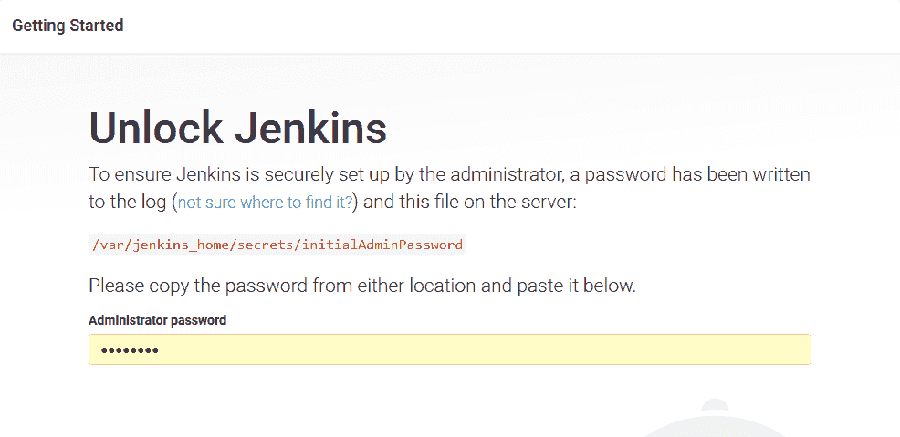 ](#) *用生成的密码解锁詹金斯。*

Jenkins 会提示你要么安装一个常用插件列表，要么只安装你选择的插件。**安装推荐插件**选项包含了我们需要的大部分插件。

插件下载需要一分钟左右的时间:

[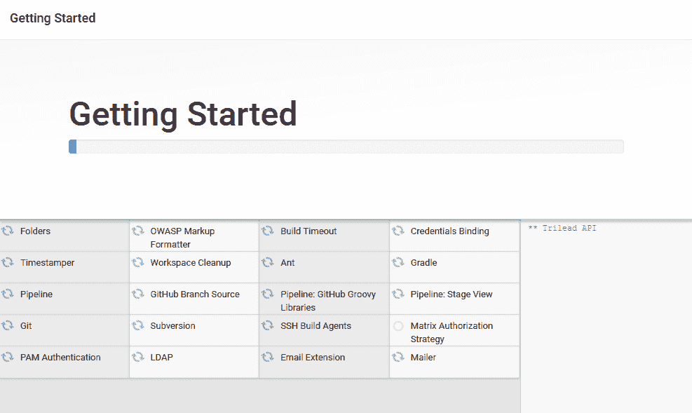 ](#) *插件安装。*

完成后，创建第一个管理员用户，点击**保存并继续**。

最后，定义 Jenkins URL 并点击**保存并完成**。

Jenkins 现在已经配置好并可以使用了，只需点击**开始使用 Jenkins** 。

## 创建代理

我们需要解决的一个问题是，我们在 Docker 容器中运行 Jenkins，并且还希望 Jenkins 自己使用 Docker 来构建 Docker 映像。这就产生了一个我们想在 Docker 中使用 Docker 的场景。

在 Docker 中运行 [Docker 是可能的，但是我们已经运行的 Jenkins 映像不支持开箱即用。已经创建了许多第三方工具，如](https://hub.docker.com/_/docker) [Kaniko](https://github.com/GoogleContainerTools/kaniko) 和 [Buildah](https://github.com/containers/buildah) ，它们支持在不依赖 Docker 守护进程的情况下构建 Docker 映像。尽管这些解决方案相当先进。

一个更简单的解决方案是在 Jenkins Docker 容器之外运行 Jenkins 代理。该代理将在主机操作系统上运行，并有权访问 Docker 守护程序来创建 Docker 映像。

要创建代理，请单击 **管理詹金斯➜管理节点和云** :

[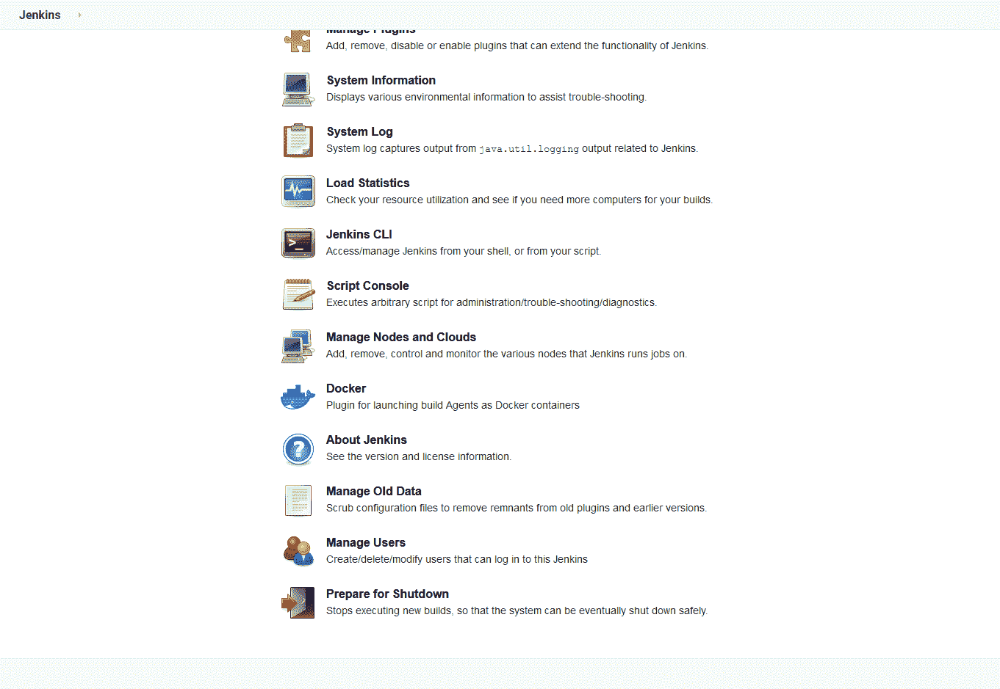 ](#) *詹金斯管理选项。*

点击**新节点**链接，给新节点起一个名字，比如 *Builder* ，点击 **OK** :

输入**远程根目录**的路径。因为我在 Windows 上运行节点，所以路径类似于`C:\JenkinsAgent`。然后输入`docker`作为节点标签，点击**保存**:

[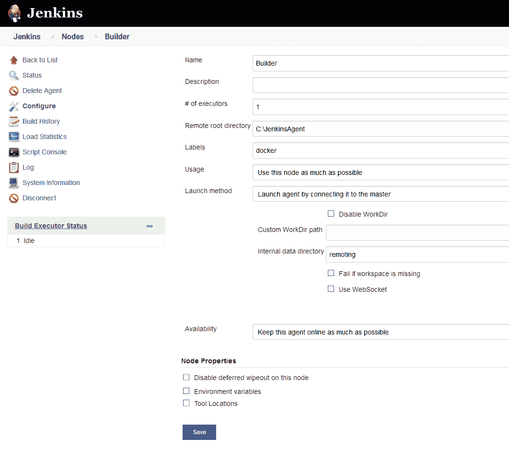 ](#) *配置新节点。*

该节点现在在 Jenkins 中进行了配置，但是由于没有节点在运行，所以它显示为断开连接。

如果单击新节点，您将看到一个屏幕，其中提供了运行代理的说明。单击 **agent.jar** 链接下载代理文件，并运行屏幕上显示的命令将代理连接到 Jenkins:

[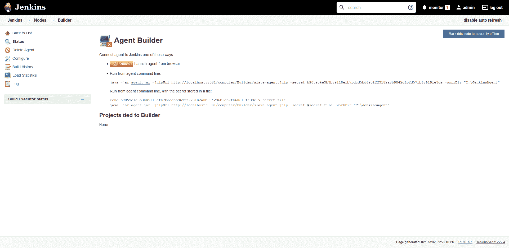 ](#) *连接一个节点的指令。*

现在，节点已连接，我们有一个连接到 Jenkins 的代理，它能够构建 Docker 映像。

## 安装 Docker 管道插件

詹金斯的初始配置安装了一些常用插件。然而，为了构建 Docker 镜像，我们还需要一个叫做 **Docker Pipeline** 的插件。这是通过 **管理詹金斯➜管理插件** 并在**可用**选项卡中搜索 **Docker 管道**插件来完成的。

下载和安装该插件需要几秒钟时间:

[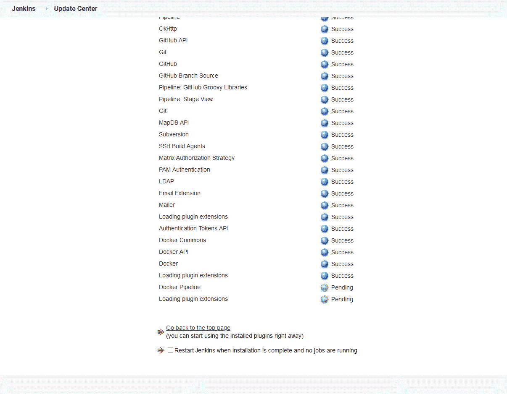 ](#) *下载插件。*

## 添加 DockerHub 凭据

为了允许我们的项目将 Docker 映像发布到 Docker Hub，我们需要在 Jenkins 中定义 Docker Hub 凭证。

1.  点击 **管理詹金斯➜管理凭证** ，导航至凭证部分。
2.  选择**詹金斯**，点击**全球凭证**。
3.  点击**添加凭证**，进入 Docker Hub 凭证，将 **ID** 设置为 **dockerhub** ，点击 **OK** 按钮:

[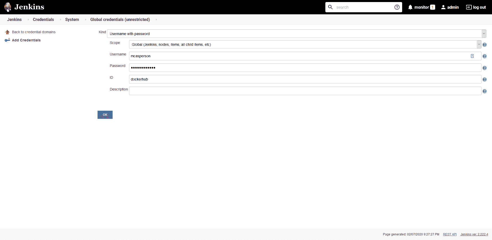 ](#) *定义 Docker Hub 凭证。*

我们现在拥有了在 Jenkins 中构建 Docker 映像所需的一切。下一步是定义 Jenkins 项目。

## 定义詹金斯项目

在高层次上，Jenkins 提供了两种类型的项目。

第一种格式称为自由式项目，在 Jenkins UI 中定义。虽然可以导出和共享自由式项目，但这很难做到，因为底层数据格式不是为手动编辑而设计的。

第二种格式称为管道，本质上是一个脚本，其创建和管理方式与应用程序中的代码非常相似。管道可以与您的项目代码一起保存在一个名为`Jenkinsfile`的文件中，它将您的应用程序代码和构建定义保存在同一个地方。

我们将为我们的项目创建一个`Jenkinsfile`,用下面的代码构建并发布我们的 Docker 图像:

```
pipeline {
    agent {
        label 'docker'
    }
    stages {
        stage('Building our image') {
            steps {
                script {
                    dockerImage = docker.build "mcasperson/petclinic:$BUILD_NUMBER"
                }
            }
        }
        stage('Deploy our image') {
            steps {
                script {
                    // Assume the Docker Hub registry by passing an empty string as the first parameter
                    docker.withRegistry('' , 'dockerhub') {
                        dockerImage.push()
                    }
                }
            }
        }
    }
} 
```

让我们把这个文件分解一下。

所有声明性管道都以`pipeline`开头:

```
pipeline { 
```

运行这个构建的代理在`agent`部分中定义。在这里，我们已经将构建配置为在任何带有标签`docker`的代理上运行。这确保了构建运行在我们的外部节点上，它可以访问 Docker 守护进程，而不是运行在 Jenkins 服务器本身上，它不能访问 Docker:

```
 agent {
        label 'docker'
    } 
```

组成流水线的阶段包含在`stages`部分:

```
stages { 
```

第一阶段构建 docker 映像。我们利用[脚本](https://www.jenkins.io/doc/book/pipeline/syntax/#script)步骤调用我们之前安装的 Docker Pipeline 插件来构建映像。这个构建的结果保存在一个名为`dockerImage`的变量中。注意使用`$BUILD_NUMBER`变量为每个构建分配一个新版本作为图像标签。这确保了该管道的每次执行都将构建一个新的不同的 Docker 映像:

```
 stage('Building our image') {
            steps {
                script {
                    dockerImage = docker.build "mcasperson/petclinic:$BUILD_NUMBER"
                }
            }
        } 
```

第二阶段将新创建的映像推送到 Docker Hub。`withRegistry`方法将 Docker 注册表作为第一个参数，或者如果它留空，则默认为 Docker Hub。第二个参数是我们之前在 Jenkins 中创建的凭证的名称:

```
 stage('Deploy our image') {
            steps {
                script {
                    // Assume the Docker Hub registry by passing an empty string as the first parameter
                    docker.withRegistry('' , 'dockerhub') {
                        dockerImage.push()
                    }
                }
            }
        } 
```

这个文件和我们的应用程序代码一起被提交。下一步是创建一个 Jenkins 项目来检查代码并运行管道。

## 创建管道项目

在 Jenkins 仪表板上，单击**新项目**链接。输入 **Petclinic** 作为项目名称，并选择**管道**选项:

[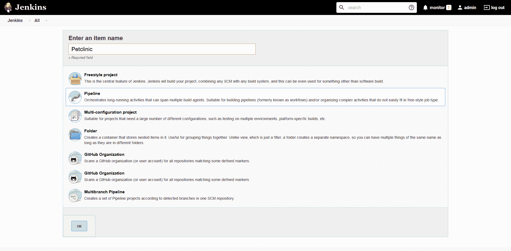 ](#) *新项目创建。*

在**管道**部分下，从 SCM 中选择**管道脚本，输入 Git 存储库 URL(本例中为[https://github.com/mcasperson/spring-petclinic.git](https://github.com/mcasperson/spring-petclinic.git))并选择要构建的分支(本例中为 **main** )。然后点击**保存**:**

[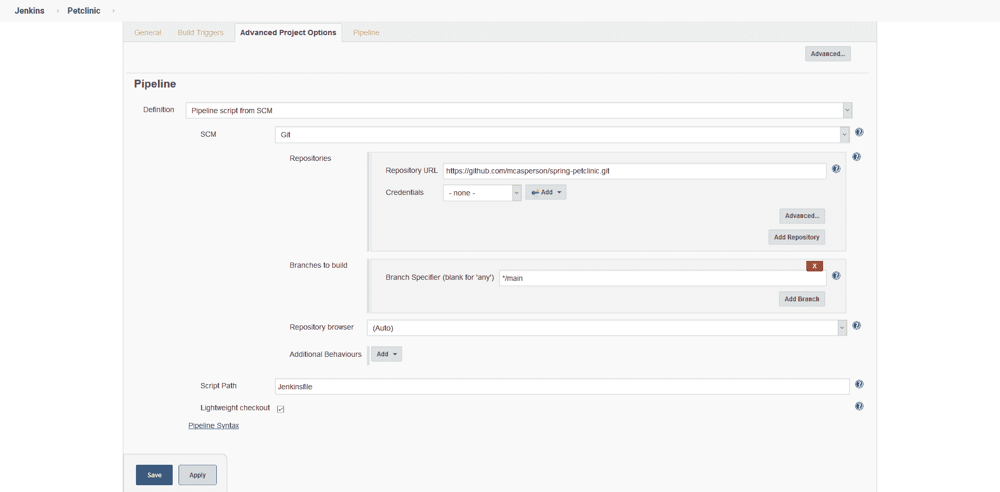 ](#) *定义管道 GIT 库。*

从项目仪表板中，单击 **Build Now** 链接手动运行一个构建，并单击构建链接图标:

[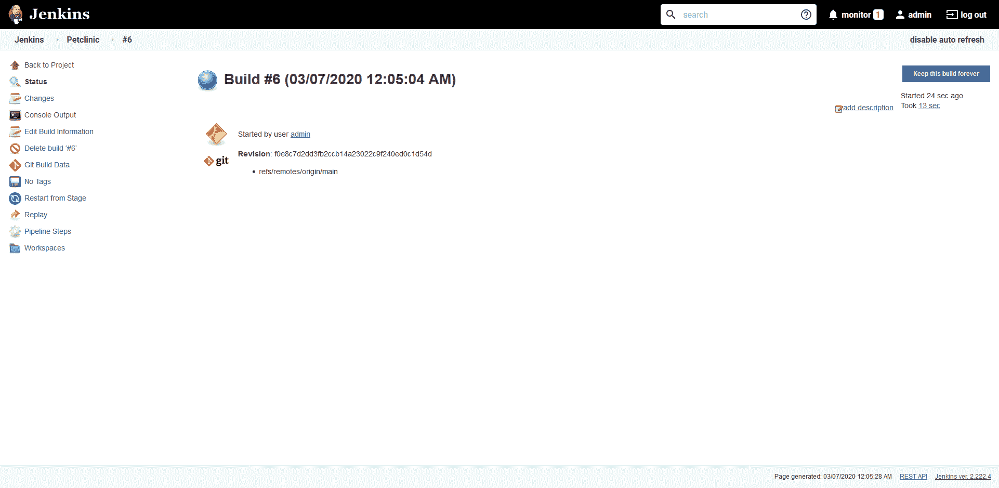 ](#) *一个詹金斯项目的构建。*

点击**控制台输出**链接查看构建输出:

[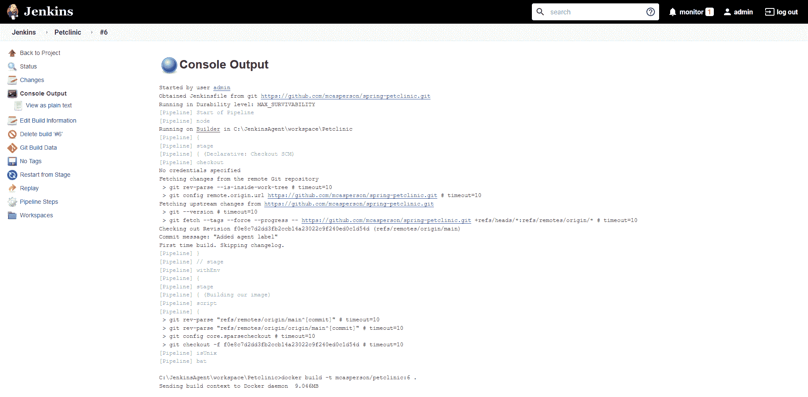 ](#) *詹金斯项目构建控制台输出。*

当构建完成时，Docker 映像在 Jenkins 节点上构建并被推送到 [Docker Hub](https://hub.docker.com/r/mcasperson/petclinic/tags) ，带有基于构建号的标签:

[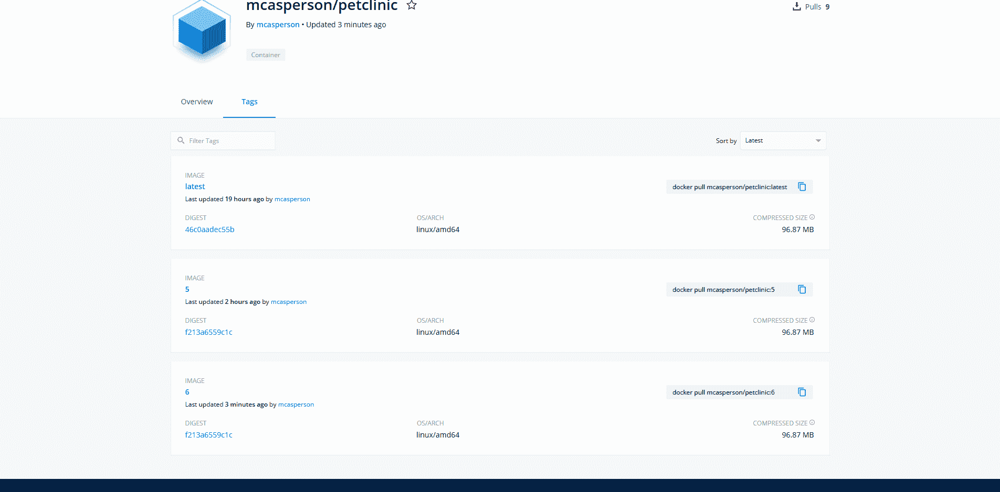 ](#) *由此产生的图像出现在 Docker 中枢。*

这样，我们就成功地配置了 Jenkins 来编译和测试应用程序代码，然后构建 Docker 映像并将其推送到 Docker Hub。

## 结论

Jenkins 提供了一个中央平台，多个开发人员可以通过这个平台构建、测试和分发他们的代码。Jenkins 维护更改的历史记录以及这些更改是否导致了成功的构建，维护分发 Docker 映像所需的凭证，并消除个人在每次构建时上传可能很大的 Docker 映像的需要。

在本文中，我们逐步完成了将 Jenkins 作为 Docker 容器运行的过程，连接了一个节点来执行构建，并编写了一个 Jenkins 管道来定义 Jenkins 将如何构建和推送 Docker 映像。这样做的最终结果是一个持续的集成系统，它可以自动构建和发布我们的应用程序，消除了单个开发人员手动管理这个过程的需要。我们实现了持续整合。

下一步是在某个地方部署我们新创建的 Docker 映像。为此，我们将在 AWS 中配置一个 Kubernetes 集群。

浏览 [DevOps 工程师手册](https://octopus.com/devops/)以了解更多关于持续集成和持续交付(CI/CD)的信息。