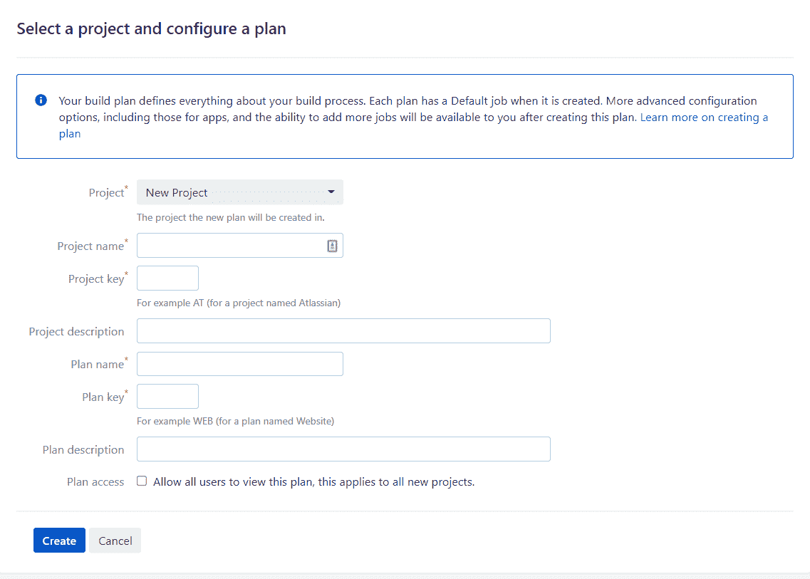
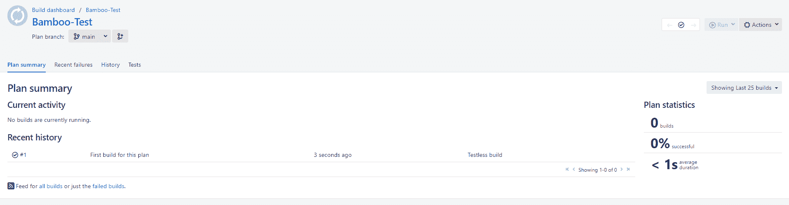

# Bamboo - Octopus 部署入门

> 原文：<https://octopus.com/blog/getting-started-with-bamboo>

持续集成(CI)服务器是 CI/CD 流程的重要组成部分。CI 服务器获取一个代码存储库，构建它，并将其推到一个中心位置，在那里像 Octopus 这样的连续交付(CD)工具可以接管和管理部署。

Bamboo 是由 Atlassian 开发的 CI 服务器，可以自动构建和测试软件应用程序。如果您正在开始您的 CI/CD 之旅，从一个简单的用例开始，并有一个可见的结果，会很有帮助。

在本文中，我将向您展示如何构建和推送一个软件构件，Octopus 可以接管它并将其部署到目标环境中。

您将学习如何:

*   在 Windows 服务器上安装 Bamboo
*   配置 Bamboo 项目
*   配置一个 Bamboo 计划来构建 Docker 容器并将其推送到容器注册中心
*   运行并查看容器图像

## 正在设置

要关注这篇文章，您需要以下软件和帐户:

## 在 Windows 服务器上安装 Bamboo

要安装 Bamboo:

*   注册一个免费试用版，它会给你一个激活密钥
*   运行安装可执行文件
*   将安装位置设置为您可以访问的目录，例如`C:\Users\Username\Documents`(注意，将其设置为 C:\Program files 的默认位置可能会导致权限错误)
*   设置 Bamboo 主目录，并确保这是一个独立于安装位置的目录，文件夹名为`Bamboo-home`

安装完成后，运行 Bamboo 服务器:

*   打开终端并导航到 Bamboo 安装目录
*   运行`bin\start-bamboo.bat`
*   服务器应该在`http://localhost:8085/`启动

## 设置用户

在启动屏幕中，会要求您设置一个管理员帐户。填写详细信息并将详细信息存储在密码管理器中。如果你把密码放错了地方，你需要运行一个恢复过程。

## 代理人

代理是在 Bamboo 中执行工作负载的工人。因为您安装了先决条件技术，所以您可以使用本地机器作为代理进行测试。

要设置本地代理:

*   在 Bamboo 仪表板中，转到设置图标并选择**代理**
*   转到**添加本地代理**并为其命名
*   点击**添加**

## 设置项目和计划

Bamboo 将您的工作流程组织成项目和计划。一个项目可以包含多个计划，每个计划是一个执行一系列任务的过程。

首先，设置您的第一个项目和计划:

*   在主菜单中，选择**创建**，然后选择**创建计划**
*   填写您的项目和计划的名称

在下一个屏幕上，选中显示 **Link new repository** 的框。

### 连接到章鱼水下应用程序库

本帖使用[章鱼水下 app](https://github.com/OctopusSamples/octopus-underwater-app) 。

要使用此存储库:

*   把它存入你自己的 GitHub 账户
*   在 GitHub 的密码设置中，使用一个[个人访问令牌](https://docs.github.com/en/authentication/keeping-your-account-and-data-secure/creating-a-personal-access-token)来授权 Bamboo 访问你的 GitHub 账户下的存储库
*   选择主分支
*   测试连接以确保 Bamboo 连接到这个存储库
*   点击**保存并继续**

### 配置作业

在**配置作业**屏幕上，配置计划为执行您的作业而运行的任务。Bamboo 提供了一套任务步骤供您选择。这些任务执行 CI 路径中的某个步骤，如检出、构建、拉取、推送。

有一个为您预先填写的源代码签出任务。这将链接的 GitHub 存储库签出到 Bamboo 中。

*   将隔离的构建作为**代理环境**。这将使用您之前设置的本地代理。

首先，添加构建 Docker 任务:

*   点击**添加任务**并搜索`Docker`
*   将命令设置为`Build a Docker Image`
*   将存储库设置为`[Your DockerHub Username]/[The tag of your image]`
*   检查**使用位于上下文路径**中的现有 docker 文件
*   点击**保存**

现在，添加 Push Docker 任务:

*   点击**添加任务**并搜索`Docker`
*   将命令设置为`Push a Docker Image`
*   将存储库设置为`[Your DockerHub Username]/[The tag of your image]`
*   检查**使用代理的本地凭证**
*   点击**保存**
*   点击**创建**

该计划通过检出代码、构建 Docker 映像并将构建的映像推送到 DockerHub 开始执行

完成后，您会看到一个绿色的勾号框，表示计划成功完成。

[【](#)

导航到您的 DockerHub 帐户，确认图像已被推送到存储库。

## 部署步骤

现在映像在 DockerHub 上，任何 CD 工具都可以将它部署到本地或云平台。我们有指南解释如何为以下人员完成此操作:

要在本地查看应用程序:

*   `docker pull [Your DockerHub Username]/[The tag of your image]`
*   `docker run -p 8080:8080 [Your DockerHub Username]/[The tag of your image]`
*   去`http://localhost:8080/`

你看到章鱼水下应用程序，你可以了解更多关于 CI/CD 和章鱼的信息。

## 结论

CI 服务器是 CI/CD 流程的重要组成部分，您可以使用许多不同的 CI 服务器和 Octopus Deploy 来完成您的部署。Atlassian 的 Bamboo 允许您构建 Docker 映像并将其推送到 Docker 存储库。

在这篇文章中，你学习了如何安装 Bamboo 和建立一个项目，并计划构建和推送 Octopus 水下应用程序。这是一个简单的入门示例，但使用竹子的方式还有很多。

如果您对更多 CI 服务器资源感兴趣，请查看我们关于 CI 服务器的[系列](https://octopus.com/blog/tag/CI%20Series)，其中我们重点介绍了 Jenkins、GitHub 操作和基本 CI 概念。

愉快的部署！