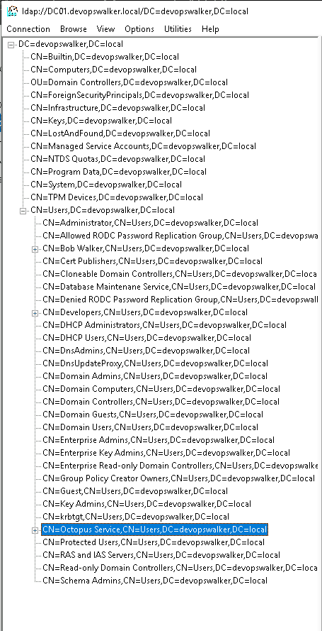
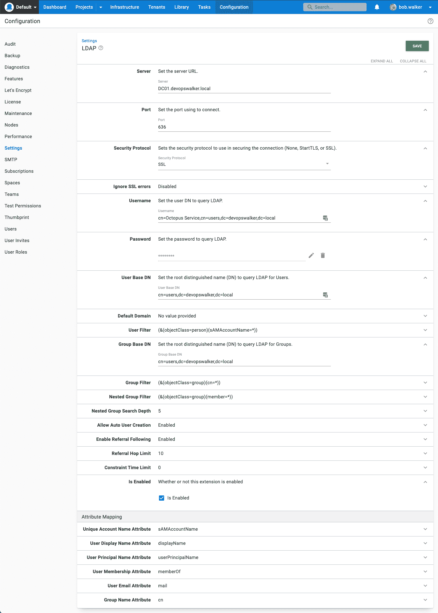
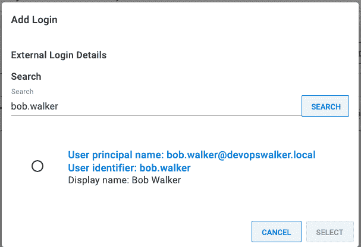
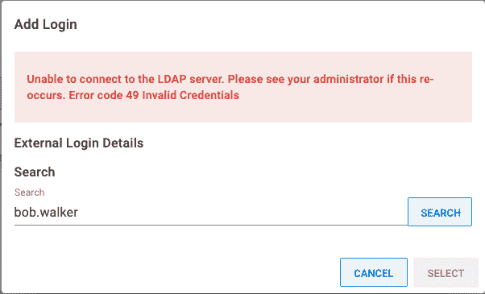
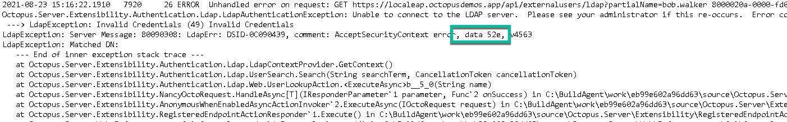
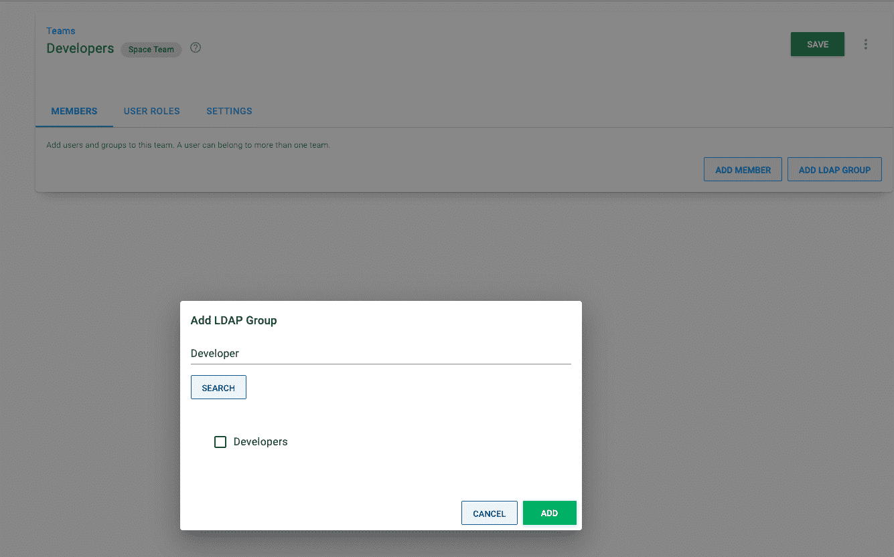
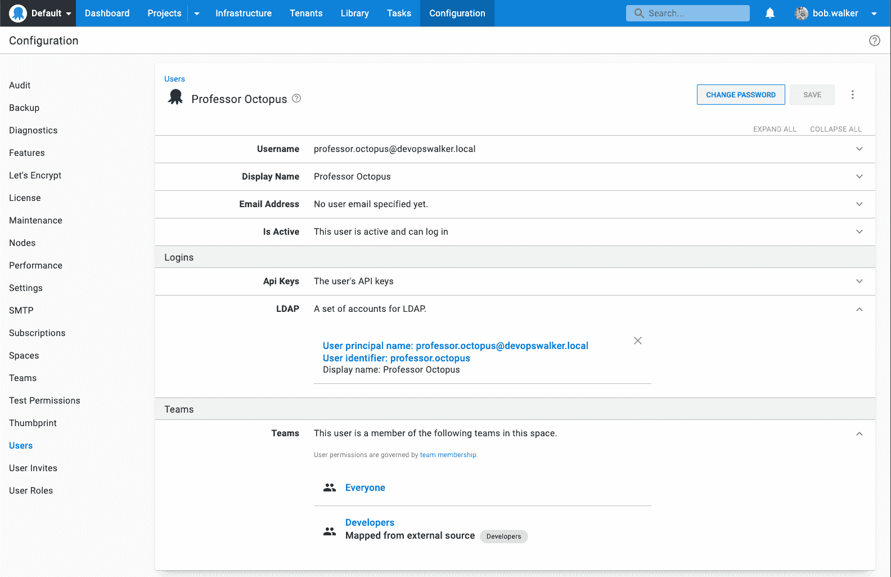
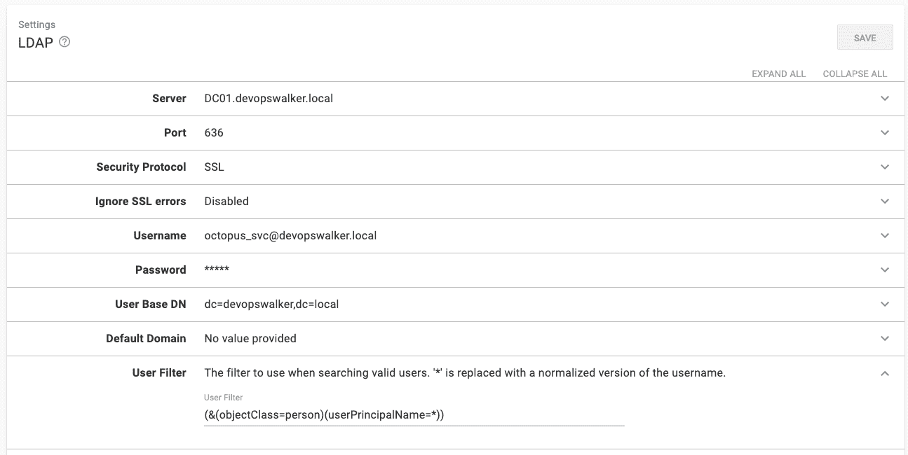
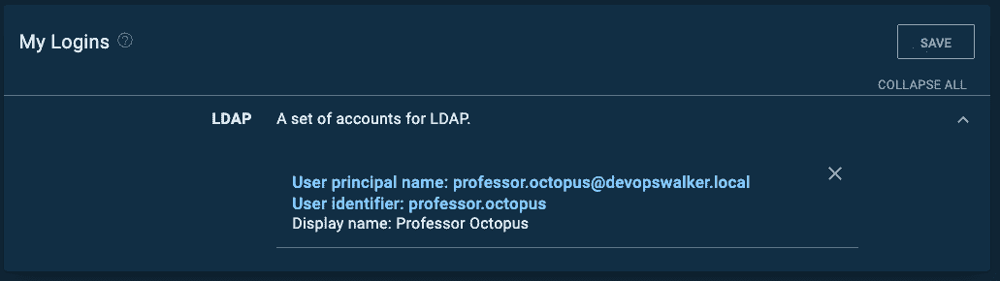

# LDAP 身份验证提供者入门- Octopus 部署

> 原文：<https://octopus.com/blog/getting-started-with-ldap-auth-provider>

在 Octopus Deploy 2021.2 中，我们增加了[轻量级目录访问协议(LDAP)](https://ldap.com/) 认证提供者。

在我们的[发布公告](https://octopus.com/blog/octopus-release-2021-q3)中了解更多关于 Octopus 2021.2 (Q3)发布的信息。

许多客户希望迁移到 Octopus Linux 容器，但是他们必须通过 Active Directory 进行身份验证。Active Directory 也是一个 LDAP 服务器，这意味着通过新的 LDAP 提供程序，您现在可以使用 Octopus Linux 容器**和**对 Active Directory 进行身份验证。

在本文中，我将带您了解配置 LDAP 身份验证提供者的步骤。在这篇文章结束时，我的 Octopus Deploy 实例将通过 LDAP 认证到我的本地域，`devopswalker.local`，运行在 Windows Server 2019 上。

本文假设您熟悉目录服务的核心概念。如果您对这些概念不确定，请与您当地的系统管理员联系。

## LDAP 背景

LDAP 或轻量级目录访问协议是一种开放的、厂商中立的、行业标准的协议，用于与目录服务器进行交互。

很容易将 LDAP 与目录服务器(如 Active Directory)混淆。LDAP 本身不是目录服务器。它是用于与目录服务器通信的协议，就像`http`是用于 web 服务器的协议，或者`wss`是通过套接字与 web 服务器通信的协议。

Active Directory 的默认配置启用 LDAP 支持。如果您在本地运行 Active Directory，您可能已经有一个 LDAP 服务器。

## 为什么是 LDAP？

有三个主要的使用案例解释了我们为什么添加 LDAP 支持:

1.  并非所有人都在运行 Active Directory。LDAP 是厂商中立的，所以更多的非微软用户可以利用外部认证。大多数(如果不是全部)目录服务器支持 LDAP。
2.  Active Directory /集成身份验证要求将服务器添加到域中。这不适用于 Octopus Linux 容器。
3.  使用非 Windows 客户端(特别是 macOS)的用户将拥有与 Windows 客户端相同的体验。有了 Active Directory，如果你在 macOS 上运行的 Chrome 上点击**用域名账户**按钮登录，你会发现自己陷入了一个无休止的登录提示循环。至少我做到了(而且我没有耐心去修复它)。

使用 LDAP 还有其他优势，比如跨域查询。我推荐阅读《ldap.com》,了解 LDAP 能提供什么和不能提供什么。这是一个灵活的协议，每个目录服务器，无论是 Active Directory 还是 OpenLDAP，都提供了很多功能。

## 首先保护您的 LDAP 服务器

默认情况下，LDAP 流量不加密。通过监控网络流量，窃听者可以知道你的 LDAP 密码。

在 Octopus Deploy 中配置 LDAP 提供程序之前，请查阅目录服务器的供应商文档，以便通过 SSL 或 TLS 进行通信。

保护 LDAP 服务器不在本文的讨论范围之内，每个供应商都有自己的独特之处。本文的其余部分假设您与系统管理员一起保护了 LDAP 服务器。

## 了解 DNs

在 LDAP 中，DN(可分辨名称)唯一地标识目录信息树中的条目和位置，就像文件系统中文件的路径。

如前所述，我的领域是`devopswalker.local`。
把它翻译成 LDAP 可以理解的 DN 就是`dc=devopswalker,dc=local`。

存储我的目录服务器的所有用户和组都有一个公共 DN`cn=users,dc=devopswalker,dc=local`。

我的用户账号`Bob Walker` DN 是`cn=Bob Walker,cn=users,dc=devopswalker,dc=local`。

## 你需要什么

在配置 LDAP 之前，您需要以下内容:

*   要查询的服务器的完全限定域名或 FQDN。在我的例子中是`DC01.devopswalker.local`。
*   要使用的端口号和安全协议。我对我的域控制器和 SSL 使用标准的安全 LDAP 端口 636。
*   可以执行用户和组查找的服务帐户的用户名和密码。在我的例子中是`cn=Octopus Service,cn=users,dc=devopswalker,dc=local`。
*   您希望用于用户和组查找的根 DN。在我的例子中，两者都是`cn=users,dc=devopswalker,dc=local`。

使用诸如 Windows ldp.exe 或 [LDAP Administrator](https://www.ldapadministrator.com/download.htm#browser) 之类的工具找到你想要开始的树/森林的最高部分。例如，从根开始`dc=devopswalker,dc=local`可能会导致性能问题，因为 LDAP 查询被迫遍历数百或数千条记录。要处理的数据越少，查询就越快。由于我的 active directory 配置，所有用户和组都存储在`cn=users,dc=devopswalker,dc=local`中。您的服务器可能不同。

## 在 Octopus Deploy 中配置 LDAP 身份验证提供程序

导航至配置➜设置➜ LDAP 。在以下字段中输入值:

*   服务器:输入服务器的 FQDN。
*   端口:更改端口(如果您的安全端口不同于默认端口)。
*   安全协议:更改为 SSL 或 StartTLS。
*   用户名:输入将用于执行用户查找的用户名。可以是`[username]@[domain name]`也可以是用户的 DN。
*   用户基本 DN:输入用户的基本 DN，在我的例子中是`cn=users,dc=devopswalker,dc=local`。
*   组基本 DN:输入您的组的基本 DN，在我的例子中是`cn=users,dc=devopswalker,dc=local`。
*   已启用:选中复选框以启用该功能。

如前所述，我使用的是运行在 Windows Server 2019 上的 Active Directory。您的根 DN 可能不同。请咨询系统管理员或使用 LDAP 浏览器为您的目录服务找到正确的用户和群组 DNs。

## 测试 LDAP 身份验证提供程序

在我配置了 LDAP 身份验证提供者之后，我犯了一个错误，注销并重新登录。我发现了两个简单的测试，我可以不执行认证的舞蹈。

*   外部用户查找
*   外部组查找

对于外部用户查找，转到配置➜用户并选择一个用户账户。屏幕加载后，展开登录下的 LDAP 部分，并单击**添加登录**按钮。

如果一切正常，您会看到一个类似如下的模式窗口:

一开始没看到那个屏幕。相反，我看到了这个:

错误“无法连接到 LDAP 服务器。如果这种情况再次出现，请咨询您的管理员。错误代码 49 无效凭据”是一个 LDAP 查找错误。我键入了查找用户的密码。

LDAP 还为每个错误代码返回一个数据代码。要找到这些信息，打开你的 Octopus 服务器日志。

对于您无法解释的错误，在托管 Octopus Deploy 的同一服务器上使用 LDAP explorer 执行类似的操作。把 Octopus 从等式中去掉，通过 explorer 工具让一切正常工作，然后配置 Octopus Deploy。如果一切都可以通过浏览器工作，而 Octopus Deploy 仍然无法工作，请联系[customersuccess@octopus.com](mailto:customersuccess@octopus.com)寻求更多帮助。

外部组查找类似于外部用户查找。

*   转到配置➜团队并选择一个团队。
*   点击按钮**添加 LDAP 组**并执行搜索。

如果配置正确，您会看到以下消息:

如果查找失败，请执行与用户查找相同的故障排除。

## 正在登录

在上述测试成功之后，尝试下一个测试，使用 LDAP 身份验证提供者登录 Octopus。

我创建了一个测试帐户`Professor Octopus`，并将其添加到了`Developers`组。

当我第一次尝试以`professor.octopus@devopswalker.local`的身份登录时，我得到了这个错误:

将用户名改为`professor.octopus`如预期的那样有效。这是因为默认配置使用`sAMAccountName`来匹配。新用户已创建并分配给适当的团队。

我更喜欢用`professor.octopus@devopswalker.local`登录。如果您有类似的偏好(或公司政策)，将**用户过滤器**更改为`(&(objectClass=person)(userPrincipalName=*))`。

在我们的测试中，我们注意到使用`user@domain`得到的结果不太可靠；但是，您的配置可能与我们的测试环境不同。

我选择了`userPrincipalName`，因为完全限定名`professor.octopus@devopswalker.local`存储在我的域控制器中。您的目录服务器可能不同。

## 结论

与 Active Directory 身份验证提供程序不同，LDAP 身份验证提供程序更灵活，因为 LDAP 更灵活。不过，这种适应性确实使 LDAP 身份验证提供程序变得更加复杂，所以可能需要进行一些尝试和错误来拨入您的设置。我建议设置一个测试实例来测试所有的 LDAP 认证设置。

拨入设置后，LDAP 鉴定提供程序提供了许多好处。可以将 Octopus Linux 容器与 Active Directory 一起使用，也可以根本不用 Active Directory。

如果你正在使用活动目录，我发现 LDAP 提供者比活动目录更容易使用，因为它是一个开放的标准。我不必担心选择 NTLM 或 Kerberos，或者如何管理托管 Octopus/Active Directory/域控制器关系的 Windows 服务器。

如果您在本地 active directory 上有多个用户帐户，每个帐户在 Octopus 中都有不同的权限，那么注销和登录您的计算机进行测试就不再是问题。LDAP 解决了这些问题，还有许多其他问题。

愉快的部署！