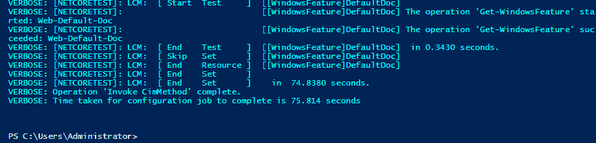
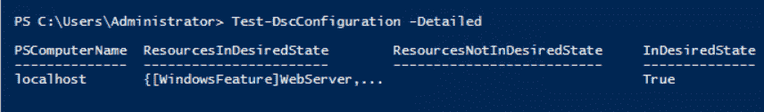
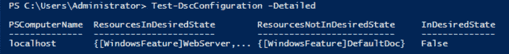

# PowerShell 所需状态配置(DSC)入门- Octopus 部署

> 原文：<https://octopus.com/blog/getting-started-with-powershell-dsc>

[](#)

PowerShell DSC 是一项非常棒的技术，可以放在您管理基于 Windows 的服务器的工具箱中。这篇文章是一系列文章的一部分:

我们也有关于使用 PowerShell DSC 和 Octopus Deploy 的文章:

* * *

无论您是大型组织还是小型组织，使用云基础架构还是机架式服务器，维护服务器的已知状态都是一项挑战。存在一些第三方解决方案，如 Ansible、Chef 和 Puppet，但它们是基于 Linux 的付费产品。对于 Windows 用户，有一个免费的以 Windows 为中心的选项；PowerShell 所需状态配置(DSC)。在这个 PowerShell DSC 教程中，我将向您展示如何开始使用 PowerShell DSC，并提供一些如何使用它的基本示例。

## 什么是 PowerShell 期望状态配置(DSC)

PowerShell DSC 是一种基础结构代码(IaC)技术，它使用 PowerShell 创建托管对象格式(MOF)文件，Windows Management Instrumentation(WMI)可以使用这些文件来配置计算机。换句话说，PowerShell DSC 使用 PowerShell 以编程方式配置基于 Windows 的计算机。此外，DSC 可以监控已配置资源的状态，以确保您的计算机保持一致。除了监控，DSC 还可以自动纠正系统的配置，使其始终处于所需的状态。

### PowerShell！= PowerShell DSC

如果您曾经参加过 PowerShell 的课程，您的讲师可能会提到 PowerShell DSC，但会掩饰地说这是一门完全不同的课程，或者 PowerShell DSC 还有其他课程。DSC 使用 PowerShell 脚本语言，但相似之处仅此而已。

### 为什么使用 PowerShell DSC

维护基础设施一致性的一种常用方法是为需要启动的不同类型的服务器创建基本映像。需要网络服务器吗？使用 web 服务器映像。需要数据库服务器吗？使用数据库服务器映像。虽然这无疑缩短了用已知/良好的配置供应资源所花费的时间，但是存在一些固有的问题。

例如，当您的首席信息安全官(CISO)更改了您的 web 服务器允许的协议时会发生什么？当然，您可以修复基本映像，或者重新创建所有 web 服务器，或者编写自动化脚本将新的安全配置应用到现有的服务器，但是重新创建服务器或者编写并测试更新脚本可能会花费大量时间，尤其是在您有数百台服务器的情况下。如果新实施的安全标准破坏了与业务合作伙伴的季度接口，该怎么办？现在你必须撤销所有的工作。

使用 PowerShell DSC，您可以定义您想要的状态，所有新的和现有的服务器都可以选择并实现该状态。如果您必须撤销它，只需更改所需的状态即可恢复。

### 它是如何工作的？

PowerShell DSC 将使用 PowerShell 配置的组件转换成 MOF 文件，供 WMI 用来配置机器。DSC 可以使用两种方法将配置应用到您的机器上；推拉。您还可以使用自动部署工具(如 Octopus Deploy)创建一种混合方法。

#### 推送方法

推送方法可能是最容易开始的方法。这种方法要求用户通过调用`Start-DscConfiguration` cmdlet 将期望的状态配置*推送到*服务器。这具有立即开始应用配置的优点。就自动化而言，这种方法的缺点是，如果服务器离线，它将无法应用新的期望状态。这就是拉方法可能是更好的方法的地方。

#### 拉动方法

顾名思义，Pull 方法通过服务器获取所需的状态配置并应用它。这要求您有一个包含服务器配置的拉服务器。这种方法的缺点是需要额外的服务器来托管配置。然后，需要配置已配置的服务器来轮询“拉”服务器，以确定是否有新的 MOF 文件可用。

## 入门指南

这篇文章是为初学 DSC 的人设计的，所以我们将使用更简单的推送方法开始。对于我们的场景，我们希望确保服务器的配置包括一些 Windows 特性。我们只使用几个例子:

*   网络服务器
*   网络管理工具
*   web-默认-文档

如果您想知道我是从哪里得到这些名字的，请使用`Get-WindowsFeature` cmdlet 获取列表。您也可以使用通配符作为名称，例如`Get-WindowsFeature Web*`。

### 简单的配置脚本

对于 DSC，我们使用`Configuration`关键字来定义配置。在本例中，`WindowsFeature`是我们正在配置的组件。您可以看到我们定义了三个单独的`WindowsFeature`组件的实例，每个实例对应一个我们想要配置的组件。每个已配置的实例都需要自己唯一的名称，因为该名称在转换为 MOF 文件时用作关键字。您配置的每个组件都有一个`Ensure`属性，它的值可以是`Present`或`Absent`。当您想确保组件存在时，您可以指定`Present`。如果您不想在机器上安装组件，您可以指定`Absent`。对于这个例子，我们希望确保组件安装在服务器上，所以我们为所有组件指定了`Present`。

在我们完成一个`Configuration`之后，我们像调用一个函数一样调用它，并提供一个`OutputPath`，这样 DSC 就知道在哪里放置生成的 MOF 文件。对于这个例子，我们将其命名为`WebServerConfiguration`。DSC `Configuration`完成后，我们调用`Start-DscConfiguration` cmdlet 并提供我们生成的 MOF 文件的路径:

```
Configuration WebServerConfiguration
{  
  Node "localhost"
  {        
    WindowsFeature WebServer
    {
      Name = "Web-Server"
      Ensure = "Present"
    }

    WindowsFeature ManagementTools
    {
      Name = "Web-Mgmt-Tools"
      Ensure = "Present"
    }

    WindowsFeature DefaultDoc
    {
      Name = "Web-Default-Doc"
      Ensure = "Present"
    }
  }
}

WebServerConfiguration -OutputPath "C:\DscConfiguration"

Start-DscConfiguration -Wait -Verbose -Path "C:\DscConfiguration" 
```

在您的配置运行之后，您应该会看到类似如下的输出:

[](#)

### 分离节点数据并使脚本更加动态

我们这个简单的例子是非常硬编码的，根本不是动态的。借助 PowerShell DSC，我们能够将配置数据从配置本身中分离出来，并使我们的脚本更加动态。毕竟是 PowerShell😃

DSC 配置数据文件只是一组哈希表，可以包含其他哈希表或数组，通常具有 psd1 文件扩展名。DSC 配置数据必须至少有一个名为`AllNodes`的密钥。参考[微软文档](https://docs.microsoft.com/en-us/powershell/scripting/dsc/configurations/configData?view=powershell-6)了解更多信息。

让我们将三个 Windows 功能的原始列表放入 DSC 配置数据文件中:

```
@{
  AllNodes = @(
    @{
      NodeName = $env:COMPUTERNAME
      WindowsFeatures = @(
        @{
          Name = "Web-Server"
          Ensure = "Present"
        },
        @{
          Name = "Web-Mgmt-Tools"
          Ensure = "Present"
        },
        @{
          Name = "Web-Default-Doc"
          Ensure = "Present"
        }
      )
    }
  )
} 
```

通过分离配置数据，我们可以缩短 DSC PowerShell 脚本并使其更加通用:

```
Configuration WebServerConfiguration
{  
  Node $AllNodes.NodeName
  {        
    # Loop through the defined features
    ForEach($Feature in $Node.WindowsFeatures)
    {
      # Define component
      WindowsFeature $Feature.Name
      {
        Name = $Feature.Name
        Ensure = $Feature.Ensure
      }
    }
  }
}

WebServerConfiguration -OutputPath "C:\DscConfiguration" -ConfigurationData "C:\DscConfiguration\WebServer.psd1"

Start-DscConfiguration -Wait -Verbose -Path "C:\DscConfiguration" 
```

在我们的新脚本中有两件事需要注意:

*   对`WebServerConfiguration`的调用现在多了一个参数`ConfigurationData`。这告诉 DSC 包含要加载的配置数据的文件。
*   我们可以使用点符号引用 DSC 配置数据文件的属性。

## 检测漂移

如前所述，DSC 可以检测某样东西是否不再处于所需状态。需要注意的是，DSC 只能检测它被告知要关注的变化。使用我们的示例，如果有人安装了 Web-Ftp-Server Windows 特性，我们的 DSC PowerShell 脚本将不会报告任何内容。然而，如果有人删除了 Web-Default-Doc，DSC 将报告该特性不再处于期望的状态。当 DSC 配置不再处于所需状态时，我们称之为漂移。

要运行当前配置的测试，您可以运行`Test-DscConfiguration` cmdlet。如果配置处于期望的状态，`Test-DscConfiguration`返回`True`，如果发生了漂移，则返回`False`。传递`-Detailed`参数将返回漂移内外的资源列表:

[](#)

让我们通过运行以下命令来删除 Web-Default-Doc:

```
Uninstall-WindowsFeature Web-Default-Doc 
```

运行`Test-DscConfiguration -Detailed`:

[](#)

如您所见，机器已经漂移并识别出[windows feature]Default Doc(we b-Default-Doc)不再处于所需状态！

### 自动校正漂移

您可以将本地配置管理器(LCM)配置为在检测到漂移时自动更正配置。为此，我们在 DSC PowerShell 脚本中放置了一个`LocalConfigurationManager`节点，并设置了`ConfigurationMode`属性。`ConfigurationMode`可以有三个值之一:

*   `ApplyOnly`:该设置指示 LCM 应用配置，不做任何其他事情。
*   `ApplyAndMonitor`:该设置指示 LCM 应用配置并定期运行一致性检查(本质上是`Test-DscConfiguration`)。一致性检查的默认频率是 15 分钟，可以通过设置`ConfigurationModeFrequencyMins`属性来覆盖。
*   `ApplyAndAutoCorrect`:该设置指示 LCM 应用配置并定期运行一致性检查。如果一致性检查返回`false`，LCM 将重新应用配置，使机器回到所需状态。

为了配置 LCM 自动校正漂移，我们将它设置为`ApplyAndAutoCorrect`:

```
Configuration WebServerConfiguration
{  
  Node $AllNodes.NodeName
  {
    # Configure the LCM
    LocalConfigurationManager
    {
      ConfigurationMode = "ApplyAndAutoCorrect"
    }        

    # Loop through the defined features
    ForEach($Feature in $Node.WindowsFeatures)
    {
      # Define component
      WindowsFeature $Feature.Name
      {
        Name = $Feature.Name
        Ensure = $Feature.Ensure
      }
    }
  }
}

WebServerConfiguration -OutputPath "C:\DscConfiguration" -ConfigurationData "C:\DscConfiguration\WebServer.psd1"

Start-DscConfiguration -Wait -Verbose -Path "C:\DscConfiguration" 
```

现在我们的服务器将自动纠正自己每当漂移被检测到！如果您启用了自动漂移校正，请确保您记录了它；否则，你或你团队中的某个人将会试图找出为什么你刚刚删除的东西又回来了！

## 摘要

这篇博文教程提供了一些关于如何开始使用 PowerShell DSC 的基本信息，以及如何检测和有选择地自动纠正漂移。关于提到的混合方法的例子，请参考本系列的这篇[文章](https://octopus.com/blog/powershelldsc-as-template)，在这篇文章中，我们将 PowerShell DSC 配置为像应用程序一样进行部署。