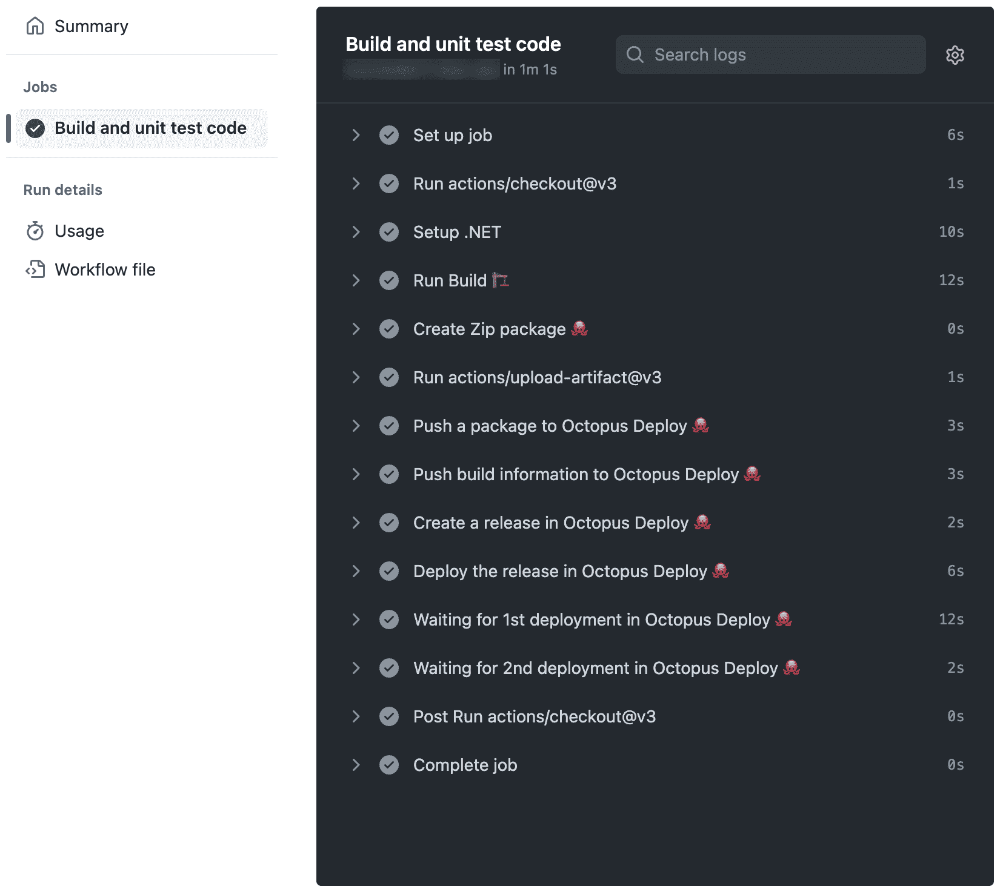
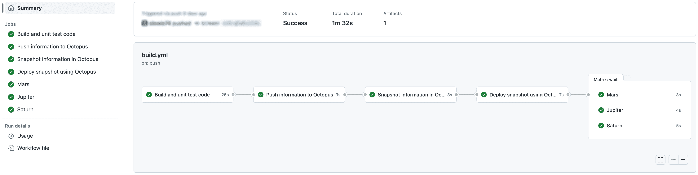

# Octopus Deploy v3 - Octopus Deploy 的 GitHub 动作中的新功能

> 原文：<https://octopus.com/blog/github-actions-for-octopus-deploy-v3>

我们在 2021 年 6 月向 GitHub 市场发布了第一组 [GitHub 行动。然后在 2022 年 9 月，](https://octopus.com/blog/github-actions-for-octopus-deploy)[我们更新了我们的行动，加入了许多新功能](https://octopus.com/blog/new-in-github-actions)。

作为我们针对 Octopus Deploy 的 GitHub 动作的第三次迭代的一部分，我们做了进一步的改进，并添加了 5 个新动作。

亮点包括:

*   我们消除了对 Octopus CLI 的依赖，这也意味着标准的环境变量名已经改变
*   [install-octopus-CLI-action](https://github.com/marketplace/actions/install-octopus-cli)现在安装[我们基于 Go 的 CLI ( `octopus` )](https://github.com/OctopusDeploy/cli)
*   部署版本和执行操作手册有了新的操作:
*   创建 Zip 和 NuGet 包有新的操作:
*   链接操作是一项内置功能

在这篇文章中，我从技术上深入探讨了这次迭代的关键变化，并向您展示了使用新动作的示例。

## 不再需要 Octopus CLI

消除对 Octopus CLI 的依赖是 GitHub 操作的最大架构变化。

我们的操作不再使用 Octopus CLI 来执行工作。相反，它们直接从 TypeScript 与 Octopus API 交互。这意味着您的工作流启动和执行速度比以前快得多。

您仍然可以使用 Octopus CLI，但是如果您只需要使用我们的其他操作，则不再需要将**install-Octopus-CLI-action**包含在您的工作流中。

如果您有自己需要的脚本，那么**install-octopus-CLI-action**仍然可供您使用。

## 安装 Octopus CLI 操作现在安装基于 Go 的 CLI

我们最近将 CLI 实现从 C#转移到了 Go(关于原因的更多信息，请参见[构建 Octopus CLI vNext](https://octopus.com/blog/building-octopus-cli-vnext) )。Octopus CLI ( `octo`)将继续得到支持，直到 2023 年年中。实际上，**install-Octopus-CLI-action**的 v1 会继续安装 Octopus CLI ( `octo`)。如果您有使用基于 C#的 CLI 的现有工作流，您可以继续使用此操作的 v1。

**install-octopus-CLI-action**v3(或更高版本)只会安装新的基于 Go 的 CLI ( `octopus`)。如果您正在编写新的工作流，我们强烈建议使用 v3。基于 Go 的 CLI ( `octopus`)具有基于 C#的 CLI 所没有的新特性和改进，但是，也有一些微小的差异。如有必要，这些 CLI 可以同时使用。

## 环境变量名

为了安全起见，我们提倡在操作中使用环境变量，而不是 CLI 参数。

我们仍然鼓励您使用环境变量来设置敏感值(即 API 键)，但是在新版本的操作中，名称已经改变，因为不再是 Octopus CLI 来选择它们。

| 价值 | 旧变量 | 新变量 |
| --- | --- | --- |
| Octopus 服务器 URL | `OCTOPUS_CLI_SERVER` | `OCTOPUS_URL` |
| Octopus API 密钥 | `OCTOPUS_CLI_API_KEY` | `OCTOPUS_API_KEY` |
| 章鱼空间名称 |  | `OCTOPUS_SPACE` |

## 部署和运行手册运行操作

GitHub Actions for Octopus Deploy v3 为部署和 runbook 运行引入了 3 项新操作:

在**创建-释放-动作**的 v1 中，我们支持来自 Octopus CLI ( `octo`)的旧的`deploy-to`参数。不幸的是，这带来了 Octopus CLI ( `octo`)支持的所有其他与部署相关的开关。这增加了动作参数，使它们变得复杂和混乱。

作为一个例子，`--variable`参数经常让人出错。它只适用于为部署设置提示变量的值，但是看起来它可以用于在发布创建期间设置项目变量值。

基于这些参数目前存在的问题，我们在 Octopus Deploy v2 的 GitHub Actions 中删除了它们，以消除混淆。我们的目标是我们现在在 v3 中拥有的，用于排队部署(和 runbooks 运行)的独立动作。

Octopus CLI ( `octo`)也将是否等待部署完成的概念捆绑到同一个命令中。我们也把它分成了自己的动作。乍一看这似乎有些过分，但是当与 GitHub 动作的其他特性结合使用时，它允许更大的灵活性。我们将在下面的例子中详细讨论这一点。

租赁部署与“标准”部署具有不同的语义。首先，它们支持您可以部署到的环境的不同多样性(标准版可以部署到多个环境，租用版只能部署到一个环境)。为了在动作契约中明确这一点，**部署-释放-租赁-动作**与**部署-释放-动作**是分开的。

虽然这是这些动作的初始版本，但我们决定将它们发布为 v3，以便更容易将这些新动作作为匹配集进行推理。随着时间的推移，版本会再次出现分歧，因为我们会单独对动作进行修补和更新。

## 创建 Zip 和 NuGet 包的操作

GitHub Actions for Octopus Deploy v3 引入了 2 个新的包创建操作:

Zip 和 NuGet 包是用于分发和部署软件应用程序的归档文件。

*   Zip 是一种广泛使用的归档格式，可以由许多不同的应用程序打开。
*   NuGet 包是专门为与 Microsoft 开发平台一起使用而设计的，用于分发可以轻松集成到中的库和其他资源。NET 应用程序。

Zip 和 NuGet 包通常用于分发软件，因为它们提供了一种方便有效的方式来打包和分发大量文件。通常，我们观察客户使用 Octopus CLI ( `octo`)通过`pack`命令生成包。这些动作消除了这种需求，同时通过 GitHub 动作提供了集成的体验。

## 链接是一种内置功能

许多动作产生输出，以实现动作的链接。输出如下:

| 行为 | 输出 | 描述 |
| --- | --- | --- |
| `create-release-action` | `release_number` | 创建的发布号(版本) |
| `deploy-release-action` | `server_tasks` | 带有`serverTaskId`和`environmentName`的 JSON 对象数组 |
| `deploy-release-tenanted-action` | `server_tasks` | 带有`serverTaskId`和`tenantName`的 JSON 对象数组 |
| `run-runbook-action` | `server_tasks` | 带有`serverTaskId`、`environmentName`和`tenantName`的对象的 JSON 数组 |
| `await-task-action` | `completed_successfully` | 无论任务是否成功完成 |

在下面的例子中，我们将更详细地展示如何使用 JSON 数组。

在`await-task-action`的输出中，请注意如果任务没有成功完成，操作将失败。然后，如果您想根据部署/运行是否失败和其他失败(比如失去与 Octopus 实例的通信)在工作流中采取不同的行动，您可以使用[步骤的结果](https://docs.github.com/en/actions/learn-github-actions/contexts#steps-context)和`completed_successfully`。

## 常见工作流模式

### 多合一

一体式是我们看到的使用最广泛的模式，由 CLI 鼓励您做事情的方式驱动。所有行动都是一项工作中的步骤:

```
- name: Create Zip package 🐙
  id: package
  uses: OctopusDeploy/create-zip-package-action@v3
  with:
    package_id: DemoNetCoreWebAppGHASingleJob
    version: ${{ steps.build.outputs.version }}
    base_path: ${{ steps.build.outputs.output_folder }}
    files: "**/*"
    output_folder: packaged

- uses: actions/upload-artifact@v3
  with:
  name: ${{ steps.package.outputs.package_filename }}
  path: ${{ steps.package.outputs.package_file_path }}

- name: Push a package to Octopus Deploy 🐙
  uses: OctopusDeploy/push-package-action@v3
  with:
    packages: ${{ steps.package.outputs.package_file_path }}

- name: Push build information to Octopus Deploy 🐙
  uses: OctopusDeploy/push-build-information-action@v3
  with:
    version: ${{ steps.build.outputs.version }}
    packages: MyPackage

- name: Create a release in Octopus Deploy 🐙
  uses: OctopusDeploy/create-release-action@v3
  id: "create_release"
  with:
    project: "Pet Shop"
    package_version: ${{ steps.build.outputs.version }}

- name: Deploy the release in Octopus Deploy 🐙
  uses: OctopusDeploy/deploy-release-action@v3
  id: "queue_deployments"
  with:
    project: "Pet Shop"
    release_number: ${{ steps.create_release.outputs.release_number }}
    environments: |
      Development
      Integration

- name: Waiting for 1st deployment in Octopus Deploy 🐙
  uses: OctopusDeploy/await-task-action@v3
  with:
    server_task_id: ${{ fromJson(steps.queue_deployments.outputs.server_tasks)[0].serverTaskId }}

- name: Waiting for 2nd deployment in Octopus Deploy 🐙
  uses: OctopusDeploy/await-task-action@v3
  with:
    server_task_id: ${{ fromJson(steps.queue_deployments.outputs.server_tasks)[1].serverTaskId }} 
```

GitHub 操作中运行的工作流的输出如下所示:

[](#)

使用这种模式有以下好处:

*   在工作流文件中，步骤相对容易链接在一起(与您在下一个示例中看到的相比)
*   适合部署到单个环境/租户

这种模式有以下缺点:

*   在有多个之后，你不能保证它们排队的顺序
*   您无法一眼看出哪个任务适用于哪个环境
*   步骤是连续执行的，所以直到第一次部署的等待完成后，第二次部署的等待才开始

### 将操作分成多个作业

在本例中，我们展示了一个使用多个作业来协调操作的工作流。它既使用了作业，也使用了 GitHub 动作中一个名为[矩阵](https://docs.github.com/en/actions/using-jobs/using-a-matrix-for-your-jobs)的特性:

```
jobs:
  build:
    name: Build and unit test code
    runs-on: ubuntu-latest

    outputs:
      version: ${{ steps.build.outputs.version }}
      artifact_name: ${{ steps.package.outputs.package_filename }}

    steps:
      - uses: actions/checkout@v3

      - name: Setup .NET
        uses: actions/setup-dotnet@v2
        with:
          dotnet-version: 6.0.x

      - name: Run Build 🏗
        id: build
        run: |
          # do whatever you do to build your package. Assume this outputs a version variable and the folder where it produced output

      - name: Create Zip package 🐙
        id: package
        uses: OctopusDeploy/create-zip-package-action@v3
        with:
          package_id: MyPackage
          version: ${{ steps.build.outputs.version }}
          base_path: ${{ steps.build.outputs.output_folder }}
          files: "**/*"
          output_folder: packaged

      - uses: actions/upload-artifact@v3
        with:
          name: ${{ steps.package.outputs.package_filename }}
          path: ${{ steps.package.outputs.package_file_path }}

  push:
    name: Push information to Octopus
    needs: build
    runs-on: ubuntu-latest

    env:
      OCTOPUS_URL: ${{ secrets.OCTOPUS_URL }}
      OCTOPUS_API_KEY: ${{ secrets.OCTOPUS_API_KEY }}
      OCTOPUS_SPACE: "Galaxy"

    steps:
      - uses: actions/download-artifact@v3
        with:
          name: MyPackage.${{ needs.build.outputs.version }}
          path: package

      - name: Push a package to Octopus Deploy 🐙
        uses: OctopusDeploy/push-package-action@v3
        with:
          packages: package/MyPackage.${{ needs.build.outputs.version }}.zip

      - name: Push build information to Octopus Deploy 🐙
        uses: OctopusDeploy/push-build-information-action@v3
        with:
          version: ${{ needs.build.outputs.version }}
          packages: MyPackage

  snapshot:
    name: Snapshot information in Octopus
    needs: [build, push]
    runs-on: ubuntu-latest

    outputs:
      release_number: ${{ steps.create_release.outputs.release_number }}

    env:
      OCTOPUS_URL: ${{ secrets.OCTOPUS_URL }}
      OCTOPUS_API_KEY: ${{ secrets.OCTOPUS_API_KEY }}
      OCTOPUS_SPACE: "Galaxy"

    steps:
      - name: Create a release in Octopus Deploy 🐙
        id: "create_release"
        uses: OctopusDeploy/create-release-action@v3
        with:
          project: "Rockets"
          package_version: ${{ needs.build.outputs.version }}

  deploy:
    name: Deploy snapshot using Octopus
    needs: [build, snapshot]
    runs-on: ubuntu-latest

    env:
      OCTOPUS_URL: ${{ secrets.OCTOPUS_URL }}
      OCTOPUS_API_KEY: ${{ secrets.OCTOPUS_API_KEY }}
      OCTOPUS_SPACE: "Galaxy"

    outputs:
      server_tasks: ${{ steps.queue_deployments.outputs.server_tasks }}

    steps:
      - name: Deploy the release in Octopus Deploy 🐙
        uses: OctopusDeploy/deploy-release-tenanted-action@v3
        id: "queue_deployments"
        with:
          project: "Rockets"
          release_number: ${{ needs.snapshot.outputs.release_number }}
          environment: Development
          tenants: Mars
          tenant_tags: |
            planets/gas giants

  wait:
    needs: deploy
    runs-on: ubuntu-latest
    name: ${{ matrix.deployment.tenantName }}

    env:
      OCTOPUS_URL: ${{ secrets.OCTOPUS_URL }}
      OCTOPUS_API_KEY: ${{ secrets.OCTOPUS_API_KEY }}
      OCTOPUS_SPACE: "Galaxy"

    strategy:
      matrix:
        deployment: ${{ fromJson(needs.deploy.outputs.server_tasks) }}

    steps:
      - name: Waiting for deployment in Octopus Deploy 🐙
        uses: OctopusDeploy/await-task-action@v3
        with:
          server_task_id: ${{ matrix.deployment.serverTaskId }} 
```

GitHub 操作中运行的工作流的输出如下所示:

[](#)

使用这种模式有以下好处:

*   当有多个部署时，很容易确定哪个是哪个
*   等待任务并行发生(这是 GitHub 动作中矩阵特性发挥作用的时候)
*   任务出现在图表的可扩展部分，但也作为单独的条目出现在左侧的摘要中(同样使用矩阵)
*   工作流中的单个作业如果失败，可以重新运行。例如，假设构建了包并推送到 Octopus，但是由于 Octopus 中的配置错误，发布创建失败了。如果您更正了配置，那么您可以从同一点重新运行工作流，而不必重新构建包并再次推送它们(这两种操作都可能是开销很大的操作)

这种模式有以下缺点:

*   工作流的设置更加复杂——将步骤的输出传递到作业边界需要在 YAML 中做更多的工作
*   如果只有一次部署，矩阵可能会感觉负担过重

### Runbook 运行

执行操作手册类似于部署版本。我们不会在这里提供一个完整的例子，但是我们想指出 action 提供的输出数据的一个特定方面，以及它对矩阵配置的意义。

在前面的示例中，该条目将矩阵作业的名称绑定到来自 JSON 输出数据的租户名称:

```
name: ${{ matrix.deployment.tenantName }} 
```

使用 runbook 运行时，输出数据包含`tenantName`和`environmentName`，因为它允许您一次请求多个这两个值，并为任何与给定环境的给定项目有关联的匹配租户执行。这意味着您的矩阵名称可以这样做，这取决于哪个值对您更重要:

```
name: ${{ matrix.deployment.tenantName }} - ${{ matrix.deployment.environmentName }} 
```

或者

```
name: ${{ matrix.deployment.environmentName }} - ${{ matrix.deployment.tenantName }} 
```

这很重要，因为在摘要视图中，GitHub Actions UI 会截断长值。将最重要的信息放在最前面会让你一眼就能找到(钻取后你总能看到完整的细节，只需要额外的点击)。

## 结论

GitHub Actions for Octopus Deploy v3 对 v2 进行了重大改进，阵容中增加了 [5 个新动作](https://github.com/marketplace?query=octopus&type=actions&verification=verified_creator)。这些新操作增强了自动化部署过程、执行任务和创建包的能力。它们还极大地改善了整体用户体验。

我们自己也在使用这些行动，这证明了它们的有效性和可靠性。我们希望这个最新版本通过提供强大的、用户友好的操作来管理您的 GitHub 部署，从而帮助您。

愉快的部署！