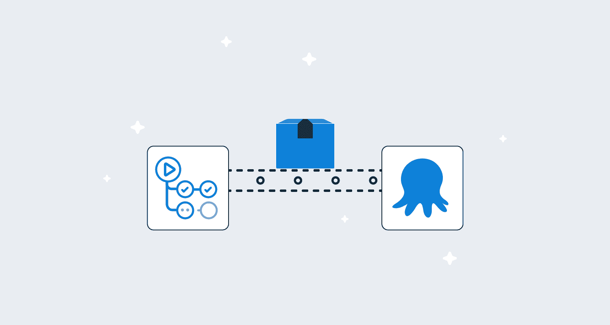
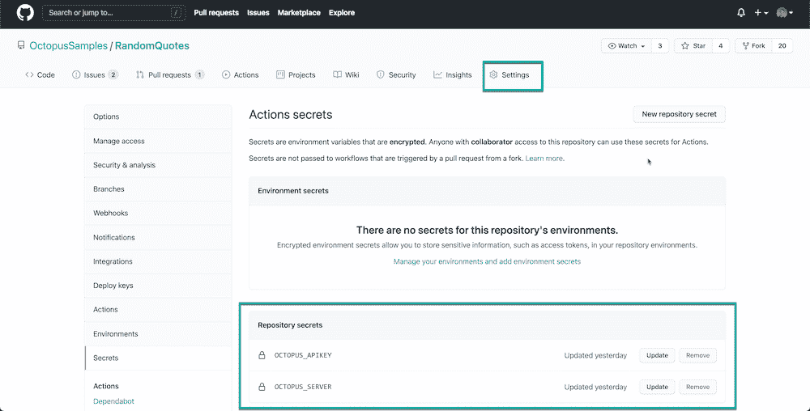
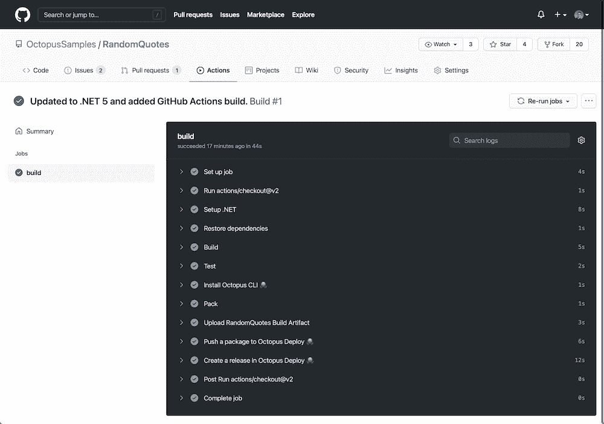

# 宣布 GitHub 对 Octopus Deploy 的操作- Octopus Deploy

> 原文：<https://octopus.com/blog/github-actions-for-octopus-deploy>

[](#)

我们已经为 Octopus Deploy 发布了我们的第一个官方 GitHub 动作。这些初始操作涵盖了将 GitHub 构建与 Octopus 中的部署和 runbook 运行相连接的核心集成场景:

我们计划在今年晚些时候添加更多的 GitHub 动作。

在这篇博文中，我演示了如何开始使用 GitHub Actions 将构建工件推送到 Octopus，创建一个版本，并将其部署到开发环境中。

## 什么是 GitHub Actions？

[GitHub Actions](https://docs.github.com/en/actions) 是一个流行的新平台，用于自动化软件开发工作流，如围绕 GitHub 生态系统构建的 CI/CD。

您使用 YAML 配置文件定义您的工作流，并将其存储在您的 Git 存储库中。您可以用称为操作的可重用构建块来构建自动化。工作流在容器中执行，实现可重复且可靠的流程。

下面是一个 GitHub Action job 工作流的例子。NET web 应用程序。GitHub 提供了大多数编程语言和框架的例子。

```
name: Build

on:
  push:
    branches: [ master ]

jobs:
  build:

    runs-on: ubuntu-latest

    steps:
    - uses: actions/checkout@v2
    - name: Setup .NET
      uses: actions/setup-dotnet@v1
      with:
        dotnet-version: 5.0.x
    - name: Restore dependencies
      run: dotnet restore
    - name: Build
      run: dotnet publish -o build 
    - name: Test
      run: dotnet test --no-build --verbosity normal 
```

这个工作流被命名为 **build** ，每当变更被推送到`master`分支上的父 Git 仓库时，它就会触发一个单一的作业。准备和执行持续集成构建的步骤包括:

*   恢复依赖关系
*   执行构建
*   运行所有测试

我推荐阅读 [GitHub 的文档](https://docs.github.com/en/actions/learn-github-actions)来了解更多。这篇博文假设您熟悉使用 GitHub 操作构建工作流的基础知识。

## Octopus Deploy 的 GitHub 操作入门

为了说明如何为 Octopus 使用新的 GitHub 操作，我们将更新上面的示例构建脚本，以安装 Octopus CLI，打包我们的构建工件并将其推送到 Octopus，然后创建一个发布并将其部署到我们的开发环境中。

完整的工作流文件可以在 [GitHub 示例库](https://github.com/OctopusSamples/RandomQuotes/actions/workflows/dotnet.yml)中找到:

```
name: Build

on:
  push:
    branches: [ master ]

jobs:
  build:

    runs-on: ubuntu-latest

    steps:
    - uses: actions/checkout@v2
    - name: Setup .NET
      uses: actions/setup-dotnet@v1
      with:
        dotnet-version: 5.0.x
    - name: Restore dependencies
      run: dotnet restore
    - name: Build
      run: dotnet publish -o build 
    - name: Test
      run: dotnet test --no-build --verbosity normal
    - name: Install Octopus CLI 🐙
      uses: OctopusDeploy/install-octopus-cli-action@v1.1.6
      with:
        version: latest
    - name: Package build artifacts
      run: octo pack --id="RandomQuotes" --format="zip" --version="1.0.${{github.run_number}}" --basePath="/home/runner/work/RandomQuotes/RandomQuotes/build/"
    - name: Push packages to Octopus Deploy 🐙
      uses: OctopusDeploy/push-package-action@v1.0.1
      with:
        api_key: ${{ secrets.OCTOPUS_APIKEY }}
        server: ${{ secrets.OCTOPUS_SERVER }}
        packages: "RandomQuotes.1.0.${{github.run_number}}.zip"
    - name: Create a release in Octopus Deploy 🐙
      uses: OctopusDeploy/create-release-action@v1.0.2
      with:
        api_key: ${{ secrets.OCTOPUS_APIKEY }}
        server: ${{ secrets.OCTOPUS_SERVER }}
        project: "Projects-141"
        deploy_to: "Dev" 
```

[](#)

注意，我们在这个配置中引用了两个秘密。一个是 Octopus 服务器 URL，另一个是 API 密钥，用于验证和集成 Octopus 实例。在这种情况下，我使用的是一个 [Octopus 云实例](https://octopus.com/docs/octopus-cloud)，然而，如果它是可公开访问的，你也可以连接到一个[自托管 Octopus 实例](https://octopus.com/docs/getting-started#self-hosted-octopus)。

注意:这是建立一个微软。NET 5 web 应用程序，但也可以是 Spring (Java) web 应用程序或 NodeJS express 服务等。重要的部分是 GitHub 对 Octopus 的操作如何使集成变得容易。

### 安装 Octopus CLI

```
 - name: Install Octopus CLI 🐙
      uses: OctopusDeploy/install-octopus-cli-action@v1.1.6
      with:
        version: latest 
```

要与 Octopus 服务器集成，首先安装 Octopus CLI。这是使用任何其他步骤的先决条件，因为它会使用适当的依赖项引导作业运行器来安装 Octopus CLI。

### 将构建工件推送到 Octopus

```
 - name: Pack
      run: octo pack --id="RandomQuotes" --format="zip" --version="1.0.${{github.run_number}}" --basePath="/home/runner/work/RandomQuotes/RandomQuotes/build/" --verbose
    - name: Push a package to Octopus Deploy 🐙
      uses: OctopusDeploy/push-package-action@v1.0.1
      with:
        api_key: ${{ secrets.OCTOPUS_APIKEY }}
        server: ${{ secrets.OCTOPUS_SERVER }}
        packages: "RandomQuotes.1.0.${{github.run_number}}.zip" 
```

下一步是打包您的构建工件，并将它们推到一个包存储库中。在这种情况下，我们正在推进 Octopus 内置的包存储库，这是一个受欢迎的选择。

打包和推送我的构建工件有两个步骤:

1.  将我的构建输出打包为 ZIP 文件。
2.  将包推送到我的 Octopus 实例。

如前所述，我引用了存储在我的存储库配置中的两个秘密。一个是 Octopus 服务器 URL，另一个是我的 GitHub 构建的 API 密钥。

### 创建一个版本并将其部署到开发环境中

```
 - name: Create a release in Octopus Deploy 🐙
      uses: OctopusDeploy/create-release-action@v1.0.2
      with:
        api_key: ${{ secrets.OCTOPUS_APIKEY }}
        server: ${{ secrets.OCTOPUS_SERVER }}
        project: "Projects-141"
        deploy_to: "Dev" 
```

我的构建过程的最后一步是创建我的项目的发布，并将其部署到我的开发环境中。这是一步完成的；我提供了我的项目 ID 和我想要部署到的环境名称。仅此而已。

### 成功！

[](#)

如果我们向我们的存储库提交一个 commit，我们可以看到 GitHub 动作的运行及其输出。可能需要几次迭代来修正语法并获得正确的结果，但结果是一个成功的构建。

## 结论

针对 Octopus Deploy 的 GitHub 操作现已推出。该版本包括安装 Octopus CLI 和将包推送到 Octopus 实例的操作，以及创建和部署版本和执行操作手册的支持。

您现在可以使用 GitHub 操作自动化您的构建，并与 Octopus 集成以满足您所有的部署和 runbook 自动化需求。

我们计划为 Octopus 添加额外的动作。如果你想让我们添加什么，请在评论中告诉我们。

愉快的部署！