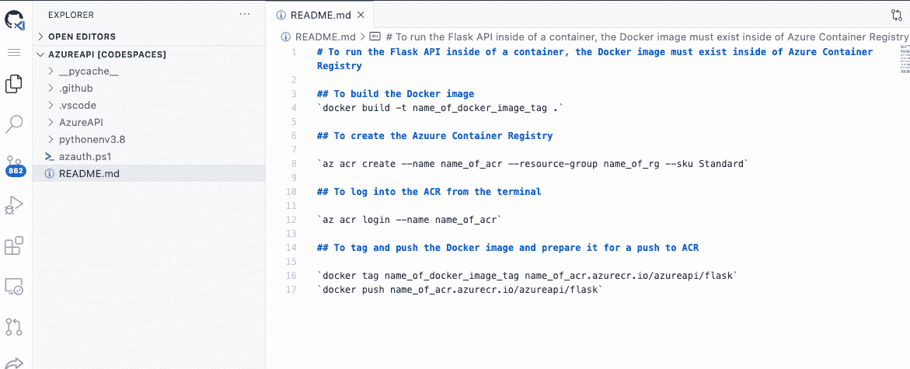
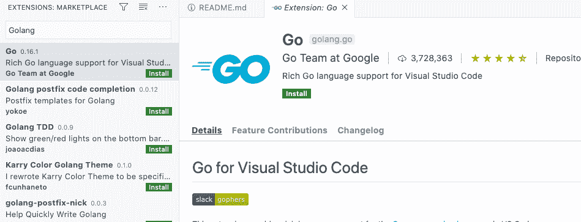
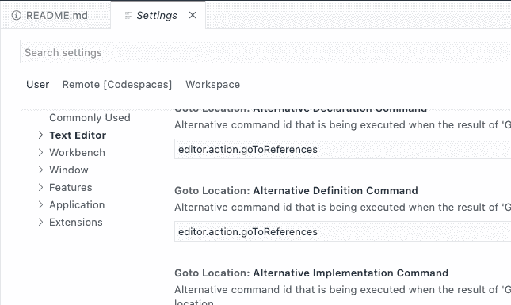

# GitHub 代码空间私人预览版——Octopus Deploy

> 原文：<https://octopus.com/blog/github-codespaces-private-preview>

有许多源代码控制系统，但让我们面对它，GitHub 可以说是最受欢迎的。

GitHub 最近通过引入 GitHub Actions 加强了他们在 CI/CD 领域的游戏，在微软 Build 2020 上，他们引入了 [GitHub Codespaces](https://github.com/features/codespaces) 。

GitHub Codespaces 就像 Visual Studio Codespaces，它是 UI 中的 VS 代码，除了 GitHub Codespaces，它内置于 GitHub 中，为您的所有开发需求提供一站式服务。

在这篇博文中，我将介绍一下私人测试版，以及如果你已经被测试版项目接受，该如何使用它。

## 先决条件

要跟进，您需要:

*   GitHub Codespaces 的私人测试邀请。如果你还没有，你可以[请求提前访问](https://github.com/features/codespaces)。
*   GitHub 账户。
*   至少一个存储库。

## 为什么选择 GitHub Codespaces？

拥有如此多的开发工具和编写代码的方式有一个大问题；根本没有一个集中的地方来存储您想要的特定配置。以 VS 代码为例，假设您在几台不同的机器上工作，或者您正在与一个队友进行结对编程，要处理相同的代码并使其看起来完全相同，您需要几样东西:

*   扩展。
*   登录服务，比如从 VS 代码登录 Azure。
*   主题。
*   `settings.json`中的设置。
*   运行时。
*   棉绒。

你知道这是怎么回事了。管理起来可能会很麻烦。

有了代码空间这样的东西，你就不用担心这个了。无论您从何处登录，所有设置和配置都在一个位置。

代码空间为您的特定开发需求提供了一个集中的位置。

## 设置代码空间

如果私人测试版是活跃的，你会在顶部任务栏上看到一个名为 **Codespaces** 的新图标。它应该是自动添加的，但您可能需要注销 GitHub，然后重新登录。

1.  登录 GitHub，点击**代码空间**图标。
2.  点击绿色的**新代码空间**按钮。
3.  您将看到两个选项:

选择您想要在代码空间中打开的存储库。代码将显示在代码空间中，因此任何东西都可以工作。

4.  点击绿色的**创建代码空间**按钮。

代码空间将会打开，您将能够像在桌面上使用 VS 代码一样看到来自存储库的代码:

## 首先看看扩展

从扩展的角度来看，什么都没有改变。您通常在 VS 代码中使用的任何扩展都可以在代码空间中使用。

1.  打开“扩展”选项卡:
2.  搜索扩展名，例如 Golang:

## GitHub 代码空间中的设置

令人惊讶的是，代码空间中的设置与 VS 代码中的设置几乎相同，这使得转换变得熟悉而平稳:

1.  点击左下角的**设置**图标。
2.  从那里，您可以配置环境、用户环境和远程代码空间环境:

## 结论

尽管 GitHub Codespaces 仍处于私人预览阶段，但很明显它是一个未来的工具。开发者没有必要离开 GitHub。他们现在可以在一个地方存储和编写代码。