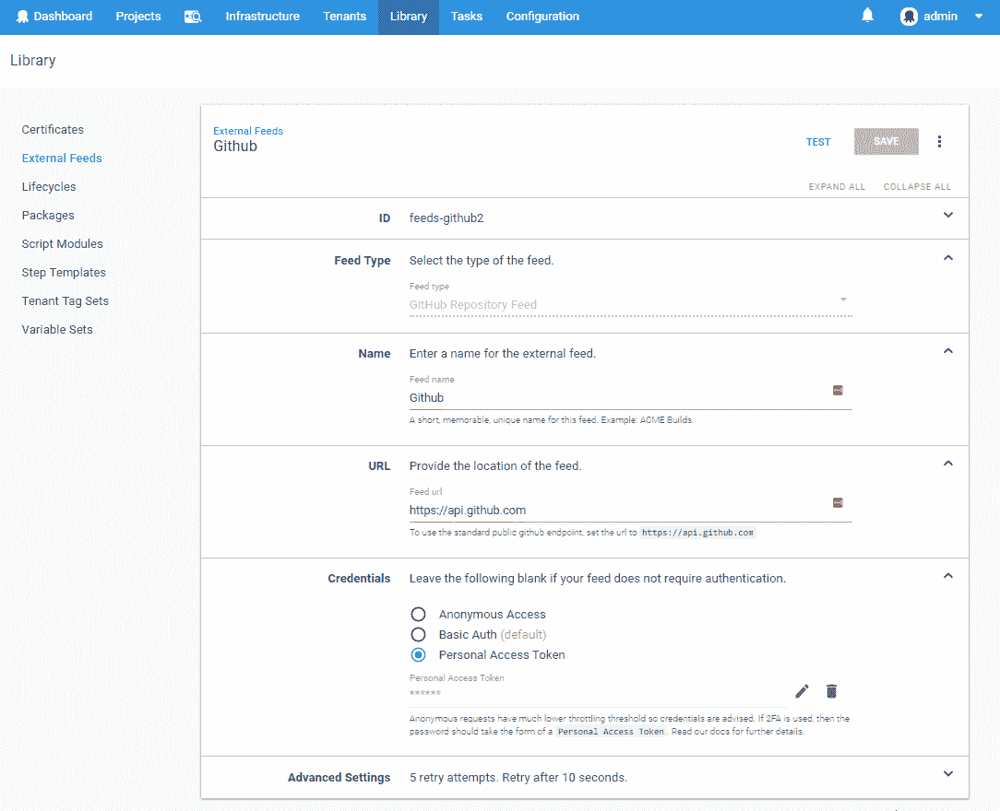
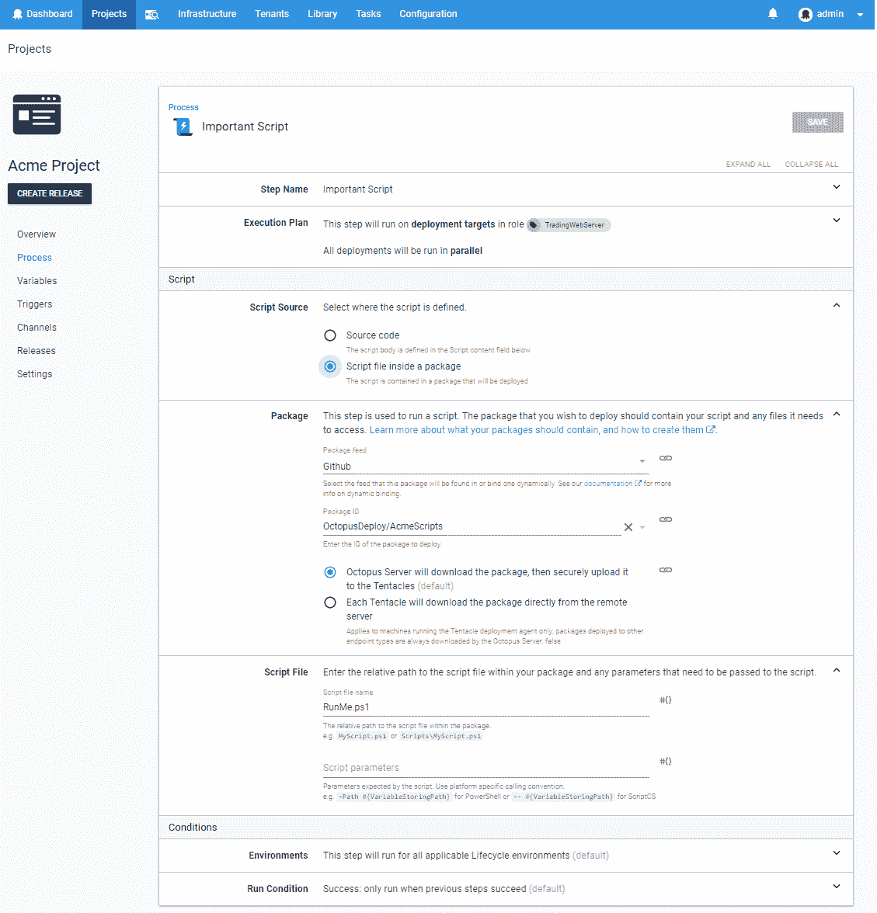
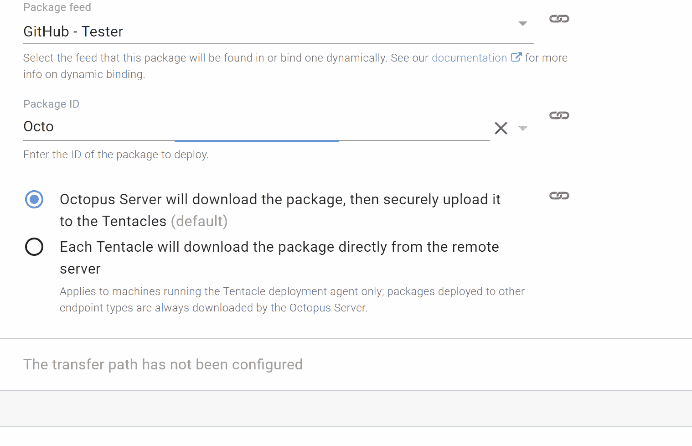
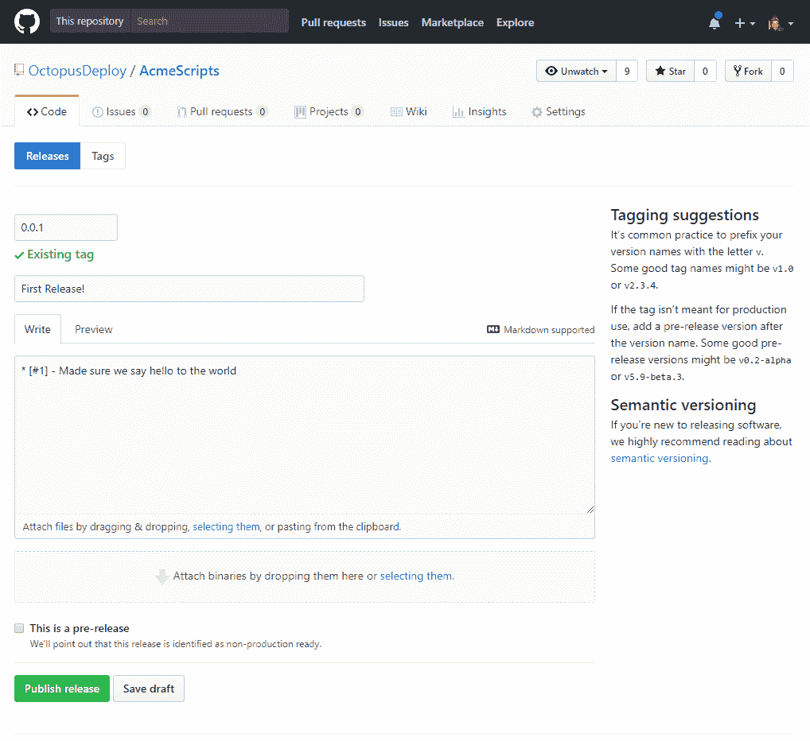
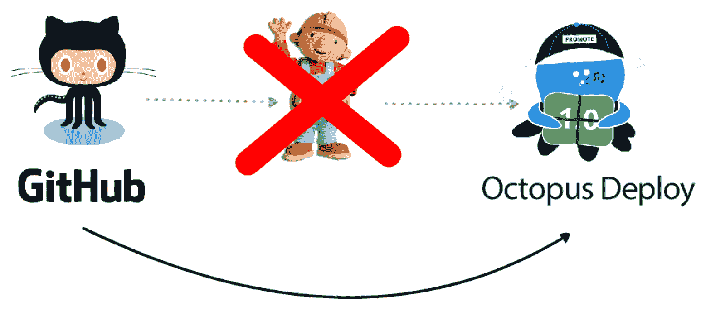

# GitHub Feeds - Octopus 部署

> 原文：<https://octopus.com/blog/github-feed>

[](#)

## 给你 GitHub

有时你只是想部署你的应用程序，但它不需要一个构建步骤。它可能是一个存储库，你可以在那里存储你的云形成模板，一堆在 Octopus 中运行的脚本，或者一个你用 nodejs 这样的解释语言运行的简单应用程序。`2018.3.0`中提供的 GitHub feed 类型为您在 Octopus 部署期间访问资源提供了一种新的方式。**没错，你没听错，我们现在支持使用 GitHub 作为提要源。**

[](#)

> 我们现在支持使用 GitHub 作为提要源。

这种新的提要类型允许 Octopus 直接从 GitHub 部署文件，而不需要任何额外的中间构建步骤。这意味着不再打包您的脚本，以便它们可以在 Octopus 中使用，并且在源代码控制中存储您的部分部署过程时有更好的体验。**标记、推送，然后直接从 Octopus 部署，无需构建服务器**

### 来龙去脉

从部署资源的角度来看，从一个包存储库中构建工件在许多方面看起来与源代码控制中的代码是完全不同的概念。然而，通过查看我们如何对 NuGet 包的各个部分建模，我们可以看到 GitHub“package”包如何被建模以适应 Octopus 生态系统的一些相似之处。

| 进料类型 | 源 Uri | 包裹 | 版本 |
| --- | --- | --- | --- |
| **NuGet** | 任何支持 NuGet v2 或 v3 api 的提要(例如[https://api.nuget.org/v3/index.json](https://api.nuget.org/v3/index.json) | 包的名称，通常在`.nuspec`文件中定义。(如`Octopus.Clients`) | 包的不同实例通过具有 [semver 2](https://semver.org/) 版本格式的`.nuspec`文件进行版本控制。 |
| **GitHub** | 任何支持 v3 api 的 GitHub 端点。这可以是标准的公共端点或私有 GitHub 安装。(例如[https://api.github.com](https://api.github.com)) | 完整的存储库身份，包括所有者。(如`OctopusDeploy/Calamari`) | 一个可以被解析为 [semver 2](https://semver.org/) 版本的独特标签。如果该标签存在一个版本，那么这些版本说明将在 Octopus 中显示在版本详细信息中该包的旁边。 |

构建这种提要类型是为了提供一种简单的方法，将 GitHub 资源作为包处理，而不会增加处理分支和提交的复杂性。因为这些概念不能很好地映射到现有的 Octopus 概念，所以决定简单地读取和解析存储库上的标签，并在识别要部署的特定包时将它们视为 Octopus 使用的版本。顺便提一下，由于 GitHub 提供了基于标签的可下载 zip 包，这提供了一种简单的机制来检索所需的文件，然后像简单的 zip 包一样集成到现有的 Octopus 部署流程中。在这篇文章的最后还提出了一些进一步的观点，概述了围绕作为提要类型的 *Git* 的一些未来想法。同样值得指出的是，目前只有源文件*被 Octopus 部署。其他链接到 GitHub 发行版的二进制文件目前还没有包括在内，但是这在将来可能会改变。*

## 它看起来像什么？

不需要构建过程的“包”的一个经典例子是存储在 Octopus 之外的版本控制中的脚本，它作为部署的一部分运行。接下来的几节看看我们如何配置一个部署来执行来自`OctopusDeploy/AcmeScripts` GitHub 存储库的脚本。

### 设置馈送

首先，让我们看看如何在 Octopus 中创建一个 GitHub 外部提要。

[](#)

如您所见，我们提供了设置个人访问令牌[的能力，而不仅仅是用户名和密码。这允许你创建 GitHub 称之为](https://github.com/blog/1509-personal-api-tokens)[的机器用户](https://developer.github.com/v3/guides/managing-deploy-keys/#machine-users)，它实际上是组织中的 GitHub 用户，用于这些种类的自动化任务。

当访问 GitHub 端点时，为 Octopus 提供一个认证选项是很重要的，因为匿名请求被 GitHub 限制为比认证请求低得多的值。

### 使用软件包

此提要中的“包”被视为与任何其他包完全相同。在这个场景中，我们将选择一个脚本步骤，并从一个包中获取我们的`RunMe.ps1`脚本。packageID 是标识我们的`AcmeScripts`存储库的完整的`Octopus/AcmeScripts`名称。

[](#)

请注意，当您搜索软件包时，如果您省略了`/`字符，它将在所有存储库中搜索(您的帐户可以访问的)。添加不带库的`/`将列出该所有者的所有包，添加库名将搜索该所有者的库。

[](#)

### 添加 GitHub 标签

我们现在已经配置了 Octopus，我们只需要将 PowerShell 脚本添加到我们的 GitHub 存储库`OctopusDeploy/AcmeScripts`中，它将在我们的项目中执行。

```
echo Write-Host Hello World > RunMe.ps1
git add RunMe.ps1
git commit -m "Ready To Run"
git tag 0.0.1
git push
git push --tags 
```

为了更好地衡量，我们还将通过 GitHub 门户网站为这个标签添加一些发行说明。

[](#)

### 创建版本

由于我们目前不支持从外部源自动创建发布(注意这个空间)，Octopus 不知道我们刚刚推了这个新标签，直到我们创建了一个新的发布。

[](#)

在部署时，Octopus 将通过 GitHub API 从标记的 commit 下载源代码。

从这一点上来说，在整个部署过程中，被有效地视为一个典型的 zip 文件，允许它被提取、传输或用作脚本和模板的源。

[](#)

**看马，没身材！**

## 未来计划

值得再次重申的是，这种新的提要类型完全是建立在标签和发布之上的。当使用新的 feed 类型时，分支、提交和 heads 这样的概念并不*直接*相关。您可以*间接地*处理分支，方法是在这些分支中适当地标记您的提交(记住，一旦您将这些提交合并回`master`分支，那么标记可能会引用一个属于`master`分支的提交)。有计划正在进行中，以提供真正的 Git-as-a-feed 支持，其中提交\分支将被更优先地对待，但是决定保持这个 GitHub feed 工作独立。

上面提到的另一点是 GitHub 缺少触发发布和部署的钩子。由于我们许多客户网络的性质，从外部世界打电话并不总是可用的。因此，我们将考虑其他更实用的机制来支持来自外部提要的 ARC。

## GitHib 作为包装饲料

我们对这种新的饲料类型给八达通用户带来的机会感到兴奋。使用 GitHub 作为一些部署依赖项的来源将有助于简化您的 CI 管道，并允许更好的版本控制，而无需花费多余的精力和时间来打包那些并不真正需要打包的资源。请让我们知道您对这一新方向的想法，以及它如何在您的部署过程中派上用场。

[](#)