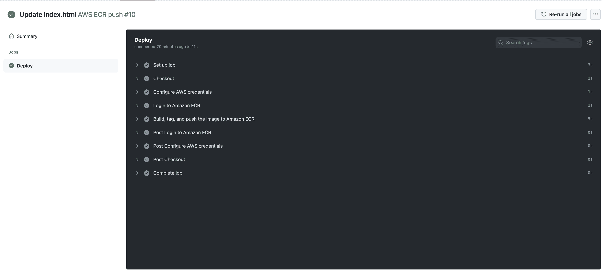

# 使用 GitHub Actions - Octopus Deploy 构建 Docker 映像并将其发布到 ECR

> 原文：<https://octopus.com/blog/githubactions-docker-ecr>

GitHub Actions 使用工作流，因此您可以在任何 GitHub 存储库中包含 DevOps 流程。GitHub Actions 允许构建存储库在部署过程中与各种服务进行交互。通常，会构建一个代码库，并将其推入容器注册中心，以便以后进行部署。

在这篇文章中，我将向您展示如何使用 GitHub Actions 构建 Octopus Deploy underwater app 并将其推送到亚马逊弹性容器注册中心(ECR)。

## 先决条件

要跟进，您需要:

*   亚马逊网络服务(AWS)帐户
*   GitHub 账户

这个帖子使用了 [Octopus 水下应用库](https://github.com/OctopusSamples/octopus-underwater-app)。您可以派生存储库并跟随它。或者，github-ecr 分支包含完成本文步骤所需的模板文件。你必须用你自己的价值观来代替一些价值观，但是我已经在这篇文章中列出了我的价值观作为参考。

## 亚马逊网络服务设置

要为 GitHub 操作设置 AWS，您需要创建一个访问键和一个 ECR 存储库来存储图像。

要创建访问密钥，请转到**亚马逊控制台**，然后 **IAM** ，然后**用户**、`[your user]`，然后**安全凭证**，然后**创建访问密钥**。

您的浏览器下载一个包含访问密钥 ID 和秘密访问密钥的文件。这些值在 GitHub 中用于向 Amazon 认证。

要创建存储库，请转到**亚马逊控制台**，然后转到 **ECR** ，然后转到**创建存储库**。

您需要为发布的每个图像建立一个图像存储库。给存储库起一个您想让图像起的名字。

你会在**亚马逊 ECR** 下看到你的仓库，然后是**仓库**。记下它所在的区域，在 URI 场。

[](#)

## GitHub 设置

在本文中，您将构建 Octopus Deploy underwater app 存储库，并将其推送到 Amazon ECR。你可以在以后的博客文章中使用这些图片。

在`https://github.com/terence-octo/octopus-underwater-app-docker`分叉存储库。

进入**设置**，然后**秘密**，然后**新储存库秘密**。

*   **REPO_NAME** -您创建的 AWS ECR 存储库的名称
*   **AWS_ACCESS_KEY_ID** -之前的访问密钥 ID
*   **AWS_SECRET_ACCESS_KEY** -之前的秘密访问密钥

您需要在存储库中创建一个工作流文件。GitHub Actions 工作流包含对代码库执行操作的说明。这些是社区维护的步骤。几个预构建的步骤模板允许您在代码存储库上执行许多不同的任务。在本例中，您使用一个步骤模板来构建代码并将其推送到 AWS ECR 存储库。

在。根文件夹的 github/workflows 目录。将以下代码粘贴到 main.yml 文件中:

```
on:
  push:
    branches: [ main ]
  pull_request:
    branches: [ main ]

name: AWS ECR push

jobs:
  deploy:
    name: Deploy
    runs-on: ubuntu-latest

    steps:
    - name: Checkout
      uses: actions/checkout@v2

    - name: Configure AWS credentials
      uses: aws-actions/configure-aws-credentials@v1
      with:
        aws-access-key-id: ${{ secrets.AWS_ACCESS_KEY_ID }}
        aws-secret-access-key: ${{ secrets.AWS_SECRET_ACCESS_KEY }}
        aws-region: us-east-2

    - name: Login to Amazon ECR
      id: login-ecr
      uses: aws-actions/amazon-ecr-login@v1

    - name: Build, tag, and push the image to Amazon ECR
      id: build-image
      env:
        ECR_REGISTRY: ${{ steps.login-ecr.outputs.registry }}
        ECR_REPOSITORY: ${{ secrets.REPO_NAME }}
        IMAGE_TAG: latest
      run: |
        # Build a docker container and push it to ECR 
        docker build -t $ECR_REGISTRY/$ECR_REPOSITORY:$IMAGE_TAG .
        echo "Pushing image to ECR..."
        docker push $ECR_REGISTRY/$ECR_REPOSITORY:$IMAGE_TAG
        echo "::set-output name=image::$ECR_REGISTRY/$ECR_REPOSITORY:$IMAGE_TAG" 
```

GitHub 通过在主分支上使用 push 或 pull 请求来启动一个动作。这些步骤包括检查代码、认证并登录 AWS，然后构建、标记并把图像推送到 Amazon ECR。类似的 step 模板可以推广到其他云存储库，如谷歌或微软。

提交您的更改，转到**操作**选项卡，并单击您的提交消息的标题。您可以看到工作流程完成时的各个阶段。

[](#)

去你的 Amazon ECR 仓库查看图片。Octopus Deploy 现在可以将这个映像部署到部署目标。

[](#)

## 结论

在本文中，您设置了一个 GitHub Actions 工作流来构建一个图像并将其推送到 Amazon ECR。像 Octopus 这样的部署工具可以在稍后的部署阶段使用这个映像将 web 应用程序部署到服务中。GitHub Actions 允许代码库成为部署过程的一部分，而无需额外的工作。GitHub Actions 有几个模板，开发人员可以使用它们来执行其他部署任务。

在下一篇文章中，我们将[获取 ECR 中的图像并部署 web 应用程序](https://octopus.com/blog/deploying-amazon-eks-github-actions)。

接下来，我们将[使用 GitHub Actions 和 Octopus Deploy 将一个 web 应用程序部署到亚马逊 EKS](https://octopus.com/blog/multi-environment-deployments-github-actions) 。

[试用我们免费的 GitHub Actions 工作流工具](https://oc.to/GithubActionsWorkflowGenerator)来帮助您快速为您的 GitHub Actions 部署生成可定制的工作流。

您还可以了解更多关于使用 GitHub 构建[和使用 Octopus 部署](https://octopus.com/github)的信息，并在 GitHub Marketplace 中使用我们的[验证行动。](https://github.com/marketplace?query=octopus&type=actions&verification=verified_creator)

## 观看我们的 GitHub 行动网络研讨会

[https://www.youtube.com/embed/gLkAs_Cy5t4](https://www.youtube.com/embed/gLkAs_Cy5t4)

VIDEO

阅读我们的[持续集成系列](https://octopus.com/blog/tag/CI%20Series)的其余部分。

愉快的部署！