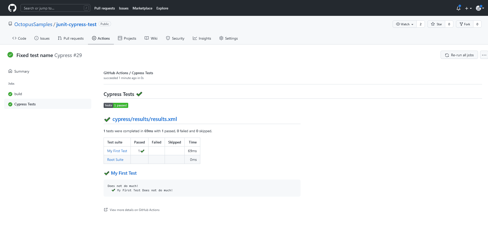
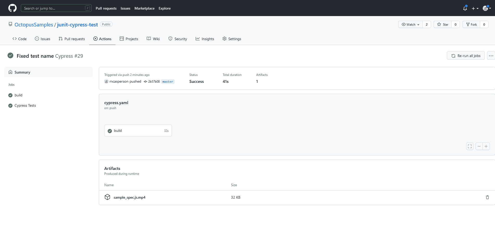
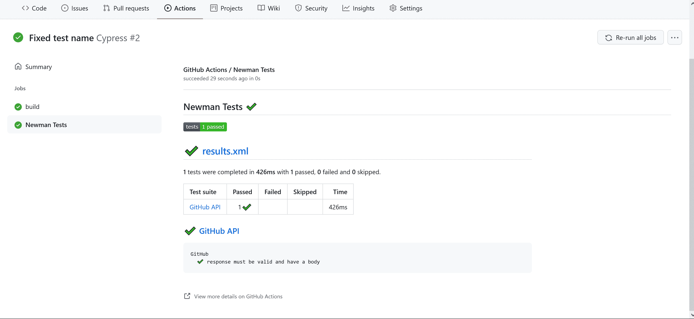
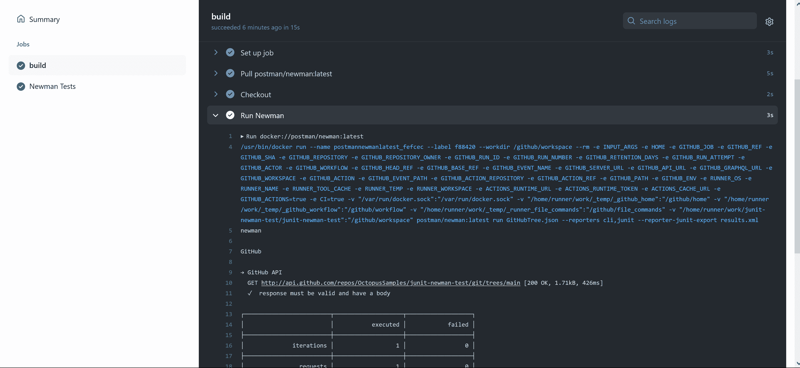

# 在 GitHub Actions - Octopus Deploy 中运行端到端测试

> 原文：<https://octopus.com/blog/githubactions-running-endtoend-tests>

GitHub Actions 拥有一个大型的高质量第三方操作生态系统，以及对在 Docker 容器中执行构建步骤的内置支持。这意味着很容易将端到端测试作为工作流的一部分来运行，通常只需要一个步骤来运行具有所有必需依赖项的测试工具。

在这篇文章中，我将向您展示如何作为 GitHub Actions 工作流的一部分，用 Cypress 运行浏览器测试，用 Postman 运行 API 测试。

## 入门指南

GitHub Actions 是一个托管服务，所以你只需要一个 GitHub 帐户就可以开始了。所有其他依赖项，如软件开发工具包(SDK)或测试工具，都由测试平台发布的 Docker 镜像或 GitHub 动作提供。

## 用 Cypress 运行浏览器测试

Cypress 是一个浏览器自动化工具，可以让你像终端用户一样与网页互动，比如点击按钮和链接，填写表格，滚动页面。您还可以验证页面的内容，以确保显示正确的结果。

[Cypress 文档提供了一个第一次测试的例子](https://docs.cypress.io/guides/getting-started/writing-your-first-test)，它已经被保存到[JUnit-Cypress-test GitHub repo](https://github.com/OctopusSamples/junit-cypress-test)中。测试如下所示:

```
describe('My First Test', () => {
  it('Does not do much!', () => {
    expect(true).to.equal(true)
  })
}) 
```

该测试被配置为在`cypress.json`文件中生成一个 JUnit 报告文件:

```
{
  "reporter": "junit",
   "reporterOptions": {
      "mochaFile": "cypress/results/results.xml",
      "toConsole": true
   }
} 
```

下面的工作流文件使用 [Cypress GitHub 动作](https://docs.cypress.io/guides/continuous-integration/github-actions#Cypress-GitHub-Action)执行这个测试，将生成的视频文件保存为工件，并处理测试结果。您可以在[JUnit-cypress-test repository](https://github.com/OctopusSamples/junit-cypress-test/actions)中找到这个工作流的例子:

```
name: Cypress

on:
  push:
  workflow_dispatch:

jobs:
  build:

    runs-on: ubuntu-latest

    steps:
      - name: Checkout
        uses: actions/checkout@v1

      - name: Cypress run
        uses: cypress-io/github-action@v2

      - name: Save video
        uses: actions/upload-artifact@v2
        with:
          name: sample_spec.js.mp4
          path: cypress/videos/sample_spec.js.mp4

      - name: Report
        uses: dorny/test-reporter@v1
        if: always()
        with:
          name: Cypress Tests
          path: cypress/results/results.xml
          reporter: java-junit
          fail-on-error: true 
```

调用官方的 Cypress GitHub 动作来执行默认选项的测试:

```
 - name: Cypress run
        uses: cypress-io/github-action@v2 
```

Cypress 生成一个视频文件，在测试运行时捕获浏览器。您将视频文件存储为工件，以便在工作流程完成后下载和查看:

```
 - name: Save video
        uses: actions/upload-artifact@v2
        with:
          name: sample_spec.js.mp4
          path: cypress/videos/sample_spec.js.mp4 
```

测试结果由`dorny/test-reporter`动作处理。

请注意，test-reporter 能够处理 Mocha JSON 文件，而 Cypress 使用 Mocha 进行报告，因此一个更惯用的解决方案是让 Cypress 生成 Mocha JSON 报告。不幸的是，Cypress 中有一个[错误，使得 JSON reporter 无法将结果保存为文件。在此问题解决之前，生成 JUnit 报告文件是一种有用的变通方法:](https://github.com/cypress-io/cypress/issues/18014)

```
 - name: Report
        uses: dorny/test-reporter@v1
        if: always()
        with:
          name: Cypress Tests
          path: cypress/results/results.xml
          reporter: java-junit
          fail-on-error: true 
```

以下是测试结果:

[](#)

视频文件工件列在**摘要**页面中:

[](#)

并非所有测试平台都提供 GitHub 动作，在这种情况下，您可以针对标准 Docker 映像执行步骤。这将在下一节中演示。

## 用 Newman 运行 API 测试

与 Cypress 不同， [Postman](https://www.postman.com/) 不提供官方的 GitHub 动作。但是，您可以在工作流程中直接使用 [postman/newman](https://hub.docker.com/r/postman/newman/) Docker 图像。您可以在[JUnit-Newman-test repository](https://github.com/OctopusSamples/junit-newman-test/actions)中找到工作流的示例:

```
name: Cypress

on:
  push:
  workflow_dispatch:

jobs:
  build:

    runs-on: ubuntu-latest

    steps:
      - name: Checkout
        uses: actions/checkout@v1

      - name: Run Newman        
        uses: docker://postman/newman:latest
        with:
          args: run GitHubTree.json --reporters cli,junit --reporter-junit-export results.xml

      - name: Report
        uses: dorny/test-reporter@v1
        if: always()
        with:
          name: Cypress Tests
          path: results.xml
          reporter: java-junit
          fail-on-error: true 
```

步骤的`uses`属性可以是已发布动作的名称，也可以直接引用 Docker 图像。在这个例子中，您运行 [postman/newman](https://hub.docker.com/r/postman/newman/) docker 图像，用`with.args`参数定义命令行参数:

```
 - name: Run Newman       
        uses: docker://postman/newman:latest
        with:
          args: run GitHubTree.json --reporters cli,junit --reporter-junit-export results.xml 
```

产生的 JUnit 报告文件然后由`dorny/test-reporter`动作处理:

```
 - name: Report
        uses: dorny/test-reporter@v1
        if: always()
        with:
          name: Cypress Tests
          path: results.xml
          reporter: java-junit
          fail-on-error: true 
```

以下是测试结果:

[](#)

在后台，GitHub Actions 使用大量与工作流相关的标准环境变量和卷挂载来执行所提供的 Docker 映像，这些卷挂载允许 Docker 容器在主文件系统上持久化更改(如报告文件)。

以下是在 Docker 映像中执行步骤的命令示例:

```
/usr/bin/docker run --name postmannewmanlatest_fefcec --label f88420 --workdir /github/workspace --rm -e INPUT_ARGS -e HOME -e GITHUB_JOB -e GITHUB_REF -e GITHUB_SHA -e GITHUB_REPOSITORY -e GITHUB_REPOSITORY_OWNER -e GITHUB_RUN_ID -e GITHUB_RUN_NUMBER -e GITHUB_RETENTION_DAYS -e GITHUB_RUN_ATTEMPT -e GITHUB_ACTOR -e GITHUB_WORKFLOW -e GITHUB_HEAD_REF -e GITHUB_BASE_REF -e GITHUB_EVENT_NAME -e GITHUB_SERVER_URL -e GITHUB_API_URL -e GITHUB_GRAPHQL_URL -e GITHUB_WORKSPACE -e GITHUB_ACTION -e GITHUB_EVENT_PATH -e GITHUB_ACTION_REPOSITORY -e GITHUB_ACTION_REF -e GITHUB_PATH -e GITHUB_ENV -e RUNNER_OS -e RUNNER_NAME -e RUNNER_TOOL_CACHE -e RUNNER_TEMP -e RUNNER_WORKSPACE -e ACTIONS_RUNTIME_URL -e ACTIONS_RUNTIME_TOKEN -e ACTIONS_CACHE_URL -e GITHUB_ACTIONS=true -e CI=true -v "/var/run/docker.sock":"/var/run/docker.sock" -v "/home/runner/work/_temp/_github_home":"/github/home" -v "/home/runner/work/_temp/_github_workflow":"/github/workflow" -v "/home/runner/work/_temp/_runner_file_commands":"/github/file_commands" -v "/home/runner/work/junit-newman-test/junit-newman-test":"/github/workspace" postman/newman:latest run GitHubTree.json --reporters cli,junit --reporter-junit-export results.xml 
```

这是一个复杂的命令，但是有一些我们感兴趣的参数。

`-e`参数定义了容器的环境变量。您可以看到暴露了许多工作流环境变量。

`--workdir /github/workspace`参数覆盖 Docker 容器的工作目录，而`-v "/home/runner/work/junit-newman-test/junit-newman-test":"/github/workspace"`参数将工作流工作区挂载到容器内的`/github/workspace`目录。这样做的效果是在 Docker 容器中挂载工作目录，从而公开签出的文件，并允许任何新创建的文件在容器关闭后保持不变:

[](#)

因为每个主要的测试工具都提供了一个受支持的 Docker 映像，所以您用来运行 Newman 的过程可以用来运行大多数其他测试平台。

## 结论

GitHub Actions 在开发人员中被广泛采用，许多平台都支持在工作流中使用的操作。对于那些没有合适的动作可用的情况，GitHub Actions 提供了一种简单的方法来执行标准 Docker 图像作为工作流的一部分。

在这篇文章中，您学习了如何运行 Cypress 动作来执行基于浏览器的测试，以及如何运行 Newman Docker 映像来执行 API 测试。

查看我们关于在 GitHub Actions 中测试的另一个帖子:

[试用我们免费的 GitHub Actions 工作流工具](https://oc.to/GithubActionsWorkflowGenerator)，帮助您快速为 GitHub Actions 部署生成可定制的工作流。

您还可以了解更多关于使用 GitHub 构建[和使用 Octopus](https://octopus.com/github) 部署的信息，并在 GitHub Marketplace 中使用我们的[验证操作。](https://github.com/marketplace?query=octopus&type=actions&verification=verified_creator)

愉快的部署！